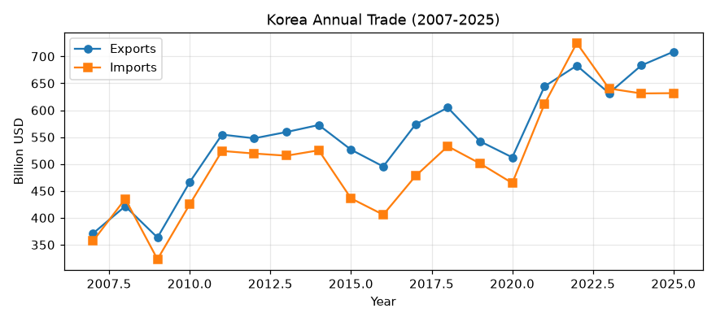
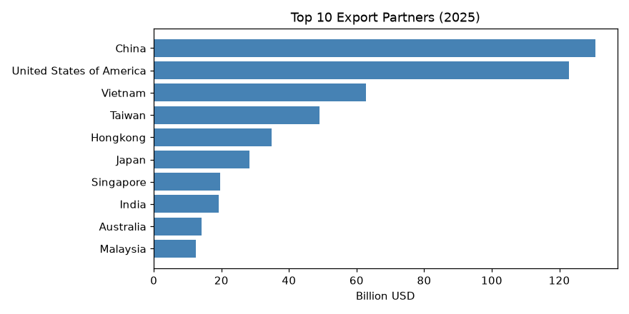
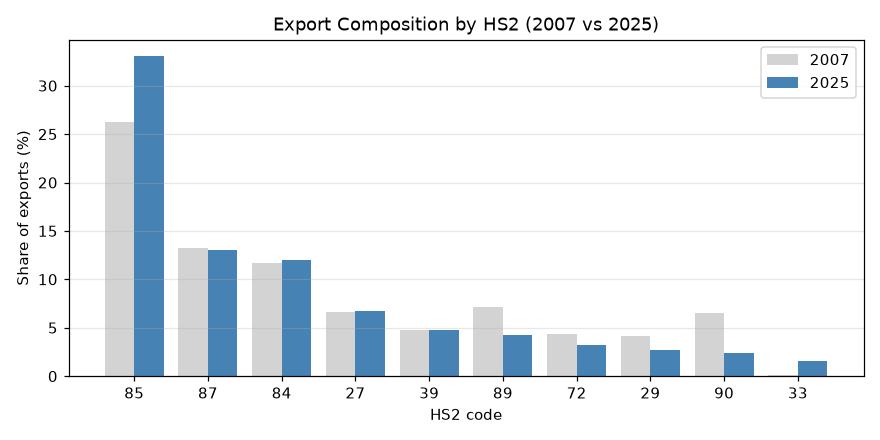
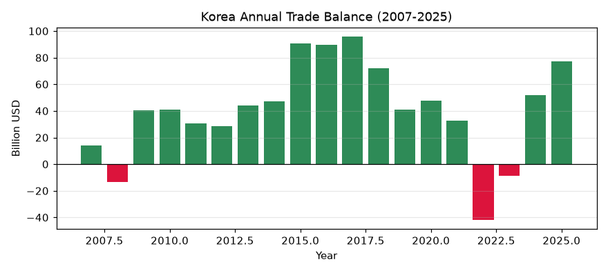

# 한국 수출입의 20년 지형도 (2007–2026)

이 문서는 관세청 무역통계 데이터베이스(KCSDB2)를 이용해, 한국의 수출입이 지난 20년 동안 **어떤 모습으로 바뀌었는지**를 서술한다. 어디에 팔았는지(교역국), 무엇을 팔았는지(품목), 그 구성이 얼마나 집중돼 있었는지, 물건값이 무게당 얼마였는지를 순서대로 본다. 이 문서는 **기술적(descriptive) 분석**이며, "왜 그렇게 됐는가"(환율·정책·경기)는 묻지 않는다. 함께 있는 노트북(`chapter01.ipynb`)이 여기 나오는 모든 수치를 실제 SQL로 뽑는 과정을 담고 있다.

---

## 이 데이터베이스에 대하여 (출처·집계 기준)

이 데이터베이스는 관세청이 OpenAPI(품목별 국가별 수출입실적(GW), <https://www.data.go.kr/data/15100475/openapi.do>)로 공개하는 월별 수출입 통계를 **2007년 1월부터 2026년 3월까지** 한데 모아 하나의 파일로 만든 것이다.

**수치의 집계 기준(관세청 정의).** 수출입 신고 통관 자료를 국가 및 HS Code(2·4·6·10단위)별로 집계한 국가별 품목별 무역통계다. 금액은 미화(USD)이며, 수출은 FOB(신고금액), 수입은 CIF(과세가격) 기준이다. 중량은 순중량(kg). 국가는 수출은 최종목적국, 수입은 원산국을 원칙으로 하며 무역통계부호상 ISO 코드로 분류한다. 단순 통과물품이나 일시 반입·반출 물품은 제외된다(물적 자원의 증감이 없으므로). 통계는 매월 수출입 신고의 정정·취하를 반영해 전월까지 자료를 현행화한다(주기 1개월).

> 이 문서의 수치는 위 데이터 전체(2007.01–2026.03, 2,753만 건)를 컴퓨터로 집계한 결과다. 금액은 편의상 **억 달러**(1억 달러 = 100 million USD) 단위로 반올림해 표기한다.

---

## 1. 이 글이 하는 것과 하지 않는 것

무역 데이터를 받으면 흔히 "왜 대중 수출이 줄었나", "반도체 호황의 효과는" 같은 인과 질문으로 바로 넘어간다. 그러나 인과를 말하려면 다른 요인을 통제한 설계가 필요하고, 그것은 이 문서의 범위가 아니다.

이 문서가 하는 것은 **지도를 그리는 일**이다. 20년 전과 지금을 나란히 놓고, 순위가 어떻게 바뀌었고 비중이 어디로 이동했는지를 보여준다. 지도는 "무엇이 어디에 있는가"를 말할 뿐 "왜 거기 있는가"를 말하지 않는다. 인과 해석은 이 지도를 읽는 사람의 다음 작업으로 남긴다.

---

## 2. 분석 전에 정한 규칙

큰 데이터를 다룰 때는 몇 가지 함정을 미리 규칙으로 고정해야 한다. 상세는 대시보드의 "데이터 함정" 탭과 `docs/세션_발견_노트.md`에 있다.

- **금액 단위는 미국 달러(USD)다.** 관세청 정의상 금액은 미화이며, 수출은 FOB(신고금액), 수입은 CIF(과세가격) 기준이다. (검증: 데이터의 2024년 총수출 합계가 약 6,832억 달러로, 공표된 실제치 $683.6B와 일치한다.) 무게는 순중량(kg)이다.
- **2026년은 비교에서 뺀다.** 데이터는 2026년 3월까지라 2026년은 1–3월만 있는 부분년이다. 연도 비교에는 최신 완전연도인 **2025년**을 쓴다.
- **음수·0 무게는 단가 계산에서 뺀다.** 관세청은 사후 정정으로 음수 무게(19줄)를 보내고, 소액 거래에서 무게가 0으로 반올림된 줄도 있다. 단가(금액÷무게)를 구할 때 이런 줄은 제외한다.
- **HS 코드 개정은 연결표로 잇는다.** 품목 번호는 5년마다 개정된다(2007·2012·2017·2022). 개정을 걸친 품목 비교는 `dim_hs6_concordance`로 코드를 이어서 한다(7절).
- **집계 범위.** 통관 신고 자료를 국가 및 HS Code별로 집계한 국가별 품목별 통계다. 단순 통과물품이나 일시 반입·반출 물품은 물적 자원 증감이 없어 제외된다.

---

## 3. 한눈에 보는 20년

먼저 전체 규모의 흐름이다. 아래는 2007–2025년의 연간 수출·수입액이다(단위: Billion USD).

몇 가지 사실을 읽을 수 있다.

- **수출은 2025년에 7,088억 달러로 이 데이터 기간 중 가장 컸다.** 2007년(3,709억 달러)의 약 1.9배다.
- 규모가 매끄럽게 늘기만 한 것은 아니다. 2009년, 2015–2016년, 2019–2020년, 2023년에는 전년보다 줄어든 해가 있다.
- 수입도 대체로 수출과 나란히 움직였고, 대부분의 해에 수출이 수입을 웃돌았다(무역수지 흑자). 예외는 9절에서 따로 본다.

| 연도 | 수출(억달러) | 수입(억달러) | 수지(억달러) |
|------|------------:|------------:|------------:|
| 2007 | 3,709 | 3,568 | +141 |
| 2010 | 4,663 | 4,251 | +411 |
| 2015 | 5,267 | 4,362 | +905 |
| 2020 | 5,124 | 4,646 | +479 |
| 2022 | 6,830 | 7,248 | −418 |
| 2024 | 6,832 | 6,312 | +520 |
| 2025 | 7,088 | 6,317 | +772 |

*(전체 연도는 노트북 셀에서 확인. 수지가 음(−)인 해는 2008·2022·2023년뿐이다.)*

---

## 4. 어디에 파는가 — 교역국 지형

### 4.1 2025년 수출 상위 10개국

| 순위 | 국가 | 수출(억달러) | 점유율 |
|:---:|------|------------:|------:|
| 1 | 중국 | 1,306 | 18.4% |
| 2 | 미국 | 1,228 | 17.3% |
| 3 | 베트남 | 628 | 8.9% |
| 4 | 대만 | 491 | 6.9% |
| 5 | 홍콩 | 348 | 4.9% |
| 6 | 일본 | 283 | 4.0% |
| 7 | 싱가포르 | 196 | 2.8% |
| 8 | 인도 | 192 | 2.7% |
| 9 | 호주 | 142 | 2.0% |
| 10 | 말레이시아 | 124 | 1.7% |

상위 두 나라(중국·미국)가 전체 수출의 **35.7%를** 차지한다. 홍콩(중계무역 성격)과 대만·베트남·싱가포르·말레이시아 등 아시아 교역국이 상위권에 두텁게 자리한다.

### 4.2 2025년 수입 상위 10개국

| 순위 | 국가 | 수입(억달러) | 점유율 |
|:---:|------|------------:|------:|
| 1 | 중국 | 1,419 | 22.5% |
| 2 | 미국 | 734 | 11.6% |
| 3 | 일본 | 489 | 7.7% |
| 4 | 대만 | 323 | 5.1% |
| 5 | 호주 | 321 | 5.1% |
| 6 | 베트남 | 318 | 5.0% |
| 7 | 사우디아라비아 | 274 | 4.3% |
| 8 | 독일 | 216 | 3.4% |
| 9 | 말레이시아 | 155 | 2.5% |
| 10 | 아랍에미리트 | 141 | 2.2% |

수입에서는 중국의 비중(22.5%)이 수출에서보다 더 크고, 호주·사우디아라비아·아랍에미리트처럼 **자원(원자재·에너지) 공급국**이 상위에 등장하는 점이 수출 지도와 다르다.

### 4.3 20년 사이 순위표는 얼마나 바뀌었나 (수출)

2007년과 2025년의 수출 상위 10위를 나란히 놓으면, 순위표의 얼굴이 상당히 바뀐다.

| 국가 | 2007 순위 | 2025 순위 | 2007(억달러) | 2025(억달러) |
|------|:---:|:---:|------------:|------------:|
| 중국 | 1 | 1 | 820 | 1,306 |
| 미국 | 2 | 2 | 458 | 1,228 |
| 베트남 | — | 3 | — | 628 |
| 대만 | 5 | 4 | 130 | 491 |
| 홍콩 | 4 | 5 | 187 | 348 |
| 일본 | 3 | 6 | 264 | 283 |
| 싱가포르 | 6 | 7 | 119 | 196 |
| 인도 | — | 8 | — | 192 |
| 호주 | — | 9 | — | 142 |
| 말레이시아 | — | 10 | — | 124 |
| 독일 | 7 | — | 115 | — |
| 러시아 | 8 | — | 81 | — |
| 멕시코 | 9 | — | 75 | — |
| 영국 | 10 | — | 69 | — |

- **중국·미국은 20년째 1·2위**다. 다만 미국 수출은 458억 → 1,228억 달러로 2.7배가 되어 격차를 좁혔다.
- **새로 상위 10위에 들어온 나라**: 베트남(→3위), 인도(→8위), 호주(→9위), 말레이시아(→10위).
- **상위 10위에서 밀려난 나라**: 독일·러시아·멕시코·영국(2007년 7~10위).
- **일본은 3위 → 6위**로 내려갔다(금액 264억 → 283억으로 거의 정체).

### 4.4 대륙별 구성 (2025년 수출)

| 대륙 | 수출(억달러) | 점유율 |
|------|------------:|------:|
| 아시아(아주) | 4,120 | 58.1% |
| 미주 | 1,637 | 23.1% |
| 유럽 | 1,033 | 14.6% |
| 중동 | 204 | 2.9% |
| 아프리카 | 91 | 1.3% |

수출의 절반 이상(58%)이 아시아로 향한다. *(대륙 구분은 외교부 분류를 따르며, 위 다섯 대륙이 전체의 99.9%다. 소수 코드가 다른 분류 라벨을 가져 나머지 0.1%는 생략했다.)*

---

## 5. 무엇을 파는가 — 품목 구성

### 5.1 HS 대분류(2단위) 비중의 이동

품목은 HS 코드로 분류된다. 코드 앞 두 자리(HS2)가 가장 큰 분류다. 아래는 2007년과 2025년 수출액을 HS2 대분류별 비중으로 나눈 것이다.

| HS2 | 대분류(대략) | 2007년 | 2025년 |
|:---:|------|------:|------:|
| 85 | 전기기기·전자(반도체 포함) | 26.3% | 33.1% |
| 87 | 자동차·차량 | 13.2% | 13.0% |
| 84 | 일반기계·컴퓨터 | 11.7% | 12.0% |
| 27 | 광물성 연료(석유제품 등) | 6.6% | 6.7% |
| 39 | 플라스틱 | 4.8% | 4.8% |
| 89 | 선박 | 7.1% | 4.2% |
| 72 | 철강 | 4.4% | 3.2% |
| 29 | 유기화학품 | 4.1% | 2.7% |
| 90 | 광학·정밀기기 | 6.5% | 2.4% |
| 33 | 향료·화장품 | 0.1% | 1.6% |
| 30 | 의약품 | 0.2% | 1.3% |
| 28 | 무기화학품 | 0.3% | 1.2% |

읽을 수 있는 변화는 이렇다.

- **전기기기·전자(85)의 비중이 4분의 1(26.3%)에서 3분의 1(33.1%)로 커졌다.** 단일 대분류로 가장 크고, 격차가 더 벌어졌다.
- **비중이 줄어든 쪽**: 선박(89) 7.1%→4.2%, 광학·정밀기기(90) 6.5%→2.4%, 철강(72)·유기화학(29)도 감소.
- **비중이 커진 쪽**: 향료·화장품(33) 0.1%→1.6%, 의약품(30) 0.2%→1.3%, 무기화학품(28) 0.3%→1.2% — 작지만 20년 새 여러 배로 늘었다.

### 5.2 2025년 수출 상위 품목 (HS10)

가장 세밀한 10자리 코드로 보면, 상위 품목은 **반도체가 압도적**이다.

| 순위 | HS10 | 품목명 | 수출(억달러) |
|:---:|------|------|------------:|
| 1 | 8542323000 | 복합구조칩 집적회로 | 493 |
| 2 | 8542321010 | 디램(DRAM) | 305 |
| 3 | 8542311000 | 모노리식 집적회로 | 269 |
| 4 | 8473304060 | 디램 모듈 | 244 |
| 5 | 2710193000 | 경유 | 173 |
| 6 | 8703401000 | 신차(승용차) | 141 |
| 7 | 8901200000 | 탱커(tanker) | 135 |
| 8 | 8901901000 | 화물선 | 125 |
| 9 | 8523511000 | 기록이 안 된 매체 | 114 |
| 10 | 8542391000 | 모노리식 집적회로 | 106 |

상위 10개 중 5개가 반도체(집적회로·디램 계열)다. 그 뒤로 석유제품(경유), 자동차, 선박(탱커·화물선)이 잇는다.

---

## 6. 얼마나 집중돼 있는가 — 다양성과 집중도

수출이 소수 품목에 몰려 있는지, 넓게 퍼져 있는지를 본다. 지표는 간단하다 — **수출액을 큰 품목부터 더해 전체의 90%에 도달하는 데 필요한 HS6 품목 수**다. 이 수가 작을수록 소수 품목에 집중된 것이다.

| 연도 | 90%를 채우는 HS6 수 | 그해 등장한 HS6 총수 | 비율 |
|:---:|------:|------:|------:|
| 2007 | 423 | 4,490 | 9.4% |
| 2010 | 412 | 4,542 | 9.1% |
| 2015 | 468 | 4,703 | 10.0% |
| 2020 | 496 | 4,811 | 10.3% |
| 2025 | 425 | 5,023 | 8.5% |

거래되는 품목의 가짓수(총수)는 4,490에서 5,023으로 늘었지만, 수출액의 90%를 채우는 품목은 20년 내내 **400개대**에 머문다. 즉 품목의 종류는 다양해졌어도 **수출액은 소수 품목에 집중된 구조가 크게 흔들리지 않았다** — 오히려 2025년(8.5%)에는 집중도가 조금 더 높아졌다.

---

## 7. 개정을 걸쳐 품목을 잇기 — 이 DB의 핵심

이 절이 KCSDB2의 존재 이유를 가장 잘 보여준다. HS 코드는 개정 때 쪼개지고 합쳐지고 사라진다. 그래서 **코드가 같은지만 보면, 개정으로 번호만 바뀐 품목을 "새로 생긴 품목"이나 "사라진 품목"으로 잘못 세게 된다.**

`dim_hs6_concordance`는 각 시기의 HS6를 최신판(HS2022) 기준의 안정 코드로 환산해 준다. 노트북은 시기별로 그때 유효한 판본(2007/2012/2017/2022)을 골라 이 표에 연결한다.

| 연도 | 원본 HS6 종수 | HS2022 안정코드 종수 | 미매칭 |
|:---:|------:|------:|------:|
| 2007 | 4,490 | 5,022 | 5 |
| 2015 | 4,703 | 5,115 | 1 |
| 2025 | 5,023 | 5,023 | 0 |

2007년의 4,490개 코드가 최신 기준으로는 5,022개에 대응한다(하나가 여럿으로 갈라지는 분할 때문에 수가 늘어난다). 2025년은 이미 최신판이라 그대로다.

> **한계(봉인 2).** 개정은 다대다라 한 코드가 여러 코드로 갈라질 수 있어 종수 집계에 근사 오차가 생긴다. 완전한 계열 식별은 "연결 컴포넌트"로 분석 계층에서 하며, 어느 판본에도 대응이 없는 완전 사각지대가 소수 남는다(종수 기준 124/63/34종, 거래액 기준으로는 0.004~0.007%로 미미). 개수 기반 지표(진입·퇴출 계수 등)를 쓸 때는 이 한계를 각주로 밝혀야 한다.

---

## 8. 얼마나 비싼가 — 단가 개관

금액을 무게로 나누면 단가(무게당 값)가 나온다. 2025년 수출을 HS6별로 묶어 단가(USD/kg)의 분포를 보면 이렇다(음수·0 무게 줄 제외, HS6 4,998개 기준).

| 지표 | 값(USD/kg) |
|------|------:|
| 하위 10%(p10) | 1.25 |
| 중앙값 | 11.27 |
| 상위 10%(p90) | 131.79 |

절반의 품목은 kg당 11달러 안팎이지만, 분포가 넓다 — 하위 10%는 1달러대(원자재·중화학 등 무겁고 싼 품목), 상위 10%는 130달러를 넘는다(반도체·정밀부품 등 가볍고 비싼 품목). *(단가는 HS6 안에서도 품목이 섞이면 왜곡될 수 있다. 정밀한 단가 분해는 분석 계층의 몫이다.)*

---

## 9. 무역수지 — 흑자와 적자의 해

수출에서 수입을 뺀 무역수지를 연도별로 보면, 대부분 흑자지만 몇 해는 적자였다.

- **적자였던 해는 셋뿐이다**: 2008년(−136억), 2022년(−418억), 2023년(−85억).
- **흑자가 가장 컸던 시기**는 2015–2017년으로, 매년 900억 달러 안팎이었다.
- 2024–2025년에는 다시 흑자로 돌아와 2025년 +772억 달러를 기록했다.

(어느 해에 왜 적자·흑자였는지는 이 문서의 범위 밖이다. 여기서는 "언제 그랬는가"만 기록한다.)

---

## 10. 한계와 각주

- **2026년 제외.** 부분년이라 연도 비교에서 뺐다.
- **음수·0 무게 제외.** 단가 계산에서 일부 소액 거래가 빠진다.
- **개정 연결의 근사 오차.** 다대다 매핑 때문에 종수 집계에 오차가 있다(7절 봉인 2).
- **집계 코드 혼입 가능성.** `stat_cd`의 EU 등 집계 코드가 국가 순위에 섞일 수 있다.
- **국가 기준.** 수출은 최종목적국, 수입은 원산국 기준이다(중계·경유지는 최종목적국으로 잡힌다). 예컨대 홍콩·싱가포르의 수출 순위에는 중계무역 성격이 섞인다.
- **HS6 셀 내부 이질성.** 단가·구성 분석에서 같은 HS6 안의 서로 다른 품목이 뭉뚱그려질 수 있다.

이 한계들은 데이터의 결함이 아니라 원자료의 성질이며, 분석 설계에서 감안할 사항이다.

---

## 재현

여기 나온 모든 표와 그래프는 함께 있는 노트북 `chapters/chapter01/chapter01.ipynb`에서 SQL로 재현된다. DB를 `data/processed/kcsdb.duckdb`에 놓고 노트북을 위에서부터 실행하면 된다. 접속·배치 방법은 대시보드 "받기·사용" 탭 참조.

*— 이 문서는 초안입니다. 세부 수치·표현·구성은 검토 후 수정될 수 있습니다.*
