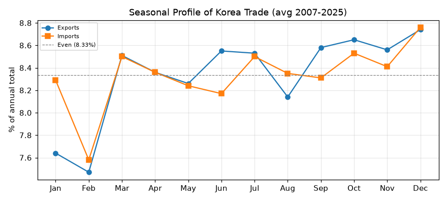
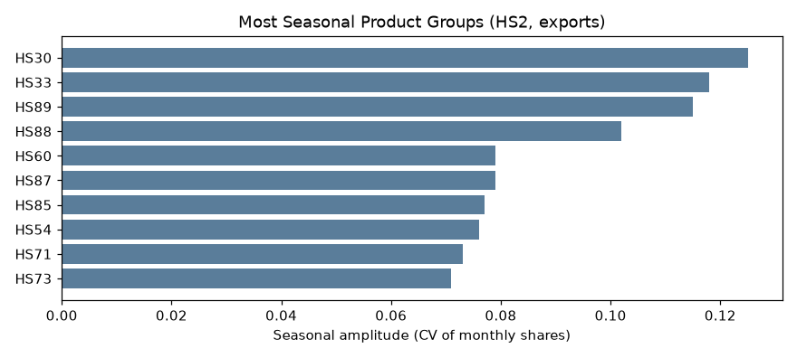
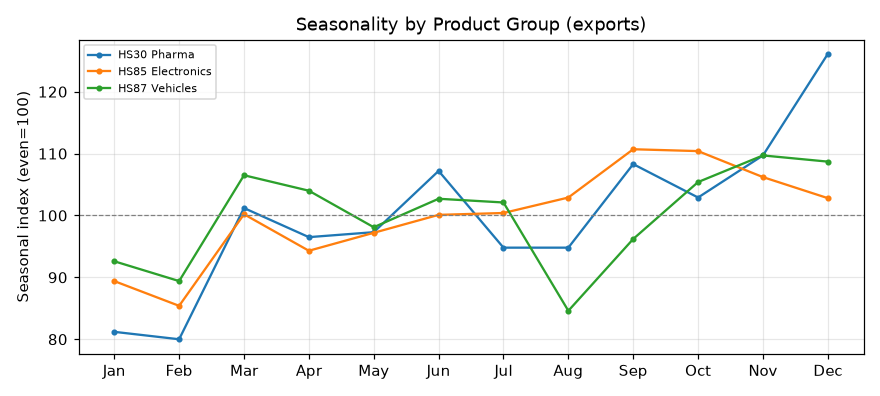

# 무역의 계절성 — 한국 수출입의 월별 리듬 (2007–2025)

이 문서는 관세청 무역통계 데이터베이스(KCSDB2)를 이용해, 한국의 수출입이 **1년 안에서 어느 달에 몰리고 어느 달에 비는지**를 서술한다. 챕터 1이 *연간* 흐름을 봤다면, 이 챕터는 이 DB의 진짜 결인 **월별(231개월) 데이터**를 처음으로 활용해 계절 리듬을 그린다. 인과 해석 없이 관측된 패턴만 제시한다.

---

## 이 데이터베이스에 대하여 (출처·집계 기준)

이 데이터베이스는 관세청이 OpenAPI(품목별 국가별 수출입실적(GW), <https://www.data.go.kr/data/15100475/openapi.do>)로 공개하는 월별 수출입 통계를 **2007년 1월부터 2026년 3월까지** 한데 모아 하나의 파일로 만든 것이다.

**수치의 집계 기준(관세청 정의).** 수출입 신고 통관 자료를 국가 및 HS Code(2·4·6·10단위)별로 집계한 국가별 품목별 무역통계다. 금액은 미화(USD)이며, 수출은 FOB(신고금액), 수입은 CIF(과세가격) 기준이다. 중량은 순중량(kg). 국가는 수출은 최종목적국, 수입은 원산국을 원칙으로 하며 무역통계부호상 ISO 코드로 분류한다. 단순 통과물품이나 일시 반입·반출 물품은 제외된다(물적 자원의 증감이 없으므로). 통계는 매월 수출입 신고의 정정·취하를 반영해 전월까지 자료를 현행화한다(주기 1개월).

---

## 1. 이 글이 하는 것

"계절성"은 1년을 주기로 반복되는 오르내림이다. 이 글은 **어느 달이 높고 낮은지**를 보여줄 뿐, "왜 그런지"(휴일·기후·회계 관행)를 규명하지 않는다. 다만 달력·휴일 같은 명백한 배경은 관측을 읽는 데 필요한 만큼만 곁들인다.

측정 방식은 단순하다. 연도별 성장 추세를 걷어내기 위해, **각 해에서 그 달이 그 해 연간 총액의 몇 %인지**를 구한 뒤 여러 해(2007–2025) 평균을 낸다. 12개 달의 값은 합쳐서 100%가 되고, **균등하면 한 달에 8.33%**다. 8.33%보다 크면 성수기, 작으면 비수기다.

---

## 2. 분석 전에 정한 규칙

- **완전연도만 사용.** 계절 프로파일은 12개월이 다 있는 해라야 공정하다. 2026년은 3월까지뿐이라 **제외**하고, 2007–2025년(19개 완전연도)으로 평균한다.
- **추세 제거.** 20년간 규모가 커졌으므로, 절대액이 아니라 "그 해 안에서의 비중(%)"으로 본다(위 방식).
- **2월 주의.** 2월은 날수가 28일로 가장 짧고, **설날 연휴**가 1–2월에 걸쳐 근무일이 줄어든다. 2월의 낮은 값에는 이런 달력 요인이 섞여 있다(자세히는 4절).
- **금액 단위는 미화 달러(USD).**

---

## 3. 전체 계절 프로파일 — 2월 저점, 연말·가을 고점

| 월 | 수출 비중 | 수입 비중 |
|:---:|------:|------:|
| 1월 | 7.64% | 8.29% |
| 2월 | **7.47%** | **7.58%** |
| 3월 | 8.51% | 8.50% |
| 4월 | 8.36% | 8.36% |
| 5월 | 8.26% | 8.24% |
| 6월 | 8.55% | 8.17% |
| 7월 | 8.53% | 8.50% |
| 8월 | 8.14% | 8.35% |
| 9월 | 8.58% | 8.31% |
| 10월 | 8.65% | 8.53% |
| 11월 | 8.56% | 8.41% |
| 12월 | **8.74%** | **8.76%** |

*(균등 = 8.33%. 굵은 값은 최대·최소 달.)*

읽을 수 있는 사실은 이렇다.

- **한국 무역의 계절성은 완만하다.** 가장 높은 달(12월 8.74%)과 가장 낮은 달(2월 7.47%)의 차이가 1.3%p 남짓이다(12월이 2월보다 약 17% 많은 정도). 반도체·기계 같은 연중 출하 품목이 큰 비중이라 전체적으로 평탄하다.
- **비수기는 1분기, 특히 2월**이다. 성수기는 **연말과 가을**이다(12월, 그리고 9–11월).
- 수출은 **8월에도 살짝 내려간다**(8.14%). 수입은 1월이 상대적으로 높다(8.29%).

---

## 4. 2월은 왜 낮게 보이는가 — 달력의 함정

2월의 저점을 "무역이 실제로 위축된 것"으로 읽으면 오해다. 2월은 **날수 자체가 적고**(28일), **설날 연휴로 근무일이 더 줄어든다**. 즉 총량이 낮은 데에는 "일하는 날이 적어서"라는 달력 요인이 상당히 섞여 있다.

한 달을 그 해 평균 월과 비교하면(균등 = 100%):

| 월 | 평균 월 대비 |
|:---:|------:|
| 1월 | 91.6% |
| 2월 | 89.7% |
| 3월 | 102.1% |
| 12월 | 104.9% |

1–2월이 함께 낮고 3월에 반등하는 모습은, 설 연휴가 낀 초봄의 근무일 감소·이연 효과와 맞물린다. **이 글은 "2월이 낮게 관측된다"는 사실과 그 달력 배경까지만 말하고, 정확한 원인 분해는 하지 않는다.**

---

## 5. 품목마다 계절이 다르다

전체는 평탄해도, **품목별로 계절 진폭은 크게 다르다.** 아래는 HS 대분류(2단위)별로 월별 비중의 변동계수(CV, 클수록 계절적)를 구한 것이다.

| 계절적인 품목 (CV 상위) | CV | 평탄한 품목 (CV 하위) | CV |
|------|---:|------|---:|
| HS30 의약품 | 0.125 | HS29 유기화학품 | 0.029 |
| HS33 향료·화장품 | 0.118 | HS72 철강 | 0.030 |
| HS89 선박 | 0.115 | HS39 플라스틱 | 0.035 |
| HS88 항공기 | 0.102 | HS48 종이 | 0.038 |
| HS87 자동차 | 0.079 | HS40 고무 | 0.038 |

- **의약품·화장품**이 가장 계절적이다. **선박·항공기**는 큰 건이 띄엄띄엄 인도되어(대형 discrete 출하) 월별로 크게 출렁인다.
- **벌크 중간재**는 유기화학·철강·플라스틱처럼 거의 계절이 없다 — 연중 꾸준히 실린다.

세 품목군의 월별 지수(균등 = 100)를 겹쳐 보면 결이 확연히 다르다.

- **HS30 의약품**: 연말로 갈수록 치솟아 **12월 지수 126**, 1–2월은 80 언저리. 뚜렷한 연말 편중.
- **HS85 전기·전자**: 완만하며 **9–10월이 소폭 성수기**(지수 110), 2월이 저점(85).
- **HS87 자동차**: **8월에 뚜렷이 감소**(지수 85)했다가 가을·연말에 회복 — 여름 휴가철과 겹치는 관측이다.

즉 "한국 무역의 계절"이라는 하나의 리듬이 있는 게 아니라, **품목마다 자기 달력을 가진다.**

---

## 6. 한계와 각주

- **완전연도(2007–2025)만 사용.** 2026 부분년 제외.
- **달력 요인 미분해.** 2월 저점 등은 날수·설날 근무일 효과가 섞여 있다. 이 글은 그 사실을 밝히되 요인별로 분해하지 않는다(근무일 보정은 분석 계층의 몫).
- **HS2 대분류 기준.** 2단위로 묶어 개정 영향이 작아 concordance 없이 비교했다(정밀한 세분 분석은 별도).
- **집계 코드·최종목적국 기준** 등 챕터 1과 동일한 데이터 특성이 그대로 적용된다.

---

## 재현

여기 나온 모든 표와 그래프는 함께 있는 노트북 `chapters/chapter02/chapter02.ipynb`에서 SQL로 재현된다. DB를 `data/processed/kcsdb.duckdb`에 놓고 노트북을 위에서부터 실행하면 된다. 접속·배치 방법은 대시보드 "받기·사용" 탭 참조.

*— 이 문서는 초안입니다. 세부 수치·표현·구성은 검토 후 수정될 수 있습니다.*
