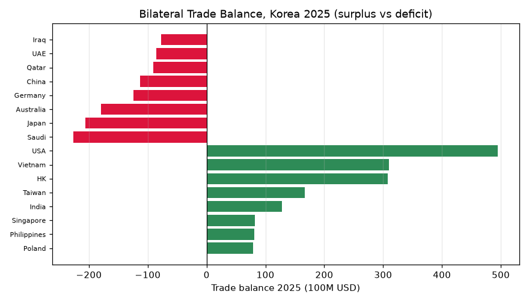
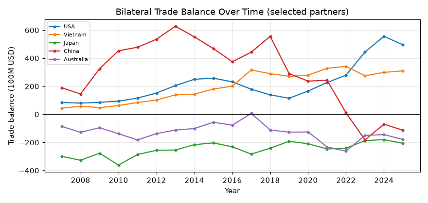
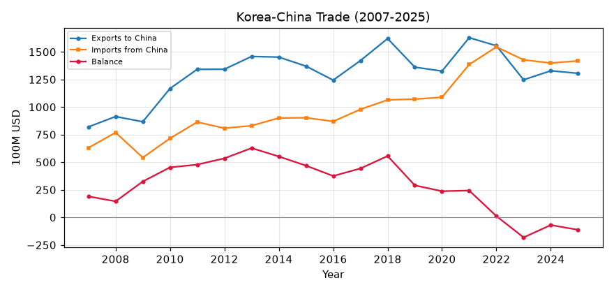

# 양방향 무역수지 — 어느 나라와 흑자, 어느 나라와 적자인가 (2007–2025)

이 문서는 관세청 무역통계 데이터베이스(KCSDB2)를 이용해, 한국이 **나라별로 흑자를 보는가 적자를 보는가**, 그리고 그 구도가 20년간 어떻게 바뀌었는지를 서술한다. 챕터 1이 *전체* 무역수지(수출−수입)를 봤다면, 이 챕터는 그것을 **교역 상대국별로 쪼갠다**. 인과 해석 없이 관측된 흑자·적자 구조만 제시한다.

---

## 이 데이터베이스에 대하여 (출처·집계 기준)

이 데이터베이스는 관세청이 OpenAPI(품목별 국가별 수출입실적(GW), <https://www.data.go.kr/data/15100475/openapi.do>)로 공개하는 월별 수출입 통계를 **2007년 1월부터 2026년 3월까지** 한데 모아 하나의 파일로 만든 것이다.

**수치의 집계 기준(관세청 정의).** 수출입 신고 통관 자료를 국가 및 HS Code(2·4·6·10단위)별로 집계한 국가별 품목별 무역통계다. 금액은 미화(USD)이며, 수출은 FOB(신고금액), 수입은 CIF(과세가격) 기준이다. 중량은 순중량(kg). 국가는 수출은 최종목적국, 수입은 원산국을 원칙으로 하며 무역통계부호상 ISO 코드로 분류한다. 단순 통과물품이나 일시 반입·반출 물품은 제외된다(물적 자원의 증감이 없으므로). 통계는 매월 수출입 신고의 정정·취하를 반영해 전월까지 자료를 현행화한다(주기 1개월).

---

## 1. 이 글이 하는 것

무역수지는 수출에서 수입을 뺀 값이다. 양(+)이면 흑자, 음(−)이면 적자다. 챕터 1은 이것을 나라 전체로 합쳐 봤지만, 여기서는 **상대국별로** 나눠 "누구와 벌고 누구에게 쓰는가"의 지도를 그린다. 흑자·적자의 크기와 순위, 그리고 20년간의 변화만 서술하고, 그 원인(환율·산업구조·자원가격)은 규명하지 않는다.

금액은 **억 달러**(1억 달러 = 100 million USD) 단위로 표기한다.

---

## 2. 분석 전에 정한 규칙

- **금액 단위 미화 달러(USD).** 수지 = 수출(FOB) − 수입(CIF).
- **2026년 제외**(부분년). 연도 비교·2025년 스냅샷은 완전연도 기준.
- **집계 코드 제외.** `stat_cd`의 EU 같은 지역 집계 코드는 개별국과 겹치므로 국가 순위에서 뺐다.
- **국가 기준의 함정.** 수출은 최종목적국, 수입은 원산국이 원칙이다. 그래서 **중계무역·편의치적**이 특정국 수지를 부풀린다(6절). 예: 홍콩(중계 재수출), 마셜제도(선박 등록지).

---

## 3. 2025년 — 흑자국과 적자국

2025년 상위 흑자국(초록)과 적자국(빨강)을 나란히 놓으면 이렇다.

| 흑자 상위 | 수지(억달러) | 적자 상위 | 수지(억달러) |
|------|------:|------|------:|
| 미국 | +495 | 사우디아라비아 | −226 |
| 베트남 | +310 | 일본 | −206 |
| 홍콩 | +308 | 호주 | −179 |
| 대만 | +167 | 독일 | −124 |
| 인도 | +128 | 중국 | −113 |
| 싱가포르 | +82 | 카타르 | −91 |
| 필리핀 | +81 | 아랍에미리트 | −85 |
| 폴란드 | +79 | 이라크 | −77 |

전체로 보면 **흑자를 보는 나라(157개)가 적자를 보는 나라(81개)보다 훨씬 많다.** 흑자 합계는 +2,352억 달러, 적자 합계는 −1,580억 달러로, 그 차이인 **순 +772억 달러**가 2025년 전체 무역흑자다(챕터 1 §9와 일치).

---

## 4. 적자의 두 얼굴 — 자원과 자본재

적자국 목록을 보면 성격이 둘로 나뉜다.

- **에너지·원자재 공급국**: 사우디아라비아·호주·카타르·아랍에미리트·이라크·쿠웨이트·인도네시아. 이들과는 수출이 수입의 몇 분의 일에 그친다(예: 사우디 수출 49억 vs 수입 274억, 카타르 8억 vs 99억). 원유·가스·석탄·광물을 사오는 구조라 **적자가 구조적**이다.
- **선진 제조국**: 일본·독일. 오랜 기간 수입이 수출을 웃돈다 — 한국이 기계·부품 등을 이들로부터 사오는 관계가 이어진다.

즉 적자의 대부분은 "무엇을 사느라 쓰는가"의 문제다. 자원이 없어 사와야 하는 나라들과, 고급 자본재를 공급하는 나라들이 적자 상위를 채운다.

---

## 5. 20년간 변한 것 — 대중국 수지의 반전

가장 큰 변화는 **중국**이다. 오래도록 한국 최대의 흑자원이던 중국이, 최근 적자로 돌아섰다.

- **중국**: 대중 흑자는 2013년 **+628억 달러**로 정점을 찍은 뒤 내리막을 타, 2022년 **+11억**까지 좁혀졌고 **2023년 −182억으로 적자 전환**했다. 2024년 −70억, 2025년 −113억으로 적자가 이어진다.
- **미국**: 흑자가 꾸준히 커져 2024년 **+556억**까지 갔다(2025년 +495억). 중국을 대신해 최대 흑자국이 됐다.
- **베트남**: +44억(2007) → +310억(2025)으로 흑자가 커졌다.
- **일본·호주**: 20년 내내 적자다(일본 −200억대, 호주 자원 적자).

대중국 무역을 금액으로 뜯어보면 반전의 결이 보인다.

대중 수출은 2018년(1,621억)을 정점으로 정체·감소한 반면, 수입은 계속 늘어 2025년에는 **수입(1,419억)이 수출(1,306억)을 웃돈다.** "수출은 주춤, 수입은 증가"가 흑자를 적자로 뒤집었다. (이 글은 그 변화의 *모습*만 기록하고, 왜 그렇게 됐는지는 다루지 않는다.)

---

## 6. 한계와 각주

- **중계무역 왜곡(홍콩).** 홍콩은 수출 348억 vs 수입 40억으로 큰 흑자로 잡히지만, 상당 부분이 제3국(특히 중국)으로 가는 **재수출**이다. 최종목적국 기준의 한계다.
- **편의치적(마셜제도 등).** 선박이 등록 편의를 위해 특정국 국적으로 잡히면(마셜제도 수출 53억 vs 수입 1억) 실제 무역과 다른 흑자로 나타난다.
- **국가 기준.** 수출=최종목적국, 수입=원산국이라 경유·중계가 상대국을 바꿔 놓을 수 있다.
- **집계 코드 제외.** EU 등 지역 집계 코드는 순위에서 뺐다(개별국과 중복).
- **2026 제외.** 부분년.

이 한계들은 데이터의 결함이 아니라 원자료의 성질이며, 상대국별 수지를 읽을 때 감안할 사항이다.

---

## 재현

여기 나온 모든 표와 그래프는 함께 있는 노트북 `chapters/chapter03/chapter03.ipynb`에서 SQL로 재현된다. DB를 `data/processed/kcsdb.duckdb`에 놓고 노트북을 위에서부터 실행하면 된다. 접속·배치 방법은 대시보드 "받기·사용" 탭 참조.

*— 이 문서는 초안입니다. 세부 수치·표현·구성은 검토 후 수정될 수 있습니다.*
