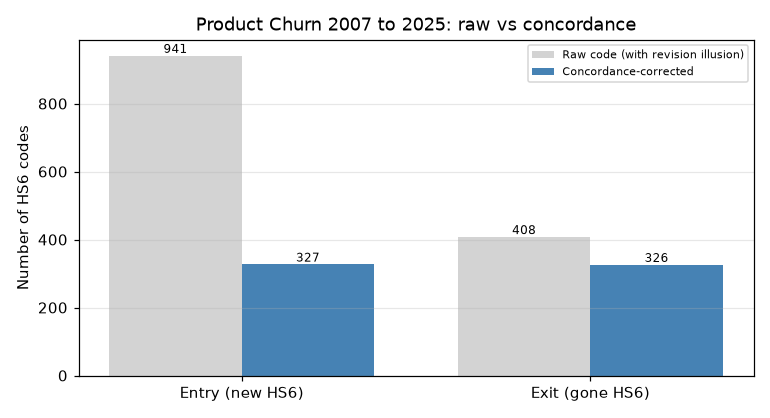
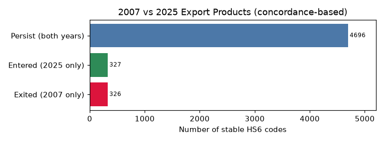
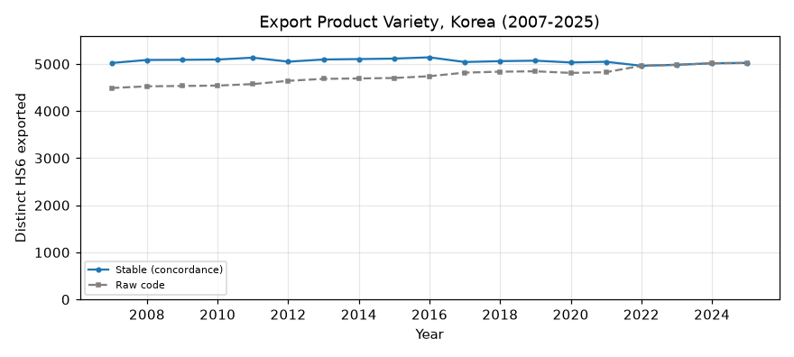

# 품목의 진입·퇴출 — 20년간 무엇이 생기고 사라졌나 (2007–2025)

이 문서는 관세청 무역통계 데이터베이스(KCSDB2)를 이용해, 한국의 수출 품목(HS6)이 **얼마나 새로 등장하고 사라졌는지**를 서술한다. "품목이 몇 종인가", "새 품목이 몇 개인가" 같은 **개수 지표**를 다루므로, HS 코드 개정을 제대로 이어야 한다. 그렇지 않으면 개정으로 번호만 바뀐 것을 "새 품목·사라진 품목"으로 잘못 세게 된다. 이 챕터의 절반은 그 **개정 착시**를 걷어내는 이야기다. 인과 해석 없이 관측된 개수만 제시한다.

---

## 이 데이터베이스에 대하여 (출처·집계 기준)

이 데이터베이스는 관세청이 OpenAPI(품목별 국가별 수출입실적(GW), <https://www.data.go.kr/data/15100475/openapi.do>)로 공개하는 월별 수출입 통계를 **2007년 1월부터 2026년 3월까지** 한데 모아 하나의 파일로 만든 것이다.

**수치의 집계 기준(관세청 정의).** 수출입 신고 통관 자료를 국가 및 HS Code(2·4·6·10단위)별로 집계한 국가별 품목별 무역통계다. 금액은 미화(USD)이며, 수출은 FOB(신고금액), 수입은 CIF(과세가격) 기준이다. 중량은 순중량(kg). 국가는 수출은 최종목적국, 수입은 원산국을 원칙으로 하며 무역통계부호상 ISO 코드로 분류한다. 단순 통과물품이나 일시 반입·반출 물품은 제외된다(물적 자원의 증감이 없으므로). 통계는 매월 수출입 신고의 정정·취하를 반영해 전월까지 자료를 현행화한다(주기 1개월).

---

## 1. 왜 개정을 이어야 하는가

HS 코드는 5년마다 개정된다(2007·2012·2017·2022). 개정 때 코드가 쪼개지고 합쳐지고 폐지된다. 그래서 **같은 상품인데 연도마다 번호가 달라진다.** 만약 번호가 같은지만 보고 "2007년엔 있고 2025년엔 없는 코드 = 사라진 품목"이라고 세면, 실제로는 계속 수출되는데 번호만 바뀐 품목까지 "퇴출"로 잡힌다. 반대로 개정으로 새로 생긴 번호는 "신규 진입"으로 부풀려진다.

이 챕터는 각 시기의 HS6를 최신판(HS2022) 기준 **안정 코드**로 환산한 뒤(챕터 1·3과 같은 `dim_hs6_concordance` 방식) 진입·퇴출을 센다. 그리고 안정 코드로 센 값과 번호 그대로 센 값을 나란히 놓아, 착시가 얼마나 큰지 보인다.

---

## 2. 분석 전에 정한 규칙

- **개수 지표.** 이 챕터는 거래액이 아니라 **품목 종수**(개수)를 다룬다. 챕터 1의 "봉인 2"가 그대로 걸린다(6절).
- **안정 코드 매핑.** 시기별로 유효한 판본(2007–2011→2007, 2012–2016→2012, 2017–2021→2017, 2022–→그대로)을 골라 HS2022 기준으로 잇는다. 매핑 안 되는 코드(연도당 0–5종)는 제외한다.
- **완전연도만.** 2007–2025로 보고, 2026 부분년은 제외한다. 수출 활동(수출액>0)이 있는 HS6만 센다.
- **경계의 한계(중요).** 2007년에 있던 코드가 그 전부터 있었는지, 2025년 코드가 이후로도 갈지는 이 데이터로 알 수 없다(좌·우 절단). 그래서 진입·퇴출은 **두 시점(2007·2025)의 집합 차이**로만 정의한다.

---

## 3. 개정 착시 — 코드만 세면 틀린다

핵심부터 보자. 2007년과 2025년의 수출 품목(HS6)을 비교할 때, **번호 그대로 세는 것**과 **개정을 이어 세는 것**은 결과가 크게 다르다.

| 세는 방식 | 새로 진입 | 사라짐(퇴출) |
|------|------:|------:|
| 번호 그대로 (개정 무시) | 941 | 408 |
| 개정 연결(concordance) | **327** | **326** |

번호만 보면 20년 새 941종이 새로 생기고 408종이 사라진 것처럼 보인다. 그러나 **개정으로 번호만 바뀐 것을 걷어내면 실제 진입은 327종, 퇴출은 326종**이다. 특히 "진입"이 941 → 327로 3분의 1 토막 난다 — HS2022가 과거보다 코드를 더 잘게 나눠, 번호 기준으로는 없던 코드가 잔뜩 생긴 것처럼 보였기 때문이다. **눈에 보이는 품목 교체의 상당 부분이 실제 상품의 변화가 아니라 코드 번호의 변화였다.**

---

## 4. 실제 구도 — 품목은 놀랍도록 안정적

착시를 걷어내고 나면, 한국 수출 품목의 구성은 20년간 거의 그대로다.

- **지속(두 해 모두 존재): 4,696종.** 2007년 품목의 약 93%가 2025년에도 그대로 수출된다.
- **진입(2025년에만): 327종 / 퇴출(2007년에만): 326종.** 진입과 퇴출이 거의 같아, 총 품목 수는 5,022종에서 5,023종으로 사실상 변화가 없다.

품목의 **다양성**(그해 수출된 서로 다른 HS6 수)도 20년 내내 5,000종 안팎에서 거의 평평하다. 번호 그대로 세면(회색 점선) 4,490 → 5,023으로 늘어나는 것처럼 보이지만, 이는 앞서 본 개정 착시이고, 안정 코드로 보면(파란 실선) 대체로 일정하다.

즉 "새 품목이 쏟아지고 옛 품목이 대거 사라진다"가 아니라, **거의 같은 5,000종을 20년째 수출하고, 그 언저리에서 300종 남짓만 조용히 교체된다**는 것이 실제 그림이다.

---

## 5. 무엇이 새로 들어왔나

진입한 327종은 대부분 **거래액이 작은 니치 품목**이다(상위도 연 수억 달러 수준). 눈에 띄는 예:

- **가열·전자담배류**(HS 240411, "담배나 재구성한 담배를 함유한 것" — 연소 없이 흡입하는 담배 제품): 2010년대 이후 등장한 실제 신품목.
- **방산 품목**: 군함(HS 890610), 자주식 무기(HS 930110) 등. 최근 방위산업 수출 확대와 함께 품목에 잡힌다.

핵심 수출품(반도체·자동차·석유제품 등)은 20년 내내 "지속" 쪽에 있고, 진입·퇴출은 이렇게 **주변부의 소액 품목**에서 일어난다. (이 글은 어떤 품목이 들고 났는지의 *사실*만 기록하며, 그 배경은 다루지 않는다.)

---

## 6. 한계와 각주

이 챕터는 개수 지표라 한계가 특히 중요하다.

- **봉인 2(개수 지표 한계).** 개정 연결은 다대다라 한 코드가 여러 HS2022로 갈라진다. 그래서 안정 코드 수가 초기 연도에 원본보다 오히려 많게 나온다(2007년 원본 4,490 → 안정 5,022). 종수 집계에 근사 오차가 있으며, 어느 판본에도 대응 없는 완전 사각지대(종수 기준 124/63/34)가 소수 남는다. 거래액 가중이 아니라 개수를 다루므로 이 오차가 그대로 반영된다.
- **좌·우 절단.** 2007년 코드가 그 이전부터 있었는지, 2025년 코드가 이후로도 갈지는 알 수 없다. 따라서 진입·퇴출은 두 시점의 집합 차이일 뿐, "탄생·사멸"의 정확한 계수가 아니다. 같은 이유로 **연도별 신규·소멸 계수**는 경계 절단에 크게 휘둘려(초기엔 첫 관측이 몰리고, 말기엔 마지막 관측이 몰림) 여기서는 제시하지 않는다.
- **미매칭 제외.** 안정 코드로 잇지 못한 코드(연도당 0–5종)는 뺐다.
- **수출 활동 기준.** 수출액>0인 HS6만 셌다(수입 전용 품목은 대상 아님).

이 한계들은 데이터의 결함이 아니라 개수 지표와 개정 연결의 본질적 성질이며, 진입·퇴출 수치를 읽을 때 반드시 감안해야 한다.

---

## 재현

여기 나온 모든 표와 그래프는 함께 있는 노트북 `chapters/chapter04/chapter04.ipynb`에서 SQL로 재현된다. DB를 `data/processed/kcsdb.duckdb`에 놓고 노트북을 위에서부터 실행하면 된다. 접속·배치 방법은 대시보드 "받기·사용" 탭 참조.

*— 이 문서는 초안입니다. 세부 수치·표현·구성은 검토 후 수정될 수 있습니다.*
