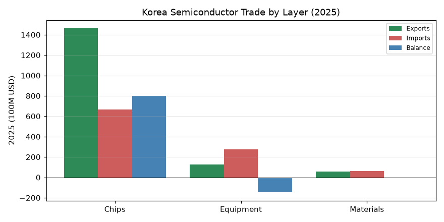
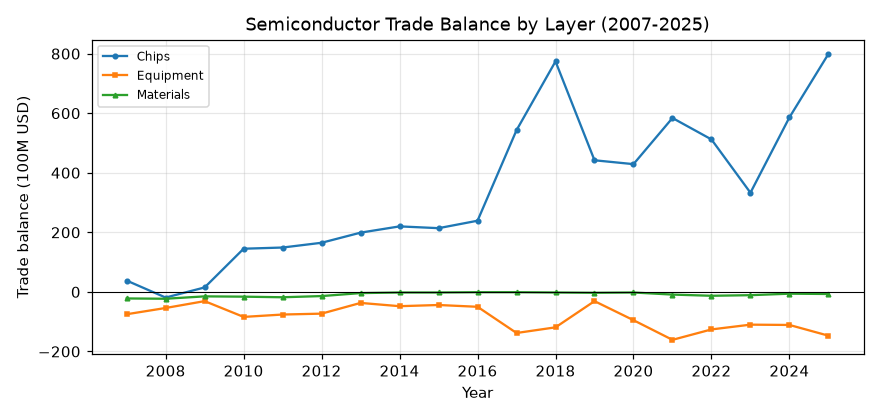
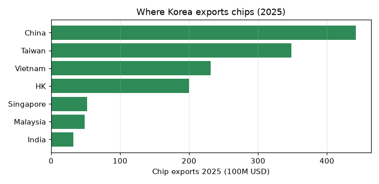
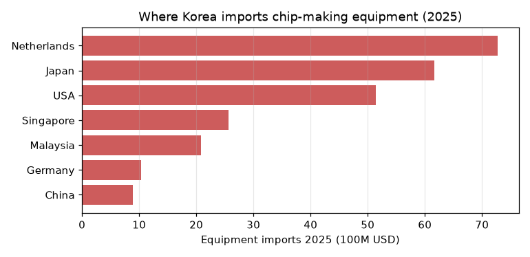

# 반도체의 세 층 — 칩, 장비, 소재 (2007–2025)

이 문서는 관세청 무역통계 데이터베이스(KCSDB2)에서 **반도체 관련 품목만 따로 떼어내** 그 교역 구조를 서술한다. 반도체는 하나가 아니라 세 층으로 나뉜다 — 완성된 **칩**(메모리 등), 그 칩을 만드는 **제조장비**, 그리고 공정에 쓰이는 **소재**(이른바 소부장의 소재·부품·장비). 이 셋을 나눠 보면 한국 반도체의 뚜렷한 비대칭이 드러난다. 챕터 1·3과 같은 방식(규모·비중·수지·교역국)으로, 인과 해석 없이 관측된 구조만 제시한다.

---

## 이 데이터베이스에 대하여 (출처·집계 기준)

이 데이터베이스는 관세청이 OpenAPI(품목별 국가별 수출입실적(GW), <https://www.data.go.kr/data/15100475/openapi.do>)로 공개하는 월별 수출입 통계를 **2007년 1월부터 2026년 3월까지** 한데 모아 하나의 파일로 만든 것이다.

**수치의 집계 기준(관세청 정의).** 수출입 신고 통관 자료를 국가 및 HS Code(2·4·6·10단위)별로 집계한 국가별 품목별 무역통계다. 금액은 미화(USD)이며, 수출은 FOB(신고금액), 수입은 CIF(과세가격) 기준이다. 중량은 순중량(kg). 국가는 수출은 최종목적국, 수입은 원산국을 원칙으로 하며 무역통계부호상 ISO 코드로 분류한다. 단순 통과물품이나 일시 반입·반출 물품은 제외된다(물적 자원의 증감이 없으므로). 통계는 매월 수출입 신고의 정정·취하를 반영해 전월까지 자료를 현행화한다(주기 1개월).

---

## 1. 반도체를 어떻게 잘랐나 — HS 코드 정의

"반도체 관련 품목"은 단일 코드가 없다. 칩은 물론, 장비·소재는 여러 HS 코드에 흩어져 있다. 이 챕터는 세 층을 다음과 같이 정의했다.

- **칩(반도체 소자·집적회로)**: HS **8541**(다이오드·트랜지스터 등 개별소자)과 **8542**(집적회로). **DRAM·HBM 등 메모리는 8542**에 들어간다.
- **제조장비(9개 HS6)**: `848610`(웨이퍼)·`848620`(전공정)·`848640`(후공정)·`903082`·`903141`·`903149`·`903180`(EDS·검사)·`842121`·`848690`(부품·지원장비).
- **소재(26개 HS10)**: 블랭크마스크·포토레지스트·현상제·각종 공정가스·스퍼터링 타깃(구리·알루미늄·탄탈륨 등)·실리콘 웨이퍼·연마 슬러리 등.

장비·소재의 코드 목록은 관세청의 **‘반도체 HS 표준해석 지침’**(2023)을 정리한 선행 연구 — 윤승환(2024), 「한국 반도체 제조장비 및 부품 산업 교역 동향 분석」, 『질서경제저널』 27(3) — 의 분류를 그대로 따랐다(6절 참고문헌). 수치는 그 정의를 이 DB에 적용해 새로 집계한 것이다.

---

## 2. 분석 전에 정한 규칙

- **금액 단위 미화 달러(USD).** 수지 = 수출 − 수입. 금액은 **억 달러**(=100M USD)로 표기.
- **2026년 제외**(부분년). 2025년을 최신 완전연도로 쓴다.
- **HS 범위는 근사다.** HS 코드는 반도체 전용이 아니다. `8486`대(장비)와 `9030/9031` 하위코드는 반도체 특화지만, `842121`(액체 여과기) 같은 코드는 반도체 밖 품목도 섞인다. 칩의 `8541`에는 태양전지·LED도 포함돼 순수 메모리보다 넓다. 즉 이 분류는 "반도체 관련"의 합리적 근사이지 정밀 경계가 아니다(6절).
- **집계 코드(EU 등) 제외**, 국가 기준의 함정(홍콩 재수출 등)은 챕터 3과 동일하게 적용.

---

## 3. 세 층의 2025년 — 칩은 흑자, 장비·소재는 적자

2025년, 세 층의 수출·수입·수지는 극명하게 갈린다.

| 층 | 수출(억달러) | 수입(억달러) | 수지(억달러) |
|-----|------:|------:|------:|
| 칩(8541·8542) | 1,464 | 665 | **+799** |
| 제조장비 | 126 | 273 | **−147** |
| 소재 | 57 | 64 | **−7** |

- **칩은 거대한 흑자**(+799억 달러)를 낸다. 칩 수출만으로 2025년 한국 전체 수출의 **20.7**%를 차지한다 — 단일 품목군으로 압도적이다.
- **제조장비는 적자**(−147억)다. 수출(126억)보다 수입(273억)이 2배 이상 많다. 칩은 세계 최강인데, 그 칩을 만드는 장비는 사와야 하는 구조다.
- **소재는 소폭 적자**(−7억)로, 셋 중 규모는 가장 작지만 역시 수입이 수출을 웃돈다.

즉 "반도체 강국"은 정확히는 **칩 강국**이고, 그 뒤의 장비·소재에서는 수입에 의존한다.

---

## 4. 20년의 궤적 — 칩은 치솟고, 장비 적자는 그대로

세 층의 무역수지를 20년에 걸쳐 보면 비대칭이 더 뚜렷하다.

- **칩 흑자는 폭발적으로 커졌다.** 2007년 +38억에서 2025년 +799억으로. 특히 2017년 이후(메모리 호황) 급증해 2018년 +774억, 2025년 +799억을 기록했다. 칩 수출이 전체 수출에서 차지하는 비중도 **8.6%에서 20.7%로**(2007→2025) 배 넘게 뛰었다.
- **장비는 20년 내내 한 번도 흑자를 낸 적이 없다.** −75억(2007)에서 −147억(2025)까지, 줄곧 적자다. 흥미롭게도 칩 투자가 몰린 해(2017·2021·2025)에 장비 적자가 더 깊어진다 — 공장을 지을수록 장비를 더 사와야 하기 때문으로 보인다(이 글은 그 동반 움직임의 *관측*까지만 말한다).
- **소재 적자는 오히려 줄었다.** 2007년 −22억에서 최근 −7억 안팎으로. 규모가 작아 그래프에서는 0선 근처에 붙어 있다.

칩의 흑자 곡선과 장비의 적자 곡선이 **서로 반대 방향으로 벌어지는** 모습이 이 챕터의 한 장짜리 요약이다.

---

## 5. 어디서 사고 어디에 파나

세 층은 교역 상대도 다르다.

**칩은 아시아로 판다.** 2025년 칩 수출 상위는 중국(442억)·대만(348억)·베트남(232억)·홍콩(200억)이다. 조립·소비의 아시아 허브로 향한다(홍콩·중국은 재수출 성격이 섞인다 — 챕터 3 참조).

**장비는 소수 공급국에서 산다.** 2025년 제조장비 수입 상위는 네덜란드(73억)·일본(62억)·미국(51억)으로, 이 셋이 전체 장비 수입(273억)의 약 3분의 2를 차지한다.

네덜란드(EUV 노광장비), 일본·미국(식각·증착·검사 장비)에 집중된 이 구조는, 첨단 장비가 세계적으로 소수 기업에 몰려 있음을 그대로 반영한다.

**소재도 특정국 의존이 보인다.** 2025년 소재 수입 1위는 일본(20억)이고 중국(16억)·미국(8억)이 뒤를 잇는다. 포토레지스트 같은 핵심 소재에서 일본 비중이 큰 점은 잘 알려져 있다.

즉 한국 반도체는 **칩을 아시아에 팔고, 장비·소재는 네덜란드·일본·미국에서 사오는** 구조로 요약된다.

---

## 6. 한계와 각주

- **HS 범위의 근사성.** 이 분류는 관세청 ‘반도체 HS 표준해석 지침’(2023)에 기반한 선행 연구(윤승환, 2024)를 따른 것으로, "반도체 관련"의 합리적 근사다. 그러나 HS 코드가 반도체 전용은 아니어서 일부 코드(`842121` 등)에는 비(非)반도체 품목이 섞이고, 칩의 `8541`에는 태양전지·LED가 포함된다. 경계는 정의에 따라 달라질 수 있다.
- **국가 기준의 함정.** 수출=최종목적국, 수입=원산국. 홍콩·중국행 칩 수출에는 재수출이 섞인다(챕터 3).
- **집계 코드 제외.** EU 등 지역 집계 코드는 뺐다.
- **2026 제외.** 부분년.

이 한계들은 데이터의 결함이 아니라 HS 분류와 원자료의 성질이며, 반도체를 "떼어내" 볼 때 감안할 사항이다.

## 참고문헌

- 윤승환(2024), 「한국 반도체 제조장비 및 부품 산업 교역 동향 분석」, 『질서경제저널』 제27권 3호, 25–48. (반도체 장비·소재 HS 코드 분류의 출처. 원 분류는 관세청 ‘반도체 HS 표준해석 지침’, 2023.)

---

## 재현

여기 나온 모든 표와 그래프는 함께 있는 노트북 `chapters/chapter05/chapter05.ipynb`에서 SQL로 재현된다. HS 코드 목록(장비 9개, 소재 26개)이 노트북 상단에 정의돼 있다. DB를 `data/processed/kcsdb.duckdb`에 놓고 노트북을 위에서부터 실행하면 된다. 접속·배치 방법은 대시보드 "받기·사용" 탭 참조.

*— 이 문서는 초안입니다. 세부 수치·표현·구성은 검토 후 수정될 수 있습니다.*
