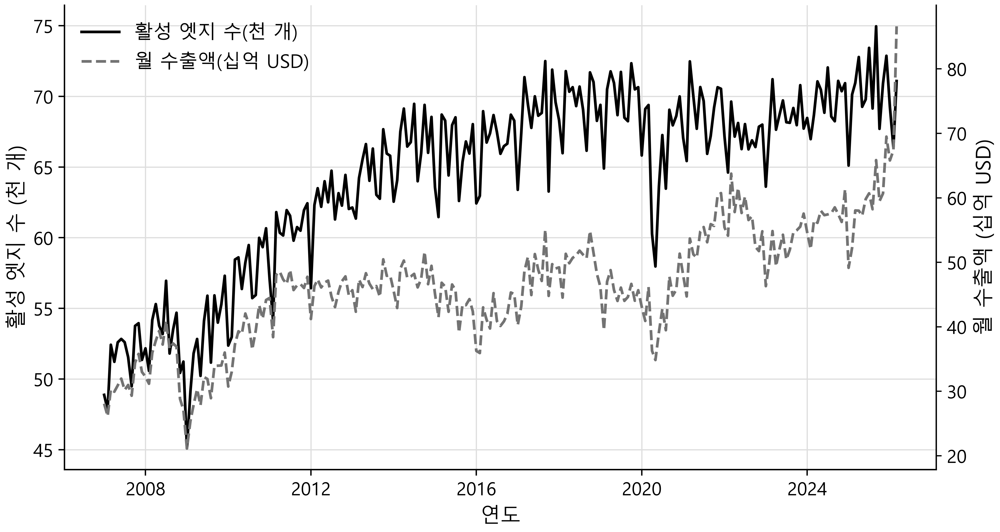
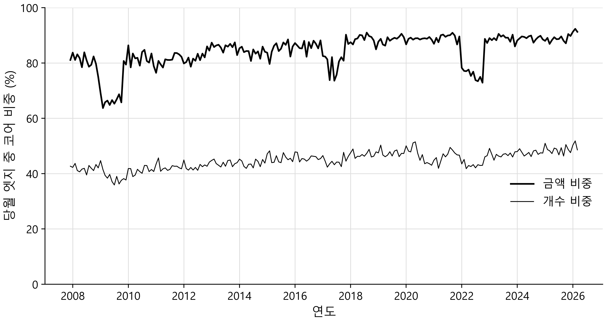
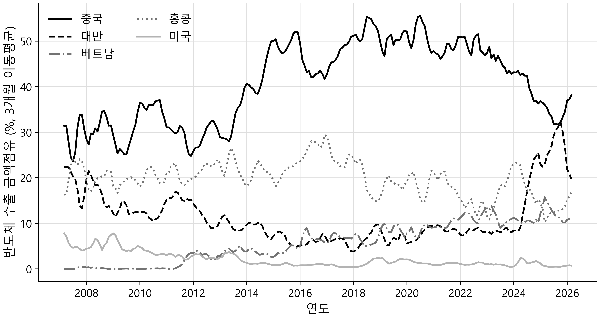
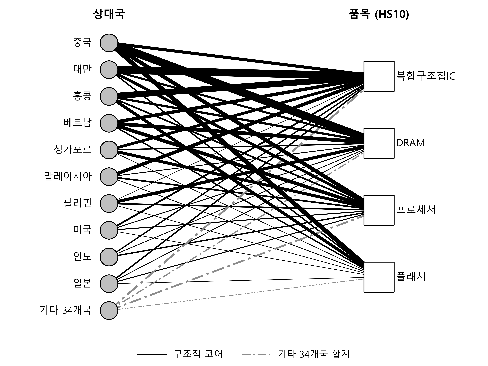

# 한국 수출 연결의 지속성: 월별 HS10 통관 자료의 이분 네트워크 분석

Ⅰ. 서 론
Ⅱ. 자 료
Ⅲ. 방법론
Ⅳ. 네트워크의 규모와 일시성
Ⅴ. 코어의 내부 구성
Ⅵ. 반도체 사례
Ⅶ. 결 론
참고문헌

---

## 초록

본 연구는 한국의 월별 통관 자료를 상대국과 품목의 이분 네트워크(bipartite network)로 표현하고, 2007년 1월부터 2026년 3월까지 231개월에 걸친 그 시계열을 분석한다. 상대국과 HS10 품목을 두 종류의 노드(node)로 삼고, 특정 월의 수출을 두 노드를 잇는 엣지(edge)로 나타낸다. 방법의 핵심은 연결을 지속성에 따라 층위로 나누는 것이다. 분석 결과 한국 수출 네트워크는 겉으로 매우 일시적이어서 매달 엣지의 절반가량이 교체되지만, 이 일시성은 금액이 작은 간헐적 연결에서 거의 전부 발생하며, 수출 금액의 약 84%(전기간 평균이며 최근에는 약 88%)를 나르는 구조적 코어는 월별로 거의 변하지 않는다. 이 코어는 지속성의 관점에서 안정적이되 금액의 관점에서 균등하지 않으며, 시간이 갈수록 소수의 대형 연결로 집중이 심화된다. 그 집중은 반도체의 팽창이 이끈다. 한편 코어의 상대국 구성에서는 대미 연결이 확대되었는데, 이는 집중의 심화와 별개로 진행된 변화다. 코어 금액 비중에 나타나는 몇 차례의 저하는 실제 위기가 아니라 HS 개정에 따른 코드 구성 변화가 만든 측정 효과다. 일시성과 지속적 코어의 분리는 연간 자료로는 관측되지 않으며, 월별 통관 자료를 네트워크로 볼 때에만 드러난다.

**주제어:** 이분 네트워크, 수출 구조, 연결의 지속성, 통관 자료, HS10, 반도체

**JEL 분류:** F14, D85, L63

---

## I. 서론

한 나라의 수출은 어떤 나라에 어떤 품목을 파는가의 집합으로 이루어진다. 이 집합은 고정되어 있지 않다. 새로운 상대국이 열리고 기존 상대국이 닫히며, 특정 품목이 새 시장으로 나가고 다른 품목이 어떤 시장에서 사라진다. 이런 변화는 연 단위로만 일어나지 않는다. 상대국과 품목의 연결은 한 해 안에서도 여러 차례 켜지고 꺼진다. 그러나 대부분의 무역 구조 연구는 연간 자료를 사용하며, 이 경우 한 해 안에서 일어나는 연결의 생성과 소멸은 관측되지 않는다. 연간으로 집계하면 그 해에 한 번이라도 거래가 있었던 연결은 모두 활성으로 기록되고, 언제 생겨 언제 사라졌는지, 얼마나 자주 반복되었는지는 사라진다.

본 연구는 한국의 월별 통관 자료를 사용해 연결의 연도 내 변동(within-year variation)을 관측한다. 방법은 무역을 상대국과 품목의 이분 네트워크로 표현하는 것이다. 상대국과 품목을 두 종류의 노드로 삼고, 특정 월에 어떤 상대국에 어떤 품목을 수출했는지를 두 노드를 잇는 엣지로 나타낸다. 이렇게 하면 매월 하나의 네트워크가 만들어지고, 231개월에 걸친 네트워크의 시계열이 수출 구조의 월별 변화를 담는다.

무역을 네트워크로 보는 접근은 새롭지 않다. 국제무역을 국가와 품목의 이분 네트워크로 표현하고 그 구조에서 경제 발전의 경로를 읽어내는 연구는 Hidalgo et al.(2007)의 제품 공간(product space)과 그 뒤를 이은 경제 복잡도 연구(Hidalgo & Hausmann, 2009) 이후 하나의 분야를 이루었다. 이분 네트워크의 구조적 특성을 통계적 영모형(null model)과 대조해 검증하는 방법론도 발전했다(Saracco et al., 2017). 시간에 따라 변하는 네트워크(temporal network)에서 연결의 지속성을 다루는 연구도 축적되어, 일시적 연결과 지속적 연결이 공존한다는 것과 그 지속성이 안정적 연결 코어에서 오는지 인접 시점 간 단기 상관에서 오는지 구분해야 한다는 점이 밝혀졌으며, 무역 네트워크에서 안정적·지속적 연결 집합의 존재가 관측되기도 했다(Bauzá Mingueza et al., 2023). 국내에서도 사회연결망분석(social network analysis)을 무역에 적용한 연구가 있다(김석민·유광현, 2021; 두본요 외, 2022). 그러나 이 연구들은 대부분 여러 나라를 노드로 하는 세계무역망을 다루거나, 단일 상품의 국가 간 흐름을 이진(binary) 연결로 보거나, 연간 자료를 사용한다. 본 연구와 가장 가까운 것은 75개국과 1,260개 품목 범주의 월별 자료로 국가–품목 이분 네트워크를 구성한 Schoeneman et al.(2024)이다. 다만 이 연구는 여러 나라를 함께 다루며, 관심이 코로나 대유행이 만든 무역 급변의 전파 경로에 있어 연결의 지속성을 층위로 나누지 않는다. 한 나라의 월별 통관 자료를 금액 가중 상대국–품목 이분 네트워크로 구성해 연결의 지속성 층위를 월별로 추적한 연구는 확인되지 않는다.

본 연구의 목적은 새로운 네트워크 지표를 제안하거나 인과 관계를 규명하려는 것이 아니다. 목적은 두 가지다. 첫째, 월별 통관 자료를 이분 네트워크로 표현하는 방법을 정합적으로 규정하는 것이다. 노드와 엣지를 어떻게 정의하고, 어떤 연결을 유의미한 것으로 인정하며, 연결의 지속성을 어떻게 판정할지를 자료에 근거해 결정한다. 둘째, 이 방법을 실제 자료에 적용해 한국 수출 구조의 월별 특성을 서술하고, 대표적인 품목을 예로 들어 방법의 유용성을 보이는 것이다.

목적을 이렇게 한정했음에도 한 가지 뚜렷한 발견이 나온다. 한국의 수출 네트워크는 겉으로는 매우 큰 일시성을 보인다. 매달 엣지의 절반가량이 새로 생기거나 사라진다. 그러나 이 일시성은 거의 전적으로 금액이 작은 간헐적 연결에서 발생한다. 수출 금액의 대부분을 나르는 연결은 소수이며 월별로 거의 변하지 않는다. 이 소수의 지속적 연결은 시간이 갈수록 더 소수의 대형 연결로 집중되며, 그 집중의 상당 부분은 반도체가 이끈다. 이 구조는 네트워크를 지속성에 따라 층위로 나누어야 드러난다. 전체를 뭉뚱그리면 일시성만 보이고, 층위를 나누면 일시적 프린지와 안정적 코어가 분리된다.

이 논문의 구성은 다음과 같다. II장은 자료를 설명한다. III장은 이분 네트워크의 구성과 지표, 지속성 층위의 정의를 규정한다. IV장은 네트워크 전체의 규모와 일시성의 시계열을 서술한다. V장은 코어의 내부 구성이 어떻게 변했는지 다룬다. VI장은 반도체를 예로 들어 방법을 구체적으로 적용한다. VII장은 결론이다.

---

## II. 자료

자료의 출처는 관세청(Korea Customs Service)이 OpenAPI(품목별 국가별 수출입실적, data.go.kr 15100475)로 공개하는 월별 수출입 통계이며, 본 연구는 2007년 1월부터 2026년 3월까지 231개월치 전체를 수집해 구축한 데이터베이스(KCSDB2, https://pilsunchoi.github.io/KCSDB2/)를 사용한다. 이 데이터베이스는 그 응답을 DuckDB 형식으로 정리한 것으로, 거래 자료에 2,753만여 건이 담겨 있다. 각 건은 특정 월, 특정 상대국, 특정 HS10 품목의 수출입 실적을 담으며, 수출 금액과 수입 금액을 각각 항목으로 가진다. 상대국은 240개국이고, 품목은 HS10 단위다.

품목 식별에 쓰는 HS10은 국제 통일 상품 분류(Harmonized System)의 6자리 표준에 한국이 4자리를 덧붙인 10자리 품목 코드다. HS10은 통관 자료에서 얻을 수 있는 가장 세분화된 품목 단위이며, 예를 들어 메모리 반도체 안에서도 DRAM, 플래시 메모리, 복합구조칩 집적회로를 서로 다른 코드로 구분한다. 상대국은 ISO 국가 코드로 식별하며, 표시용 국가명은 관세청 표기를 따른다.

한 가지 자료상의 성질을 밝힌다. HS 분류는 개정될 때마다 코드가 신설되거나 폐지된다. 이 때문에 18년치 거래 자료에는 현재 유효하지 않은 구 코드까지 과거 거래 기록으로 남아 있다. 공식 품목 코드 목록에 등재된 유효 코드는 11,327개이지만, 거래 자료에 실제로 등장한 코드는 이보다 많다. 본 연구는 네트워크의 품목 노드를 각 월의 거래 자료에 실제로 등장한 코드로 정의한다. 이 선택은 HS 개정 시점에 코어 금액 비중을 실물과 무관하게 낮추는 측정 효과로 이어지며, 그 성질은 III.4절에서 다룬다.

이 자료는 통관 기준 통계라는 점에서 몇 가지 본질적 한계를 가진다. 첫째, 통관 시점은 계약이나 선적 시점과 다를 수 있어, 월별 변화가 실물 거래의 시차인지 통관 처리의 지연인지 구분되지 않는다. 둘째, 수출 실적은 상대국(신고상 목적국)과 품목까지만 식별하며, 최종 구매자나 최종 용도는 담지 않는다. 특정 품목이 어떤 나라로 수출되었다는 사실은 알 수 있으나, 그것이 그 나라에서 소비되는지 다시 가공되어 제3국으로 가는지는 알 수 없다. 이 한계들은 VI장의 해석에서 다시 언급한다.

---

## III. 방법론

이 장은 한국의 월별 통관 자료를 상대국과 품목의 이분 네트워크로 표현하는 방식을 규정한다. 먼저 자료를 네트워크로 옮기는 과정에서 내려야 하는 선택들을 밝히고, 각 선택이 결과에 미치는 영향과 그 선택을 정당화하는 근거를 함께 제시한다. 네트워크 분석은 노드와 엣지의 정의, 엣지를 활성으로 인정하는 임계값, 연결의 지속성을 판정하는 기준 같은 여러 재량적 결정을 요구하며, 이 결정들이 결과를 좌우한다. 따라서 이 장의 목적은 분석 기법을 나열하는 데 있지 않고, 각 결정을 명시하고 그 타당성을 자료로 확인하는 데 있다.

### 1. 이분 네트워크의 구성

**두 노드 집합.** 무역 자료는 세 축을 가진다. 시간(월), 상대국, 품목이다. 이 가운데 상대국과 품목을 두 노드 집합으로 삼고, 특정 월에 한국이 어떤 상대국에 어떤 품목을 수출했는지를 두 집합 사이의 연결로 표현한다. 이런 구조를 이분 네트워크(bipartite network)라 한다(이분 네트워크의 기본 개념과 지표는 Newman, 2018을 따른다). 이분 네트워크는 노드(node)가 두 종류로 나뉘고 연결이 서로 다른 종류의 노드 사이에서만 발생하는 네트워크다. 상대국끼리 또는 품목끼리는 직접 연결되지 않는다. 한쪽 노드 집합은 상대국이며 전체 240개국이 등재되어 있고, 다른 쪽 노드 집합은 품목으로 HS10 단위로 식별한다. 이렇게 구성한 네트워크의 실제 모습은 반도체를 예로 든 마지막 그림(그림 4)에서 볼 수 있다.

품목 노드를 정의할 때 한 가지 결정이 필요하다. 품목 노드 집합을 무엇으로 잡을 것인가이다. 두 가지 후보가 있다. 하나는 품목 코드 목록에 등재된 코드 전체이고, 다른 하나는 거래 자료에 실제로 등장한 코드다. 두 집합의 크기는 다르다. 품목 코드 목록에는 11,327개 코드가 등재되어 있으나, 거래 자료에는 2007년 이후 폐지된 구 코드까지 거래 기록으로 남아 있어 실제 등장 코드 수가 더 많다. HS 분류는 개정마다 코드가 신설되고 폐지되므로, 18년치 자료의 누적 코드 수는 특정 시점의 유효 코드 수를 넘어선다.

본 연구는 품목 노드를 각 월의 거래 자료에 실제로 등장한 HS10으로 정의한다. 네트워크의 노드는 명목상 존재하는 코드가 아니라 실제로 거래가 발생한 코드여야 하기 때문이다. 이 선택은 한 가지 함의를 낳는다. 즉, 품목 노드 집합이 시기에 따라 달라진다. 코드 폐지와 신설로 각 월의 품목 노드 수가 변하므로, 노드 수에 의존하는 양을 시기 사이에 직접 비교할 때는 주의해야 한다. 더 중요하게는, HS 개정 시점에 코드가 대거 교체되면 코어 금액 비중에 실물과 무관한 저하가 생기는데, 이는 III.4절에서 다룬다.

**엣지와 가중치.** 특정 월 *t*에 한국이 상대국 *c*에 품목 *h*를 수출하면, 그 월의 네트워크에 상대국 *c*와 품목 *h*를 잇는 엣지(edge)가 하나 생긴다. 엣지의 가중치는 그 달 해당 조합의 수출 금액(미국 달러)으로 둔다. 수출 금액이 없는 조합, 즉 그 달에 그 상대국으로 그 품목이 나가지 않은 조합에는 엣지가 없다.

본 연구는 수출만 다루므로 엣지 가중치에 수출 금액만 사용하고 수입은 제외한다. 수출과 수입은 경제적 의미가 다르고, 본 연구의 관심이 한국의 수출 구조에 있기 때문이다.

한 달의 네트워크는 그 달에 활성인 모든 상대국–품목 엣지의 집합으로 정의된다. 자료 기간은 2007년 1월부터 2026년 3월까지이므로, 이 기간에 걸쳐 231개의 월별 네트워크가 만들어진다. 각 네트워크는 상대국과 품목이라는 같은 두 종류의 노드로 이루어지되, 활성 노드와 엣지의 구성이 달마다 다른, 하나의 스냅샷이다. 이 시계열이 분석 대상이다.

**엣지 활성 임계값.** 모든 상대국–품목 조합을 엣지로 인정하면 네트워크가 소액 일회성 거래로 뒤덮인다. 통관 자료에는 견본 발송, 소량 시험 수출, 일회성 반출 같은 소액 거래가 다수 포함되어 있으며, 이들은 무역 구조를 나타내는 연결이라기보다 잡음에 가깝다. 따라서 엣지를 활성으로 인정하는 최소 금액, 곧 임계값(threshold)을 정해야 한다.

임계값은 재량적 결정이므로 그 선택이 결과를 흔드는지 확인해야 한다. 본 연구는 두 시점(2025년 12월과 2015년 12월)의 네트워크를 세 임계값에서 구성해 지표의 민감도를 점검했다. 임계값을 0, 1,000달러, 100,000달러로 두었을 때의 결과는 다음과 같다(이하 엣지 수와 금액은 2025년 12월 기준이다).

임계값 0달러에서 엣지는 100,724개, 총수출액은 694.8억 달러다. 임계값 1,000달러에서 엣지는 72,871개로 27.6% 줄지만 총수출액은 694.7억 달러로 0.01%만 감소한다. 임계값 100,000달러에서 엣지는 22,247개로 77.9% 줄고 총수출액은 683.5억 달러로 1.6% 감소한다.

이 결과는 1,000달러 임계값을 정당화한다. 엣지의 4분의 1 이상을 제거해도 수출 금액은 0.01%만 사라진다. 제거된 엣지가 금액상 무의미한 거래임을 뜻한다. 반면 100,000달러 임계값은 금액도 1.6% 잃고 품목의 상당수를 탈락시켜 과도하다. 집중도도 세 임계값에서 거의 변하지 않는다. 상위 점유율(III.2절)로 재면 상위 5개 상대국의 금액 점유율이 세 임계값 사이에서 1%p 미만으로만 달라진다(2025년 12월 59.5~60.1%, 2015년 12월 56.7~57.6%). 임계값 선택이 본 연구의 주요 결론을 좌우하지 않음을 뜻한다. 이에 따라 이후 모든 분석은 1,000달러 임계값을 적용한다. 즉 한 달에 특정 상대국으로 특정 품목이 1,000달러를 초과해 수출된 경우에만 엣지로 인정한다.

### 2. 네트워크 지표

네트워크 전체에 적용할 지표를 정의하고 각각이 무역 현상으로 무엇을 뜻하는지 밝힌다. 연결을 지속성에 따라 나누는 판정은 III.3절에서 따로 다룬다. 지표는 모두 각 월의 네트워크에서 계산되어 231개월의 시계열을 이룬다.

**차수(degree).** 한 노드에 연결된 엣지의 수다. 이분 네트워크에서는 두 종류의 차수가 있다. 상대국 차수는 한 상대국에 연결된 품목 수, 곧 한국이 그 상대국에 수출하는 품목의 종수다. 품목 차수는 한 품목에 연결된 상대국 수, 곧 그 품목이 수출되는 상대국의 수다. 품목 차수가 크다는 것은 그 품목이 여러 나라로 널리 나간다는 뜻이고, 작다는 것은 소수 상대국에만 나간다는 뜻이다. 예를 들어 품목 차수가 1인 품목의 비율은 단일 상대국에만 수출되는 품목이 전체에서 차지하는 몫을 말한다.

**집중도(concentration).** 수출이 소수의 상대국이나 품목에 얼마나 몰려 있는지를 나타낸다. 상위 점유율로 측정한다. 곧 금액 기준으로 상위 몇 개 상대국(또는 품목)이 전체 수출액에서 차지하는 비율이다.

집중도 상승은 두 가지로 해석될 수 있어 주의가 필요하다. 하나는 네트워크 구조 자체가 소수 연결로 재편되는 것이고, 다른 하나는 특정 대형 상대국이나 품목의 수출 규모가 팽창해 점유율이 오르는 것이다. 이 둘은 다른 현상이며, 집중도 수치만으로는 구분되지 않는다. 따라서 집중도 변화를 서술할 때는 상위 상대국이나 품목의 구성이 시기에 따라 어떻게 바뀌었는지를 함께 제시해야 한다.

**자카드 유사도(Jaccard similarity).** 인접한 두 달 사이에 엣지 구성이 얼마나 바뀌었는지는 자카드 유사도로 측정한다(Jaccard, 1901). 자카드 유사도는 두 집합의 교집합 크기를 합집합 크기로 나눈 값으로, 두 달의 엣지 집합이 완전히 같으면 교집합과 합집합이 같아 1이 되고, 전혀 겹치지 않으면 0이다. 값이 낮을수록 엣지 구성이 많이 바뀌었음을 뜻한다. 시간에 따라 변하는 네트워크에서 (1 − 자카드)는 일시성(temporality)이라는 이름으로 연결이 얼마나 자주 교체되는지를 재는 데 쓰여 왔다(Bauzá Mingueza et al., 2023).

자카드 유사도가 낮다는 것은 인접한 두 달 사이에 엣지가 대거 새로 생기거나 사라졌다는 뜻이다. 곧 연결 구조의 월간 일시성이 높다는 신호다. 본 연구는 인접월 자카드(직전 달과의 유사도)와 함께 전년동월 자카드(12개월 전과의 유사도)도 계산한다. 두 지표를 비교하면 일시성이 계절적 요인에서 오는지 구조적 요인에서 오는지 가늠할 수 있다.

### 3. 지속성에 따른 연결의 층위

앞의 지표들을 이 네트워크 전체에 적용하면 한 가지 역설이 드러난다. 인접월 자카드가 낮아 매달 엣지의 상당 부분이 교체되는 것처럼 보이는데, 동시에 수출 금액은 안정적으로 흐른다. 이 역설을 풀려면 엣지를 지속성에 따라 나누어 보아야 한다.

본 연구는 어떤 월의 각 엣지가 해당월 포함 최근 12개월 가운데 몇 개월 동안 활성이었는지를 세어 지속성을 판정한다. 이 값을 활성 개월수라 부른다. 활성 개월수가 클수록 그 연결이 꾸준히 유지되는 구조적 연결이고, 작을수록 간헐적으로 켜지고 꺼지는 일시적 연결이다.

활성 개월수의 분포는 뚜렷한 이봉형(bimodal)을 보인다. 2025년 자료에서 한 해 통틀어 한 번이라도 등장한 엣지 16만여 개의 활성 개월수를 세면, 1개월만 활성인 엣지가 29.0%, 3개월 이하가 누적 50.2%로 한쪽 봉우리를 이루고, 12개월 내내 활성인 엣지가 17.4%로 다른 봉우리를 이룬다. 중간대(4개월에서 11개월)는 각 구간이 3~6%로 얇다. 분포가 양극단으로 갈린다는 것은 연결이 구조적인 것과 간헐적인 것으로 자연스럽게 나뉜다는 뜻이다.

이 뚜렷한 이봉 구조에 근거해 두 층위를 정의한다. 구조적 코어(core)는 최근 12개월 가운데 11개월 이상 활성인 엣지다. 간헐적 프린지(fringe)는 최근 12개월 가운데 3개월 이하 활성인 엣지다. 층위는 달마다 다시 판정하므로 한 엣지의 소속이 달에 따라 달라질 수 있다. 층위별 자카드를 잴 때도 각 달의 코어와 프린지를 그 달의 창으로 각각 판정하므로, 이 지표에는 엣지의 등장과 소멸뿐 아니라 층위 소속의 이동도 함께 반영된다.

지속성 판정은 당월 포함 최근 12개월의 이동 창(rolling window) 방식이므로, 자료 시작 후 첫 12개월(2007년)은 판정에 필요한 과거가 없어 코어와 프린지를 정의할 수 없다. 이 구간은 층위 분석에서 제외되고 2008년부터 유효하다.

### 4. 품목 코드 개정의 영향

III.1절에서 품목 노드를 각 월 실제 등장 코드로 정의한 결과, 코어 금액 비중은 HS 개정 시점에 실물 변동과는 무관하게 움직인다. 본 연구의 품목 노드는 HS10, 곧 관세·통계통합품목분류표(HSK)의 코드다. HSK는 해마다 1월 1일자로 개정되어 코드가 신설·폐지되며, 세계관세기구가 정하는 6단위 HS 협약이 함께 바뀌는 개정(2012, 2017, 2022년 1월 발효, 이하 대개정)에서는 그 규모가 특히 크다. 엣지는 상대국과 코드의 짝으로 정의되므로, 어떤 코드가 폐지되고 같은 거래가 새 코드로 이어지면 실물 거래는 끊기지 않아도 엣지는 개정 경계에서 둘로 갈린다. 폐지된 코드의 엣지는 코어 자격을 잃고, 새 코드의 엣지는 아직 자격을 갖추지 못한다. 코어 금액 비중이 낮아지는 시기는 12개월 창의 길이가 정한다. 거래가 매달 이어지는 경우를 놓고 보면, 폐지된 코드는 개정 이후 거래가 없어 창이 2월로 넘어가는 순간 11개월 기준을 채우지 못해 코어에서 빠지고, 새로 생긴 코드는 1월부터 활동을 쌓아야 하므로 11월이 되어서야 코어에 든다. 따라서 어느 해든 2월부터 10월까지는 폐지 코드가 이미 빠지고 신설 코드는 아직 들지 않은 구간이며, 코어 금액 비중이 이 구간에서 낮아진다. 평년에는 교체 규모가 작아 눈에 띄지 않고, 대개정 연도에만 저하가 뚜렷하게 드러난다. 같은 이유로 코드 교체는 12개월 창으로 판정하는 다른 지표에도 영향을 준다. 예를 들어 층위별 자카드는 개정 경계인 12월과 1월 사이에서 코어 엣지의 대응이 끊겨 해마다 1월에 낮아지며, 대개정 연도에 특히 낮다.

코드 교체라는 메커니즘이 있다는 것만으로는 코어 금액 비중 시계열에 나타나는 저하를 개정 탓으로 돌릴 수 없다. 저하의 크기가 얼마이고 코드 교체를 걷어내면 그것이 사라지는지를 자료로 확인해야 한다. 코어 금액 비중에는 상승 추세가 있으므로, 저하 폭은 그 달의 값을 그 무렵의 정상 수준(앞뒤 두 해의 월별 중앙값)과 견주어 잰다. 이 기준으로 세 차례 대개정의 저하는 2017년 14.2%p, 2022년 12.5%p, 2012년 2.8%p다.

이 저하가 코드 교체에서 온다는 근거는 둘이다. 하나는 교체되는 금액의 규모다. 개정 직전 달에 곧 폐지될 코드가 나르던 금액 비중은 2012년 3.4%, 2017년 3.8%, 2022년 13.8%다. 이 코드들은 개정 전에는 코어일 수 있었으므로, 그 자격 상실은 코어 정의에서 자동으로 따라 나오는 결과가 아니다. 다만 대개정별로 이 비중과 저하 폭이 비례하지는 않아, 이 수치는 측정 효과가 실재함을 보일 뿐 저하의 크기까지 설명하지는 못한다. 다른 하나는 코드 집합을 바꾼 비교다. 전 기간 등장 코드(2007–2025년 19개 연도 모두에 등장한 5,130개)로만 한정하면 세 저하가 모두 ±1.1%p로 줄어 비이벤트 월의 변동(표준편차 2.0%p) 안에 든다. 개정 때 신설되거나 폐지되지 않은 코드만 남기면 저하가 사라진다는 뜻이다. 한편 이 측정 효과가 지표의 수준 자체를 낮추지는 않는다. 코어 금액 비중의 전기간 평균은 전체 코드 84.3%, 이 부표본(subsample) 85.3%로 거의 같다.

이에 따라 본 연구는 두 가지 규칙을 둔다. 첫째, 대개정 뒤 몇 달 동안 나타나는 코어 금액 비중 저하를 실물 구조 변화로 해석하지 않는다. 둘째, 이 지표를 서로 다른 시기 사이에 비교할 때는 위 부표본을 강건성 기준으로 삼는다. 곧 전체 코드로 계산한 값이 이 부표본에서도 유지되는지 확인한 뒤에 시기 간 차이를 해석한다. 다만 이 필터의 기준(모든 해에 등장)은 측정 대상(연결의 지속성)과 같은 성질을 재므로 중립적이지 않고 실제 단절까지도 함께 걷어낸다. 코드 교체가 없던 2009년 금융위기 구간에서도 저하 폭이 이 필터를 적용하면 14.8%p에서 1.1%p로 줄어드는 것이 그 증거다. 위기에 끊긴 연결은 모든 해에 등장한 코드라는 기준에 걸려 표본에서 함께 빠진다. 그러므로 부표본에서 저하가 사라진다는 사실은 코어 안정성의 증거가 아니라 실물 효과의 하한으로만 읽는다.

---

## IV. 네트워크의 규모와 일시성

이 장은 네트워크 전체의 시계열을 다룬다. 개별 품목이나 상대국이 아니라 총량 지표의 추이를 다루며, 여기서 본 연구의 중심 발견인 지속적 코어와 일시적 프린지의 분리가 드러난다.

### 1. 규모의 성장

네트워크의 규모는 꾸준히 커졌다. 활성 엣지 수는 2007년 12월 약 51,000개에서 2025년 12월 약 73,000개로 늘었고, 같은 기간 월 수출 금액은 330억 달러에서 695억 달러로 증가했다(그림 1). 두 계열은 대체로 같은 방향으로 증가한다. 다만 이중축의 스케일 선택에 따라 두 선의 겹침 정도가 달라 보일 수 있으므로, 두 계열이 함께 성장했다는 사실만 읽고 동조의 강도는 여기서 판단하지 않는다. 두 계열 모두 2008년 말~2009년 초와 2020년 초에 뚜렷이 급락하는데, 각각 세계 금융위기와 코로나 대유행의 시기다. 위기가 수출 금액뿐 아니라 활성 연결의 수, 곧 네트워크의 외연(extensive margin)까지 줄였음을 보여준다.

**그림 1. 상대국 × HS10 이분 네트워크의 규모 성장 (2007–2026년).** 검은 실선은 각 월의 활성 엣지 수(좌축, 천 개), 회색 점선은 월 수출 금액(우축, 십억 달러)이다.

### 2. 외견상의 일시성

네트워크는 겉으로는 매우 큰 일시성을 보인다. 인접한 두 달 사이의 자카드 유사도는 평균 약 0.52이며, 이는 매달 엣지의 절반가량이 교체됨을 뜻한다. 직전 달에 있던 연결의 상당수가 이번 달에 사라지고, 이번 달의 상당수가 지난달에는 없던 것이다.

전체 엣지의 일시성은 계절적 요인에서 오지 않는다. 인접월 자카드의 월별 평균을 1월부터 12월까지 계산하면 모두 0.50에서 0.52 사이로 평탄하며, 특정 월에 교체가 몰리는 패턴이 없다. 전년동월 자카드도 평균 약 0.48로 인접월과 비슷하다. 만약 일시성이 계절적이라면 전년동월 유사도가 인접월보다 뚜렷이 높아야 하지만 그렇지 않다. 곧 이 네트워크의 엣지 교체는 계절이 아니라 다른 요인으로 규정된다. 다만 이는 전체 엣지 기준이며, 코어 층위에서는 1월 저점이 상대적으로 두드러진다. 코어의 인접월 자카드는 1월 평균 0.90으로 나머지 달의 평균 0.92보다 낮다. 또 여기서 확인한 것은 엣지 집합 교체율의 무계절성에 한정된다. 조업일수나 명절 같은 달력 효과는 집합 구성보다 수출 금액에 주로 작용하므로, 코어 금액 비중이나 집중도 같은 금액 지표의 계절성은 이 관측만으로 검정되지 않는다.

### 3. 층위를 나누면 드러나는 이중 구조

외견상의 일시성과 안정적으로 흐르는 수출 금액 사이의 역설은 엣지를 지속성에 따라 나누면 풀린다. III.3절의 층위 구분(코어는 12개월 중 11개월 이상, 프린지는 3개월 이하 활성)을 적용해 인접월 자카드를 다시 재면 세 계열이 뚜렷이 갈린다. 코어는 평균 0.92로 거의 변하지 않고, 프린지는 평균 0.07로 매달 거의 전부 교체되며, 전체는 그 중간인 0.52 부근이다. 다만 코어와 프린지가 활성 개월수로 정의되는 이상, 이들의 자카드 수준은 정의에서 상당 부분 따라 나오므로 이는 발견이 아니라 층위 구분이 작동함을 보이는 정합성 점검이다.

정의에서 따라 나오지 않는 사실은 금액의 분포다. 코어는 개수로는 전체의 절반에 못 미치지만(약 45%), 금액으로는 대부분을 차지한다(전기간 평균 약 84%, 최근 평상시 약 88~90%; 그림 2). 코어와 프린지를 금액 정보 없이 지속성만으로 갈랐는데도 지속적 연결이 금액의 대부분과 겹친다는 것, 이것이 본 연구의 중심 발견이다. 외견상의 일시성을 만드는 매달 절반의 교체는 거의 전적으로 금액이 작은 프린지에서 일어나며, 금액의 대부분을 나르는 코어는 월별로 거의 미동하지 않는다.

**그림 2. 코어의 금액 비중과 개수 비중.** 굵은 실선은 각 월의 활성 엣지 가운데 구조적 코어가 차지하는 금액 비중, 가는 실선은 개수 비중이다. 굵은 실선은 2009, 2017, 2022년 중반에 일시적으로 낮아진다.

그림 2의 굵은 실선에 몇 차례 보이는 저하는 III.4절에서 밝힌 코드 구성 변화에 따른 것이며 코어 자체의 불안정이 아니다. 이는 그림 1에서 관측한 2009, 2020년의 급락과 다른 현상이다. 앞은 코어가 당월 금액에서 차지하는 몫의 변화이고, 뒤는 엣지 수와 수출 금액 자체의 감소다. 코드 개정이 없던 2020년 코로나 시기에는 실제 최대 충격에도 검출 가능한 저하가 없는데, 이는 실물 충격이 코어를 흔들지 않았다는 증거라기보다 이 지표의 검출 한계로 읽는 편이 안전하다.

---

## V. 코어의 내부 구성

IV장은 코어가 금액의 대부분을 안정적으로 나른다는 것을 보였다. 이 장은 그 내부를 들여다본다. 코어가 안정적이라는 것이 곧 균등하다는 뜻은 아니다. 그 안에서 금액이 어떻게 분포하고 그 분포가 어떻게 변했는지를 보면, 안정적 코어라는 서술을 한정해야 할 필요가 드러난다.

### 1. 금액 집중의 심화

한국 수출의 코어는 시간이 갈수록 더 소수의 대형 연결로 집중되었다. 코어 엣지를 금액 순으로 정렬한 다음 상위 몇 퍼센트가 코어 금액에서 차지하는 몫을 보면, 그 몫이 두 시점 사이에 뚜렷이 커졌다. 표 1이 이를 보여준다.

**표 1. 코어 내부 금액 집중의 심화**

| 연월 | 코어 엣지수 | 코어 금액(십억 USD) | 상위 1% | 상위 5% | 상위 10% |
|------|:---:|:---:|:---:|:---:|:---:|
| 2007.12 | 21,915 | 26.7 | 51.9% | 75.3% | 84.3% |
| 2025.12 | 34,675 | 62.4 | 65.6% | 82.8% | 89.3% |

*주: 코어 엣지수는 각 월의 활성 엣지 가운데 구조적 코어의 개수, 코어 금액은 그 코어의 당월 수출 금액 합계다. 상위 x%는 코어 엣지를 금액 순으로 정렬했을 때 상위 x%가 코어 금액에서 차지하는 비율이다. 엣지 기준의 상위 점유율은 상대국 기준 집중도와 달리 엣지 활성 임계값에 민감하므로(III.1절), 이 표의 비교는 임계값을 1,000달러로 고정한 두 시점 사이에서만 유효하다.*

상위 1%의 몫은 2007년 12월 51.9%에서 2025년 12월 65.6%로 올랐다. 상위 5%의 몫은 75.3%에서 82.8%로, 상위 10%의 몫은 84.3%에서 89.3%로 올랐다. 코어 엣지의 상위 1%가 코어 금액의 3분의 2를 나르는 셈이며, 그 집중은 심화되었다.

코어의 절대 규모 역시 이 집중과 같은 방향으로 움직였다. 코어 엣지수는 2007년 12월 21,915개에서 2025년 12월 34,675개로 약 1.6배 늘었으나, 코어 금액은 같은 기간 267억 달러에서 624억 달러로 약 2.3배 늘었다. 금액이 엣지 수보다 빠르게 증가했다는 것은 개별 코어 연결의 평균 규모가 커졌다는 뜻이며, 앞서 본 상위 집중의 심화와 정합한다.

이 사실은 IV장의 서술에 단서를 붙인다. 코어는 지속성의 관점에서 안정적이지만, 금액의 관점에서 균등하지 않으며 오히려 소수 연결로의 쏠림이 커지고 있다. 소수의 안정적 코어가 금액의 대부분을 나른다는 IV장의 서술과, 그 코어 안에서 다시 극소수로 집중이 심화된다는 이 장의 서술은 층위가 다르다. 앞은 연결의 지속성에 관한 것이고, 뒤는 금액의 분포에 관한 것이다. 둘을 뭉뚱그리면 안정과 집중을 같은 것으로 오해하기 쉽다.

### 2. 코어 구성 변화의 두 축

코어의 구성이 어떻게 바뀌었는지를 보면 두 개의 서로 다른 축이 나타난다. 첫째 축은 반도체다. 코어 금액에서 반도체(HS 8541, 8542)가 차지하는 비중은 2007년 12월 9.9%에서 2025년 12월 27.3%로 세 배 가까이 올랐다. 반도체 수출의 팽창은 소수의 대형 엣지를 키우므로 5.1에서 본 엣지 기준 집중의 심화와 직접 이어진다.

둘째 축은 대미 연결의 확대다. 본 연구의 엣지 집합에서 연간 금액 점유로 보면 대미 비중은 2007년 12.3%에서 2025년 17.3%로 올랐다. 같은 기간 대중국 비중은 22.1%에서 2018년 26.8%까지 오른 뒤 2025년 18.4%로 낮아져 두 나라의 격차가 크게 좁혀졌으나(2024년 중국 19.5%·미국 18.7%), 연간 기준으로 미국이 중국을 앞선 해는 없다. 다만 이 축은 집중과 방향이 다르다. 최대 상대국의 몫이 줄고 2위와의 격차가 좁혀졌으므로, 상대국 기준으로 보면 분포는 오히려 평평해졌다. 곧 둘째 축은 집중을 이끄는 것이 아니라 코어의 상대국 구성이 바뀌는 것이다. 그러나 뒤의 VI장에서 보듯 이 대미 비중 상승은 반도체가 이끈 것이 아니다. 반도체는 거의 전적으로 아시아로 나가며 미국 비중이 미미하다. 곧 코어 구성 변화의 두 축, 반도체의 대아시아 연결과 비반도체의 대미 연결은 서로 다른 품목과 상대국에서 진행되며 하나로 묶이지 않는다.

이 분리는 네트워크 관점의 유용성을 보여준다. 총량 통계는 "대미 수출 증가"와 "반도체 수출 증가"를 각각 보여주지만, 두 현상이 수출 구조의 어느 부분에서 일어나며 서로 겹치는지 또는 갈라지는지는 보여주지 못한다. 엣지 수준의 분해는 이 둘이 다른 연결에서 진행됨을 드러낸다.

---

## VI. 반도체 사례

이 장은 앞의 서술을 반도체라는 하나의 품목군에서 구체적으로 확인한다. 반도체 주력 품목을 고른 것은 V장에서 반도체가 코어 금액 집중을 이끄는 축으로 확인되었기 때문이다. 아울러 수출 규모가 크고, 첨단 패키징 재편처럼 해석의 기준점이 될 만한 잘 알려진 산업 변화가 있어 예시로 적합하다. 따라서 이 장은 새로운 가설 검정이 아니라, 앞 장에서 얻은 발견을 대표적 품목군에서 사후적으로 예시하는 부연이다.

분석 대상은 반도체 주력 품목인 복합구조칩 집적회로(HS 8542323000), DRAM(HS 8542321010), 플래시 메모리(HS 8542321030), 프로세서·컨트롤러(HS 8542311000)다. 이 네 코드는 V.2절에서 첫째 축으로 다룬 HS 8541·8542 가운데 금액 규모가 가장 큰 품목들이며, 따라서 이 장의 관측은 V.2절의 반도체 전체가 아니라 그 주력 부분에 대한 것이다.

### 1. 소수 상대국에 집중된 수출

반도체는 소수의 나라로만 나간다. 주력 네 품목의 품목 차수, 곧 실제로 수출되는 상대국의 수는 품목과 시점에 따라 10개에서 60개 사이로, 네 품목 모두 전체 240개 상대국의 4분의 1 이하에 그친다. DRAM은 14개에서 33개국 사이로 안정적으로 나가고, 복합구조칩 집적회로의 차수는 2007년 12월 11개에서 2025년 12월 30개로 늘었다. 프로세서·컨트롤러는 2010년에야 자료에 등장해 최근 44개국으로 넷 가운데 가장 넓다. 반도체 수출은 넓게 퍼지지 않고 소수 시장에 묶여 있다.

### 2. 목적지의 이동

반도체 합산 수출액은 2007년 12월 약 12억 달러에서 2025년 12월 약 136억 달러로 11배 늘었다. 이 기간 목적지의 구성은 크게 바뀌었다. 이하에서 보고하는 비중은 위 네 품목의 합산 금액에서 각 목적지가 차지하는 몫이며, 전체 수출을 분모로 삼는 V.2절의 상대국 점유와는 기준이 다르다. 대중국 비중은 2010년대 후반 50%를 오르내리며 2020년 한때 약 58%까지 높아졌다가 2025년 12월 34%로 낮아졌고, 대만 비중은 2019년 12월 약 6%에서 2025년 12월 23%로 크게 올랐으며, 베트남 비중은 꾸준히 올랐다. 홍콩은 대중국 중계무역의 성격을 띤 채 높은 비중을 유지했다. 반면 미국 비중은 0.8%에서 4% 사이로 시종 미미하다(그림 3). 미국 비중이 미미하다는 사실은 V장의 서술을 뒷받침한다. 전체 수출에서 관측된 대미 비중 상승은 반도체가 아닌 다른 품목에서 온 것이다. 반도체는 철저히 아시아를 향한다.

**그림 3. 반도체 주력 품목의 목적지 금액점유 이동 (3개월 이동평균).** 다섯 선은 각각 중국(검은 실선), 대만(검은 파선), 베트남(회색 1점쇄선), 홍콩(회색 점선), 미국(옅은 회색 실선)이다. 값은 반도체 주력 네 품목(복합구조칩 집적회로·DRAM·플래시 메모리·프로세서)의 합산 수출액에서 각 목적지가 차지하는 금액 비중이며, 월별 진폭을 줄이기 위해 3개월 이동평균으로 표시했다. 이동평균을 적용했으므로 특정 월의 정확한 점유율은 본문 수치를 따른다.

앞에서 본 대만 비중의 상승은 원인을 자료만으로 특정할 수 없다. 시기는 고대역폭 메모리(HBM, High Bandwidth Memory)를 포함한 첨단 패키징 공급망에서 한국과 대만의 연결이 강화된 국면과 맞는다. 그러나 통관 자료가 보여주는 것은 대만향 반도체 수출액이 늘었다는 사실까지다. 복합구조칩 집적회로 코드는 고대역폭 메모리 전용이 아니라 여러 종류의 다중구성 집적회로를 함께 담으므로 수출품이 무엇인지 가려지지 않고, 그것이 대만에서 어떻게 가공되어 어디로 가는지도 자료에 없다. 따라서 공급망 재편이라는 해석은 통관 자료 밖의 산업 지식에 기댄 것이며, 본 연구는 대만향 반도체 연결의 금액 비중이 최근 크게 올랐다는 서술까지만 자료로 확정한다.

### 3. 코어가 나르는 반도체 수출

반도체의 상대국 연결은 거의 전부 구조적 코어에 속한다. 표 2가 2025년 반도체 엣지의 층위 분류를 보여준다.

**표 2. 반도체 상대국–품목 엣지의 층위 분류 (2025년)**

| 층위 | 엣지 수 | 엣지 비율 | 금액 점유 |
|------|:---:|:---:|:---:|
| 구조적 코어 (11/12개월 이상) | 98 | 56% | 99.9% |
| 간헐 프린지 (3/12개월 이하) | 46 | 26% | 0.0% |
| 전체 | 175 | 100% | 100% |

*주: 반도체 주력 4개 품목 코드(복합구조칩 집적회로·DRAM·플래시 메모리·프로세서)에 대해, 2025년 1~12월에 한 번이라도 등장한 모든 상대국–품목 조합을 그 12개월 중 활성 개월수로 분류했다. 이 12개월 창은 이동 창 정의(III.3절)로 2025년 12월을 판정한 창과 같은 구간이다. 다만 IV장의 월별 코어가 '당월 활성 엣지 중 코어'인 것과 달리 이 표는 그 해에 등장한 엣지 전체를 대상으로 하므로 개수 기준이 다르다. 코어와 프린지의 엣지 비율 합이 100%가 되지 않는 것은 중간대(4~10개월 활성)가 나머지를 차지하기 때문이다.*

2025년 반도체 엣지 175개 가운데 최근 12개월 중 11개월 이상 활성인 코어는 98개로 56%를 차지하며, 이 코어가 반도체 수출 금액의 99.9%를 나른다. 3개월 이하 활성인 프린지는 46개로 26%를 차지하지만 금액으로는 사실상 0%다.

같은 관계를 네트워크로 그리면 그림 4와 같다. 2025년 12월에 네 품목이 실제로 나간 상대국은 44개이고 활성 엣지는 114개다. 44개 상대국을 모두 노드로 그리면 선이 겹쳐 읽히지 않으므로, 금액 상위 10개국만 개별 노드로 두고 나머지 34개국은 하나의 노드로 묶어 품목별 합계로 이었다. 선 굵기는 그 달의 수출 금액에 비례시키되, 상대국 사이의 금액 차이가 커 제곱근 척도를 썼다. 선 종류는 그 엣지가 구조적 코어(최근 12개월 중 11개월 이상 활성)인지 아닌지를 나타낸다.

**그림 4. 반도체 주력 4품목의 상대국 연결 (2025년 12월).** 왼쪽은 금액 상위 10개 상대국과 나머지 34개국을 묶은 노드, 오른쪽은 반도체 주력 네 품목이다. 선 굵기는 그 달의 수출 금액을 나타낸다. 상위 10개국으로 가는 연결 39개는 예외 없이 모두 구조적 코어이므로 검은 실선으로만 그려진다. 코어가 아닌 연결 17개는 모두 기타 34개국에 속해, 품목별로 합산한 1점쇄선에 포함되었다. 상위 10개국이 금액의 98.2%를 나르고, 기타 34개국은 모두 합쳐도 1.8%에 그친다. 당월 활성 엣지를 대상으로 하므로, 그 해에 한 번이라도 등장한 엣지를 대상으로 한 표 2와 엣지 수가 다르다.

이 결과는 IV장과 V장의 서술을 미시 수준에서 확증한다. 반도체 수출은 소수 아시아 상대국과의 지속적 연결로 거의 전부가 흐르며, 간헐적 연결은 금액상 무의미하다. 반도체가 코어 금액의 상당 부분을 차지한다는 V장의 발견은, 반도체 자체가 거의 전적으로 지속적 대형 연결로 이루어져 있다는 이 미시 관측과 정합한다. 전체에서 관측된 지속적 코어의 금액 집중이 반도체라는 대표 품목에서 그대로 재현되는 것이다.

---

## VII. 결론

본 연구는 한국의 월별 통관 자료를 상대국과 품목의 이분 네트워크로 표현하고, 231개월에 걸친 그 시계열을 분석했다. 방법의 핵심은 연결을 지속성에 따라 층위로 나누는 것이다.

주요 관측 결과는 세 가지다. 첫째, 한국 수출 네트워크는 겉으로 매우 일시적이어서 매달 엣지의 절반가량이 교체되지만, 이 일시성은 간헐적 프린지에서 거의 전부 발생하며 수출 금액의 약 84%(전기간 평균이며 최근에는 약 88%)를 나르는 구조적 코어는 월별로 거의 변하지 않는다. 둘째, 그 코어는 지속성의 관점에서 안정적이되 금액의 관점에서 균등하지 않으며, 시간이 갈수록 소수의 대형 연결로 집중이 심화된다. 그 집중은 반도체의 팽창이 이끈다. 코어 금액에서 반도체가 차지하는 비중이 2007년 12월 9.9%에서 2025년 12월 27.3%로 오르면서 소수의 대형 엣지가 커졌기 때문이다. 코어의 상대국 구성에서도 큰 변화가 있었다. 대미 연결의 비중이 커지고 대중국 비중은 2018년을 정점으로 낮아졌다. 다만 이 변화는 최대 상대국의 몫을 줄이는 방향이어서 집중의 심화와는 성격이 다르며, 두 변화는 서로 다른 품목과 상대국에서 진행된다. 셋째, 반도체를 예로 들면 그 상대국 연결은 거의 전부가 지속적 코어이며 금액의 99.9%가 소수 아시아 상대국과의 안정적 연결로 흐른다.

방법을 규정하는 과정에서 한 가지 측정상의 성질이 드러났다. 각 월의 실제 등장 코드를 품목 노드로 삼으면 코어 금액 비중이 HS 개정에 따른 코드 구성 변화에 민감해져, 개정 시점에 실물과 무관한 저하가 나타난다(III.4절). 따라서 이 지표를 그대로 위기·충격의 탐지 수단으로 삼아서는 안 되며, 월별 통관 자료를 네트워크로 다루는 후속 연구는 코드 개정 시점의 측정 효과를 반드시 통제해야 한다.

본 연구는 인과를 규명하지 않으며, 통관 자료가 최종 용도와 최종 구매자를 담지 않는다는 제약 아래 있다. 관측된 변화를 알려진 사건과 시기적으로 견주는 데 그친다. 층위 경계와 엣지 활성 임계값도 재량적 결정이다. 경계는 활성 개월수 분포의 이봉 구조에, 임계값은 세 값에서의 민감도 점검에 근거해 정했으나, 다른 경계나 다른 임계값에서 세부 수치는 달라질 수 있다. 남은 과제는 두 가지다. 하나는 HS10 수준에서 개정 전후를 잇는 대조표를 구축해 측정 효과를 선택 편의 없이 제거하는 것이고, 다른 하나는 반도체에서 확인된 층위 구성이 다른 품목군에서도 성립하는지 확인하는 것이다.

이 관측들의 바탕에 있는 층위 구분은 연간 자료로는 만들 수 없다. 연결의 지속성은 한 해 안의 월별 반복을 세어야 판정되고, 외견상의 일시성과 안정적 코어의 분리도 월별 재배선을 관측해야 드러난다. 금액 집중의 심화나 상대국 구성의 재편은 연간 자료로도 볼 수 있으나, 그것이 지속적 연결 안에서 일어난다는 사실은 월별 자료라야 확인된다. 월별 통관 자료를 네트워크로 보는 것의 유용성은 여기에 있다.

---

## 참고문헌

김석민·유광현 (2021). SNA를 통한 세계 지역경제통합 네트워크의 중심성 분석과 시각화. *관세학회지*, 22(4), 115–141.

두본요·최동오·유천 (2022). 중고의류 무역 연결망 분석과 시사점. *통상정보연구*, 24(3), 43–63. 한국통상정보학회. DOI: 10.15798/kaici.2022.24.3.43.

Bauzá Mingueza, F., Floría, M., Gómez-Gardeñes, J., Arenas, A., & Cardillo, A. (2023). Characterization of interactions' persistence in time-varying networks. *Scientific Reports*, 13, 765. DOI: 10.1038/s41598-022-25907-7.

Hidalgo, C. A., Klinger, B., Barabási, A.-L., & Hausmann, R. (2007). The product space conditions the development of nations. *Science*, 317(5837), 482–487. DOI: 10.1126/science.1144581.

Hidalgo, C. A., & Hausmann, R. (2009). The building blocks of economic complexity. *Proceedings of the National Academy of Sciences*, 106(26), 10570–10575. DOI: 10.1073/pnas.0900943106.

Jaccard, P. (1901). Distribution de la flore alpine dans le bassin des Dranses et dans quelques régions voisines. *Bulletin de la Société Vaudoise des Sciences Naturelles*, 37, 241–272.

Newman, M. E. J. (2018). *Networks* (2nd ed.). Oxford University Press.

Saracco, F., Straka, M. J., Di Clemente, R., Gabrielli, A., Caldarelli, G., & Squartini, T. (2017). Inferring monopartite projections of bipartite networks: an entropy-based approach. *New Journal of Physics*, 19(5), 053022. DOI: 10.1088/1367-2630/aa6b38.

Schoeneman, J., Brienen, M., Lambert, L., & Lambert, D. (2024). A bipartite network analysis of international trade volatility. *Applied Network Science*, 9, 74. DOI: 10.1007/s41109-024-00684-6.

---

## Persistence of Export Ties in Korea: A Bipartite Network Analysis of Monthly HS10 Customs Data

**Abstract**

This study represents Korea's monthly customs data as a bipartite network of trading partners and products, and analyzes the resulting series of 231 months from January 2007 to March 2026. Partner countries and HS10 products form the two node sets, and exports in a given month form the edges connecting them. The core of the method is to divide connections into layers according to their persistence. On the surface the network appears highly transient: about half of all edges are replaced each month. This transience, however, occurs almost entirely among intermittent, low-value connections, while the structural core that carries roughly 84 percent of export value (the full-period average; about 88 percent in recent years) barely changes from month to month. The core is stable in terms of persistence but uneven in terms of value, and concentration within it has deepened over time, driven by the expansion of semiconductors. The partner composition of the core has shifted separately, with connections to the United States expanding. The occasional declines in the core's value share reflect not actual crises but a measurement effect produced by changes in the set of active codes at HS revisions. The separation between surface transience and a persistent core is not observable in annual data; it emerges only when monthly customs data are viewed as a network.

**Keywords:** bipartite network, export structure, connection persistence, customs data, HS10, semiconductors

**JEL Classification:** F14, D85, L63
