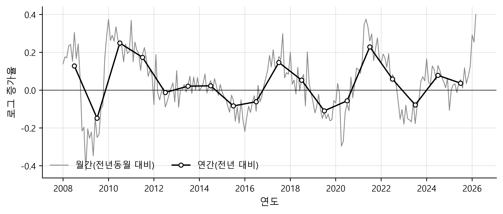
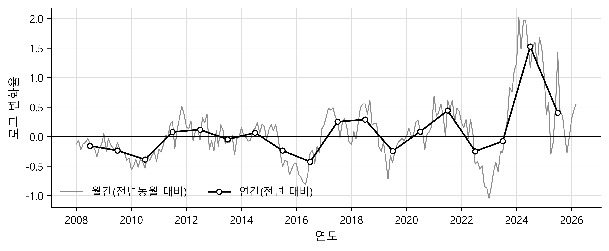
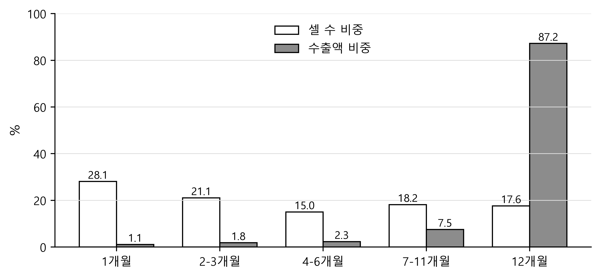

# 한국 수출입 변동의 외연·내연·가격·수량 분해: 연간 자료와 월간 자료의 비교

*Decomposing Korean Trade Fluctuations into Extensive, Intensive, Price, and Quantity Margins: What Monthly Data Show That Annual Data Cannot*

---

## 요약

본 연구는 한국 수출입의 변동(fluctuations)이 어디서 오는지를, 교역상대국-품목 조합의 수(외연, extensive margin), 단가(가격), 물량(수량)의 세 갈래 마진으로 나누어 측정한다. 동일한 관세청 통관 자료를 연간(2007–2025)과 월간(2007.1–2026.3)으로 두 번 집계해 같은 분해를 반복한다. 연간 자료는 월간 자료의 합산이므로 두 결과의 차이는 전부 관측 빈도에서 나온다. 결과는 세 가지다. 첫째, 마진의 순위는 빈도와 무관하게 가격, 수량, 외연 순으로 같다. 둘째, 크기는 크게 달라져, 수출에서 가격의 비중은 연간 49.2%에서 월간 32.9%로 낮아진다(수입은 58.9%에서 47.9%). 셋째, 그러나 연간에서는 안 보이다가 월간에서 비로소 드러나는 변동의 92%는 가격이 아니라 물량의 증감, 그리고 거래의 끊김과 재개 등으로 이루어져 있다. 가격이 만드는 변동의 절대 크기는 두 빈도에서 거의 같다. 반도체 가격의 연내 급등락 때문에 연간 자료가 가격 변동을 놓치리라던 당초 예상과 달리, 연간 자료가 실제로 놓치는 것은 물량의 움직임과 거래 관계(교역상대국-품목 조합)의 명멸이다. 실제로 수출 기준으로 연간 자료에 활성으로 잡힌 관계의 28%는 연중 단 1개월만 거래되었고, 매달 새로 나타나는 관계의 94%는 과거에 거래된 적 있는 관계의 복귀다. 다만 월간 쪽 수치는 미조정 잡음이 섞인 최대치이고, 가격 비중의 절대 수준에는 과대측정 위험이 있다.

핵심어: 외연 마진, 내연 마진, 단가 분해, 시간 집계, 관세청 통관자료, 반도체

---

## 1. 서론

본 연구의 질문은 하나다. 한국 수출입의 변동(fluctuations)은 어떤 원천에서 비롯되는가. 변동의 원천은 세 갈래로 나눌 수 있다. 거래되는 국가-품목 조합(이하 셀이라 부른다)의 수가 변해서 생기는 변동이 외연 마진(extensive margin)이고, 이미 거래되던 조합의 거래액이 변해서 생기는 변동이 내연 마진(intensive margin)이며, 내연 마진은 다시 단가가 변한 부분(가격)과 물량이 변한 부분(수량)으로 나뉜다. 이 구분이 중요한 이유는, 겉으로 같은 크기의 수출 감소라도 어느 마진에서 왔느냐에 따라 경제적 의미가 다르기 때문이다. 단가 하락은 물량이 유지되는 교역조건의 문제이고, 물량 감소는 실물 활동의 위축이며, 거래 관계의 소멸은 다시 잇는 데 비용이 드는 구조적 손실이다. 본 연구는 이 세 갈래의 기여도가 얼마인지를 묻되, 같은 질문을 두 번 묻는다. 한 번은 연간 자료로, 한 번은 월간 자료로 측정하고, 두 답이 얼마나 다른지를 본다. 이것은 인과 질문이 아니라 측정 질문이다. 동일한 원자료, 동일한 셀 정의, 동일한 분해 항등식(decomposition identity)을 두 빈도에 적용했을 때 결과가 어디서 갈라지는지를 숫자로 보고하는 것이 목표이다.

한 가지를 처음부터 분명히 해 둔다. 월간 분해에서 외연 기여도가 연간보다 크게 나오는 것 자체는 발견이 아니다. 연간 합산에서는 사라지는 한두 달의 공백과 재개가 월간에서는 외연 변동으로 잡히므로, 이 방향은 자료를 보기 전부터 예상되는 것에 가깝기 때문이다. 보고할 가치가 있는 것은 세 가지다. 기여도의 순위가 빈도에 따라 뒤집히는가, 격차의 크기는 얼마인가, 그 격차는 어떤 품목과 어떤 마진에서 생기는가. 본 연구는 세 물음 모두에 답하며, 세 번째 답은 사전 예상과 방향이 반대였다는 점을 미리 밝혀 둔다.

연간 자료와 월간 자료는 장단점이 서로의 거울상이다. 연간 자료의 장점은 두 가지다. 우선 계절, 조업일수, 명절 이동, 월말에 신고가 몰리는 현상 같은 통관 시점의 잡음이 12개월을 합치는 과정에서 평균되어 사라진다. 또한 가령 한 달 쉬었다가 재개되는 거래가 퇴출로 잘못 잡히는 가짜 퇴출(spurious exit) 문제가 없다. 이에 반해 연간 자료의 약점은 1년 안에서 일어나는 움직임을 볼 수 없다는 것이다. 연간 증가율은 수학적으로 월간 증가율의 12개월 이동평균에 가깝다. 이동평균은 느린 흐름은 통과시키고 빠른 출렁임은 걸러 내는 저역통과 필터(low-pass filter)여서, 주기가 12개월보다 짧은 변동을 지운다(Working, 1960; Rossana and Seater, 1995). 그 결과 두 가지가 보이지 않게 된다. 첫째, 연내에 일어났다가 연내에 되돌아간 사건이다. 상반기에 급락하고 하반기에 회복하면 연간 합계에서는 두 움직임이 상쇄되어 아무 일도 없었던 것처럼 보인다. 둘째, 1년 안에 생겼다 사라진 거래 관계다. 연간 자료에서 어떤 셀이 활성으로 기록되어 있으면, 그 셀이 12개월 내내 거래되었는지 한 달만 거래되었는지 구분할 길이 없다. Besedeš and Prusa (2006)가 미국 수입자료의 생존분석(survival analysis)으로 보였듯 신규 무역 관계의 상당수는 금방 소멸하는데, 연간 자료의 외연 마진은 이 잦은 진입과 퇴출, 곧 회전(churning)을 통째로 가려 버린다.

한편, 월간 자료의 장단점은 이것의 정반대다. 연내의 급락과 반전을 직접 볼 수 있고 거래 관계의 진입, 생존, 퇴출을 월 단위로 추적할 수 있는 대신, 연간 자료에는 없던 계절성과 통관 시점 잡음이 측정에 끼어들고, 가짜 퇴출이 외연 마진에 섞이게 된다. 특히 새로 끼어드는 잡음은 정확히 월간 자료가 새로 열어 주는 고빈도 대역에 몰려 있다. 따라서 월간 분해의 각 분산 항은 연간보다 구조적으로 부풀려져 측정될 수밖에 없다.

두 자료의 장단점이 이렇게 맞물려 있는바, 본 연구는 같은 원자료로 연간 분해와 월간 분해를 모두 수행해 나란히 놓는다. 이 설계에서 연간 분해는 선행연구와 이어 주는 다리가 되고, 월간 분해는 연간이 놓친 것의 목록이 되며, 두 결과의 격차 자체가 본 연구의 산출물이 된다. 선행연구가 연간 자료를 쓴 것은 대체로 자료를 구할 수 없어서였지 방법상의 선택이 아니었다. 월별 HS 6단위 전수 통관자료를 쓸 수 있게 된 지금, 연간으로 재면 얼마이고 월간으로 재면 얼마인가라는 단순한 질문에 정면으로 답한 한국 연구는 우리가 아는 한 없다.

월간 분석이 어느 나라에서나 똑같이 중요한 것은 아니다. 수출이 가격 변동이 심한 소수 품목에 쏠린 나라에서 특히 중요하며, 한국이 바로 그런 경우다. 경제 전체의 변동이 소수의 큰 단위에서 나올 수 있다는 논리는 '기업 차원'에서 Gabaix (2011)가 입자성(granularity)이라는 이름으로 정식화했고, di Giovanni, Levchenko and Méjean (2014)은 프랑스 기업 자료에서 무역이 이런 변동을 키운다는 것을 보였다. 한국에서는 그 큰 단위가 '품목 차원'에서도 뚜렷하다. 본 연구 자료로 직접 계산하면 반도체(HS 8541·8542)의 수출 비중은 2007년 8.6%에서 2025년 20.7%까지 올라, 단일 품목군이 총수출의 5분의 1을 차지한다. 수입 쪽에서는 에너지(HS 27류)가 총수입의 20\~35%를 오간다. 여기에 메모리 반도체 가격이 몇 달 단위로 급등락을 반복한다는 사실을 겹쳐 보면 자연스러운 예상이 하나 나온다. 총수출의 5분의 1을 차지하는 품목의 가격이 1년보다 짧은 주기로 움직이니, 가격 마진의 기여도는 어느 빈도로 재느냐에 민감할 것이고, 연간 분해는 반도체 가격의 기여를 놓쳐서 과소평가할 것이며, 월간과 연간의 격차는 반도체에서 가장 클 것이다. 분석 결과, 이 예상은 절반만 맞았다. 격차가 반도체와 화학에서 가장 큰 것은 맞지만 방향이 반대다. 월간으로 측정하면 가격 비중은 커지는 게 아니라 작아진다. 왜 그런지는 제4.2절의 절대 분산 분해가 보여준다.

논문의 구성은 다음과 같다. 제2절은 마진 분해의 방법을 선행연구의 흐름 속에서 설명하고 본 연구의 측정상 약점을 미리 밝힌다. 제3절은 자료를 소개한다. 제4절은 분석 결과를 제시하고, 제5절은 결론과 함의를 논한다.

---

## 2. 방법론

본 절은 세 부분으로 이루어진다. 먼저 마진 분해가 문헌에서 어떻게 발전해 왔고 본 연구의 분해가 그 안에서 어디에 서 있는지를 밝힌다. 다음으로 분해식과 분산 분해를 정의한다. 마지막으로 두 빈도를 공정하게 비교하기 위한 설계를 설명하고, 이 방법이 안고 있는 측정상의 약점을 결과에 앞서 정리한다.

### 2.1 마진 분해의 선행연구

무역 총액의 변동을 거래 관계의 수(외연)와 관계당 평균 규모(내연)로 나누는 분해는 여러 갈래로 발전해 왔는데, 갈래마다 외연을 정의하는 방식이 다르다. 나라 간 비교의 대표인 Hummels and Klenow (2005)는 126개국의 수출을 비교하면서 외연을 수출 품목 집합이 세계 수출에서 차지하는 비중으로, 내연을 공통 품목 내 수출 점유율로 정의하고, 내연을 다시 가격과 수량으로 나누어 큰 나라일수록 더 다양한 품목을 더 높은 단가에 판다는 것을 보였다. 본 연구의 4중 구조, 곧 외연과 내연을 나누고 내연을 가격과 수량으로 다시 나누는 구조는 이 논문의 틀을 시계열로 옮겨 온 것이다. 이 분해를 한국 자료에 적용한 표준적 연구는 이시욱(2009)이다. 대중국 수출을 연간 자료를 사용해 집약도와 다양도로 분해했다. 민성환 외(2011)는 산업 수준에서 수출다각화의 패턴을 역시 연간 자료로 분석했다.

시간에 따른 변화를 분해할 때는 외연을 어떻게 정의하느냐에 따라 결과가 크게 달라진다. Kehoe and Ruhl (2013)은 외연을 신규 품목이 아니라 기준 시점에 가장 적게 거래되던 품목 집합(least-traded goods)의 성장으로 정의했다. 구체적으로는 기준 시점의 품목들을 거래액 오름차순으로 정렬한 뒤 누적 거래액이 전체의 10%가 될 때까지의 최하위 묶음을 그 집합으로 잡고, 이 묶음의 무역 비중이 이후 얼마나 커지는지로 외연 마진을 잰다. 진입이라는 사건 자체가 어디까지를 거래로 볼 것인가 하는 임계값 설정에 민감하기 때문이다. 이렇게 정의해도 무역자유화 이후 성장의 10\~26%가 외연에서 나온다는 것을 1,900개 국가쌍에서 보였다. 본 연구는 같은 문제를 활동 임계값(activity threshold)을 바꿔 보는 민감도 분석으로 다룬다(제4.5절).

기업 차원의 거래 수준 자료를 쓴 연구로는 Eaton, Eslava, Kugler and Tybout (2008)이 있다. 콜롬비아 기업별 통관자료에서, 어느 해든 수출 기업의 절반 가까이가 전년도에는 수출하지 않던 기업이었지만, 그렇게 진입과 퇴출을 반복하는 기업들의 규모는 작고 수명도 짧았다. 한편 Besedeš and Prusa (2006)는 품목 수준 자료로 미국 수입 관계의 절반가량이 단기에 소멸함을 보였다. 이 문헌들이 공통으로 말하는 것은 하나다. 관계는 격렬하게 진입과 퇴출을 반복하지만, 금액은 소수의 오래가는 관계에 몰려 있다. 본 연구의 월간 자료는 이 진입과 퇴출을 월 단위로 직접 관측하는 첫 한국 사례다.

가격과 수량의 하위분해는 단가(unit value), 곧 금액을 수량으로 나눈 값에 의존하는데, 단가의 약점은 문헌에서 오래전부터 지적되어 왔다. Feenstra (1994)는 품목 구성이 변하면 통상적인 가격지수가 참값에서 벗어남을 보이고 이를 바로잡는 지수를 제안했다. 뒤집어 말하면, 안에 담긴 상품의 구성이 바뀌는 셀에서는 단가의 변동이 순수한 가격 변동이 아니라는 뜻이다. 본 연구의 셀은 HS 6단위 품목과 상대국의 조합이므로 셀 하나 안에 여러 품종이 섞여 있고, 그 구성이 바뀌면 가격이 변한 것처럼 보인다. 이 구성 편의(composition bias)가 본 연구에서는 두 가지 이유로 보통의 경우보다 크다. 첫째, 쓸 수 있는 수량 변수가 품목별 단위(개수, 대수 등)가 아니라 순중량(kg)뿐이어서 단가가 달러/kg으로 정의되고, 무게당 가치가 다른 품종끼리의 구성 변화가 전부 단가에 스며든다. 둘째, 핵심 품목군인 반도체가 속한 HS 8542는 제품 세대와 등급의 차이가 유난히 크다(반도체 품목군의 다른 축인 8541 개별소자는 금액 비중이 작다 — 품목군 수출액 중 전 기간 5.9%, 2025년 2.4%). 따라서 반도체의 가격 마진 수치는 부풀려졌을 위험을 안고 읽어야 한다는 경고를 미리 밝혀 둔다.

한편, 지속 셀의 가격·수량 변화를 하나로 합칠 때의 가중치는 전기와 당기 거래액 비중의 평균을 쓰는 Törnqvist 방식을 택한다. Diewert (1976)가 보인 대로 Törnqvist 지수는 폭넓은 종류의 집계함수를 잘 근사하는 초월(superlative) 지수여서, 기준 시점을 앞으로 잡느냐 뒤로 잡느냐에 따라 답이 달라지는 문제를 줄여 준다.

### 2.2 분해의 정의

본 연구의 분석 단위는 셀(cell), 곧 상대국 $c$와 HS 6단위 품목 $p$의 조합이다. 셀은 통계적 집계 단위이고, 그 이면의 기업 수준 거래 관계들을 국가-품목 해상도로 뭉뚱그려 보여 준다. 셀 $(c,p)$의 시점 $t$ 거래액을 $X_{cp,t}$라 하자(수출을 기준으로 서술하며 수입도 같은 방식이다). 거래가 있었던 셀의 집합, 곧 활성 셀(active cell) 집합을 $A_t = \{(c,p): X_{cp,t} > 0\}$, 활성 셀 수를 $N_t$, 총액을 $X_t = \sum_{(c,p)\in A_t} X_{cp,t}$, 셀당 평균 거래액을 $\bar{X}_t = X_t/N_t$라 하자. 총액은 셀 수 곱하기 셀당 평균이므로, 로그 증가율로 쓰면 다음 항등식이 성립한다.

$$\Delta \ln X_t = \underbrace{\Delta \ln N_t}_{\text{외연}} + \underbrace{\Delta \ln \bar{X}_t}_{\text{내연}}$$

총액의 증가율은 셀 수의 증가율(외연)과 셀당 평균의 증가율(내연)의 합이라는 뜻이다. 각 마진이 총액의 출렁임에 얼마나 기여하는지는 다음의 분산 분해(variance decomposition)로 잰다.

$$\text{Var}(\Delta\ln X) = \text{Var}(\Delta\ln N) + \text{Var}(\Delta\ln \bar{X}) + 2\,\text{Cov}(\Delta\ln N, \Delta\ln \bar{X})$$

마지막의 공분산 항은 두 마진이 같은 방향으로 함께 움직인 부분인데, 이것을 어느 쪽 몫으로 돌릴지에는 정답이 없다. 절반씩 나누는 관행이 있지만 이론적 근거가 없고 나누는 규칙에 따라 답이 달라질 수 있으므로, 본 연구는 나누지 않고 공분산이라는 별도 항목으로 그대로 보고한다. 그 대가로, 공분산이 클 때는 개별 마진의 몫이 그만큼 흐릿해진다는 한계를 안는다. 실제로 본 연구의 공분산 항은 30\~37%로 작지 않다.

내연 마진의 가격·수량 하위분해는 지속 셀(continuing cell), 곧 비교 시점과 현재 시점 양쪽에서 거래가 있고 양쪽 중량이 모두 양수인 셀에 적용된다. 단가를 $p_{cp,t} = X_{cp,t}/Q_{cp,t}$로 정의하면 셀 하나에서 금액의 변화는 단가의 변화와 수량의 변화의 합, 곧 $\Delta\ln X_{cp} = \Delta\ln p_{cp} + \Delta\ln Q_{cp}$이고, 이를 Törnqvist 가중으로 합산한 뒤 위와 같은 방식으로 분산 분해한다.

4중 분해(four-way decomposition)의 최종 기여도는 다음과 같이 얻는다. 외연은 첫 단계의 외연 비중을 그대로 쓰고, 가격과 수량은 첫 단계의 내연 비중에 둘째 단계의 내연 내 가격·수량 비중을 곱해 얻으며, 두 단계의 공분산은 하나의 공분산 항목으로 합쳐 보고한다. 이렇게 하면 외연, 가격, 수량, 공분산 네 항의 합이 1이 된다. 단, 여기에 근사가 하나 끼어 있다. 첫 단계의 내연은 활성 셀 전체의 움직임인데 둘째 단계의 가격·수량은 지속 셀에서만 계산되므로, 내연의 움직임을 지속 셀로 대신 재는 오차가 존재한다. 뒤에서 보듯 금액의 대부분이 지속 셀에 실려 있어 이 오차의 실질 영향은 작다.

### 2.3 빈도 비교의 설계와 측정상의 약점

두 빈도를 공정하게 비교하는 열쇠는 비교 기준을 통일하는 것이다. 월간 분해는 전년동월 대비($\Delta_{12}$), 연간 분해는 전년 대비($\Delta_1$)를 쓴다. 어느 쪽이든 1년 전과 비교한다는 점이 같으므로 두 빈도의 결과를 나란히 놓을 수 있다. 만약 월간에서 전월 대비를 쓴다면 비교하는 시차 자체가 달라져, 두 결과의 차이에 빈도 효과와 시차 효과가 뒤섞일 것이다. 전년동월 비교에는 매년 반복되는 계절 패턴을 지워 주는 부수 효과도 있다. 다만 해마다 날짜가 옮겨 다니는 것들, 대표적으로 설과 추석, 그리고 조업일수의 변동은 이 방법으로 지워지지 않는다. 이 남은 잡음은 주로 월간 쪽의 수량과 외연에 스며든다. 따라서 월간 분해에서 수량과 외연의 기여도는 실제보다 부풀려져 있을 수 있으며, 본 논문의 해당 수치는 최대치로 읽어야 한다. 역설적이지만 이 잡음의 방향은 본 연구의 중심 발견을 오히려 튼튼하게 만든다. 중심 발견은 가격의 절대 기여가 빈도에 따라 거의 변하지 않는다는 것인데, 잡음은 가격이 아니라 수량과 외연 쪽만 부풀리기 때문이다. 잡음을 걷어 내면 수량과 외연의 몫이 줄어들 뿐, 가격에 대한 결론은 그대로 남거나 오히려 또렷해진다.

연간과 월간의 분해가 왜 다를 수 있는지는 시간 집계(temporal aggregation) 이론이 설명한다. Working (1960)은 평균을 낸 뒤 차분하면 없던 상관이 생겨남을 보였고, Rossana and Seater (1995)는 시간 집계가 경제 시계열의 성질을 체계적으로 바꾼다는 것을 실증했다. 연간 증가율은 월간 증가율의 12개월 이동평균에 가깝고, 이 필터의 이득함수(gain function)는 주기 12개월에서 0이 되며 그보다 짧은 주기의 변동을 거의 통과시키지 않는다. 요컨대 연간 자료는 1년보다 짧은 파동을 걸러 낸 자료다. 따라서 연간 분해와 월간 분해의 차이는 곧 "걸러진 그 파동에 무엇이 실려 있었는가"라는 질문이고, 제4.2절의 절대 분산 분해가 그 내용물을 마진별로 따져 보는 절차다.

비교는 세 층위에서 한다. 층위 1은 총량이다(제4.1–4.2절). 수출과 수입 각각의 외연, 가격, 수량, 공분산 기여도를 연간과 월간으로 나란히 놓는다. 층위 2는 품목군이다(제4.3절). 같은 표를 반도체, 에너지, 자동차, 기계, 화학, 기타의 여섯 품목군별로 반복해 격차가 어디서 생기는지 본다. 여섯 품목군은 가격 변동이 큰 품목군(반도체, 에너지, 화학)과 한국 수출의 주력인 수량 조정형 품목군(자동차, 기계)을 포괄하도록 골랐으며, 나머지는 기타로 묶는다. 품목군 분석은 수출을 기준으로 하되, 수입 측은 총수입의 20\~35%를 차지하는 지배적 품목군인 에너지 하나에 같은 분해를 반복해 나란히 놓는다. 층위 3은 외연 마진의 내부 구성을 들여다본다(제4.4절). 월간 자료라야 제대로 보이는 작업으로, 진입(entry)을 초회 진입(first-time entry)과 재진입(re-entry)으로 나누고, 퇴출(exit)한 셀이 얼마나 빨리 돌아오는지 재며, 연간 자료에 활성으로 기록된 셀이 실제로는 1년 중 몇 달이나 거래되었는지 분포를 그린다. 층위 3이 연간 자료가 가리는 진입과 퇴출을 직접 세는 부분이다.

결과에 앞서 이 방법의 약점 여섯 가지를 정리한다. 첫째, 구성 편의다. 수량이 중량뿐이라 셀 안의 품종 구성이 바뀐 것이 단가 변동으로 잡히며, 세대 교체가 빠른 반도체에서 가격 마진이 부풀려질 위험이 있다. 둘째, 공분산이다. 공분산 항이 30%를 넘으므로 개별 마진의 몫에는 그만큼 해석의 여지가 남는다. 셋째, 작은 표본이다. 연간 증가율 관측치는 18개뿐이어서 연간 점추정치의 표본오차가 크다. 넷째, 가짜 퇴출과 좌측 절단(left truncation)이다. 한두 달 쉰 거래가 퇴출로 잘못 잡히고, 자료가 2007년 1월에 시작하므로 그 이전부터 있던 관계의 복귀가 첫 진입으로 잘못 분류될 수 있다. 다섯째, 조정하지 못한 달력 잡음이다. 앞서 말한 대로 월간의 수량·외연 기여는 최대치다. 여섯째, 단가가 달러 표시라는 점이다. 환율이 움직인 것과 기업이 가격을 바꾼 것을 구분할 수 없다. 여섯 약점의 처리는 성격에 따라 갈린다. 민감도 분석이 가능한 약점 — 가짜 퇴출과 맞닿는 소액 셀의 회전(넷째) — 은 제4.5절에서 점검한다. 아울러 제4.5절은 여섯 약점에 속하지 않는 자료 정제·구축 관련 사항, 곧 단가 이상치 트림 기준, 표본 범위의 정합성, HS 개정 경계 문제(모두 제3.2절)도 함께 점검한다. 나머지 약점은 민감도 분석의 형태를 취하기 어렵다. 공분산(둘째)은 배분하지 않고 별도 항목으로 보고하는 설계 자체가 대응이고, 달력 잡음(다섯째)과 달러 표시 단가(여섯째)는 위에서 밝힌 편향의 방향 논증과 해석상의 단서로 관리하며, 구성 편의(첫째)의 크기를 직접 재는 일은 HSK 10단위 보조 분해와 함께 후속 과제로 남긴다(제5절).

---

## 3. 데이터

### 3.1 출처와 구축

자료의 출처는 관세청이 OpenAPI(품목별 국가별 수출입실적, data.go.kr 15100475)로 공개하는 월별 수출입 통계이며, 본 연구는 2007년 1월부터 2026년 3월까지 231개월의 전체 응답을 수집해 구축한 데이터베이스(KCSDB2; 소개 자료는 https://pilsunchoi.github.io/KCSDB2/ )를 사용한다. 원자료의 집계 기준은 관세청 정의를 따른다. 수출입 신고 통관 자료를 국가 및 HS 코드별로 집계한 것으로, 금액은 미화 기준이며 수출은 FOB 신고금액, 수입은 CIF 과세가격이다. 중량은 순중량(kg)이고, 국가는 수출의 경우 최종목적국, 수입의 경우 원산국이 원칙이며, 단순히 거쳐 가는 물품과 일시 반출입 물품은 제외된다. 데이터베이스는 원본 보존을 원칙으로 삼아 관세청 응답 필드만 담은 사실 테이블(fact table)과 국가·품목 참조 테이블(reference table)로 구성했으며, 구축 후 자동 검증에서 무결성 위반이 없었고 수지 항등식이 2,753만 행 전체에서 성립함을 확인했다.

### 3.2 분석 단위, 표본과 정제

분석 단위는 제2절에서 정의한 셀, 곧 상대국 $c$와 HS 6단위 품목 $p$의 조합이며, 원자료의 HSK 10단위 코드를 앞 6자리로 잘라 집계한다. HS 6단위를 고른 이유는 두 가지다. 마진 분해와 품목 다양성 분석에서 사실상 표준 해상도가 HS 6단위이고, 관세청이 공식 공개하는 HS 개정 연계표도 HS 6단위까지만 존재하기 때문이다. 자료의 규모는 다음과 같다. 월간 활성 셀-월 관측치는 수출 13,924,306개, 수입 11,036,091개이고, 연간 셀-년 관측치는 수출 2,595,138개, 수입 1,891,324개다. 전 기간에 한 번이라도 등장한 수출 셀의 고유 조합은 357,384개다. 연간 자료는 따로 수집한 것이 아니라 월간 자료를 12개월씩 더해 만든다. 이것이 본 연구 설계의 핵심이다. 두 빈도가 글자 그대로 같은 원자료를 공유하므로, 분해 결과에 차이가 있다면 그 원인은 집계 빈도뿐이고, 원자료가 서로 달랐을 가능성은 처음부터 배제된다. 2026년은 3월까지만 있는 부분 연도이므로 연간 분석에서 뺀다. 따라서 연간 표본은 2007–2025년의 19개년(증가율 기준 18개 관측치), 월간 표본은 231개월(전년동월 증가율 기준 219개 관측치)이다. 월간 표본의 마지막 3개월(2026.1–3)은 연간 표본에 대응 연도가 없는 부분 기간인데, 이 부분 기간이 빈도 간 비교를 왜곡하지 않음은 제4.5절에서 확인한다.

분석 기간에는 HS 품목분류의 네 판본(2007, 2012, 2017, 2022)이 걸쳐 있다. 개정 때마다 코드가 새로 생기고 없어지고 합쳐지고 갈라지므로, 코드가 같은지만 보고 시계열을 이으면 개정 경계에서 가짜 진입과 가짜 퇴출이 생길 수 있다. 본 연구의 기본 분석은 원 코드를 그대로 쓰되, 개정이 있었던 해(2012, 2017, 2022)를 표본에서 빼 보는 강건성 분석으로 이 문제의 크기를 재며, 그 결과는 제4.5절에서 보고한다. HS 6단위 수준에서 개정 경계가 총량 분해에 사실상 영향을 주지 않는다는 이 결과는, 개정에 따른 코드 재편이 주로 HS 6단위보다 세밀한 수준에서 일어나고 거래액 기준으로 개정 전후를 이을 수 없는 코드가 0.01% 미만이라는 데이터베이스 구축 단계의 실측과도 맞아떨어진다.

단가 관련 정제 규칙은 다음과 같다. 가격·수량 하위분해는 지속 셀 중 양 시점의 중량이 모두 양수인 셀에서 하고, 셀 수준의 단가 또는 수량 변화가 1년 새 50배를 넘는 경우($|\Delta\ln p|$ 또는 $|\Delta\ln q| > \ln 50$)는 이상치로 보아 뺀다. 기준을 20배로 조이거나 아예 빼지 않은 결과도 강건성으로 함께 보고한다. 모든 정제 규칙은 두 빈도에 똑같이 적용한다.

이 자료가 담고 있지 않은 것도 밝혀 둔다. 기업 식별자가 없으므로 기업 수준의 결론은 낼 수 없고, 본 연구의 외연 마진은 기업의 진입·퇴출이 아니라 국가-품목 관계의 진입·퇴출이다. 송장 통화 정보가 없으므로 환율 효과와 가격 조정을 나눌 수 없고, 가격 마진은 달러로 표시된 단가의 변동으로만 해석된다. 최종 소비국 정보가 없어 환적이 상대국 구성을 왜곡할 수 있고, 실제 거래 시점이 아니라 통관 시점만 관측된다.

### 3.3 주요 품목군의 비중

표 1은 주요 품목군의 수출입 비중 시계열이다. 품목군의 선정은 기계적 기준이 아니라 제4.3절의 질문, 곧 빈도 간 격차가 가격 변동형 품목에서 생기는가에 맞춘 목적적 선택이다. 가격 변동형(반도체, 에너지, 화학)과 수량 조정형(자동차, 기계)의 두 극단을 포괄하는 이 다섯 품목군은 한국 수출의 주력으로 2025년 수출의 61%를 차지하며, 나머지가 기타다. 수입 측은 표 1의 마지막 열이 보여주듯 에너지가 지배적이어서 이것 하나를 분해 대상으로 삼는다. 표에서는 반도체 수출 비중이 꾸준히 오르는 추세와 에너지 수입 비중이 국제유가를 따라 오르내리는 모습이 보인다.

표 1. 주요 품목군의 수출입 비중 (연간, %)

<!-- Word 변환 지침: 아래 표의 머리글은 2단으로 구현할 것. 첫 머리글 행은 "수출"이 반도체·에너지·자동차·기계·화학의 5개 열에 걸친 병합 셀(colspan=5), "수입"이 마지막 에너지 열 1개인 그룹 행이다(마크다운 첫 행의 빈 칸들은 병합 구간의 연속을 뜻한다). 둘째 행(반도체\~에너지)이 품목군 머리글 행이며, 두 행 모두 머리글이지 데이터가 아니다. 맨 왼쪽 "연도" 머리글 셀은 두 머리글 행에 걸쳐 세로 병합(rowspan=2)하고, 둘째 행의 연도 자리 빈 칸은 그 병합의 연속이다. -->

| 연도 | 수출 | | | | | 수입 |
|---|---:|---:|---:|---:|---:|---:|
| | 반도체 | 에너지 | 자동차 | 기계 | 화학 | 에너지 |
| 2007 | 8.6 | 6.6 | 13.2 | 11.7 | 9.2 | 27.0 |
| 2010 | 9.2 | 7.0 | 11.5 | 11.2 | 9.4 | 28.8 |
| 2013 | 9.4 | 9.7 | 13.0 | 10.6 | 10.6 | 35.0 |
| 2016 | 11.7 | 5.5 | 12.6 | 11.8 | 9.9 | 20.1 |
| 2019 | 15.6 | 7.8 | 11.6 | 13.1 | 10.8 | 25.4 |
| 2022 | 17.2 | 9.5 | 11.1 | 10.7 | 11.9 | 30.2 |
| 2025 | 20.7 | 6.7 | 13.0 | 12.0 | 8.7 | 22.2 |

주: 반도체는 HS 8541·8542, 에너지는 27류, 자동차는 87류, 기계는 84류, 화학은 28·29·39류다. 모든 수치는 본 연구 자료에서 직접 계산했다.

---

## 4. 분석 결과

### 4.1 총량 4중 분해: 연간 대 월간

출발점은 두 증가율 계열을 시각적으로 살펴보는 것이다. 그림 1은 같은 원자료에서 계산한 총수출 증가율을 월간(전년동월 대비)과 연간(전년 대비)으로 겹쳐 그린 것이다. 연간 계열은 월간 계열의 잔물결을 지우고 큰 흐름만 남긴 것이어서, 전체 윤곽은 따라가지만 2020년처럼 연내에 급락했다가 연내에 되돌아온 국면은 크게 평탄화되어 나타난다. 수출 증가율의 표준편차는 월간 0.149, 연간 0.116이고, 수입은 월간 0.181, 연간 0.161이다. 분해는 분산 단위에서 이루어지므로 분산(표준편차의 제곱)으로 바꾸면, 수출은 연간 0.0134에서 월간 0.0223으로 66% 커진다. 월간으로 옮겨 갈 때 새로 보이게 되는 이 추가 변동이 어느 마진의 몫인가가 본 절의 중심 질문이다.

*그림 1. 동일 원자료의 수출 증가율: 월간(회색 실선)과 연간(흑색 원표식). 연간 계열은 월간 계열의 저역통과 필터로, 2020년 연내 급락-반전 같은 사건이 소거된다. 수출 증가율 표준편차: 월간 0.149 vs 연간 0.116.*

표 2가 총량 분해의 핵심 표다. 총수출과 총수입 변동의 4중 분해를 연간과 월간으로 나란히 보여준다. 네 행은 수출과 수입 각각을 두 빈도로 잰 것이고, 각 행은 그 증가율 분산이 외연, 가격, 수량, 공분산의 네 항으로 어떻게 나뉘는지를 비중으로 보여준다. 예컨대 첫 행은 연간으로 잰 수출 변동의 절반가량(49.2%)이 가격 마진의 몫이라는 뜻이며, 같은 수출을 월간으로 재면(둘째 행) 이 몫이 32.9%로 줄어든다.

표 2. 총수출·총수입 변동의 4중 분해

<!-- Word 변환 지침: 아래 표의 머리글은 2단, 본문 첫 열은 세로 병합으로 구현할 것. (1) 첫 머리글 행의 "구분"은 첫 두 열(무역 방향, 빈도)에 걸친 가로·세로 병합 셀(colspan=2, rowspan=2)이다. (2) "증가율 표준편차"는 두 머리글 행에 걸친 세로 병합(rowspan=2)이다. (3) "비중"은 외연·가격·수량·공분산 4개 열에 걸친 가로 병합(colspan=4)이고, 둘째 머리글 행의 외연\~공분산이 그 하위 머리글이다. (4) 본문 첫 열의 "수출"은 아래 행의 빈 칸과 세로 병합(rowspan=2), "수입"도 같다. 빈 칸은 모두 병합의 연속이며 데이터가 아니다. -->

| 구분 | | 증가율 표준편차 | 비중 | | | |
|---|---|---:|---:|---:|---:|---:|
| | | | 외연 | 가격 | 수량 | 공분산 |
| 수출 | 연간 ($T=18$) | 0.116 | 0.022 | 0.492 | 0.120 | 0.366 |
| | 월간 ($T=219$) | 0.149 | 0.082 | 0.329 | 0.215 | 0.374 |
| 수입 | 연간 ($T=18$) | 0.161 | 0.014 | 0.589 | 0.095 | 0.302 |
| | 월간 ($T=219$) | 0.181 | 0.032 | 0.479 | 0.146 | 0.344 |

주: 비중 네 열(외연·가격·수량·공분산)은 증가율 분산을 네 항으로 분해했을 때 각 항의 비중이며, 합은 1이다.

표 2에서 세 가지를 읽을 수 있다. 첫째, 순위는 뒤집히지 않는다. 수출과 수입, 연간과 월간의 네 조합 모두에서 가격이 가장 크고 수량, 외연이 그 뒤를 잇는다. 한국 무역 변동의 제1 원천이 달러 표시 단가라는 결론은 어느 빈도로 측정해도 바뀌지 않는다. 둘째, 그러나 크기는 크게 달라진다. 월간으로 측정하면 연간에 비해 가격 비중이 수출에서 16.3%p, 수입에서 11.0%p 내려가고, 그만큼 수량(각각 +9.5%p, +5.1%p)과 외연(각각 +6.0%p, +1.8%p)이 올라간다. 따라서 연간 자료로 잰 기여도를 빈도 표시 없이 인용하거나 월간 기반 수치와 직접 비교하면, 수출 가격 마진에서만 16%p의 괴리를 무시하는 셈이다. 셋째, 가격 비중이 내려가는 방향은 제1절의 사전 예상과 반대다. 예상은 반도체 등 가격 변동이 큰 품목의 연내 사이클 때문에 월간에서 가격 비중이 올라간다는 것이었다. 왜 반대가 되었는지의 실마리는 비중이 상대적인 숫자라는 데 있다. 비중의 분모인 총변동 자체가 월간에서 커졌으므로, 가격 비중이 내려간 것은 가격의 변동이 줄었다는 뜻이 아니라 다른 마진의 변동이 더 크게 늘었다는 뜻일 수 있다. 이를 가리려면 비중이 아니라 절대 크기를 봐야 한다.

### 4.2 격차의 원천: 절대 분산의 귀속

표 3은 월간으로 측정할 때 새로 드러나는 변동을 마진별 절대 기여(제2.2절 분산 분해식의 각 항, 예컨대 외연은 $\text{Var}(\Delta\ln N)$)의 변화로 나누어 본 것이다. 가격이 만드는 변동의 절대 크기는 연간 0.0066에서 월간 0.0073으로 11% 커지는 데 그친다. 반면 수량의 절대 기여는 약 3배, 외연은 약 6배로 뛴다. 월간에서 추가되는 분산 +0.0088 중에서 가격의 몫은 8%뿐이고, 나머지 92%를 수량(36%), 공분산(39%), 외연(17%)이 채운다. 수입도 같은 그림이다. 표로 따로 제시하지는 않으나, 수입의 추가 분산 +0.0071 중 가격은 8%, 수량은 33%, 공분산은 49%, 외연은 10%다.

표 3. 월간에서 추가되는 분산의 귀속 (수출)

<!-- Word 변환 지침: 아래 표의 머리글은 2단으로 구현할 것. "마진", "차이(월간−연간)", "추가 분산 중 비중"은 각각 두 머리글 행에 걸친 세로 병합(rowspan=2)이고, "절대 기여"는 연간·월간 2개 열에 걸친 가로 병합(colspan=2)이며 둘째 머리글 행의 연간·월간이 그 하위 머리글이다. 빈 칸은 병합의 연속이며 데이터가 아니다. -->

| 마진 | 절대 기여 | | 차이(월간−연간) | 추가 분산 중 비중 |
|---|---:|---:|---:|---:|
| | 연간 | 월간 | | |
| 외연 | 0.0003 | 0.0018 | +0.0015 | 17% |
| 가격 | 0.0066 | 0.0073 | +0.0007 | 8% |
| 수량 | 0.0016 | 0.0048 | +0.0032 | 36% |
| 공분산 | 0.0049 | 0.0083 | +0.0034 | 39% |

주: 차이 열의 합 +0.0088이 월간에서 추가되는 총분산이며, 표 2의 표준편차로부터 계산한 분산 차이(0.149² − 0.116²)와 반올림 범위에서 일치한다.

이것이 본 연구의 중심 발견이다. 연간 자료가 걸러 냈던 1년 미만 주기의 파동에 실려 있던 것은 가격이라기보다는 물량의 움직임과 거래 관계의 진입·퇴출, 그리고 이 둘이 함께 움직인 부분이었다. 반도체 품목을 예로 들면, 반도체 단가의 변동성이 월간에서 연간보다 17% 큰 것은 사실이다(표준편차 월간 0.521 대 연간 0.445). 그러나 그 증가분은 수량과 외연이 새로 보여주는 변동에 비하면 작다. 따라서 "연간 자료는 반도체 가격 사이클을 놓친다"는 말은 부정확하고, "연간 자료는 수량의 움직임과 거래 관계의 진입과 퇴출을 놓친다"가 정확한 서술이다. 이 발견은 2008–2009년 세계 무역 붕괴(the Great Trade Collapse)에서 무너진 것이 가격이 아니라 수량이었다는 Levchenko, Lewis and Tesar (2010)의 관찰과 같은 방향이며, 본 연구는 그것이 위기 때만의 특수 현상이 아니라 한국 무역의 고빈도 대역 전반의 성질임을 보인다.

그림 2는 반도체 단가의 전년 대비 변화를 두 빈도로 겹쳐 그린 것이다. 월간의 진폭이 더 크지만, 2019년과 2023년의 연내 급락–반전 국면을 빼면 연간 계열도 사이클의 대부분을 담아낸다. 이는 앞의 절대 분산 분해와 방향이 일치하는 그림이다. 다만 여기의 집계 단가(품목군 총액/총중량)는 셀 간 구성 변화를 포함하므로 표 3의 셀 수준 Törnqvist 가격 지수와는 다른 통계량이며, 표 3의 직접 확인이 아니라 별도 통계량 기준의 예시로 읽어야 한다.

*그림 2. 반도체(HS 8541·8542) 집계 단가의 전년 대비 변화: 월간(회색 실선)과 연간(흑색 원표식). 월간이 연간보다 진폭이 크지만(표준편차 0.521 vs 0.445), 2019·2023년의 연내 급락-반전 국면 외에는 연간 계열이 사이클의 대부분을 포착한다.*

단서 두 가지를 붙인다. 하나는 조정하지 못한 달력 잡음이다. 이 잡음이 수량과 외연 쪽에 섞여 있으므로 월간이 새로 여는 변동의 비가격 몫 92%는 최대치다. 그러나 잡음이 그쪽만 부풀리는 이상, 가격의 절대 기여가 빈도에 따라 변하지 않는다는 결론 자체는 잡음을 걷어 내도 유지된다. 다른 하나는 공분산이다. 공분산이 추가 분산의 39\~49%를 차지하므로, 수량과 외연 각각의 순수한 몫은 공분산을 어떻게 나누느냐에 따라 달라질 수 있다.

### 4.3 품목군별 분해: 격차는 어디서 발생하는가

이제 이 격차가 어느 품목에서 생기는지를, 네 항 가운데 격차의 핵심인 가격·수량 두 마진에 초점을 맞춰 본다. 표 4는 여섯 개 주요 품목군 각각에 같은 4중 분해를 두 빈도로 적용한 결과 중 가격과 수량 비중, 그리고 가격 비중의 빈도 간 격차를 보여준다.

표 4. 품목군별 가격·수량 마진 비중: 연간 대 월간

<!-- Word 변환 지침: 아래 표는 머리글 2단, 본문 첫 열 세로 병합으로 구현할 것. (1) 머리글의 "구분"과 "품목군"은 두 머리글 행에 걸친 세로 병합(rowspan=2)이다. (2) "연간", "월간", "격차(월간−연간)"는 각각 가격·수량 2개 열에 걸친 가로 병합(colspan=2)이고, 둘째 머리글 행의 가격·수량이 하위 머리글이다. (3) 본문 첫 열의 "수출"은 반도체\~기타 6개 행에 걸친 세로 병합(rowspan=6), "수입"은 에너지 1개 행이다. 빈 칸은 병합의 연속이며 데이터가 아니다. -->

| 구분 | 품목군 | 연간 | | 월간 | | 격차(월간−연간) | |
|---|---|---:|---:|---:|---:|---:|---:|
| | | 가격 | 수량 | 가격 | 수량 | 가격 | 수량 |
| 수출 | 반도체 | 0.855 | 0.166 | 0.651 | 0.230 | −0.204 | +0.065 |
| | 에너지 | 0.922 | 0.035 | 0.803 | 0.128 | −0.119 | +0.093 |
| | 자동차 | 0.039 | 0.689 | 0.024 | 0.560 | −0.015 | −0.129 |
| | 기계 | 0.252 | 0.470 | 0.282 | 0.456 | +0.029 | −0.014 |
| | 화학 | 0.870 | 0.060 | 0.637 | 0.117 | −0.233 | +0.056 |
| | 기타 | 0.508 | 0.298 | 0.322 | 0.463 | −0.186 | +0.165 |
| 수입 | 에너지 | 0.923 | 0.015 | 0.762 | 0.047 | −0.162 | +0.032 |

주: 품목군의 HS 분류는 표 1의 주와 같다.

표 4에서 두 가지가 확인된다. 첫째, 앞에서 가격 변동형으로 분류했던 반도체·에너지·화학은 실제로 가격 마진이 지배적이며(연간·월간 모두 64\~92%), 격차가 큰 품목군도 예상대로 이들이었다 — 다만 격차의 방향만 예상과 반대였다. 표 4의 가격 격차 열이 보여주듯 가격 비중의 빈도 간 격차는 화학(−23.3%p), 반도체(−20.4%p), 기타(−18.6%p), 에너지(−11.9%p)에서 크고, 자동차(−1.5%p)와 기계(+2.9%p)에서는 거의 없다.

수입 측에서도 같은 패턴이 확인된다. 에너지 수입 역시 가격 마진이 지배적인 품목이어서(연간 0.923) 수출의 가격 변동형 품목군과 성격이 같은데, 표 4의 마지막 행이 보여주듯 그 가격 비중은 월간에서 0.762로 하락한다(격차 −16.2%p) — 방향까지 수출과 일치한다. 격차가 가격 변동형 품목에 몰릴 것이라는 예상은 맞았다. 다만 그 품목들에서 월간 가격 비중은 오르는 게 아니라 내린다. 가격이 요동치는 품목일수록, 월간이 새로 보여주는 고빈도 변동은 오히려 수량 쪽에 몰려 있다는 뜻이다. 표 4의 수량 격차 열이 이를 직접 보여준다. 가격 격차가 큰 네 품목군(반도체, 에너지, 화학, 기타)에서 수량 비중의 격차는 모두 양(+0.056\~+0.165)이고, 자동차와 기계에서는 음이다.

둘째, 각 품목군 안의 구조 자체는 빈도를 바꿔도 그대로다. 반도체, 에너지, 화학은 어느 빈도로 재도 가격 마진이 지배하고(64\~92%), 자동차는 어느 빈도로 재도 수량 마진이 지배한다(56\~69%). 결국, 총량에서 가격 마진이 1위인 것은, 가격 마진이 지배하는 품목군(반도체, 에너지, 화학)이 수출의 약 40%를 차지하는 구성 때문이다. 가격 비중의 절대 수준에는, 특히 그 값이 가장 큰 품목들에서, 제2절의 경고가 그대로 적용된다. 대표적으로 반도체는 HS 8542의 세대·등급 차이와 무게 기준 단가가 겹치므로 연간 0.855라는 숫자에 구성 편의가 섞여 있을 가능성이 크다. 믿을 만한 것은 이 숫자 자체가 아니라 두 빈도 사이 격차의 방향과 크기다.

### 4.4 외연 마진의 세부: 연간 자료가 은폐하는 회전

외연 마진의 세부 내역은 — 연간 자료는 셀이 활성인지만 알 뿐 연중 진입·퇴출 시점을 구분하지 못하므로 — 월간 자료라야 제대로 보이는 작업으로, 연간 자료가 가리는 진입과 퇴출을 직접 세어 본다. 그림 3은 연간 자료에 활성으로 기록된 셀-년 관측치(수출, 2007–2025 풀링)가 실제로는 그해에 몇 달이나 거래되었는지의 분포를 셀 수 기준과 금액 기준으로 나란히 보여준다.

*그림 3. 연간 활성 셀의 연중 실거래 개월수 분포(수출, 2007–2025): 셀 수 비중(백색 막대)과 수출액 비중(회색 막대). 회전은 셀 개수의 현상이지 금액의 현상이 아니다.*

연간 자료가 활성이라고 기록한 셀의 절반(49.2%)은 실제로는 그해에 3개월 이하만 거래되었고, 12개월 내내 거래된 셀은 17.6%뿐이다. 그런데 금액 기준으로는 분포가 뒤집힌다. 12개월 연속 거래된 셀이 금액의 87.2%를 실어 나르고, 1개월만 거래된 셀의 금액은 1.1%에 그친다. 요컨대 이 진입과 퇴출, 곧 회전은 셀의 개수에서 벌어지는 일이지 금액에서 벌어지는 일이 아니다. 이 비대칭은 표 2에서 외연 마진의 기여가 작았던 이유와 정확히 맞아떨어진다. 수많은 셀이 나타났다 사라지지만 그 셀들이 실어 나르는 금액이 작으므로, 총액의 변동에 미치는 영향은 제한적인 것이다. 이 구조는 Eaton et al. (2008)이 콜롬비아 기업 자료에서 본 것, 곧 진입·퇴출 기업은 많지만 규모가 작고 한 해만 수출한 기업은 특히 작다는 사실의 국가-품목 판이다. 아울러 이 분포는 제2절에서 밝힌 근사, 곧 내연의 가격·수량 움직임을 지속 셀로 대신 재는 근사가 실질적으로 무해한 이유이기도 하다. 금액의 대부분이 지속 셀에 실려 있기 때문이다.

표 5는 월간 진입·퇴출 이벤트의 구성이다. 여기의 진입·퇴출은 전월 대비 상태 전환으로 정의되므로, 전년동월 대비 활성 셀 수의 변화로 측정되는 표 2의 외연 마진과는 정의가 다르며, 그 외연 변동의 미시적 원천을 보여주는 자료로 읽어야 한다. 이 표가 보여주는 진입·퇴출의 실체는 새 관계의 탄생과 죽음이 아니라 기존 관계의 점멸(on-off)이다. 매달 평균 17,840건의 진입이 관측되지만, 표본에서 처음 보는 초회 진입은 6.4%뿐이고 93.6%는 예전에 거래된 적 있는 관계가 돌아온 것이다. 퇴출한 셀의 59.4%는 3개월 안에, 82.9%는 12개월 안에 돌아오며, 1년 넘게 돌아오지 않는 준영구 퇴출(quasi-permanent exit)은 17.1%다.

표 5. 월간 진입·퇴출 이벤트의 구성 (수출, 전월 대비 기준, 2008.01–2026.03)

| 항목 | 값 |
|---|---:|
| 진입 이벤트 (월평균) | 17,840건 |
| 진입 중 초회 진입 (표본 내 최초 관측) | 6.4% |
| 진입 중 재진입 | 93.6% |
| 퇴출 이벤트 중 3개월 내 재진입 | 59.4% |
| 퇴출 이벤트 중 12개월 내 재진입 | 82.9% |
| 12개월 내 재진입 없는 준영구 퇴출 | 17.1% |

주: 진입 통계의 표본은 2008.01–2026.03(219개월)이다. 퇴출·재진입 통계는 퇴출 후 12개월 내 재진입 관측창을 확보하기 위해 2024.03까지 관측된 퇴출 이벤트를 대상으로 한다.

월간에서 퇴출로 관측되는 사건의 대부분은 관계의 소멸이 아니라 이내 끝나는 일시적 공백이고, 연간 자료에서도 소멸로 보일 만큼 긴 공백(1년 이상)은 17.1%에 그친다. Besedeš and Prusa (2006)는 무역 관계가 단명함을 보였는데, 본 연구의 월간 자료는 그 짧은 수명의 상당 부분이 소멸이 아닌 일시적 공백임을 덧붙인다.

표 5의 해석에 두 가지 단서를 붙인다. 초회 진입 6.4%는 자료가 2007년 1월에 시작한다는 좌측 절단 때문에 최대치로 읽어야 한다. 그 이전부터 있던 관계의 복귀가 첫 진입으로 잘못 세어졌을 수 있기 때문이다. 또 본 자료의 셀은 기업이 아니라 국가-품목 수준이므로, 셀이 껐다 켜지는 동안 그 안에서 기업이 바뀌고 있을 가능성은 기업 식별자가 없어 확인할 수 없다.

### 4.5 강건성

강건성은 네 방향에서 점검했다. 각 점검이 어느 약점 또는 자료 이슈에 대응하는지를 함께 밝힌다.

첫째, 단가 이상치 기준이다(제3.2절의 트림 규칙 — 단가 측정의 극단 이상치가 결과를 끌지 않는지 점검). 기준을 $\ln 20$, $\ln 50$(기본), 무제한으로 바꿔도 월간 내연 내 가격 비중은 0.447, 0.446, 0.425로 거의 움직이지 않는다. 가격 비중이 소수의 극단값에 끌려다니는 것이 아니라 분포의 몸통에서 결정된다는 뜻이다.

둘째, 표본 끝의 부분 기간이다(제3.2절 — 두 빈도의 표본 범위 정합성 점검). 월간 표본의 마지막 3개월(2026.1–3)은 연간 표본에 대응 연도가 없다. 월간 표본을 2025년 12월에서 잘라 표 2를 재계산하면 수출의 4중 비중은 외연 0.085, 가격 0.307, 수량 0.219, 공분산 0.389로 기준 대비 최대 2.2%p 움직인다. 수입은 외연 0.032, 가격 0.479, 수량 0.146, 공분산 0.344로 기준과 사실상 동일하다(최대 0.1%p). 두 빈도의 표본 범위를 정확히 맞춰도 결론은 그대로다.

셋째, 활동 임계값이다(제2.3절의 넷째 약점 — 가짜 퇴출을 만드는 소액 셀의 회전 문제). 거래로 인정하는 기준을 0달러 초과에서 1만 달러, 10만 달러 초과로 올리면 외연 비중이 연간 0.022에서 0.095로, 월간 0.082에서 0.268로 커진다. 임계값 근처를 오르내리는 소액 셀들이 외연으로 다시 분류되기 때문이다. 이는 외연 마진의 크기가 정의에 달려 있다는 Kehoe and Ruhl (2013)의 지적을 본 자료에서 다시 확인하는 결과다. 다만 어떤 임계값에서도 월간 외연이 연간 외연보다 크고 내연이 우세하다는 순위는 변하지 않으므로, 본 연구의 정성적 결론은 임계값 선택과 무관하다.

넷째, HS 개정이다(제3.2절에서 밝힌 개정 경계의 가짜 진입·퇴출). 개정 연도(2012, 2017, 2022)를 빼면 월간 외연·내연 비중은 0.080과 0.721로, 기본 결과(0.082와 0.739)에서 각각 0.2%p와 1.8%p 안에서만 움직인다. HS 6단위에서는 개정 경계의 가짜 진입·퇴출이 총량 분해에 사실상 영향을 주지 않는다.

---

## 5. 결론

동일한 통관 원자료에 동일한 4중 분해를 연간과 월간으로 적용한 결과는 세 문장으로 요약된다. 첫째, 마진의 순위(가격, 수량, 외연 순)는 수출과 수입, 두 빈도 모두에서 같다. 둘째, 그러나 비중은 크게 달라지며, 그 격차를 절대 크기로 추적하면 월간 자료가 새로 보여주는 변동의 92%는 가격이 아니라 수량, 외연, 공분산이다. 연간 자료가 반도체 가격 사이클을 놓칠 것이라는 사전 예상은 틀렸고, 연간 자료가 실제로 놓치는 것은 물량의 움직임과 거래 관계의 진입과 퇴출이다. 셋째, 그 진입과 퇴출의 실체는 관계의 탄생과 죽음이 아니라 점멸이다. 연간 활성 셀의 절반이 연중 3개월 이하만 거래되고, 월간 진입의 93.6%가 재진입이며, 퇴출의 82.9%가 1년 안에 돌아온다. 다만 이 진입과 퇴출은 셀의 개수에서 벌어지는 일이지 금액에서 벌어지는 일이 아니어서, 금액의 87.2%는 12개월 연속 거래되는 셀에 실려 있다.

본 연구의 함의는 측정에 관한 것이다. 연간 자료로 잰 외연·내연 기여도와 월간 자료로 잰 기여도는 서로 다른 주파수 대역을 재는 서로 다른 숫자이며, 둘을 빈도 표시 없이 섞어 쓰면 수출 가격 마진에서만 16%p의 괴리를 무시하는 셈이다. 표 2가 두 숫자 사이의 환산표다. 연구 주제에 따른 자료 선택의 지침도 따라 나온다. 가격 사이클을 연구할 때는 연간 자료로도 절대 기여의 대부분이 보존되므로 큰 손실이 없다. 반면 수량 조정이나 거래 관계의 점멸을 연구할 때는 월간 자료가 필수다.

이 결론에는 본문에서 밝힌 한계가 그대로 붙는다. 월간과 연간의 격차에는 조정하지 못한 달력 잡음이 섞여 있으므로 월간 쪽 수량·외연 기여는 최대치다. 무게 기준 단가의 구성 편의 때문에 반도체 가격 비중의 절대 수준은 부풀려졌을 수 있다. 공분산을 나누지 않았으므로 개별 마진의 순수한 몫에는 해석의 여지가 남는다. 연간 분산은 18개 관측치로 잰 작은 표본의 추정치다. 작은 표본에 대해서는, 월간과 연간의 격차가 여러 품목군에서 같은 방향으로 나타난다는 점이 우연일 가능성을 낮추지만, 연간 점추정치 자체는 넓은 오차를 감안하고 읽어야 한다. 본 연구는 인과 질문에는 답하지 않는다. 반도체 가격이 왜 1년보다 짧은 주기로 움직이는지, 거래 관계가 왜 껐다 켜지는지는 범위 밖이다. 후속 과제로는 HSK 10단위 보조 분해로 구성 편의의 크기를 재는 일, 달력 자료를 확보해 조업일수·명절 조정을 실행하고 잡음의 크기를 재는 일, 그리고 점멸하는 관계의 결정 요인을 캐는 인과 분석이 남는다. 본 연구의 기여는 그 후속 연구들이 출발점으로 삼을 측정 기준을 마련한 것이다.

---

## 참고문헌

- 민성환·신현수·이진면·이상호 (2011). 『한국 산업의 수출다각화 패턴 분석』. KIET 기본연구보고서, 산업연구원. ISBN 978-89-5992-379-3.
- 이시욱 (2009). 우리나라 대중국 수출에서의 수출 집약도 및 다양도의 역할. 『한국개발연구』, 31(2), 195–229.
- Besedeš, T., & Prusa, T. J. (2006). Product Differentiation and Duration of US Import Trade. *Journal of International Economics*, 70(2), 339–358.
- di Giovanni, J., Levchenko, A. A., & Méjean, I. (2014). Firms, Destinations, and Aggregate Fluctuations. *Econometrica*, 82(4), 1303–1340.
- Diewert, W. E. (1976). Exact and Superlative Index Numbers. *Journal of Econometrics*, 4(2), 115–145.
- Eaton, J., Eslava, M., Kugler, M., & Tybout, J. (2008). Export Dynamics in Colombia: Firm-Level Evidence. In E. Helpman, D. Marin, & T. Verdier (Eds.), *The Organization of Firms in a Global Economy* (pp. 231–272). Harvard University Press.
- Feenstra, R. C. (1994). New Product Varieties and the Measurement of International Prices. *American Economic Review*, 84(1), 157–177.
- Gabaix, X. (2011). The Granular Origins of Aggregate Fluctuations. *Econometrica*, 79(3), 733–772.
- Hummels, D., & Klenow, P. J. (2005). The Variety and Quality of a Nation's Exports. *American Economic Review*, 95(3), 704–723.
- Kehoe, T. J., & Ruhl, K. J. (2013). How Important Is the New Goods Margin in International Trade? *Journal of Political Economy*, 121(2), 358–392.
- Levchenko, A. A., Lewis, L. T., & Tesar, L. L. (2010). The Collapse of International Trade during the 2008–09 Crisis: In Search of the Smoking Gun. *IMF Economic Review*, 58(2), 214–253.
- Rossana, R. J., & Seater, J. J. (1995). Temporal Aggregation and Economic Time Series. *Journal of Business & Economic Statistics*, 13(4), 441–451.
- Working, H. (1960). Note on the Correlation of First Differences of Averages in a Random Chain. *Econometrica*, 28(4), 916–918.

---

## Decomposing Korean Trade Fluctuations into Extensive, Intensive, Price, and Quantity Margins: What Monthly Data Show That Annual Data Cannot

### Abstract

This paper measures the sources of fluctuations in Korea's exports and imports by decomposing them into three margins: the number of partner-product pairs (the extensive margin), unit values (price), and quantities. We apply the identical decomposition to the same customs data aggregated twice, annually (2007–2025) and monthly (2007.1–2026.3). Since the annual series is the sum of the monthly series, any difference between the two sets of results is attributable solely to the frequency of observation. Three findings emerge. First, the ranking of the margins—price, quantity, and extensive, in that order—is invariant to frequency. Second, the magnitudes differ substantially: the price share of export variance falls from 49.2% at the annual frequency to 32.9% at the monthly frequency (from 58.9% to 47.9% for imports). Third, however, 92% of the variation that is invisible in annual data and revealed only by monthly data consists not of price movements but of quantity changes and the interruption and resumption of trading relationships; the absolute contribution of prices is nearly identical at the two frequencies. Contrary to the prior expectation that annual data would miss the within-year semiconductor price cycle, what annual data actually miss are quantity movements and the on-and-off dynamics of trading relationships (partner-product pairs). Indeed, 28% of the relationships recorded as active in annual export data traded in only a single month of the year, and 94% of the relationships newly appearing each month are returns of previously traded ones. Two caveats apply: the monthly figures are upper bounds contaminated by unadjusted noise, and the absolute level of the price share may be overstated.

Keywords: extensive margin, intensive margin, unit value decomposition, temporal aggregation, Korean customs data, semiconductors

JEL Classification: F14, C43, C82

---

부기(저자 메모, 투고 시 삭제). 모든 표와 그림은 재현 노트북 `annual_vs_monthly_4margins.ipynb`에서 KCSDB2로부터 재계산되며, 그림 1(총수출 증가율의 월간·연간 대비, fm_growth), 그림 2(반도체 집계 단가, fm_semi_uv), 그림 3(연중 실거래 개월수 분포, fm_months)은 `img/` 경로에 300dpi로 저장된다. fm_fourway(4중 분산분해 막대)와 fm_gap_groups(품목군별 가격 격차)는 표 2·표 4와의 중복으로 논문에서 제외했다(노트북에는 참고용으로 남겨도 무방). 작업 목록은 다음과 같다((1)–(4) 완료, (5) 미완). (1) [완료] 표 4의 에너지 수입 행 수량 비중 두 칸을 노트북에서 계산해 채웠다(수입 기준 27류, imp_dlr·imp_wgt; 연간 0.015, 월간 0.047). (2) [완료] 노트북의 그림 번호 주석과 라벨을 논문과 일치시켰다: 그림 4↔5 교환 반영, 그림 5 라벨 "셀 수 비중"·제목의 '셀' 표기 확인, 그림 1·2의 "성장률/σ(g)" 문자열을 "증가율/표준편차"로 수정. (3) [완료] 월간 표본을 2025.12까지 잘라 표 2를 재계산했고(수출 최대 2.2%p, 수입 0.1%p 이내로 안정), 제3.2절의 부분 기간 문장을 강화하고 제4.5절 넷째 강건성 항목으로 추가했다. (4) [완료] 반도체 품목군 내 8541 대 8542 수출액 비중을 계산해(전 기간 5.9% 대 94.1%, 2025년 2.4% 대 97.6%) 제2.1절 괄호 주장에 수치를 붙였다. (5) 투고 학술지 규정 확인 사항: 국문 문헌 선치 여부, 영문 인명 괄호 공백, 재현성 안내의 위치(자료 가용성 진술 형식). (6) [완료] 표·그림 정리에 따른 노트북 재정합(품목군 라벨 '석유·에너지'→'에너지' 변경, 표 4의 수량 격차 열 값을 노트북 원값으로 검증): fm_fourway·fm_gap_groups에 논문 제외 표시, 그림 번호 재부여(fm_growth=그림 1, fm_semi_uv=그림 2, fm_months=그림 3), 구 표 5(개월수 분포) 삭제 및 구 표 6 → 표 5 재번호 반영. (2)에서 맞춘 구 번호 체계는 이 항목으로 대체된다. 검증 결과 수량 격차 원값은 반도체 +0.0646, 화학 +0.0565로, 표 4의 두 칸을 +0.065와 +0.056으로 정정했다(나머지 다섯 칸과 가격 격차 일곱 칸은 일치).
