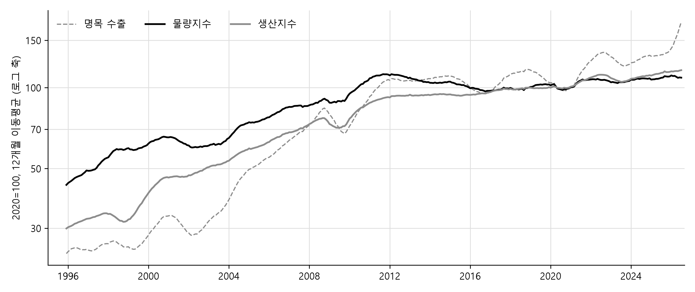
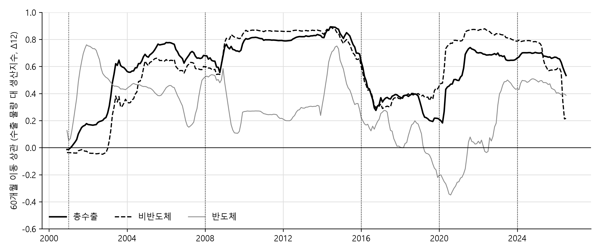

# 관세청 수출 통계는 같은 달의 산업생산을 얼마나 먼저 알려 주는가 — 성질별 수출입실적과 광공업생산지수, 1995\~2026

작성일: 2026-09-02
자료: KCSDB2 데이터베이스 (https://pilsunchoi.github.io/KCSDB2/)

---

## 요약

한 달의 수출은 그 달이 끝난 다음 날 공표되고, 같은 달의 광공업생산지수는 그 뒤 4주가 지나야 나온다. 본 연구가 묻는 것은 같은 달의 두 통계 가운데 먼저 나오는 수출이 나중에 나오는 생산을 예측하는 데 얼마나 도움이 되는가이다. 수출과 생산이 같은 달에 함께 움직이는 관계이기만 해도 먼저 나오는 쪽은 아직 나오지 않은 쪽에 대한 정보를 갖는다. 자료는 관세청 성질별 수출입실적 1995년 1월부터 2026년 7월까지 31년의 월 자료와 국가데이터처 광공업생산지수 둘뿐이며, 생산과 비교하는 수출의 척도는 외부 물가지수 없이 관세청 자료의 금액과 중량만으로 만든 명목 수출과 물량지수다. 분석은 세 단계로 이루어진다. 먼저 품목군 15개의 수출을 산업별 생산지수와 대응시키고, 조업일수와 설·추석 같은 달력 효과를 뺀 월별 움직임에서 명목 수출과 물량지수 가운데 어느 척도가 생산과 가깝게 움직이는지를 국면마다 본다. 다음으로 같은 월별 움직임의 교차상관으로 두 계열의 관계가 동행인지 선행인지를 판별한다. 마지막으로 브리지 회귀를 사용해, 각 예측 시점에 이미 공표된 정보만으로 같은 달의 생산을 예측할 때 수출을 설명변수로 넣으면 예측오차가 얼마나 줄어드는지를 표본외로 측정한다.

결과는 세 가지로 요약된다. 첫째, 31년 성장률은 척도마다 크게 달라 명목 수출 연 6.5%, 물량지수 2.0%, 생산 4.4%다. 예측에 쓰는 전년 동월 대비의 월별 움직임에서 달력 효과를 빼면 총수출과 생산의 상관은 명목 수출 0.63, 물량지수 0.54이고, 국면에 따라 0에 가까운 시기도 있다. 둘째, 수출과 생산의 관계는 동행적이다. 교차상관은 대부분의 계열에서 동시점이 가장 높고 수출이 앞서는 시차는 거의 없으며, 전월 수출은 같은 달 생산의 예측오차를 줄이지 못한다. 셋째, 그럼에도 수출은 생산보다 먼저 공표되기 때문에 같은 달의 생산을 미리 알려 준다. 전월 생산과 그 달의 달력으로 이번 달 생산을 예측하는 기준 모형에 익월 1일에 나오는 명목 수출을 설명변수로 넣으면 표본외 예측오차가 총지수에서 6%, 비반도체에서 13% 줄고, 중순에 중량이 포함된 확정치가 나와 물량지수를 쓰면 7%와 8% 줄어든다. 경기선행지수까지 쓰는 기준에 대해서는 총지수에서 명목 수출의 몫이 1%로 줄지만 물량지수는 11%를 줄인다.

---

## I. 서론

한국의 월별 수출은 산업통상부와 관세청이 익월 1일에 금액을 공표하고, 중량이 포함된 월간 확정치는 관세청이 익월 중순에 낸다. 같은 달의 광공업생산지수는 국가데이터처가 익월 마지막 평일에 산업활동동향으로 공표한다. 2026년 7월을 예로 들면 7월 수출은 8월 1일, 중량이 포함된 확정치는 8월 18일, 7월 광공업생산은 8월 31일에 나왔다. 요컨대 월간 수출은 생산지수보다 약 4주 먼저 나온다. 익월 1일의 월간 수출은 금액뿐이고 중량이 포함된 확정치는 그 뒤 중순에 나오지만, 그것도 생산지수보다는 약 2주 앞선다. 이 시차가 뜻하는 것은, 수출과 생산이 같은 달에 함께 움직이는 관계이기만 해도 먼저 나오는 수출이 아직 나오지 않은 생산에 대한 정보를 갖는다는 점이다.

본 연구가 묻는 것은 수출과 생산의 관계이며, 같은 달의 두 통계 가운데 먼저 나오는 수출이 나중에 나오는 생산을 예측하는 데 얼마나 도움이 되는가이다. 이 질문에 답하려면 세 가지가 먼저 정해져야 한다. 명목 수출과 물량지수(volume index) 가운데 어느 쪽이 생산의 월별 움직임과 가까운가, 두 계열의 관계가 동행(coincident)인가 선행(leading)인가, 그리고 각 예측 시점에 이미 공표된 정보만으로 예측 모형을 세울 때 수출 통계를 설명변수로 넣으면 오차가 얼마나 줄어드는가이다.

첫 번째 물음, 즉 명목 수출과 물량지수 가운데 어느 쪽이 생산의 월별 움직임과 가까운가라는 물음이 필요한 이유는 수출 실적이 명목 달러 금액으로 집계되기 때문이다. 달러 표시 수출액은 물건이 해외로 더 나갔을 때도, 같은 물건의 달러 가격이 올랐을 때도 늘어난다. 반면 생산지수는 품목별 생산량이나 생산자물가지수로 실질화한 생산액으로 작성되므로, 이 가운데 가격 변동을 제외한 실질 생산의 변화를 반영한다. 따라서 광공업생산지수와 성격이 맞는 척도는 명목 수출을 단가지수로 나눈 물량지수이고, 본 연구의 비교도 물량지수와 생산지수를 축으로 한다. 그러면서도 명목 수출을 함께 보는 이유는 익월 1일에 쓸 수 있는 수출 척도가 그것뿐이기 때문이다.

두 번째 물음, 즉 두 계열의 관계가 동행인가 선행인가라는 물음이 필요한 이유는 동행과 선행이 다른 예측 설계를 요구하기 때문이다. 수출이 생산에 한두 달 앞선다면 이번 달 수출은 다음 달 생산의 정보이고, 동행이라면 이번 달 수출은 이번 달 생산의 정보다. 두 경우 모두 수출은 쓸모가 있지만 무엇을 예측하는 데 쓸 것인지가 달라진다.

세 번째 물음, 즉 수출 통계를 설명변수로 넣으면 예측오차가 얼마나 줄어드는가라는 물음은 앞의 두 물음에서 확인한 척도와 시점의 관계가 실제 예측에서 얼마만큼의 이득이 되는지를 수치로 측정하는 것이며, 이를 위해 브리지 회귀를 쓴다. 여기서 지켜야 할 규칙은 하나다. 각 예측 시점에서 그때까지 공표된 통계만 쓴다. 관세청 수출이 나오는 익월 1일에는 그 달의 금액과 그 전달까지의 생산을 알 수 있고, 중순에는 그 달의 중량이 더해진다. 그 정보 집합에서 이번 달 생산을 예측하는 식을 세우고 수출을 넣었을 때와 넣지 않았을 때의 표본외(out-of-sample) 오차를 비교하면 공표 시차의 정보 가치가 숫자로 나온다. 설계는 가장 단순하게 두었다. 설명변수는 전월 생산, 그 달의 달력, 경기선행지수, 그리고 같은 달의 수출 하나다. 통계의 개정, 곧 처음 공표된 값과 뒤에 정정된 값의 차이는 다루지 않으며, 여러 품목군을 함께 넣는 결합도 다루지 않는다. 관세청이 그 달 안에 내는 10일 단위 잠정치는 월별 성질별 자료의 범위 밖이라 다루지 않는다.

본 연구는 기술적 분석이다. 인과를 규명하거나 척도 사이의 차이가 어디서 오는지를 따지기보다는, 수출과 생산이 얼마나 같이 움직이는지, 어느 쪽이 앞서는지, 그리고 먼저 나오는 통계가 나중 통계의 예측오차를 얼마나 줄이는지를 측정한다. 대상은 수출 품목군 15개와 총수출, 비반도체 수출이다. 품목군의 정의와 성질별 코드와 산업 코드의 대응표는 II장에, 국면 구분은 III장에 있다.

자료는 관세청 성질별 수출입실적과 국가데이터처 광공업생산지수 둘뿐이다. 제조업 전체를 물량으로 측정하면서 광공업생산지수보다 먼저 나오는 공식 통계는 없다. 광공업생산지수는 대상 월 다음 달 말에 국가데이터처의 산업활동동향으로 공표된다. 한국은행 기업경기조사와 제조업 구매관리자지수(PMI)는 해당 월 하순과 익월 첫 평일에 나오지만 응답 기업의 방향 판단이고, 자동차·철강·석유의 업종별 협회 통계는 익월 중순 무렵에 나오지만 업종이 한정된다. 수출 쪽 척도를 관세청 자료 안에서만 만든 것은 의도한 설계다. 물가지수나 출하지수 같은 다른 기관의 통계를 섞으면 공표 시점이 하나 더 생기고 대응이 하나 더 필요해지는데, 본 연구의 물음은 수출 통계가 나오는 그 시점에 그 통계만으로 무엇을 알 수 있는가이기 때문이다.

---

## II. 자료 및 품목군

### 1. 자료 및 공표 시점

수출 자료는 관세청 성질별 수출입실적(공공데이터포털 15102109)이며 본 연구가 쓰는 데이터베이스 KCSDB2(https://pilsunchoi.github.io/KCSDB2/)에 적재된 것이다. 기간은 1995년 1월부터 2026년 7월까지 379개월이고 값은 달러 금액과 킬로그램 중량이다.

생산 자료는 국가데이터처 광업제조업동향조사의 광공업생산지수(2020=100)이며 KOSIS 공유서비스 OpenAPI로 받았다. 산업별 표(DT_1F02001)는 전국 기준으로 한국표준산업분류 소분류(3자리)까지 공개되며, 소분류 81개 가운데 76개가 1995년 1월부터 빠짐없이 있다. 원지수를 쓴다. 전국지수는 연쇄 라스파이레스(chained Laspeyres) 산식이고 2015년부터 제10차 산업분류 기준이다. 매달 공표 시점 기준으로 가장 최근 두 달의 값은 잠정치이고, 매년 1월분 공표 때 연간보정으로 최근 몇 해가 수정된다.

IV.3절에서 공표 시차의 정보 가치를 측정하는 브리지 회귀(III.4절)의 기준 모형에는 국가데이터처 경기종합지수(2020=100)의 선행종합지수를 쓴다. 선행종합지수는 산업활동동향과 같은 날 공표되므로, 예측 시점마다 이미 공표되어 있는 값도 생산지수와 같은 달까지다. 본 연구는 이 지수를, 수출 통계가 없더라도 예측 시점에 이미 쓸 수 있는 경기 정보를 대표하는 자료로 삼는다. 선행종합지수에는 수출입물가비율과 재고순환지표, 경제심리지수, 기계류내수출하지수(선박 제외), 건설수주액, 코스피, 장단기금리차가 들어 있기 때문에, 수출 통계가 그 시점에 더해 주는 정보가 이 7개 지표를 넘어서는가를 판단하는 기준이 된다.

표 1은 $`t`$월 자료가 언제 공표되는지를 통계별로 보여 준다. 열은 통계와 발표 기관, 공표일, 그 달의 마지막 날부터 센 시차, 그리고 본 연구가 확인한 실제 사례다. 월간 수출은 생산지수보다 약 4주, 중량이 포함된 확정치는 약 2주 먼저 나오며, 경기선행지수는 생산지수와 같은 날 나온다. 이 순서가 III.4절의 정보 집합 규칙을 정한다.

**표 1. $`t`$월 자료의 공표 시점**

| 통계 | 기관 | 공표일 | $`t`$월 말 기준 시차 | 확인한 사례 |
|---|---|---|---|---|
| 월간 수출입 동향(잠정, 금액) | 산업통상부·관세청 | $`t+1`$월 1일 | +1일 | 2026년 7월분 8월 1일(토요일) |
| 월간 수출입 현황(확정, 금액과 중량) | 관세청 | $`t+1`$월 중순 | 약 +2.5주 | 2026년 7월분 8월 18일(화요일) |
| 산업활동동향(광공업생산지수) | 국가데이터처 | $`t+1`$월 마지막 평일 | 약 +4주 | 2026년 7월분 8월 31일(월요일) |
| 경기종합지수(선행종합지수) | 국가데이터처 | 산업활동동향과 같은 날 | 약 +4주 | 2026년 7월분 8월 31일(월요일) |

### 2. 품목군과 대응 산업

성질별 분류의 가장 아래 단계 항목(이하 코드) 가운데 수출 코드 153개를 품목군 15개와 나머지로 묶는다. 품목군은 관세청이 수출입 현황 보도자료에서 쓰는 10대 수출 품목(반도체, 승용차, 석유제품, 철강제품, 선박, 자동차부품, 무선통신기기, 컴퓨터주변기기, 정밀기기, 가전제품)에 일반기계, 화공품, 의약품, 제조장비, 이차전지를 더한 것이고, 나머지는 여기에 들지 않는 코드 96개다. 분석 대상은 이 품목군 15개와 코드 153개 전체의 합인 총수출, 그리고 총수출에서 반도체를 뺀 비반도체 수출까지 모두 17개 계열이며, 비반도체를 따로 두는 이유는 이 절 끝에서 설명한다. 생산 쪽에서는 수출 품목군마다 범위가 가장 가까운 소분류나 중분류를 하나 또는 둘 골라 대응시키고, 총수출에는 총지수를 대응시킨다.

표 2는 이 17개 계열별로 생산지수 산업 코드를 붙인 대응표다. 산업 코드가 둘 이상인 계열은 2026년 가중치로 가중평균한 것이다. 이 가중치는 앞 절의 광공업생산지수 산업별 표(DT_1F02001)의 메타 정보가 산업 코드마다 제공하는 것으로, 국가데이터처가 2026년 지수 작성에 적용하는 전국 가중치(총지수 10,000)다. 품목군 6개는 성질별 범위와 생산지수 산업의 범위가 정확히 맞지 않아 대응이 느슨하다. 승용차는 대응 소분류(자동차용 엔진 및 자동차 제조업)가 승용차만이 아니라 화물차와 버스, 자동차용 엔진까지 포함하고 있어 성질별 승용차보다 넓다. 철강제품은 성질별 코드에 구리와 알루미늄 같은 비철금속이 들어 있어 1차 철강 소분류만으로는 좁으므로, 비철금속까지 포함한 1차 금속 중분류 전체에 대응시켰다. 일반기계와 제조장비는 생산지수가 소분류까지만 공개되어 특수 목적용 기계 소분류 안에서 반도체와 디스플레이 제조장비를 구분할 수 없으므로, 제조장비는 특수 목적용 기계에, 일반기계는 이를 포함한 기타 기계 및 장비 중분류 전체에 대응시켜 둘이 겹친다. 화공품은 성질별 코드에 플라스틱 제품이 들어 있어 화학물질에 고무 및 플라스틱을 더했다. 정밀기기는 대응 중분류(의료, 정밀, 광학 기기 및 시계)가 의료기기와 광학기기, 시계까지 포함해 성질별 정밀기기보다 훨씬 넓다. 승용차와 정밀기기, 일반기계, 제조장비는 생산지수 쪽이 성질별보다 넓어 동조성이 그만큼 낮게 나올 수 있다.

**표 2. 품목군과 생산지수 산업의 대응**

| 품목군 | 생산지수 산업(KSIC) |
|---|---|
| 총수출 | 총지수 |
| 비반도체 | C26을 뺀 모든 중분류와 C262\~C265의 가중 합성(1995년부터 있는 코드만) |
| 반도체 | C261 반도체 제조업 |
| 승용차 | C301 자동차용 엔진 및 자동차 |
| 자동차부품 | C303 자동차 신품 부품 |
| 석유제품 | C192 석유 정제품 |
| 철강제품 | C24 1차 금속 |
| 선박 | C311 선박 및 보트 건조업 |
| 무선통신기기 | C264 통신 및 방송장비 |
| 컴퓨터주변기기 | C263 컴퓨터 및 주변 장치 |
| 정밀기기 | C27 의료, 정밀, 광학 기기 및 시계 |
| 가전제품 | C285 가정용 기기 + C265 영상 및 음향 기기 |
| 일반기계 | C29 기타 기계 및 장비 |
| 화공품 | C20 화학물질(의약품 제외) + C22 고무 및 플라스틱 |
| 의약품 | C212 의약품 제조업 |
| 제조장비 | C292 특수 목적용 기계 |
| 이차전지 | C282 일차전지 및 축전지 |

본 연구는 총수출과 함께 비반도체 수출을 따로 분석한다. 반도체는 2026년 7월 기준 수출의 3분의 1이 넘고 단가 변동이 커서 총수출의 움직임을 좌우하므로, 반도체를 뺀 수출과 반도체를 뺀 생산을 따로 비교해야 나머지 산업의 관계가 드러나기 때문이다. 국가데이터처는 비반도체 생산지수를 공표하지 않으므로, 표 2와 같이 반도체 제조업이 속한 중분류 C26을 뺀 모든 중분류에 C26 안의 반도체 외 소분류 넷(C262\~C265)을 더해 2026년 가중치로 묶어 만들었다. 총지수에서 반도체만 빼는 방식은 연쇄 지수에서는 근사에 그쳐 초기 연도를 왜곡하기 때문이다. 1995년부터 빠짐없이 있는 코드만 묶었다.

---

## III. 분석 방법

### 1. 명목, 물량, 단가

수출 쪽 척도로 명목 수출만 쓰지 않고 물량지수를 따로 만드는 것은, I장에서 보았듯 생산지수가 가격 변동을 뺀 실질 척도이기 때문이다. 명목 수출에서 가격 변동을 빼는 방법은 세 가지다. 첫째는 한국은행 수출물가지수로 명목 수출을 나누는 것이다. 그러나 물가지수는 공표 시점이 따로 있고 선박처럼 물가지수가 없는 품목군도 있어, 관세청 통계가 나오는 시점에 그 통계만으로 무엇을 알 수 있는가라는 본 연구의 물음에 맞지 않는다. 둘째는 관세청 자료에 기록된 중량을 품목군별로 더해 물량으로 쓰는 것이다. 그러나 중량을 그대로 더하면 1kg이 어떤 물건이든 같은 몫으로 셈해지므로, 그 합은 금액 비중과 상관없이 무게가 많이 나가는 코드의 움직임을 따라간다. 반도체 품목군이 그 예다. 2023년 반도체 품목군 중량의 87%는 금액으로 반도체 수출의 2.5%인 기타 개별소자 코드였고, 금액의 51%인 메모리 반도체는 중량의 2.6%였다. 2024년에 기타 개별소자의 중량이 18.6만 톤에서 4.1만 톤으로 줄자 품목군 중량도 3분의 1이 됐다. 중량 합을 물량으로 쓰면 반도체 수출 물량이 한 해에 3분의 2 줄었다고 읽게 되지만, 메모리 반도체의 중량은 5,600톤에서 5,500톤으로 거의 그대로였다. 셋째는 코드마다 금액을 중량으로 나눈 단가를 구하고, 그 단가들을 금액 비중으로 가중해 묶은 단가지수로 명목 수출을 나누는 것이다. 본 연구는 셋째 방법을 쓴다. 중량은 코드 안에서 단가를 내는 데만 쓰이고 코드 사이는 금액으로 가중되므로, 금액이 작은 코드가 중량이 크다는 이유로 지수를 좌우하지 않는다.

단가들을 하나로 묶는 산식으로는 기준 시점의 금액 비중으로 가중하는 라스파이레스(Laspeyres) 산식, 비교 시점의 비중으로 가중하는 파셰(Paasche) 산식, 두 시점의 비중을 평균해 가중하는 Törnqvist (1936) 산식이 있다. 앞의 두 산식은 품목 구성이 두 시점 사이에 크게 바뀌면 한쪽 시점의 구성에 치우친다. Törnqvist 산식은 두 시점의 비중을 대칭으로 쓰며, Diewert (1976)는 이런 성질을 갖는 산식을 최상(superlative) 지수로 분류했다. 또 이 산식은 로그 변화의 가중합이라 명목 변화를 단가 변화와 물량 변화의 합으로 정확히 나눈다. 그래서 표 3에서 명목 증가율은 단가 증가율과 물량 증가율의 합과 같다. 본 연구가 이 산식을 고른 것은 이 두 성질 때문이다.

품목군 $`g`$에 속한 코드 $`i`$의 금액을 $`V_i`$, 중량을 $`W_i`$, 단가를 $`p_i = V_i/W_i`$라 하고, 품목군의 명목 수출을 $`V_g = \sum_{i \in g} V_i`$라 하자. 두 시점 사이 품목군 물량의 로그 변화는 명목의 로그 변화에서 Törnqvist 단가 변화를 뺀 것이다.

```math
\Delta \ln Q_g = \Delta \ln V_g - \sum_{i \in g} \bar{s}_i \, \Delta \ln p_i, \qquad \bar{s}_i = \tfrac{1}{2}\left(\frac{V_{i0}}{V_{g0}} + \frac{V_{i1}}{V_{g1}}\right)
```

오른쪽 둘째 항이 단가지수 $`U_g`$의 로그 변화 $`\Delta \ln U_g`$이며, 한쪽 시점에 금액이나 중량이 없는 코드는 가중에서 뺀다. 다만 여기서 단가는 시장 가격이 아니라 단위중량당 가치다. 한 코드에는 여러 물건이 섞여 있어, 같은 코드 안에서 구성이 무겁고 싼 물건에서 가볍고 비싼 물건 쪽으로 옮겨 가면 시장 가격이 그대로여도 단가는 오르고, 그만큼 물량지수는 실제 물량보다 낮게 나온다. 예를 들어 1995년의 16메가비트 D램과 2026년의 고대역폭 메모리(HBM)는 같은 메모리 반도체 코드로 분류되므로, 그 사이의 성능 향상은 단가 상승으로 계산되고 물량지수에는 반영되지 않는다. 본 연구는 이 한계를 안고 이 척도를 쓰며, 그 쓸모는 생산과의 월별 동조성과 예측력으로 판단한다.

위 식은 두 가지 시간 구조로 쓰인다. 표 3의 연평균 로그 변화율은 두 끝점 연도의 연간 금액과 중량으로 코드 단가를 내어 위 식을 한 번에 계산하고 햇수로 나눈 것이며, 중간 연도를 거치지 않는다. 월별 계열은 이웃한 두 달 사이의 변화를 달마다 같은 식으로 구해 첫 달부터 누적한 연쇄 지수이고, 전년 동월 대비 변화와 그림 1에 쓴다. 연쇄 지수는 달마다 비중이 새로 정해져 구성 변화를 따라가는 대신, 긴 기간에서는 끝점 비교와 차이가 벌어진다. 총수출 물량의 31년 연평균은 끝점 비교로 2.0%, 월 연쇄로 3.0%다. 따라서 그림에서 읽는 장기 기울기는 표의 연평균과 다를 수 있다.

### 2. 계절과 달력 효과

동조성과 브리지 회귀는 수출과 생산 모두 계절조정하지 않은 원계열의 전년 동월 대비 로그 변화 $`\Delta_{12}`$를 쓴다. 같은 달끼리 비교하므로 해마다 되풀이되는 계절 요인은 상쇄된다. 예측 대상을 생산지수 원지수의 전년 동월 대비로 두는 것은, $`t-1`$월까지의 생산을 이미 아는 예측 시점에서 이것을 맞히는 일이 곧 $`t`$월 생산 수준을 맞히는 일이기 때문이다. 계절조정 지수를 쓰지 않는 이유는 계절조정 값이 새 달이 더해질 때마다 과거까지 다시 추정되기 때문이다. 과거 시점의 예측을 지금 남아 있는 계절조정 값으로 측정하면 그 시점에는 알 수 없던 뒤의 자료가 섞이며, 그 수정은 예측에 쓰는 가장 최근 달에서 가장 크다. 원지수는 잠정치가 확정될 때와 연간보정 때만 바뀐다.

다만 전년 동월 대비에도 달력 효과는 남는다. 두 해의 같은 달 조업일수가 다르거나 설과 추석이 해마다 다른 달에 들면, 수출과 생산은 경기와 관계없이 함께 늘거나 준다. 본 연구는 이것을 달력 설명변수 7개로 다룬다. 하나는 그 달의 조업일수, 곧 주말과 공휴일을 뺀 날수의 로그이고, 나머지 6개는 설과 추석 각각에 대해 연휴 앞 20일, 연휴 사흘, 연휴 뒤 10일 가운데 그 달에 든 날의 몫이다. 모두 전년 동월 대비 차이를 취해 쓴다. 그 달의 달력은 미리 알 수 있으므로 예측 시점에 공표된 정보만 쓴다는 규칙에도 어긋나지 않는다. 동조성은 수출과 생산 각각의 전년 동월 대비 변화에서 이 7개 변수로 설명되는 부분을 전체 기간 회귀로 뺀 나머지끼리 측정하고, 브리지 회귀는 모든 모형에 이 7개 변수를 넣는다. 달력이 설명하는 전년 동월 대비 변동의 몫은 총수출에서 물량지수 19%, 명목 수출 4%, 생산 13%이고, 반도체에서는 셋 다 2% 미만이다.

### 3. 동조성과 선후행

이 절에서 $`x_t`$는 품목군의 수출 척도(물량지수 또는 명목 수출), $`ip_t`$는 대응 산업의 생산지수를 가리키며 품목군 첨자는 생략한다. $`\tilde{{x}}_t`$와 $`\tilde{{ip}}_t`$는 각각의 전년 동월 대비 로그 변화 $`\Delta_{12} \ln x_t = \ln x_t - \ln x_{t-12}`$에서 III.2절의 달력 효과를 뺀 나머지다. 동조성은 $`\tilde{{x}}_t`$와 $`\tilde{{ip}}_t`$의 피어슨 상관계수로 측정하며, 두 계열이 모두 있는 달을 표본으로 한다. 전체 기간은 1996년 1월부터 2026년 7월까지이고, 관측이 24개월을 넘는 경우에만 값을 적는다. 물량지수와 명목 수출 각각에 대해 생산지수와의 상관을 구하되, 국면별 상관은 물량지수에 대해서만 낸다. 국면은 비반도체 수출의 성장 국면이 바뀐 시점과 큰 사건을 경계로 나눈 6개이며 경계 연도는 2001, 2008, 2016, 2020, 2024년이다. 2001년과 2008년은 비반도체 수출의 평균 성장률이 이동한 시점, 2016년은 총수출 트렌드 성장률의 저점, 2020년은 코로나, 2024년은 반도체 급등의 시작이다. 국면별 상관은 그 국면에 속하는 달만으로 구한다. 동조성의 시간 변화는 60개월 이동 상관으로 본다. 즉, 각 달 $`t`$에 대해 $`t-59`$월부터 $`t`$월까지 60개 관측의 상관을 구해 $`t`$월의 값으로 둔다.

선후행은 같은 나머지의 교차상관으로 측정한다. 수출 쪽을 $`k`$개월씩 옮기며 상관을 구하고,

```math
\rho(k) = \mathrm{corr}\left(\tilde{x}_{t-k},\ \tilde{ip}_t\right), \qquad k = -12, \ldots, 12
```

$`\rho(k)`$가 가장 높은 시차 $`k^*`$를 찾아, $`k^* > 0`$이면 수출이 생산에 $`k^*`$개월 앞서고 $`k^* < 0`$이면 생산이 앞서며 $`k^* = 0`$이면 동행으로 읽는다. 전년 동월 대비 변화는 이웃한 달끼리 11개월이 겹쳐 시차를 한 달 옮겨도 상관이 크게 떨어지지 않으므로, 상관의 크기보다 최댓값이 나오는 위치를 읽는다. 선후행은 브리지 회귀에서도 확인한다. 같은 달 수출 대신 전월 수출을 넣은 모형이 예측오차를 줄이지 못하면, 수출의 정보는 같은 달에 있다는 뜻이다.

### 4. 브리지 회귀

공표 시차의 정보 가치는 브리지 회귀로 측정한다. 브리지 회귀(bridge regression)는 늦게 나오는 통계를 먼저 나오는 통계에 회귀시켜 식을 얻어 두고, 먼저 나오는 통계가 공표되면 그 값을 식에 넣어 아직 나오지 않은 통계를 미리 추정하는 방법으로, 분기 GDP를 그 분기의 월 지표로 추정하는 중앙은행의 속보 추정에서 유래했다(Baffigi et al., 2004). 추정은 보통최소제곱법으로 하며, 일반 회귀와 다른 점은 예측 시점에 실제로 공표된 값만 설명변수로 쓰고 성능을 표본외 예측오차로 평가한다는 데 있다. 본 연구는 분기와 월이 아니라 공표일이 4주 어긋나는 월 통계 둘 사이에 이 방법을 쓴다. 같은 문제를 더 정교하게 푸는 방법으로 서로 다른 빈도의 자료를 한 식에 직접 섞는 MIDAS(mixed data sampling) 회귀와 동적 요인 모형이 있으나, 본 연구는 가장 단순한 형태인 브리지 회귀를 사용한다. 예측 대상은 $`t`$월 광공업생산지수 원지수의 전년 동월 대비 로그 변화 $`\Delta_{12} \ln ip_t`$이고, 기본 모형은 다음과 같다.

```math
\Delta_{12} \ln ip_t = a + b\,\Delta_{12} \ln ip_{t-h} + \gamma' \Delta_{12} \mathbf{cal}_t + c\,\Delta_{12} \ln x_t + e_t
```

설명변수는 예측 시점에 이미 공표되었거나 미리 알 수 있는 것만 쓴다. $`\mathbf{cal}_t`$는 III.2절의 달력 설명변수 7개로, 모든 모형에 들어간다. $`h`$는 그 시점에 알 수 있는 가장 최근 생산의 시차다. 관세청 월간 수출이 나오는 $`t+1`$월 1일과 확정치가 나오는 중순에는 $`t-1`$월 생산까지 나와 있으므로 $`h = 1`$이다. $`x_t`$는 같은 달의 수출이다. $`t+1`$월 1일에는 금액만 있으므로 명목 수출을 넣고, 그 변형으로 명목의 전년 동월 대비 변화에서 $`t-1`$월 단가의 전년 동월 대비 변화를 뺀 것($`\Delta_{12} \ln V_t - \Delta_{12} \ln U_{t-1}`$)을 넣는다. 전월 단가는 그 시점에 이미 나온 확정치에서 계산되며, 단가의 전년 동월 대비 변화가 한 달 사이에 크게 움직이지 않으므로 이번 달 단가의 대용이 된다. $`t+1`$월 중순에는 중량이 포함된 확정치가 나오므로 $`t`$월 물량지수를 넣는다.

기준은 둘이다. 전월 생산과 달력만 쓰고 수출 항이 없는 모형($`c = 0`$)이 첫째 기준이고, 여기에 $`t-1`$월 경기선행지수의 전년 동월 대비 변화를 더한 것이 둘째 기준이다.

```math
\Delta_{12} \ln ip_t = a + b\,\Delta_{12} \ln ip_{t-h} + \gamma' \Delta_{12} \mathbf{cal}_t + d\,\Delta_{12} \ln cli_{t-1} + c\,\Delta_{12} \ln x_t + e_t
```

여기서 $`cli`$는 선행종합지수다. 선행지수는 산업활동동향과 같은 날 나오므로 생산과 같은 시차로 알 수 있다(II.1절). 수출 항은 두 기준 각각에 더하며, 오차 감소는 같은 기준에 대해 계산한다. 첫째 기준에 대한 감소가 수출 통계의 정보 가치이고, 둘째 기준에 대한 감소가 그 가운데 선행지수에 아직 포함되지 않은 몫이다.

표본외 오차는 확장창으로 계산한다. 예측 시점마다 그때까지의 자료로 계수를 추정해 다음 달을 예측하고, 오차의 제곱평균제곱근(RMSE)을 %p로 적는다. 1996년 2월부터 추정하고 2010년 1월부터 199개월을 표본외로 둔다. 예측 대상인 생산지수는 총지수, 비반도체, 반도체 셋이고, 수출 항은 각각에 대응하는 계열이다. 같은 달 수출 대신 전월 수출을 넣은 모형도 첫째 기준에 대해 추정한다. 이 설계는 자료를 처음 공표된 잠정치가 아니라 개정된 값으로 쓰고 설명변수를 수출 하나로 두는 두 가지 단순화를 했으며, 그것이 결과에 주는 영향은 V장에서 다룬다.

---

## IV. 분석 결과

### 1. 트렌드의 차이

이 절은 명목 수출, 물량지수, 생산지수가 31년 동안 각각 얼마나 늘었는지를 비교한다. 세 계열은 같은 산업 활동을 서로 다른 방식으로 측정하므로 장기 성장률이 같을 이유가 없다. 명목 수출에는 달러 가격의 변화가 더해지고, 물량지수에서는 단위중량당 가치로 잡히지 않는 품질 향상이 빠지기 때문이다. 이 비교는 예측 분석에 앞서 세 계열의 장기 움직임이 얼마나 다른지를 확인하는 기초 자료다.

표 3은 계열마다 전체 기간의 연평균 로그 변화율을 보여 준다. 시작점은 1995년 한 해의 합, 끝점은 2025년 8월부터 2026년 7월까지 12개월의 합이며 두 끝점 사이는 30.6년이다. 명목은 달러 수출액으로, 단가와 물량지수는 코드별 단가를 묶은 Törnqvist 분해로, 생산지수는 대응 산업의 원지수로 계산한 것이다. 명목은 단가와 물량의 합이고, 마지막 두 열은 물량지수와 명목 수출이 생산지수보다 연평균 몇 %p 빠르게 또는 느리게 늘었는지를 보인다.

**표 3. 전체 기간 연평균 로그 변화율, 1995\~2026.07 (%)**

| 계열 | 명목 | 단가 | 물량 | 생산지수 | 물량$`-`$생산 | 명목$`-`$생산 |
|---|---|---|---|---|---|---|
| 총수출 | 6.5 | 4.5 | 2.0 | 4.4 | $`-2.5`$ | 2.1 |
| 비반도체 | 5.6 | 3.0 | 2.5 | 1.9 | 0.6 | 3.6 |
| 반도체 | 9.5 | 9.2 | 0.3 | 19.8 | $`-19.5`$ | $`-10.3`$ |
| 화공품 | 6.9 | 1.4 | 5.5 | 1.9 | 3.6 | 5.0 |
| 승용차 | 7.7 | 1.7 | 5.9 | 2.3 | 3.7 | 5.4 |
| 일반기계 | 6.3 | 1.5 | 4.8 | 2.8 | 2.0 | 3.5 |
| 석유제품 | 10.2 | 5.1 | 5.1 | 2.1 | 3.1 | 8.1 |
| 철강제품 | 5.1 | 1.7 | 3.5 | 1.5 | 2.0 | 3.6 |
| 선박 | 5.9 | 7.3 | $`-1.4`$ | 4.8 | $`-6.2`$ | 1.1 |
| 자동차부품 | 10.0 | 1.0 | 9.0 | 5.1 | 3.9 | 4.9 |
| 무선통신기기 | 9.7 | 8.5 | 1.2 | 3.8 | $`-2.7`$ | 5.8 |
| 컴퓨터주변기기 | 6.7 | 10.9 | $`-4.2`$ | 2.9 | $`-7.0`$ | 3.8 |
| 정밀기기 | 8.7 | 2.5 | 6.2 | 2.9 | 3.2 | 5.8 |
| 이차전지 | 9.3 | 2.4 | 6.9 | 7.5 | $`-0.5`$ | 1.9 |
| 제조장비 | 27.7 | $`-5.9`$ | 33.6 | 2.8 | 30.7 | 24.9 |
| 의약품 | 12.1 | 8.1 | 4.0 | 6.3 | $`-2.3`$ | 5.8 |
| 가전제품 | $`-0.5`$ | 2.3 | $`-2.9`$ | $`-0.8`$ | $`-2.1`$ | 0.2 |

총수출의 연평균 변화율은 명목 6.5%, 단가 4.5%, 물량 2.0%, 생산 4.4%로, 물량지수는 생산보다 연 2.5%p 느리고 명목 수출은 연 2.1%p 빠르다. 품목군 15개 가운데 물량지수가 생산보다 느린 것이 일곱, 빠른 것이 여덟이다. 가장 느린 것은 반도체(연 19.5%p), 컴퓨터주변기기(7.0%p), 선박(6.2%p)이고, 이 가운데 반도체와 컴퓨터주변기기는 단가가 연 9% 넘게 오른 품목군이다. 비반도체 수출 전체로는 물량 2.5%와 생산 1.9%로 차이가 0.6%p다.

그림 1은 총수출의 명목 수출, 물량, 생산지수를 2020년을 100으로 맞춰 로그 축에 놓은 것이다. 12개월 이동평균이며 로그 축이라 기울기가 성장률이다. 표 3이 31년의 평균을 보인다면 그림 1은 그 변화를 시점별로 보인다.



**그림 1. 총수출의 명목 수출, Törnqvist 연쇄 물량, 광공업생산지수 (1995.12\~2026.07, 2020=100, 12개월 이동평균, 로그 축)**

물량은 1995\~2000년을 빼면 생산보다 완만하다. 1995년부터 2008년까지 생산은 2.5배, 물량은 2.1배가 됐고, 2008년부터 2026년 7월까지는 생산 1.6배에 물량 1.2배다. 2016년부터 2026년까지 10년만 보면 생산 1.21배에 물량 1.12배로 두 선이 가장 가깝다. 명목 수출은 2008년까지 3.4배로 둘보다 가파르고, 2008년 금융위기와 2015년 유가 하락, 2020년과 2023년에 둘과 어긋나며, 2024년 이후에는 물량과 생산보다 가파르게 오른다.

이런 트렌드의 차이는 예측과는 직접 관계가 없다. 다음 절 이후의 동조성과 브리지 회귀는 전년 동월 대비 변화를 쓰므로, 척도 사이에 일정하게 유지되는 성장률 차이는 상관계수에 영향을 주지 않고 회귀에서는 상수항에 흡수된다. 트렌드가 다른 두 계열도 월별로 같이 움직이면 예측에 쓸 수 있으며, 다음 절부터는 그 월별 움직임을 본다.

### 2. 동조성과 선후행

이 절은 수출과 생산이 같은 방향으로 같은 만큼 움직이는지, 그리고 어느 쪽이 먼저 움직이는지를 본다. 두 계열의 전년 동월 대비 변화율이 함께 오르고 함께 내리면 상관계수가 1에 가깝고, 서로 관계없이 움직이면 0에 가깝다. 두 계열 모두 조업일수와 명절처럼 달력으로 정해지는 부분을 뺀 나머지로 측정하므로, 이 상관은 달력이 같을 때 두 계열이 얼마나 함께 움직이는지를 나타낸다. 수출로 생산을 예측하려면 먼저 이 상관이 높아야 하므로, 동조성은 어느 척도와 어느 품목군이 예측에 쓸 만한지를 가늠하는 첫 기준이 된다. 이어서 한 계열을 몇 달씩 앞뒤로 옮겨 가며 상관을 구해, 수출이 생산보다 먼저 움직이는지, 같은 달에 움직이는지를 본다.

표 4는 품목군마다 달력 효과를 뺀 전년 동월 대비 변화의 생산지수와의 상관을 물량지수와 명목 수출 각각에 대해 전체 기간으로 구하고, 물량지수에 대해서는 국면별로도 구해 보여 준다. 전체 기간은 1996년 1월부터 2026년 7월까지 367개월이다. 국면별 첫 열은 $`\Delta_{12}`$가 1996년 1월부터 있으므로 1996\~2000년이다.

**표 4. 수출과 생산지수의 동조성, 달력 효과를 뺀 $`\Delta_{12}`$ 상관 (1996.01\~2026.07)**

| 품목군 | 물량·생산 | 명목·생산 | 1996\~2000 | 2001\~2007 | 2008\~2015 | 2016\~2019 | 2020\~2023 | 2024\~2026.07 |
|---|---|---|---|---|---|---|---|---|
| 총수출 | 0.54 | 0.63 | $`-0.01`$ | 0.72 | 0.80 | 0.05 | 0.71 | 0.36 |
| 비반도체 | 0.46 | 0.64 | $`-0.04`$ | 0.60 | 0.83 | 0.46 | 0.81 | 0.38 |
| 반도체 | 0.35 | 0.51 | 0.13 | 0.48 | 0.32 | $`-0.38`$ | 0.55 | 0.13 |
| 화공품 | 0.22 | 0.56 | $`-0.46`$ | 0.24 | 0.48 | 0.51 | 0.64 | 0.45 |
| 승용차 | 0.66 | 0.72 | 0.48 | 0.75 | 0.87 | 0.87 | 0.81 | 0.79 |
| 일반기계 | 0.45 | 0.55 | 0.01 | 0.54 | 0.86 | 0.38 | 0.45 | 0.19 |
| 석유제품 | 0.56 | 0.40 | 0.56 | 0.38 | 0.60 | 0.28 | 0.67 | 0.86 |
| 철강제품 | 0.20 | 0.41 | $`-0.57`$ | 0.25 | 0.62 | 0.42 | 0.52 | 0.28 |
| 선박 | 0.18 | 0.18 | 0.27 | $`-0.03`$ | 0.25 | 0.23 | 0.29 | 0.12 |
| 자동차부품 | 0.54 | 0.56 | 0.46 | 0.13 | 0.87 | 0.47 | 0.77 | 0.32 |
| 무선통신기기 | 0.45 | 0.48 | 0.40 | 0.69 | 0.41 | $`-0.20`$ | 0.45 | $`-0.19`$ |
| 컴퓨터주변기기 | 0.45 | 0.27 | 0.23 | $`-0.09`$ | 0.70 | 0.64 | 0.51 | $`-0.39`$ |
| 정밀기기 | 0.11 | 0.18 | 0.23 | $`-0.17`$ | 0.37 | 0.50 | 0.26 | $`-0.11`$ |
| 이차전지 | 0.17 | 0.51 | 0.10 | $`-0.07`$ | 0.59 | 0.18 | $`-0.16`$ | $`-0.51`$ |
| 제조장비 | 0.16 | 0.17 | $`-0.13`$ | 0.56 | 0.59 | 0.51 | 0.16 | 0.19 |
| 의약품 | 0.04 | 0.13 | 0.19 | $`-0.26`$ | 0.07 | 0.34 | $`-0.13`$ | 0.25 |
| 가전제품 | 0.41 | 0.46 | 0.71 | 0.23 | 0.52 | $`-0.18`$ | 0.51 | 0.71 |

총수출과 생산지수의 상관은 명목 0.63, 물량 0.54로 명목이 조금 높다. 17개 계열 가운데 물량이 명목보다 0.1 넘게 높은 것은 석유제품(0.56 대 0.40)과 컴퓨터주변기기(0.45 대 0.27)뿐이고, 명목이 물량보다 0.1 넘게 높은 것은 비반도체(0.64 대 0.46), 반도체(0.51 대 0.35), 화공품(0.56 대 0.22), 철강제품(0.41 대 0.20), 이차전지(0.51 대 0.17), 일반기계(0.55 대 0.45)다. 물량지수의 전년 동월 대비 변동은 달력이 설명하는 몫이 명목보다 커서(III.2절), 그 몫을 빼면 생산과의 상관이 명목보다 낮아진다. 품목군에서는 승용차가 물량 0.66, 명목 0.72로 가장 높고, 의약품 0.04, 정밀기기 0.11, 제조장비 0.16, 이차전지 0.17, 선박 0.18이 물량 기준으로 낮다. 낮은 품목군 가운데 정밀기기와 제조장비는 II.2절이 대응이 느슨하다고 꼽은 품목군이고, 선박은 몇 건의 인도가 한 달 수출을 정하는 품목이다.

국면별 상관은 총수출에서 $`-0.01`$, 0.72, 0.80, 0.05, 0.71, 0.36이다. 2001\~2015년과 2020\~2023년에는 0.7을 넘지만 1996\~2000년과 2016\~2019년에는 0에 가깝고, 2024년 이후에는 0.36이다. 비반도체는 $`-0.04`$, 0.60, 0.83, 0.46, 0.81, 0.38로 같은 모양이되 2016\~2019년에 0.46으로 총수출보다 높다. 반도체는 0.13, 0.48, 0.32, $`-0.38`$, 0.55, 0.13으로 어느 국면에서도 0.55를 넘지 않고 2016\~2019년에는 음수다. 달력 효과를 빼고 나면 수출과 생산이 함께 움직이는 정도는 국면에 따라 크게 달라서, 한 국면의 동조성으로 다른 국면을 짐작할 수 없다.

그림 2는 표 4와 같은 나머지로 구한 물량과 생산지수의 60개월 이동 상관을 총수출, 비반도체, 반도체에서 보인 것이다. 세로 점선은 국면 경계다. 그림 2는 표 4의 국면별 상관이 국면 안에서 언제 오르고 내렸는지를 보인다.



**그림 2. 수출 물량과 생산지수의 60개월 이동 상관, 달력 효과를 뺀 $`\Delta_{12}`$ (2000.12\~2026.07, 총수출, 비반도체, 반도체). 점선은 국면 경계**

총수출의 이동 상관은 2000년 12월 $`-0.01`$에서 시작해 2003년 5월에 0.5를 넘고 2014년 6월 0.89가 가장 높으며, 2019년 9월 0.19까지 내려갔다가 2026년 7월 0.53이다. 비반도체는 2002년 10월 $`-0.05`$가 가장 낮고 2004년 10월에 0.5를 넘어 2014년 6월 0.89가 가장 높으며 2026년 7월 0.22다. 반도체의 이동 상관은 2001년 12월 0.76이 가장 높고 2020년 8월 $`-0.35`$가 가장 낮으며 2026년 7월 0.39다.

같은 나머지로 교차상관을 구하면, 물량지수와 생산의 상관이 가장 높은 시차는 17개 계열 가운데 13개에서 0이다. 예외 넷은 화공품 $`-9`$개월, 철강제품 $`-6`$개월, 제조장비 $`-4`$개월, 의약품 5개월인데, 넷 다 동시 상관이 0.04\~0.22로 낮고 최대 상관도 0.12\~0.32에 그친다. 명목 수출은 총수출을 포함한 7개 계열에서 최대 상관 시차가 음수, 곧 생산이 먼저 움직이는 쪽에 있고 나머지 10개는 0이다. 수출이 생산에 앞서는 양의 시차는 명목에서는 하나도 없고 물량에서는 의약품 하나뿐이다. 이번 달 수출은 다음 달 생산의 정보라기보다 이번 달 생산의 정보이며, 수출 자료가 생산에 대해 갖는 정보는 앞선 달을 알려 주는 것이 아니라 같은 달을 공표 시차만큼 먼저 알려 주는 것이다. 그 정보 가치를 측정하는 것이 다음 절이다.

### 3. 공표 시차와 브리지 회귀

이 절은 수출 통계가 생산보다 먼저 나온다는 사실이 예측에서 실제로 얼마만큼의 이득이 되는지를 측정한다. 방법은 두 예측을 비교하는 것이다. 하나는 수출 없이 그때까지 공표된 생산과 그 달의 달력만으로 이번 달 생산을 예측하고, 다른 하나는 여기에 먼저 공표된 이번 달 수출을 더한다. 2010년 이후 매달 두 예측을 실제 생산과 비교해, 수출을 더했을 때 오차가 몇 % 줄어드는지를 본다. 수출 척도는 공표 시점에 따라 달라서, 익월 1일에는 금액만 있으므로 명목 수출을 쓰고 중순에는 중량이 나오므로 물량지수를 쓴다.

표 1의 시차를 예측 설계로 옮기면 두 시점이 된다. $`t+1`$월 1일에는 $`t`$월 금액과 $`t-1`$월 생산, $`t-1`$월 선행지수, $`t-1`$월 확정치의 중량이 있고, $`t+1`$월 중순에는 $`t`$월 중량이 더해진다. $`t`$월의 달력은 두 시점 모두 알 수 있다. 표 5는 두 시점의 브리지 회귀 결과다. 생산지수 총지수, 비반도체, 반도체 각각에 대해 기준 둘(전월 생산과 달력, 여기에 선행지수를 더한 것)마다 같은 달 명목 수출을 넣은 모형, 명목에서 전월 단가를 뺀 모형, 그리고 중순 시점에 같은 달 물량지수를 넣은 모형의 표본내 결정계수, 수출 계수와 $`t`$값, 2010년 1월부터 2026년 7월까지 199개월의 확장창 표본외 RMSE를 적었다. 기준 대비 열은 같은 기준의 표본외 RMSE에 대한 변화율이다. 추정 표본은 1996년 2월부터 366개월이다.

**표 5. 브리지 회귀, $`t+1`$월 1일과 중순 시점 (예측 대상: $`t`$월 생산지수 $`\Delta_{12}`$, 표본외 2010.01\~2026.07)**

| 생산지수 | 기준 | 시점 | 수출 항 | $`R^2`$ | 수출 계수 | $`t`$ | 표본외 RMSE(%p) | 기준 대비(%) |
|---|---|---|---|---|---|---|---|---|
| 총지수 | 생산 $`t-1`$ + 달력 $`t`$ | $`t+1`$월 1일 | 없음 | 0.79 |  |  | 3.03 |  |
|  |  | $`t+1`$월 1일 | + 명목 수출 $`t`$ | 0.81 | 0.09 | 5.7 | 2.85 | $`-6`$ |
|  |  | $`t+1`$월 1일 | + 명목 수출 $`t`$ $`-`$ 단가 $`t-1`$ | 0.81 | 0.14 | 5.7 | 2.91 | $`-4`$ |
|  |  | $`t+1`$월 중순 | + 물량지수 $`t`$ | 0.81 | 0.15 | 5.7 | 2.84 | $`-7`$ |
|  | 생산 $`t-1`$ + 달력 $`t`$ + 선행지수 $`t-1`$ | $`t+1`$월 1일 | 없음 | 0.83 |  |  | 2.91 |  |
|  |  | $`t+1`$월 1일 | + 명목 수출 $`t`$ | 0.84 | 0.09 | 6.4 | 2.87 | $`-1`$ |
|  |  | $`t+1`$월 1일 | + 명목 수출 $`t`$ $`-`$ 단가 $`t-1`$ | 0.85 | 0.15 | 7.0 | 2.73 | $`-6`$ |
|  |  | $`t+1`$월 중순 | + 물량지수 $`t`$ | 0.85 | 0.19 | 7.9 | 2.59 | $`-11`$ |
| 비반도체 | 생산 $`t-1`$ + 달력 $`t`$ | $`t+1`$월 1일 | 없음 | 0.74 |  |  | 3.23 |  |
|  |  | $`t+1`$월 1일 | + 명목 수출 $`t`$ | 0.78 | 0.12 | 7.8 | 2.80 | $`-13`$ |
|  |  | $`t+1`$월 1일 | + 명목 수출 $`t`$ $`-`$ 단가 $`t-1`$ | 0.76 | 0.13 | 5.5 | 3.07 | $`-5`$ |
|  |  | $`t+1`$월 중순 | + 물량지수 $`t`$ | 0.77 | 0.15 | 5.9 | 2.97 | $`-8`$ |
|  | 생산 $`t-1`$ + 달력 $`t`$ + 선행지수 $`t-1`$ | $`t+1`$월 1일 | 없음 | 0.78 |  |  | 3.01 |  |
|  |  | $`t+1`$월 1일 | + 명목 수출 $`t`$ | 0.82 | 0.12 | 8.5 | 2.60 | $`-14`$ |
|  |  | $`t+1`$월 1일 | + 명목 수출 $`t`$ $`-`$ 단가 $`t-1`$ | 0.80 | 0.12 | 5.6 | 2.83 | $`-6`$ |
|  |  | $`t+1`$월 중순 | + 물량지수 $`t`$ | 0.81 | 0.16 | 6.7 | 2.70 | $`-10`$ |
| 반도체 | 생산 $`t-1`$ + 달력 $`t`$ | $`t+1`$월 1일 | 없음 | 0.79 |  |  | 9.41 |  |
|  |  | $`t+1`$월 1일 | + 명목 수출 $`t`$ | 0.80 | 0.07 | 3.7 | 9.83 | $`+4`$ |
|  |  | $`t+1`$월 1일 | + 명목 수출 $`t`$ $`-`$ 단가 $`t-1`$ | 0.81 | 0.14 | 6.1 | 9.20 | $`-2`$ |
|  |  | $`t+1`$월 중순 | + 물량지수 $`t`$ | 0.80 | 0.10 | 3.9 | 9.39 | 0 |
|  | 생산 $`t-1`$ + 달력 $`t`$ + 선행지수 $`t-1`$ | $`t+1`$월 1일 | 없음 | 0.79 |  |  | 9.38 |  |
|  |  | $`t+1`$월 1일 | + 명목 수출 $`t`$ | 0.80 | 0.06 | 3.1 | 9.81 | $`+5`$ |
|  |  | $`t+1`$월 1일 | + 명목 수출 $`t`$ $`-`$ 단가 $`t-1`$ | 0.81 | 0.14 | 5.9 | 9.21 | $`-2`$ |
|  |  | $`t+1`$월 중순 | + 물량지수 $`t`$ | 0.80 | 0.10 | 3.9 | 9.37 | 0 |

총지수에서 전월 생산과 달력만 쓰는 기준 모형의 표본외 RMSE는 3.03%p다. 같은 달 명목 수출을 넣으면 2.85%p로 6% 줄고, 명목에서 전월 단가를 빼면 2.91%p로 4%, 중순에 물량지수가 나오면 2.84%p로 7% 줄어 세 척도의 차이는 작다. 수출 계수는 셋 다 $`t`$값이 5.7이며, 물량 모형의 계수 0.15는 물량의 전년 동월 대비 변화 1%p가 생산의 전년 동월 대비 변화 0.15%p에 해당한다는 뜻이다. 같은 달 수출 대신 전월 수출을 넣으면 표본외 RMSE는 명목 3.11%p, 물량 3.02%p로 기준과 같거나 더 커져, IV.2절의 교차상관과 같이 수출의 정보는 같은 달에 있다.

비반도체 생산에서는 명목 수출이 오차를 13% 줄여 가장 크고 물량지수 8%, 단가 보정 5%가 뒤를 잇는다. 반도체 생산에서는 단가 보정 명목이 2% 줄이는 것이 가장 크고 명목 수출은 오히려 4% 늘린다. 반도체는 기준 모형의 결정계수가 이미 0.79이고, 수출 계수는 표본내에서 유의하지만($`t`$ 3.1\~6.1) 표본외 오차는 거의 줄지 않는다.

선행지수를 넣은 둘째 기준은 총지수의 표본외 RMSE를 2.91%p로 첫째 기준보다 4% 낮춘다. 그 위에 같은 달 수출을 넣으면 명목 수출은 1%, 단가를 보정한 명목은 6%, 물량지수는 11%를 더 줄여, 첫째 기준에 대한 6%, 4%, 7%와 비교하면 명목의 몫은 줄고 단가 보정과 물량의 몫은 커진다. 비반도체 생산에서는 첫째 기준에 대해 13%, 5%, 8%였던 것이 둘째 기준에 대해 14%, 6%, 10%로 비슷하고, 반도체 생산에서는 어느 기준에서도 이득이 없다. 총지수에서 이 결과는, 명목 수출의 정보는 대부분 선행지수와 겹치지만 단가를 보정한 수출과 물량지수의 정보는 겹치지 않는다는 뜻이다. 선행지수의 구성지표에 수출입물가비율이 들어 있어 가격 성분은 이미 반영되어 있고 물량 성분은 반영되어 있지 않기 때문으로 보인다.

표 4와 표 5를 함께 읽으면 공표 시차의 정보 가치가 드러난다. 수출은 생산에 앞서지 않지만(IV.2절), 같은 달의 생산이 나오기 4주 전에 공표되는 수출 금액은 전월 생산과 달력으로 한 예측의 오차를 총지수에서 6%, 비반도체에서 13% 줄이고, 2주 전에 중량이 나오면 물량지수로 총지수 7%, 비반도체 8%를 줄인다(표 5). 선행지수까지 쓰는 기준에 대해서는 총지수에서 명목의 몫이 1%로 줄지만 물량지수의 몫은 11%로 커진다. 이것이 예측 시점에 공표된 통계와 그 달의 달력만 쓰되 그 값은 개정된 값으로 측정한, 관세청 수출 통계가 산업생산에 대해 갖는 정보의 크기다.

---

## V. 결론과 한계

본 연구의 물음은 먼저 나오는 수출 통계가 나중에 나오는 같은 달의 산업생산을 예측하는 데 얼마나 도움이 되는가였고, 답은 세 부분으로 이루어진다. 31년 성장률은 척도마다 크게 다르지만, 예측에 쓰는 월별 움직임에서 달력 효과를 빼면 명목 수출이 물량지수보다 생산과 조금 더 가깝게 움직이고, 그 동조성은 국면에 따라 크게 달라진다. 수출과 생산의 관계는 동행이다. 교차상관은 대부분의 계열에서 동시점에서 가장 높고 수출이 앞서는 시차는 거의 없으며, 전월 수출은 같은 달 생산의 예측을 개선하지 못한다. 그럼에도 수출은 생산보다 먼저 나온다. 예측 시점에 공표된 통계와 그 달의 달력만으로 측정한 그 정보 가치는, 전월 생산과 달력으로 한 예측에 대해 익월 1일의 명목 수출로 총지수 6%, 비반도체 13%, 중순의 물량지수로 총지수 7%, 비반도체 8%다. 경기선행지수까지 쓰는 기준에 대해서는 총지수에서 명목의 몫이 1%로 줄고 물량지수의 몫은 11%로 커진다.

이 결과는 수출 통계를 어떻게 읽을 것인가에 대해 세 가지를 말한다. 첫째, 수출을 산업생산의 선행지표로 읽는 것은 자료가 지지하지 않으며, 같은 달의 동행지표를 먼저 받아 보는 것으로 읽는 것이 맞다. 매달 1일의 수출 발표는 그 달의 생산에 대한 정보를 4주 먼저 제공한다. 둘째, 그 정보의 크기는 무엇을 이미 알고 있느냐에 달려 있다. 전월 생산과 달력만 쓰는 예측에 대해서는 명목 수출과 물량지수가 비슷하게 오차를 줄이지만, 경기선행지수까지 쓰는 예측에 대해서는 총지수에서 물량지수만 뚜렷한 정보를 더한다. 선행지수를 함께 보는 경우에는 중순에 나오는 중량이 포함된 확정치가 1일의 금액보다 쓸모가 크다. 셋째, 수출로 예측할 수 있는 것은 반도체를 뺀 산업의 생산이다. 반도체 생산은 전월 생산과 달력만으로 결정계수가 0.79이고 같은 달 수출을 넣어도 표본외 오차가 3% 넘게 줄지 않으며, 반도체 물량과 생산의 동조성은 어느 국면에서도 0.55를 넘지 않는다. 수출로 생산을 예측할 때는 비반도체 수출과 비반도체 생산을 짝으로 두어야 한다.

한계는 네 가지다. 첫째, 브리지 회귀는 두 가지를 단순화했다. 어느 통계를 쓸 수 있는가는 공표 시점대로 지켰으나 그 값은 개정된 것이고, 설명변수를 수출 하나로 두었다. 관세청 월간 수출은 익월 중순에 확정치로 바뀌고 생산지수는 최근 두 달이 잠정치이며 해마다 연간보정을 거치므로, 실시간 예측오차는 본 연구의 값보다 클 수 있다. 여러 품목군을 함께 넣으면 오차 감소가 커질 것이므로 이 방향으로는 하한이지만, 실시간 잠정치로 다시 측정하면 두 모형의 오차가 함께 커져 감소 폭의 방향을 알 수 없다. 둘의 크기는 본 연구가 측정하지 않았다. 둘째, 대응표가 느슨하다. 승용차, 일반기계, 제조장비, 정밀기기는 생산지수 쪽이 성질별보다 넓고, 철강제품과 화공품은 성질별 범위를 덮으려고 생산지수를 넓혀 대응시켰다. 이들에서 동조성이 낮게 나오면 그것이 실제 관계인지 대응의 결함인지 구분할 수 없다. 셋째, 물량지수는 명목 수출을 단위중량당 가치로 나눈 것이라 코드 안의 구성 변화가 단가에 섞인다. 반도체, 컴퓨터주변기기, 무선통신기기에서 물량지수는 생산의 척도가 되지 못하며, 이 품목군들에 대해서는 관세청 자료만으로 생산에 가까운 물량을 만들 수 없다. 수출물가지수로 실질화하는 길이 있으나 물가지수는 공표 시점이 따로 있고 본 연구는 관세청 자료만 쓰기로 했으므로 그 비교는 하지 않았다. 생산지수 쪽에도 근사가 있다. 소분류를 묶고 뺄 때 2026년 가중치를 고정해 썼고, 2015년부터 제10차 산업분류 기준이며 그 전 기간은 국가데이터처가 이어 붙인 것이다. 넷째, 브리지 회귀의 추론이 느슨하다. 전년 동월 대비 변화는 이웃한 달끼리 11개월이 겹치므로 회귀 잔차에 계열상관이 있을 가능성이 크고, 보통의 표준오차로 계산한 표 5의 $`t`$값은 실제보다 크게 나왔을 수 있다. 본 연구가 계수의 유의성보다 표본외 오차의 감소를 중심 지표로 삼은 것은 이 때문이다. 또 수출을 넣은 모형과 기준 모형의 표본외 오차 차이가 우연의 범위를 넘는지는 Diebold and Mariano (1995)의 검정 같은 예측 정확도 비교 검정으로 확인하지 않았다.

---

## 참고문헌

방법과 자료의 출처를 밝히는 목록이다. 자료 출처와 공표 사례는 본 연구가 직접 받거나 확인한 것이고, 학술 문헌 넷은 원문 대조를 하지 않은 2차 지식 수준의 인용이다.

- Baffigi, A., Golinelli, R., & Parigi, G. (2004). Bridge models to forecast the euro area GDP. *International Journal of Forecasting*, 20(3), 447–460.

- Diebold, F. X., & Mariano, R. S. (1995). Comparing predictive accuracy. *Journal of Business & Economic Statistics*, 13(3), 253–263.

- Diewert, W. E. (1976). Exact and superlative index numbers. *Journal of Econometrics*, 4(2), 115–145.

- Törnqvist, L. (1936). The Bank of Finland's consumption price index. *Bank of Finland Monthly Bulletin*, 10, 1–8.

- 관세청. 성질별 수출입실적. 공공데이터포털 15102109. https://www.data.go.kr/data/15102109/openapi.do

- 관세청(2026.8.18). 「2026년 7월 월간 수출입 현황(확정치)」. 보도자료. https://www.customs.go.kr/kcs/na/ntt/selectNttList.do?mi=2891&bbsId=1362

- 국가데이터처. 광업제조업동향조사, 광공업생산지수(2020=100). KOSIS 공유서비스 OpenAPI, 표 DT_1F02001. https://kosis.kr/

- 국가데이터처. 경기종합지수(2020=100). KOSIS 공유서비스 OpenAPI, 표 DT_1C8015. https://kosis.kr/

- 국가데이터처(2026.8.31). 「2026년 7월 산업활동동향」. 보도자료.

- 산업통상부·관세청(2026.8.1). 「2026년 7월 수출입 동향」. 보도자료. https://www.motir.go.kr/kor/article/ATCL3f49a5a8c/172077/view
