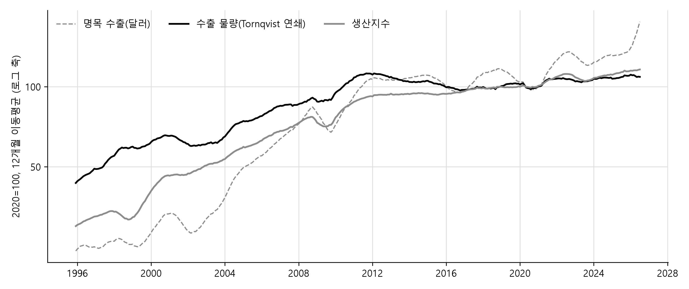
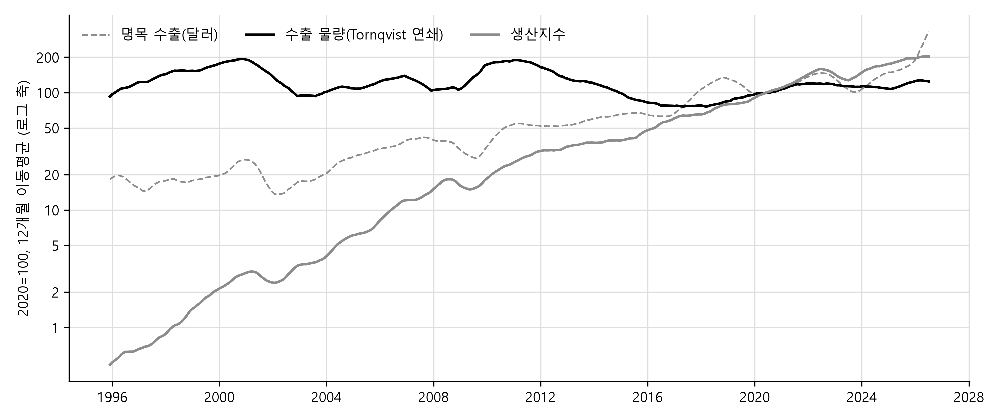
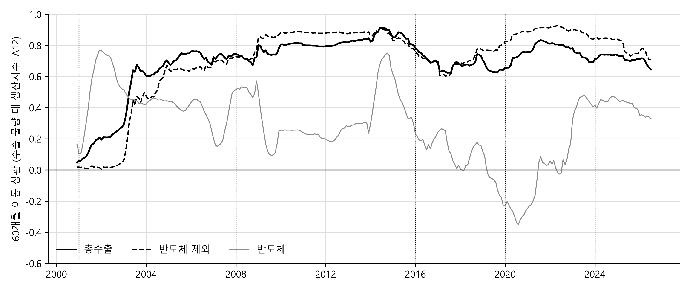

# 관세청 수출 통계는 같은 달의 산업생산을 얼마나 먼저 알려 주는가 — 성질별 수출입실적과 광공업생산지수, 1995\~2026

작성일: 2026-09-02
자료: KCSDB2 데이터베이스 (https://pilsunchoi.github.io/KCSDB2/)

---

## 요약

한 달의 수출은 그 달이 끝난 다음 날 공표되고, 같은 달의 광공업생산지수는 그 뒤 4주가 지나야 나온다. 본 연구가 묻는 것은 같은 달의 두 통계 가운데 먼저 나오는 수출이 나중에 나오는 생산을 얼마나 미리 알려 주는가이다. 수출과 생산이 같은 달에 함께 움직이는 관계이기만 해도 먼저 나오는 쪽은 아직 나오지 않은 쪽에 대한 정보를 갖는다. 자료는 관세청 성질별 수출입실적 1995년 1월부터 2026년 7월까지 31년의 월 자료와 국가데이터처 광공업생산지수 둘뿐이며, 생산과 견주는 수출의 척도는 외부 물가지수 없이 관세청 자료의 금액(value)과 중량(weight)만으로 만든 명목 수출과 물량(volume) 지수다. 분석은 세 단계로 이루어진다. 먼저 품목군 15개의 수출을 산업별 생산지수와 대응시키고, 명목 수출과 물량 지수의 성장률과 월별 움직임을 생산지수와 견주어 어느 것이 생산과 가까운 척도인지를 정한다. 다음으로 수출과 생산의 동조성과 선후행을 국면마다 재어 두 계열의 관계가 동행인지 선행인지를 가린다. 마지막으로 브리지 회귀(bridge regression)를 사용해, 각 예측 시점에 이미 공표된 정보만으로 같은 달의 생산을 예측할 때 수출 항이 예측오차를 얼마나 줄이는지를 표본외(out-of-sample)로 측정한다.

결과는 세 가지로 요약된다. 첫째, 수출의 어느 척도가 생산과 가까운가는 무엇을 재는가에 따라 다르다. 31년 성장률의 수준에서는 물량 지수가 생산에서 가장 멀다. 명목 수출은 연 6.5%, 생산은 4.4%, 물량 지수는 2.0% 늘었는데, 그 차이는 같은 무게에 담긴 가치가 오른 것을 생산지수는 물량으로 잡고 중량은 잡지 못하기 때문이다. 이 어긋남은 반도체와 컴퓨터주변기기처럼 단위중량당 가치가 연 9\~11% 오른 품목군에 몰려 있고, 반도체를 뺀 수출에서는 물량 지수와 생산의 성장률이 거의 같다. 그러나 전년 동월 대비의 월별 움직임에서는 물량 지수가 생산과 가장 가깝다. 단가 상승은 트렌드라 전년 동월 대비에서 빠지기 때문이며, 물량 지수로 잰 반도체 제외 수출과 생산의 상관은 2008년 이후 0.8 안팎이다. 둘째, 수출과 생산의 관계는 동행적(coincident)이다. 계절조정 월간 변화의 교차상관은 거의 모든 계열에서 동시점이 가장 높고, Granger 검정이 양방향에서 유의하기는 하나 그 정보는 동시점 관계에 비해 작아 어느 쪽이 앞선다고 할 시차는 없다. 셋째, 그럼에도 수출은 생산보다 먼저 공표되기 때문에 같은 달의 생산을 미리 알려 주는 역할을 할 수 있다. 전월 생산만으로 이번 달 생산을 예측하는 기준 모형에 익월 1일에 나오는 명목 수출을 더하면 표본외 예측오차가 13% 줄고, 전월 단가로 보정하면 19%, 중순에 중량이 붙은 확정치가 나와 물량 지수를 쓰면 27% 감소한다. 정보가 공표되는 순서대로 오차가 감소하는 것이다. 경기선행지수까지 아는 기준에 견주어도 이 감소는 줄지 않아, 수출이 더해 주는 정보는 선행지수가 담지 않은 것이다. 수출 통계의 정보 가치는 생산에 앞서는 데 있지 않고 같은 달을 2주에서 4주 먼저 보이는 데 있다. 그 가치는 물량 지수에서 가장 크고 반도체 생산에서는 거의 없다.

---

## I. 서론

한국의 월별 수출은 산업통상부와 관세청이 익월 1일에 금액을 공표하고, 중량이 붙은 월간 확정치는 관세청이 익월 중순에 낸다. 같은 달의 광공업생산지수는 국가데이터처가 익월 마지막 평일에 산업활동동향으로 공표한다. 2026년 7월을 예로 들면 7월 수출은 8월 1일, 중량이 붙은 확정치는 8월 18일, 7월 광공업생산은 8월 31일에 나왔다. 정확한 공표 시점과 확인한 사례는 II.1절의 표 1에 있다. 월간 수출은 생산지수보다 약 4주 먼저 나온다. 익월 1일의 월간 수출은 금액뿐이고 중량이 붙은 확정치는 그 뒤 중순에 나오며, 그것도 생산지수보다 약 2주 앞선다. 이 시차가 뜻하는 것은, 수출과 생산이 같은 달에 함께 움직이는 관계이기만 해도 먼저 나오는 수출이 아직 나오지 않은 생산에 대한 정보를 갖는다는 점이다. 본 연구가 묻는 것은 수출과 생산의 관계이며, 같은 달의 두 통계 가운데 먼저 나오는 쪽이 나중에 나오는 쪽을 얼마나 미리 알려 주는가이다. 이 질문에 답하려면 세 가지가 먼저 정해져야 한다. 수출의 어느 척도가 생산과 가장 가깝게 움직이는가, 두 계열의 관계가 동행(coincident)인가 선행(leading)인가, 그리고 각 예측 시점에 이미 공표된 정보만으로 예측 모형을 세우면 수출 항이 오차를 얼마나 줄이는가이다.

첫 번째 물음, 즉 수출의 어느 척도가 생산과 가장 가깝게 움직이는가라는 물음이 필요한 이유는 수출이 명목 달러이기 때문이다. 달러 표시 수출액은 물건이 해외로 더 나갔을 때도, 같은 물건의 달러 가격이 올랐을 때도 늘며, 생산지수는 이 가운데 물량만 재는 것에 해당한다. 성질별 자료에는 금액과 중량이 모두 있어 코드마다 단가(unit value)를 계산할 수 있고, 이를 금액 비중으로 가중해 품목군의 단가 지수와 물량 지수를 만든다. 외부 물가지수 없이 관세청 통계 안에서 금액과 단가, 물량의 세 지표가 나오는 셈이다. 이 가운데 생산과 성격이 맞는 척도는 물량 지수이고, 본 연구의 비교도 물량 지수와 생산지수를 축으로 한다. 그럼에도 명목 수출과 단가까지 함께 고려하는 이유가 있다. 명목은 익월 1일에 나오는 유일한 수출 통계라 그 자체의 정보 가치를 재야 하고, 단가는 명목과 물량 지수의 차이를 설명하는 항이라 물량 지수가 생산에서 벗어나는 곳이 어디인지를 보여 준다. 이 단가는 시장 가격이 아니라 단위중량당 가치다. 메모리 반도체 코드 하나에 1995년의 16메가 D램과 2026년의 고대역폭 메모리(HBM)가 같이 들어 있으므로 같은 무게에 담긴 가치가 커지는 만큼 본 연구에서 사용하는 물량 지수는 생산보다 느리게 늘어날 것이다. 본 연구는 물량 지수와 생산지수를 견주어 이 한계가 31년 성장률에서 어느 품목군에서 얼마나 큰지, 그리고 전년 동월 대비의 월별 움직임에서도 문제가 되는지를 확인한다.

두 번째 물음, 즉 두 계열의 관계가 동행인가 선행인가라는 물음이 필요한 이유는 동행과 선행이 다른 예측 설계를 요구하기 때문이다. 수출이 생산에 한두 달 앞선다면 이번 달 수출은 다음 달 생산의 정보이고, 동행이라면 이번 달 수출은 이번 달 생산의 정보다. 두 경우 모두 수출은 쓸모가 있지만 무엇을 예측하는 데 쓸 것인지가 달라진다. 세 번째 물음, 즉 수출 항이 예측오차를 얼마나 줄이는가라는 물음은 앞의 둘을 예측오차의 크기로 바꾼다. 여기서 지켜야 할 규칙은 하나다. 각 예측 시점에서 그때까지 공표된 통계만 쓴다. 관세청 수출이 나오는 익월 1일에는 그 달의 금액과 그 전달까지의 생산을 알 수 있고, 중순에는 그 달의 중량이 더해진다. 그 정보 집합에서 이번 달 생산을 예측하는 브리지 회귀를 세우고 수출 항이 없는 기준 모형과 표본외 오차를 견주면, 공표 시차의 정보 가치가 숫자로 나온다.

본 연구는 기술적 분석이다. 인과를 묻지 않고 명목 수출과 물량 지수가 생산과 어디서 어긋나는지, 수출과 생산이 얼마나 같이 움직이는지, 어느 쪽이 앞서는지, 그리고 먼저 나오는 통계가 나중 통계의 예측오차를 얼마나 줄이는지를 잰다. 대상은 수출 품목군 15개와 총수출, 반도체 제외 수출이며, 수입은 산업생산의 투입재로 정한 13개 품목군을 대응 산업의 생산과 견주는 데 그친다. 품목군의 정의와 국면 구분, 성질별 코드와 산업 코드의 대응표는 II장에 있다.

자료는 관세청 성질별 수출입실적과 국가데이터처 광공업생산지수 둘뿐이다. 생산 쪽을 광공업생산지수로 둔 것은 달리 고를 것이 없어서다. 제조업 전체를 물량으로 재면서 산업활동동향보다 먼저 나오는 공식 통계는 없다. 한국은행 기업경기조사와 제조업 구매관리자지수(PMI)는 해당 월 하순과 익월 첫 평일에 나오지만 응답 기업의 방향 판단이고, 자동차·철강·석유의 업종별 협회 통계는 익월 중순 무렵에 나오지만 업종이 한정된다. 생산액에 해당하는 월별 통계도 없다. 광업제조업동향조사는 생산량과 출하량을 지수로만 공표하고, 생산액은 연간 광업제조업조사와 분기 국민계정에만 있다. 수출 쪽 척도를 관세청 자료 안에서만 만든 것은 의도한 설계다. 물가지수나 출하지수 같은 다른 기관의 통계를 섞으면 공표 시점이 하나 더 생기고 대응이 하나 더 필요해지는데, 본 연구의 물음은 수출 통계가 나오는 그 시점에 그 통계만으로 무엇을 알 수 있는가이기 때문이다. 관세청 자료의 금액과 중량만으로 만든 물량 지수가 생산과 얼마나 가까운지는 III장과 IV장에서 측정하며, 그 결과에 따라 이 물량 지수가 외부 물가지수 없이도 생산과 견줄 만한 척도인지가 정해진다.

세 번째 물음, 즉 먼저 나오는 수출 통계가 나중에 나오는 같은 달 생산의 예측오차를 얼마나 줄이는가를 재는 데는 브리지 회귀를 쓴다. 예측 시점에 공표된 통계만으로 생산을 예측하는 식을 세우고 수출 항이 있을 때와 없을 때의 표본외 오차를 견주는 방법이며, 설계는 가장 단순하게 두었다. 설명변수는 전월 생산, 경기선행지수, 그리고 같은 달의 수출 하나다. 통계의 개정, 곧 처음 공표된 값과 뒤에 정정된 값의 차이는 다루지 않으며, 여러 품목군을 함께 넣는 결합도 다루지 않는다. 관세청이 그 달 안에 내는 10일 단위 잠정치는 월별 성질별 자료의 범위 밖이라 다루지 않는다. 본 연구는 그런 확장이 얻을 수 있는 개선의 하한을 측정하는 셈이다.

세 질문에 대한 답을 미리 적으면 다음과 같다. 첫째 질문은 수출의 어느 척도가 생산과 가장 가까운가이다. 답은 척도가 무엇을 재는가에 따라 다르다. 31년 성장률의 수준에서는 명목 6.5%, 물량 지수 2.0%, 생산 4.4%로 물량 지수가 생산에서 가장 멀고, 반도체·컴퓨터주변기기처럼 단위중량당 가치가 연 9\~11% 오른 품목군이 그 차이를 만든다. 그러나 전년 동월 대비의 월별 움직임에서는 물량이 생산과 가장 가까우며 브리지 회귀에서도 물량이 오차를 가장 많이 줄인다. 둘째 질문은 동행인가 선행인가이다. 답은 동행이다. 월 단위에서 교차상관은 동시점에서 가장 높고, 시차를 두고 앞서는 관계는 어느 쪽으로도 뚜렷하지 않다. 셋째 질문은 공표 시차의 정보 가치다. 답은 익월 1일의 명목 수출로 같은 달 광공업생산의 표본외 예측오차를 13%, 전월 단가로 보정하면 19%, 중순에 이용할 수 있는 물량 지수를 쓰면 27%까지 줄인다는 것이다. 경기선행지수까지 아는 기준에 대해서도 명목 8%, 단가 보정 22%, 물량 32%로 그 이득은 줄지 않는다. 세 답의 근거는 III장부터 VI장까지 차례로 제시한다.

---

## II. 자료와 방법

### 1. 공표 시점

표 1은 $`t`$월 자료의 공표 시점을 한 달의 자료 기준으로 배열한 것이다. 열은 통계와 발표 기관, 공표일, 그 달의 마지막 날부터 센 시차, 그리고 본 연구가 확인한 실제 사례다. 월간 수출은 생산지수보다 약 4주, 중량이 붙은 확정치는 약 2주 먼저 나오며, 경기선행지수는 생산지수와 같은 날 나온다. 이 순서가 II.6절의 정보 집합 규칙을 정한다.

**표 1. $`t`$월 자료의 공표 시점**

| 통계 | 기관 | 공표일 | $`t`$월 말 기준 시차 | 확인한 사례 |
|---|---|---|---|---|
| 월간 수출입 동향(잠정, 금액) | 산업통상부·관세청 | $`t+1`$월 1일 | +1일 | 2026년 7월분 8월 1일(토요일) |
| 월간 수출입 현황(확정, 금액과 중량) | 관세청 | $`t+1`$월 중순 | 약 +2.5주 | 2026년 7월분 8월 18일 |
| 산업활동동향(광공업생산지수) | 국가데이터처 | $`t+1`$월 마지막 평일 | 약 +4주 | 2026년 7월분 8월 31일 |
| 경기종합지수(선행종합지수) | 국가데이터처 | 산업활동동향과 같은 날 | 약 +4주 | 2026년 7월분 8월 31일 |

### 2. 자료

수출 자료는 관세청 성질별 수출입실적(공공데이터포털 15102109)이며 본 연구가 쓰는 데이터베이스 KCSDB2(https://pilsunchoi.github.io/KCSDB2/)에 적재된 것이다. 기간은 1995년 1월부터 2026년 7월까지 379개월이고 값은 달러 금액과 킬로그램 중량이다. 수출 코드 153개를 품목군 15개와 나머지로 묶는다. 품목군은 관세청이 수출입 현황 보도자료에서 쓰는 10대 수출 품목(반도체, 승용차, 석유제품, 철강제품, 선박, 자동차부품, 무선통신기기, 컴퓨터주변기기, 정밀기기, 가전제품)에 일반기계, 화공품, 의약품, 제조장비, 이차전지를 더한 것이고, 나머지는 여기에 들지 않는 코드 96개다.

생산 자료는 국가데이터처 광업제조업동향조사의 광공업생산지수(2020=100)이며 KOSIS 공유서비스 OpenAPI로 받았다. 산업별 표(DT_1F02001)는 전국 기준으로 한국표준산업분류 소분류(3자리)까지 공개되며, 소분류 81개 가운데 76개가 1995년 1월부터 빠짐없이 있다. 원지수와 계절조정 지수를 쓴다. 전국지수는 연쇄 라스파이레스(chained Laspeyres) 산식이고 2015년부터 제10차 산업분류 기준이며, 국가데이터처는 장기 시계열 이용에 이 점을 참고하라고 적고 있다. 매달 공표 시점에 가장 최근 두 달의 값은 잠정치이고, 매년 1월분 공표 때 연간보정으로 최근 몇 해가 수정된다. 소분류 두 개를 하나로 묶을 때 쓴 가중치는 같은 표(DT_1F02001)의 메타 정보가 산업 코드마다 제공하는 가중치이며, 국가데이터처가 2026년 지수 작성에 적용하는 전국 가중치(총지수 10,000)다.

브리지 회귀의 기준 모형에는 국가데이터처 경기종합지수(2020=100)의 선행종합지수를 쓴다. 선행종합지수는 산업활동동향과 같은 날 공표되므로, 어느 예측 시점에서든 알 수 있는 가장 최근 달이 생산지수와 같다. 본 연구는 이 지수를, 수출 통계가 없더라도 예측 시점에 이미 쓸 수 있는 경기 정보를 대표하는 자료로 삼는다. 선행종합지수에는 수출입물가비율과 재고순환지표, 경제심리지수, 기계류내수출하지수(선박 제외), 건설수주액, 코스피, 장단기금리차가 들어 있기 때문에, 수출 통계가 그 시점에 더해 주는 정보가 이 일곱 지표를 넘어서는가를 재는 기준이 된다.

### 3. 품목군과 산업의 대응

표 2는 품목군 15개와 총수출, 반도체 제외에 생산지수 산업 코드를 붙인 대응표다. 산업 코드가 둘인 품목군은 2026년 가중치로 가중평균한 것이다. 품목군 여섯은 성질별 범위와 생산지수 산업의 범위가 정확히 맞지 않아 대응이 느슨하다. 승용차는 대응 소분류(C301)가 승용차만이 아니라 화물차와 버스, 자동차용 엔진까지 담고 있어 성질별 승용차보다 넓다. 철강제품은 성질별 코드에 구리와 알루미늄 같은 비철금속이 들어 있어 1차 철강(C241)만으로는 좁으므로, 비철금속까지 담은 1차 금속 중분류(C24) 전체에 대응시켰다. 일반기계와 제조장비는 생산지수가 소분류까지만 공개되어 특수 목적용 기계(C292) 안에서 반도체와 디스플레이 제조장비를 가를 수 없으므로, 제조장비는 C292에, 일반기계는 C292를 포함한 기타 기계 및 장비(C29) 전체에 대응시켜 둘이 겹친다. 화공품은 성질별 코드에 플라스틱 제품이 들어 있어 화학물질(C20)에 고무 및 플라스틱(C22)을 더했다. 정밀기기는 대응 중분류(C27)가 의료기기와 광학기기, 시계까지 담아 성질별 정밀기기보다 훨씬 넓다. 이들은 생산지수 쪽이 성질별보다 넓으므로 동조성은 그만큼 낮게 나올 수 있다.

**표 2. 품목군과 생산지수 산업의 대응**

| 품목군 | 생산지수 산업(KSIC) |
|---|---|
| 총수출 | 0 총지수 |
| 반도체 제외 | C261을 뺀 모든 중분류와 C26의 다른 소분류의 가중 합성(1995년부터 있는 코드만) |
| 반도체 | C261 반도체 제조업 |
| 승용차 | C301 자동차용 엔진 및 자동차 |
| 자동차부품 | C303 자동차 신품 부품 |
| 석유제품 | C192 석유 정제품 |
| 철강제품 | C24 1차 금속 |
| 선박 | C311 선박 및 보트 건조업 |
| 무선통신기기 | C264 통신 및 방송장비 |
| 컴퓨터주변기기 | C263 컴퓨터 및 주변 장치 |
| 정밀기기 | C27 의료, 정밀, 광학 기기 및 시계 |
| 가전제품 | C285 가정용 기기 + C265 영상 및 음향 기기 |
| 일반기계 | C29 기타 기계 및 장비 |
| 화공품 | C20 화학물질(의약품 제외) + C22 고무 및 플라스틱 |
| 의약품 | C212 의약품 제조업 |
| 제조장비 | C292 특수 목적용 기계 |
| 이차전지 | C282 일차전지 및 축전지 |

본 연구는 총수출과 나란히 반도체 제외 수출을 따로 본다. 반도체는 2026년 7월 기준 수출의 3분의 1이 넘는 데다 단가가 크게 움직여 총수출의 움직임을 좌우하므로, 반도체를 뺀 수출이 반도체를 뺀 생산과 어떻게 움직이는지를 따로 보아야 나머지 산업의 관계가 드러나기 때문이다. 이를 위해서는 생산 쪽에도 반도체 제외 생산지수가 필요한데, 국가데이터처는 그런 지수를 공표하지 않으므로 본 연구가 만들었다. 총지수에서 반도체를 빼는 대신 반도체 소분류를 뺀 모든 중분류와 C26의 다른 소분류를 2026년 가중치로 묶어 만들었다. 2026년 가중치로 총지수에서 빼는 식 $`(w_A I_A - w_B I_B)/(w_A - w_B)`$는 연쇄 지수에는 근사이고, 반도체처럼 31년 동안 상대 수준이 크게 움직인 항목에서는 초기 연도가 왜곡되기 때문이다. 두 방식의 전년 동월 대비 변화 상관은 0.93이다. 1995년부터 빠짐없이 있는 코드만 묶었으므로 2020년에 생긴 산업용 기계 및 장비 수리업(C34, 가중치 0.86%)은 빠진다. 선후행 분석에 쓰는 계절조정 판은 광업 세 중분류(B05\~B07)와 전기·가스·증기 공급업(D35)의 계절조정 지수가 1995년부터 빠짐없이 있지 않아 이들도 빠지므로(가중치 합 6.9%), 사실상 제조업의 반도체 제외 지수다.

### 4. 명목, 물량, 단가

품목군 $`g`$에 속한 코드 $`i`$의 $`t`$월 수출 금액을 $`V_{it}`$, 중량을 $`W_{it}`$라 하자. 품목군의 명목 수출은 그 합 $`V_{gt} = \sum_{i \in g} V_{it}`$이고 달러 금액이다. 코드의 단가는 금액을 중량으로 나눈 $`p_{it} = V_{it}/W_{it}`$다. 이 상황에서 품목군의 단가 지수와 물량 지수는 코드별 단가를 Törnqvist(1936) 산식으로 묶어 만든다. 즉, 품목군 단가의 변화는 코드별 단가의 로그 변화를 두 시점의 평균 금액 비중($`\bar{s}_i`$)으로 가중해 더한 것이다.

```math
\Delta \ln U_g = \sum_{i \in g} \bar{s}_i \, \Delta \ln p_i, \qquad \bar{s}_i = \tfrac{1}{2}\left(\frac{V_{ia}}{V_{ga}} + \frac{V_{ib}}{V_{gb}}\right)
```

물량 변화는 명목 변화에서 이 단가 변화를 뺀 것이다.

```math
\Delta \ln Q_g = \Delta \ln V_g - \Delta \ln U_g
```

본 연구가 단가 지수와 물량 지수라 부르는 것은 이 $`\Delta \ln U_g`$와 $`\Delta \ln Q_g`$를 첫 달부터 누적해 수준으로 되만든 지수이며, 표 3\~5의 연평균 로그 변화율은 두 끝점 연도 사이의 이 변화를 햇수로 나눈 것이다. 곧 품목군의 명목 증가율은 단가 증가율과 물량 증가율의 합으로 나뉜다. 두 시점 가운데 한쪽에서 중량이 0인 코드는 단가를 낼 수 없으므로 가중에서 뺀다. 국면별과 31년의 변화는 두 끝점 연도의 연간 금액과 중량으로 단가를 내어 그 두 연도 사이의 변화를 바로 계산하며 중간 연도를 거치지 않는다. 월별 계열은 이웃한 두 달 사이의 변화를 달마다 같은 식으로 계산하고, 그 로그 변화를 처음 달부터 차례로 더해 각 달의 지수 수준을 만든다. 품목군 중량을 그대로 물량 지수로 쓰지 않는 이유는 그것이 금액은 작고 중량은 큰 코드에 좌우되기 때문이다. 반도체 품목군의 중량은 2023년 21.5만 톤에서 2024년 7.1만 톤으로 한 해 만에 3분의 1이 됐는데, 반도체 수출의 1%인 기타 개별소자 코드의 중량이 18.6만 톤에서 4.1만 톤으로 준 것이고 메모리 반도체는 5,600톤에서 5,500톤으로 같다. 코드 단위로 가중하면 이 코드의 몫은 1%뿐이다.

두 척도와 생산의 차이는 다음과 같이 나뉜다. 즉, 품목군의 실제 수출 물량을 $`Q^*_g`$, 대응 산업의 생산지수를 $`ip_g`$라 하면 다음이 성립한다.

```math
\Delta \ln V_g - \Delta \ln ip_g = \Delta \ln U_g + \left(\Delta \ln Q_g - \Delta \ln Q^*_g\right) + \left(\Delta \ln Q^*_g - \Delta \ln ip_g\right)
```

여기에서 오른쪽 첫 항은 단가 상승, 둘째 항은 중량으로 만든 물량 지수가 실제 물량에서 벗어난 정도, 셋째 항은 생산 가운데 수출로 나가는 몫의 변화다. 명목에서 생산을 뺀 것은 세 항의 합이고, 물량 지수에서 생산을 뺀 것은 뒤의 두 항의 합이다. $`Q^*_g`$는 관측되지 않으므로 둘째 항과 셋째 항을 따로 잴 수는 없고, 본 연구는 두 차이의 크기와 품목군별 분포에서 둘째 항이 큰 자리를 가려낸다.

이 식에서 단가는 시장 가격이 아니라 단위중량당 가치다. 한 코드에는 여러 물건이 섞여 있어, 물건마다의 시장 가격이 그대로여도 코드 안의 구성이 무겁고 싼 물건에서 가볍고 비싼 물건 쪽으로 옮겨 가면 단가는 오르고, 그만큼 물량 지수는 실제 물량보다 낮게 나온다. 본 연구는 이 척도를 그대로 쓰되, 생산지수와 견주어 그 왜곡이 어느 품목군에서 얼마나 큰지를 보인다. 명목 수출이 생산보다 빨리 늘었다면 그 차이는 단가가 올랐거나 생산 가운데 수출로 나가는 몫이 커진 것이고, 물량 지수가 생산보다 느리게 늘었다면 그 차이는 중량이 물량을 제대로 재지 못한 만큼이거나 수출로 나가는 몫이 줄어든 것이다. 31년 성장률에서 명목은 생산보다 훨씬 빠르고 물량 지수는 생산보다 훨씬 느린 품목군이 있다면, 그 품목군에서는 중량이 물량의 척도가 되지 못한다고 판단한다. 다만 그런 품목군에서도 전년 동월 대비의 월별 움직임에서는 물량 지수가 생산과 같이 움직일 수 있다. 그렇다면 중량과 생산의 어긋남은 오랜 기간에 걸쳐 쌓이는 트렌드의 문제이지 달마다의 순환을 재는 데는 문제가 되지 않는다는 뜻이다.

### 5. 동조성과 선후행

이 절에서 $`x_t`$는 품목군의 수출 척도(물량 지수 또는 명목 수출), $`ip_t`$는 대응 산업의 생산지수를 가리키며 품목군 첨자는 생략한다. $`\Delta_{12} \ln x_t = \ln x_t - \ln x_{t-12}`$는 전년 동월 대비 로그 변화율, $`\Delta_1 \ln x_t = \ln x_t - \ln x_{t-1}`$은 월간 로그 변화율이고, 생산지수에도 같은 기호를 쓴다. 동조성은 원계열의 $`\Delta_{12}`$ 상관으로 측정한다. 수출 척도와 생산지수 각각의 $`\Delta_{12}`$를 계산하고, 두 계열이 모두 있는 달을 표본으로 피어슨 상관계수를 구한다. 전체 기간은 1996년 1월부터 2026년 7월까지이고, 관측이 24개월을 넘는 경우에만 값을 적는다. 물량 지수와 명목 수출 각각에 대해 생산지수와의 상관을 구하되, 국면별 상관은 생산과 성격이 맞는 물량 지수에 대해서만 내고 명목 수출은 전체 기간의 상관이 물량 지수와 얼마나 다른지를 보는 데 그친다. 국면은 반도체 제외 수출의 성장 국면이 바뀐 시점과 큰 사건을 경계로 나눈 여섯이며 경계 연도는 2001, 2008, 2016, 2020, 2024년이다. 2001년과 2008년은 반도체 제외 수출의 평균 성장률이 이동한 시점, 2016년은 총수출 트렌드 성장률의 저점, 2020년은 코로나, 2024년은 반도체 급등의 시작이다. 국면별 상관은 그 국면에 속하는 달만으로 구한다. 동조성의 시간 변화는 60개월 이동 상관으로 본다. 즉, 각 달 $`t`$에 대해 $`t-59`$월부터 $`t`$월까지 60개 관측의 상관을 구해 $`t`$월의 값으로 둔다.

선후행은 계절조정한 계열의 $`\Delta_1`$로 측정한다. 전년 동월 대비 변화율은 같은 달끼리 견주어 계절 요인이 상쇄되므로 동조성에서는 원계열을 그대로 썼지만, 월간 변화에는 계절이 그대로 남으므로 여기서는 계절조정한 계열이 필요하다. 수출은 명목 계열을 조업일수와 설·추석 효과를 설명변수로 넣어 미국 센서스국의 X-13ARIMA-SEATS 1.1판(U.S. Census Bureau, 2025)으로 계절조정한 것을, 생산은 국가데이터처의 계절조정 지수를 쓴다. 반도체 제외 수출은 총수출과 반도체의 계절조정 수준의 차로 만든다. 두 계열의 교차상관을 시차 $`k`$마다 구한다.

```math
\rho(k) = \mathrm{corr}\left(\Delta_1 \ln x_{t-k},\ \Delta_1 \ln ip_t\right), \qquad k = -12, \ldots, 12
```

$`\rho(k)`$가 가장 높은 시차 $`k^*`$를 찾아, $`k^* > 0`$이면 수출이 생산에 $`k^*`$개월 앞서고 $`k^* < 0`$이면 생산이 앞서며 $`k^* = 0`$이면 동행으로 읽는다. Granger(1969) 검정은 생산의 월간 변화를 자기 과거 $`L`$개와 수출의 과거 $`L`$개에 회귀한 식에서 수출 과거의 계수가 모두 0이라는 가설을 검정한다.

```math
\Delta_1 \ln ip_t = \alpha + \sum_{j=1}^{L} \beta_j \, \Delta_1 \ln ip_{t-j} + \sum_{j=1}^{L} \gamma_j \, \Delta_1 \ln x_{t-j} + e_t, \qquad H_0: \gamma_1 = \cdots = \gamma_L = 0
```

가설을 기각하면 수출의 과거가 생산의 현재에 대해 생산 자신의 과거로는 설명되지 않는 정보를 갖는다는 뜻이며, 이를 수출에서 생산으로의 방향(Granger causality from exports to production)이라 부른다. 반대 방향은 두 변수의 자리를 바꾼 같은 식으로 검정한다. $`L`$은 3과 6으로 두고, 제약 회귀와 비제약 회귀의 잔차제곱합을 견주는 $`F`$ 검정의 $`p`$값을 적는다. 표본은 1995년 2월부터 2026년 7월까지이고 관측이 60개월 이상인 계열만 검정한다. 품목군 가운데 선박은 몇 건의 인도가 한 달 수출을 정하는 탓에 X-11의 품질 통계 M7이 1을 넘어 계절조정 계열이 없으므로 선후행 분석에서 뺀다. M7은 안정 계절성에 견준 이동 계절성의 크기이며 1을 넘으면 계절 요인을 믿을 수 없다는 뜻이다(Ladiray and Quenneville, 2001). 계절조정에 기대지 않는 확인으로 물량 지수 $`\Delta_{12}`$ 원계열의 교차상관도 함께 낸다. VII장의 수입 투입재 13개 계열도 같은 사양으로 X-13 계절조정을 하며, M7이 1을 넘는 계열은 월간 변화의 분석에서 뺀다.

### 6. 브리지 회귀

공표 시차의 정보 가치는 브리지 회귀로 잰다. 브리지 회귀(bridge regression)는 늦게 나오는 통계를 먼저 나오는 통계에 회귀시켜 식을 얻어 두고, 먼저 나오는 통계가 공표되면 그 값을 식에 넣어 아직 나오지 않은 통계를 미리 추정하는 방법으로, 분기 GDP를 그 분기의 월 지표로 추정하는 중앙은행의 속보 추정에서 유래했다(Baffigi, Golinelli and Parigi, 2004). 회귀식은 보통의 최소제곱이고, 다른 점은 예측 시점에 실제로 공표된 값만 설명변수로 쓰며 성능을 표본외 예측오차로 잰다는 자료의 시간 구조에 있다. 본 연구는 분기와 월이 아니라 공표일이 4주 어긋나는 월 통계 둘 사이에 이 방법을 쓴다. 같은 문제를 더 정교하게 푸는 방법으로 서로 다른 빈도의 자료를 한 식에 직접 섞는 MIDAS(mixed data sampling) 회귀와 동적 요인 모형이 있으나, 본 연구는 가장 단순한 형태인 브리지 회귀를 사용한다. 예측 대상은 $`t`$월 광공업생산지수 원지수의 전년 동월 대비 로그 변화 $`\Delta_{12} ip_t`$이고, 기본 모형은 다음과 같다.

```math
\Delta_{12} ip_t = a + b\,\Delta_{12} ip_{t-h} + c\,\Delta_{12} x_t + e_t
```

설명변수는 예측 시점에 이미 공표된 것만 쓴다. $`h`$는 그 시점에 알 수 있는 가장 최근 생산의 시차다. 관세청 월간 수출이 나오는 $`t+1`$월 1일과 확정치가 나오는 중순에는 $`t-1`$월 생산까지 나와 있으므로 $`h = 1`$이다. $`x_t`$는 같은 달의 수출이다. $`t+1`$월 1일에는 금액만 있으므로 명목 수출을 넣고, 그 변형으로 명목의 전년 동월 대비 변화에서 $`t-1`$월 단가의 전년 동월 대비 변화를 뺀 것을 넣는다. 전월 단가는 그 시점에 이미 나온 확정치에서 계산되며, 단가의 전년 동월 대비 변화가 한 달 사이에 크게 움직이지 않으므로 이번 달 단가의 대용이 된다. $`t+1`$월 중순에는 중량이 붙은 확정치가 나오므로 $`t`$월 물량 지수를 넣는다.

기준은 둘이다. 수출 항이 없는 모형($`c = 0`$)이 첫째 기준이고, 여기에 $`t-1`$월 경기선행지수의 전년 동월 대비 변화를 더한 것이 둘째 기준이다. 선행지수는 산업활동동향과 같은 날 나오므로 생산과 같은 시차로 알 수 있고, 수출이 없어도 그 시점에 쓸 수 있는 경기 정보를 다 쓴 기준이 그것이다. 수출 항은 두 기준 각각에 더하며, 오차 감소는 같은 기준에 대해 잰다. 첫째 기준에 대한 감소가 수출 통계의 정보 가치이고, 둘째 기준에 대한 감소가 그 가운데 선행지수가 아직 담지 않은 몫이다.

표본외 오차는 확장창으로 잰다. 예측 시점마다 그때까지의 자료로 계수를 추정해 다음 달을 예측하고, 오차의 제곱평균제곱근(RMSE)을 %p로 적는다. 1996년 2월부터 추정하고 2010년 1월부터 199개월을 표본외로 둔다. 예측 대상인 생산지수는 총지수, 반도체 제외, 반도체 셋이고, 수출 항은 각각에 대응하는 계열이다.

이 설계는 두 가지를 단순화시켰다. 첫째, 자료는 잠정치가 아니라 개정된 값이다. 어느 통계를 쓸 수 있는가는 공표 시점대로 지켰지만, 그 값은 예측 시점에 실제로 공표된 잠정치가 아니라 지금 남아 있는 값이다. 관세청 월간 수출은 익월 중순에 확정치로 바뀌고 생산지수는 최근 두 달이 잠정치이며 해마다 연간보정을 거치므로, 실시간 예측오차는 이보다 클 수 있다. 둘째, 설명변수를 수출 하나로 두었다. 여러 품목군을 함께 넣는 결합은 후속 연구가 한다. 따라서 여기서 나오는 오차 감소는 공표 시차가 갖는 정보 가치의 하한이다.

---

## III. 명목 수출, 물량, 생산

### 1. 전체 기간

표 3은 계열마다 전체 기간의 연평균 로그 변화율을 배열한 것이다. 시작점은 1995년 한 해의 합, 끝점은 2025년 8월부터 2026년 7월까지 12개월의 합이며 두 끝점 사이는 30.6년이다. 명목은 달러 수출액으로, 단가와 물량 지수는 코드별 단가를 묶은 Törnqvist 분해로, 생산지수는 대응 산업의 원지수로 계산한 것이다. 마지막 두 열은 두 척도가 생산에서 얼마나 벗어났는지를 보인다. 물량 지수에서 생산을 뺀 열은 중량으로 만든 물량 지수가 생산지수보다 얼마나 느리게 또는 빠르게 늘었는가이고, 명목에서 생산을 뺀 열은 명목 수출이 생산보다 얼마나 빨리 늘었는가다. II.4절의 식대로 앞의 차이에는 중량이 물량을 재지 못하는 정도가, 뒤의 차이에는 단가 상승이 주로 들어 있고, 생산 가운데 수출로 나가는 몫의 변화는 둘 모두에 들어 있다.

**표 3. 전체 기간 연평균 로그 변화율, 1995\~2026.07 (%)**

| 계열 | 명목 | 단가 | 물량 | 생산지수 | 물량$`-`$생산 | 명목$`-`$생산 |
|---|---|---|---|---|---|---|
| 총수출 | 6.5 | 4.5 | 2.0 | 4.4 | $`-2.5`$ | 2.1 |
| 반도체 제외 | 5.6 | 3.0 | 2.5 | 1.9 | 0.6 | 3.6 |
| 반도체 | 9.5 | 9.2 | 0.3 | 19.8 | $`-19.5`$ | $`-10.3`$ |
| 화공품 | 6.9 | 1.4 | 5.5 | 1.9 | 3.6 | 5.0 |
| 승용차 | 7.7 | 1.7 | 5.9 | 2.3 | 3.7 | 5.4 |
| 일반기계 | 6.3 | 1.5 | 4.8 | 2.8 | 2.0 | 3.5 |
| 석유제품 | 10.2 | 5.1 | 5.1 | 2.1 | 3.1 | 8.1 |
| 철강제품 | 5.1 | 1.7 | 3.5 | 1.5 | 2.0 | 3.6 |
| 선박 | 5.9 | 7.3 | $`-1.4`$ | 4.8 | $`-6.2`$ | 1.1 |
| 자동차부품 | 10.0 | 1.0 | 9.0 | 5.1 | 3.9 | 4.9 |
| 무선통신기기 | 9.7 | 8.5 | 1.2 | 3.8 | $`-2.7`$ | 5.8 |
| 컴퓨터주변기기 | 6.7 | 10.9 | $`-4.2`$ | 2.9 | $`-7.0`$ | 3.8 |
| 정밀기기 | 8.7 | 2.5 | 6.2 | 2.9 | 3.2 | 5.8 |
| 이차전지 | 9.3 | 2.4 | 6.9 | 7.5 | $`-0.5`$ | 1.9 |
| 제조장비 | 27.7 | $`-5.9`$ | 33.6 | 2.8 | 30.7 | 24.9 |
| 의약품 | 12.1 | 8.1 | 4.0 | 6.3 | $`-2.3`$ | 5.8 |
| 가전제품 | $`-0.5`$ | 2.3 | $`-2.9`$ | $`-0.8`$ | $`-2.1`$ | 0.2 |

표에서 총수출의 연평균 변화율을 보면, 명목 6.5%, 단가 4.5%, 물량 2.0%, 생산 4.4%다. 물량 지수가 생산보다 연 2.5%p 느린 것은 31년 동안 한국 수출의 단위중량당 가치가 오른 몫이 생산지수에는 물량으로 잡히고 중량에는 잡히지 않기 때문이다. 품목군은 두 그룹으로 나뉜다. 단가가 연 8% 넘게 오른 그룹은 컴퓨터주변기기 10.9%, 반도체 9.2%, 무선통신기기 8.5%다. 이들에서 중량은 물량의 척도가 아니다. 반도체 물량은 연 0.3%, 컴퓨터주변기기는 $`-4.2\%`$인데 생산은 19.8%와 2.9%다. 한 코드 안에서 같은 무게의 물건이 31년 동안 수십 배 비싸진 것이고, 그 물건이 무엇으로 바뀌었는지는 중량이 말해 주지 않는다. 반대 그룹은 자동차부품 1.0%, 화공품 1.4%, 일반기계 1.5%, 철강제품 1.7%, 승용차 1.7%로 단가 상승이 작다. 이들에서는 물량이 생산보다 2\~4%p 빠르며, 생산 가운데 수출로 나가는 몫이 늘어난 것으로 읽힌다. 석유제품의 단가 5.1%는 유가이고 물량 5.1%는 생산 2.1%보다 빠르다. 반도체 제외 수출 전체로는 물량 지수 2.5%와 생산 1.9%가 0.6%p 차이여서, 반도체를 빼면 물량 지수가 생산에 가까운 척도가 된다.

그림 1은 총수출의 명목 수출, 물량, 생산지수를 2020년을 100으로 맞춰 로그 축에 놓은 것이다. 12개월 이동평균이며 로그 축이라 기울기가 성장률이다. 표 3의 31년 평균을 그림은 시점별로 보인다.



**그림 1. 총수출의 명목 수출, Törnqvist 연쇄 물량, 광공업생산지수 (1995.12\~2026.07, 2020=100, 12개월 이동평균, 로그 축)**

물량은 31년 내내 생산보다 완만하다. 1995년부터 2008년까지 생산은 2.5배, 물량은 2.1배가 됐고, 2008년부터 2026년 7월까지는 생산 1.6배에 물량 1.2배다. 2016년부터 2026년까지 10년만 보면 생산 1.21배에 물량 1.12배로 두 선이 가장 가깝다. 명목 수출은 2008년까지 3.4배로 둘보다 가파르고 2008년 금융위기와 2015년 유가 하락, 2020년과 2023년에 둘과 어긋나며, 2024년 이후 명목이 물량과 생산에서 떨어져 올라가는 것이 반도체 가격이다. 그림 2는 같은 것을 반도체에서 보인다.



**그림 2. 반도체의 명목 수출, Törnqvist 연쇄 물량, 생산지수 (1995.12\~2026.07, 2020=100, 12개월 이동평균, 로그 축)**

반도체는 생산지수가 1995년부터 2016년까지 122배가 되는 동안 물량 지수가 0.8배로 오히려 줄었다. 명목 수출은 같은 기간 1995년 177억 달러에서 2016년 627억 달러로 연 6.0% 늘었을 뿐이며, 생산지수의 연 23%와 명목의 연 6%의 차이의 대부분이 그 사이의 가격 하락이다. 2016년 이후에는 생산 3.4배에 물량 1.6배로 두 선의 기울기 차이가 줄었다. 반도체에서 중량은 생산의 척도가 아니며, 명목 수출도 가격이 크게 움직이는 시기에는 생산과 다른 것을 잰다.

### 2. 국면별

표 4는 국면마다 총수출, 반도체 제외, 반도체의 명목·단가·물량·생산지수 연평균 로그 변화율을 배열한 것이다. 끝점은 직전 국면의 마지막 해와 이 국면의 마지막 해이고 2026은 2025년 8월부터 2026년 7월까지의 12개월이다. 네 행이 한 계열이며 명목은 단가와 물량의 합이다.

**표 4. 국면별 총수출, 반도체 제외, 반도체의 연평균 로그 변화율 (%)**

| 계열 | 척도 | 1995\~2000 | 2001\~2007 | 2008\~2015 | 2016\~2019 | 2020\~2023 | 2024\~2026.07 |
|---|---|---|---|---|---|---|---|
| 총수출 | 명목 | 6.4 | 11.0 | 4.4 | 0.7 | 3.8 | 14.1 |
|  | 단가 | $`-2.5`$ | 5.7 | 3.3 | 1.0 | 4.3 | 13.5 |
|  | 물량 | 8.9 | 5.3 | 1.1 | $`-0.2`$ | $`-0.4`$ | 0.6 |
|  | 생산지수 | 8.8 | 6.4 | 3.3 | 1.6 | 1.6 | 3.2 |
| 반도체 제외 | 명목 | 6.2 | 11.7 | 4.2 | $`-1.0`$ | 4.4 | 3.9 |
|  | 단가 | $`-1.9`$ | 6.0 | 2.3 | $`-0.3`$ | 5.6 | 3.6 |
|  | 물량 | 8.0 | 5.7 | 1.9 | $`-0.7`$ | $`-1.2`$ | 0.3 |
|  | 생산지수 | 2.7 | 3.9 | 1.9 | $`-0.3`$ | 0.1 | 1.4 |
| 반도체 | 명목 | 7.8 | 5.8 | 6.0 | 10.5 | 1.0 | 44.8 |
|  | 단가 | $`-6.3`$ | 3.2 | 10.9 | 8.2 | $`-2.4`$ | 39.8 |
|  | 물량 | 14.1 | 2.6 | $`-4.9`$ | 2.4 | 3.4 | 5.0 |
|  | 생산지수 | 35.7 | 23.1 | 14.7 | 15.8 | 12.2 | 13.2 |

총수출의 물량은 8.9%, 5.3%, 1.1%, $`-0.2\%`$, $`-0.4\%`$, 0.6%로 2015년까지 국면마다 절반씩 줄었다가 2016년 이후 세 국면 모두 0 근처이고, 생산지수는 8.8%, 6.4%, 3.3%, 1.6%, 1.6%, 3.2%로 같은 모양이되 2016년 이후 세 국면에서 물량보다 1.9\~2.6%p 높다. 2016년 이후 물량 지수의 정체는 중량 척도의 결과이고, 생산은 같은 기간 연 1.6\~3.2% 늘었다. 2016\~2019년은 명목과 물량 지수가 가장 가까운 국면이다. 단가가 1.0%에 그쳐 명목 0.7%와 물량 $`-0.2\%`$의 차이가 작고, 생산 1.6%까지 세 계열의 폭이 1.9%p로 여섯 국면 가운데 가장 좁다. 2024년 이후는 반대로 가장 벌어진 국면이다. 명목 14.1%가 단가 13.5%와 물량 0.6%로 나뉘고 생산은 3.2%다.

반도체 제외는 2016\~2019년에 물량 $`-0.7\%`$, 생산 $`-0.3\%`$로 두 척도가 모두 마이너스다. 반도체를 뺀 한국 수출은 이 4년 동안 물량으로 줄었고 그것을 만든 산업의 생산도 줄었다. 2020\~2023년은 물량 $`-1.2\%`$에 생산 0.1%, 2024년 이후는 물량 0.3%에 생산 1.4%로 물량이 생산을 조금 밑돈다. 2001\~2007년의 명목 11.7%는 단가 6.0%와 물량 5.7%로 반씩이고 생산은 3.9%였다. 반도체는 2024년 이후 명목 44.8%가 단가 39.8%와 물량 5.0%로 나뉘고 생산은 13.2%다. 물량 5.0%가 생산 13.2%에 못 미치는 것은 이 국면에서도 단가에 구성 변화가 섞여 있다는 뜻이다. 2008\~2015년은 반도체 단가 10.9%에 물량 $`-4.9\%`$, 생산 14.7%로 세 열이 가장 어긋난 국면이다.

표 5는 품목군마다 국면별 물량과 생산지수의 연평균 로그 변화율을 나란히 놓은 것이다. 국면마다 두 열이며 앞이 물량, 뒤가 생산이다.

**표 5. 국면별 품목군의 물량과 생산지수 연평균 로그 변화율 (%)**

<!-- Word 변환 지침 (표 5):
- 헤더 2행 구조. 마크다운의 13열 헤더("품목군", "1995\~2000 Q", "IP", …)를 두 층으로 나눈다.
  · 1행: [품목군 (1\~2행 rowspan=2 병합)] [1995\~2000 (2\~3열 colspan=2)] [2001\~2007 (4\~5열)] [2008\~2015 (6\~7열)] [2016\~2019 (8\~9열)] [2020\~2023 (10\~11열)] [2024\~2026.07 (12\~13열)]
  · 2행: [ (품목군 셀과 병합) ] [Q][IP] [Q][IP] [Q][IP] [Q][IP] [Q][IP] [Q][IP]
- Q는 물량, IP는 생산지수. 표 주석으로 그 뜻을 한 줄 단다.
- 병합 셀은 세로·가로 가운데 정렬. 숫자 열은 우측 정렬, 소수 1자리.
-->

| 품목군 | 1995\~2000 Q | IP | 2001\~2007 Q | IP | 2008\~2015 Q | IP | 2016\~2019 Q | IP | 2020\~2023 Q | IP | 2024\~2026.07 Q | IP |
|---|---|---|---|---|---|---|---|---|---|---|---|---|
| 화공품 | 14.4 | 4.6 | 6.8 | 3.9 | 4.6 | 2.4 | 3.2 | 0.7 | $`-0.3`$ | $`-3.0`$ | 0.8 | $`-0.4`$ |
| 승용차 | 14.1 | 5.8 | 12.0 | 5.6 | 0.3 | 1.9 | $`-1.9`$ | $`-3.8`$ | 6.5 | 0.7 | 2.4 | $`-0.4`$ |
| 일반기계 | 10.7 | 1.7 | 12.3 | 6.0 | 2.4 | 2.8 | 0.7 | 1.2 | $`-0.3`$ | 2.0 | $`-4.6`$ | 0.3 |
| 석유제품 | 18.5 | 7.0 | 0.8 | $`-0.1`$ | 6.6 | 2.3 | 2.1 | 3.8 | $`-2.0`$ | $`-0.7`$ | 0.2 | $`-0.5`$ |
| 철강제품 | 6.9 | 4.0 | 5.4 | 3.5 | 5.7 | 2.2 | $`-0.6`$ | $`-0.6`$ | $`-2.2`$ | $`-2.1`$ | $`-0.3`$ | $`-2.0`$ |
| 선박 | $`-16.5`$ | 13.8 | 3.2 | 10.1 | 2.8 | $`-0.6`$ | $`-8.2`$ | $`-11.6`$ | 3.5 | 5.4 | 5.5 | 14.8 |
| 자동차부품 | 19.8 | 5.2 | 20.3 | 8.2 | 7.1 | 6.0 | $`-2.5`$ | 0.1 | $`-2.0`$ | 5.6 | $`-1.7`$ | 0.4 |
| 무선통신기기 | 22.5 | 24.4 | 11.2 | 10.8 | $`-9.6`$ | $`-6.6`$ | $`-5.9`$ | $`-12.0`$ | $`-17.5`$ | 1.9 | 6.1 | 5.1 |
| 컴퓨터주변기기 | 11.3 | 34.7 | $`-6.2`$ | $`-4.5`$ | $`-15.5`$ | $`-2.8`$ | 1.6 | $`-6.8`$ | $`-4.8`$ | 3.3 | $`-1.6`$ | $`-7.3`$ |
| 정밀기기 | 13.6 | 0.3 | 13.3 | 1.5 | 9.5 | 3.1 | 1.5 | 4.9 | $`-9.8`$ | 3.0 | $`-5.7`$ | 8.2 |
| 이차전지 | 7.3 | 1.9 | 8.8 | 24.6 | 9.0 | 5.2 | 5.3 | 5.2 | 2.5 | 5.0 | 4.0 | $`-14.1`$ |
| 제조장비 | 158.9 | $`-1.3`$ | 16.0 | 5.9 | 16.6 | 3.7 | 11.0 | 0.1 | $`-6.8`$ | 3.6 | 1.2 | 2.7 |
| 의약품 | 3.2 | 4.7 | 5.7 | 8.1 | 3.9 | 3.0 | 4.9 | 6.9 | 3.1 | 8.3 | 2.0 | 10.7 |
| 가전제품 | 6.4 | 2.8 | $`-12.7`$ | 1.5 | 2.9 | $`-0.8`$ | $`-8.1`$ | $`-6.6`$ | $`-5.7`$ | 0.0 | $`-1.8`$ | $`-5.6`$ |

물량과 생산이 여섯 국면 모두 같은 부호로 움직이는 품목군은 철강제품과 의약품이고, 승용차, 화공품, 무선통신기기, 이차전지는 한 국면만 부호가 다르다. 자동차부품은 2016년 이후 세 국면에서 모두 어긋난다. 승용차는 2020\~2023년 물량 6.5%에 생산 0.7%로 국내 생산 가운데 수출로 나가는 몫이 이 국면에 크게 늘었고, 자동차부품은 2020년 이후 생산이 늘면서 물량이 줄어 반대로 국내 완성차로 가는 몫이 늘었다. 정밀기기는 2020년 이후 물량 $`-9.8\%`$, $`-5.7\%`$에 생산 3.0%, 8.2%로 어긋나는데, 대응 중분류가 의료·광학·시계를 다 담아 성질별 정밀기기보다 훨씬 넓은 탓이 크다. 컴퓨터주변기기는 2024년 이후 물량 $`-1.6\%`$, 생산 $`-7.3\%`$인데 명목은 크게 늘어, 이 품목군의 최근 수출 증가가 물건이 아니라 단가라는 것을 보인다.

---

## IV. 동조성

표 6은 품목군마다 물량 지수와 명목 수출 각각과 생산지수의 $`\Delta_{12}`$ 상관, 그리고 국면별 물량과 생산지수의 상관을 배열한 것이다. 전체 기간은 1996년 1월부터 2026년 7월까지 367개월이다. 이 표는 브리지 회귀에 쓸 정보가 어느 척도, 어느 품목군, 어느 국면에 있는지를 보인다. 국면별 첫 열은 $`\Delta_{12}`$가 1996년 1월부터 있으므로 1996\~2000년의 상관이다.

**표 6. 수출과 생산지수의 동조성, $`\Delta_{12}`$ 상관 (1996.01\~2026.07)**

| 품목군 | 물량·생산 | 명목·생산 | 1995\~2000 | 2001\~2007 | 2008\~2015 | 2016\~2019 | 2020\~2023 | 2024\~2026.07 |
|---|---|---|---|---|---|---|---|---|
| 총수출 | 0.60 | 0.64 | 0.05 | 0.74 | 0.82 | 0.64 | 0.74 | 0.79 |
| 반도체 제외 | 0.57 | 0.66 | 0.02 | 0.68 | 0.86 | 0.83 | 0.85 | 0.83 |
| 반도체 | 0.35 | 0.51 | 0.16 | 0.47 | 0.31 | $`-0.40`$ | 0.52 | 0.07 |
| 화공품 | 0.29 | 0.57 | $`-0.44`$ | 0.32 | 0.51 | 0.73 | 0.63 | 0.66 |
| 승용차 | 0.69 | 0.74 | 0.48 | 0.79 | 0.87 | 0.92 | 0.82 | 0.91 |
| 일반기계 | 0.49 | 0.58 | 0.00 | 0.66 | 0.86 | 0.51 | 0.52 | 0.43 |
| 석유제품 | 0.56 | 0.39 | 0.55 | 0.40 | 0.59 | 0.21 | 0.68 | 0.85 |
| 철강제품 | 0.25 | 0.44 | $`-0.50`$ | 0.44 | 0.61 | 0.63 | 0.51 | 0.50 |
| 선박 | 0.19 | 0.15 | 0.24 | $`-0.10`$ | 0.31 | 0.25 | 0.36 | 0.20 |
| 자동차부품 | 0.57 | 0.58 | 0.46 | 0.29 | 0.86 | 0.71 | 0.79 | 0.78 |
| 무선통신기기 | 0.45 | 0.48 | 0.39 | 0.69 | 0.43 | $`-0.19`$ | 0.46 | $`-0.13`$ |
| 컴퓨터주변기기 | 0.46 | 0.27 | 0.24 | $`-0.02`$ | 0.69 | 0.69 | 0.50 | $`-0.23`$ |
| 정밀기기 | 0.18 | 0.21 | 0.28 | $`-0.06`$ | 0.40 | 0.56 | 0.32 | 0.33 |
| 이차전지 | 0.23 | 0.52 | 0.18 | 0.12 | 0.59 | 0.51 | $`-0.11`$ | $`-0.43`$ |
| 제조장비 | 0.16 | 0.16 | $`-0.13`$ | 0.56 | 0.59 | 0.51 | 0.13 | 0.30 |
| 의약품 | 0.09 | 0.16 | 0.20 | $`-0.13`$ | 0.22 | 0.49 | $`-0.09`$ | 0.35 |
| 가전제품 | 0.44 | 0.48 | 0.74 | 0.27 | 0.53 | 0.09 | 0.51 | 0.78 |

총수출의 물량과 생산지수의 상관은 0.60, 명목은 0.64로 전체 기간에서는 비슷하다. 품목군에서는 승용차 0.69가 가장 높고 총수출, 반도체 제외, 자동차부품, 석유제품이 0.56\~0.60, 의약품 0.09, 제조장비 0.16, 정밀기기 0.18, 선박 0.19가 낮다. 정밀기기와 제조장비는 II.3절이 느슨한 대응으로 꼽은 자리이고, 선박은 몇 건의 인도가 한 달 수출을 정하는 품목이라 월 단위 동조성이 성립하지 않는다. 철강제품 0.25는 성질별 코드에 비철금속이 섞인 대응의 문제가 한 이유이고, 국내 수요와 수출이 다른 순환을 타는지는 이 자료로 가리지 못한다. 명목이 물량보다 생산과 가까운 품목군은 화공품(0.57 대 0.29), 이차전지(0.52 대 0.23), 철강제품(0.44 대 0.25)으로 단가 변동이 큰 곳이며, 반대로 석유제품(0.39 대 0.56)과 컴퓨터주변기기(0.27 대 0.46)는 물량이 낫다.

국면별 상관은 총수출에서 0.05, 0.74, 0.82, 0.64, 0.74, 0.79다. 1990년대 후반의 동조성이 0에 가까운 것은 외환위기 앞뒤로 물량 지수와 생산이 반대로 움직인 시기가 창 안에 있기 때문이며, 2001년 이후 다섯 국면은 0.64\~0.82로 안정적이다. 2024년 이후의 0.79는 반도체 가격 급등이 물량에는 섞이지 않은 결과다. 반도체 제외는 0.02, 0.68, 0.86, 0.83, 0.85, 0.83으로 2008년 이후 네 국면에서 0.8 이상을 유지하며 총수출보다 생산과 가깝게 움직인다. 반도체는 0.16, 0.47, 0.31, $`-0.40`$, 0.52, 0.07로 어느 국면에서도 높지 않고 2016\~2019년에는 음수다. 반도체의 물량 지수는 생산의 움직임을 재지 못하며, 명목으로 재도 0.51이다. 수출로 생산을 예측할 때 반도체 제외 계열을 따로 두어야 하는 이유가 여기 있다.

그림 3은 물량과 생산지수 $`\Delta_{12}`$의 60개월 이동 상관을 총수출, 반도체 제외, 반도체에서 보인 것이다. 세로 점선은 국면 경계다. 그림은 표 6의 국면 평균이 국면 안에서 언제 오르고 내렸는지를 보인다.



**그림 3. 수출 물량과 생산지수 $`\Delta_{12}`$의 60개월 이동 상관 (2000.12\~2026.07, 총수출, 반도체 제외, 반도체). 점선은 국면 경계**

총수출의 이동 상관은 2000년 12월 0.05에서 시작해 2003년 4월에 0.5를 넘고 2014년 6월 0.91이 가장 높으며 2026년 7월 0.64다. 2016\~2019년 국면 안에서 가장 낮은 값은 2017년 8월의 0.62로, 반도체 호황이 창에 들어와도 물량 기준의 동조성은 크게 내려오지 않았다. 반도체 제외는 2002년 1월 0.01에서 2004년 7월에 0.5를 넘어 2022년 5월 0.93이 가장 높고 2026년 7월 0.71이다. 반도체의 이동 상관은 2001년 12월 0.77이 가장 높고 2020년 8월 $`-0.35`$가 가장 낮으며 2026년 7월 0.33이다. 2019년 12월에 $`-0.23`$까지 내려온 것이 2016\~2019년 국면 상관 $`-0.40`$에 해당한다.

---

## V. 선후행

표 7은 품목군마다 계절조정 월간 변화의 동시 상관, 교차상관이 가장 높은 시차와 그 값, Granger 검정의 $`p`$값, 그리고 물량 지수 $`\Delta_{12}`$ 원계열 교차상관의 최댓값을 배열한 것이다. 그 시차는 철강제품 $`-7`$, 제조장비 $`-6`$, 의약품 5개월을 빼면 모두 0이다. 시차가 양수이면 수출이 생산에 앞선다. 수출에서 생산으로의 $`p`$값은 수출의 과거가 생산의 현재를 설명하는가를, 생산에서 수출로의 $`p`$값은 그 반대를 검정한 것이다. 표본은 1995년 2월부터 2026년 7월까지 378개월이며 선박은 뺐다.

**표 7. 수출과 생산지수의 선후행, 계절조정 $`\Delta_1`$ (1995.02\~2026.07)**

<!-- Word 변환 지침 (표 7):
- 헤더 2행 구조.
  · 1행: [품목군 (rowspan=2)] [동시 상관 (rowspan=2)] [최대 상관 (2열 colspan=2)] [Granger p값 (4열 colspan=4)] [물량 Δ12 최대 상관 (rowspan=2)]
  · 2행: [시차][값] [수출→생산 시차 3][생산→수출 시차 3][수출→생산 시차 6][생산→수출 시차 6]
- 병합 셀은 세로·가로 가운데 정렬. 숫자 열은 우측 정렬, 상관 소수 2자리, p값 소수 3자리.
-->

| 품목군 | 동시 상관 | 최대 시차 | 최대 상관 | 수출→생산 (3) | 생산→수출 (3) | 수출→생산 (6) | 생산→수출 (6) | 물량 $`\Delta_{12}`$ 최대 상관 |
|---|---|---|---|---|---|---|---|---|
| 총수출 | 0.33 | 0 | 0.33 | 0.020 | 0.001 | 0.000 | 0.004 | 0.60 |
| 반도체 제외 | 0.32 | 0 | 0.32 | 0.002 | 0.057 | 0.000 | 0.038 | 0.57 |
| 반도체 | 0.39 | 0 | 0.39 | 0.076 | 0.969 | 0.138 | 0.700 | 0.35 |
| 화공품 | 0.36 | 0 | 0.36 | 0.001 | 0.666 | 0.000 | 0.235 | 0.29 |
| 승용차 | 0.68 | 0 | 0.68 | 0.012 | 0.026 | 0.055 | 0.035 | 0.69 |
| 일반기계 | 0.17 | 0 | 0.17 | 0.253 | 0.008 | 0.609 | 0.020 | 0.49 |
| 석유제품 | 0.29 | 0 | 0.29 | 0.678 | 0.321 | 0.605 | 0.437 | 0.56 |
| 철강제품 | 0.18 | 0 | 0.18 | 0.021 | 0.226 | 0.004 | 0.221 | 0.29 |
| 자동차부품 | 0.27 | 0 | 0.27 | 0.032 | 0.214 | 0.064 | 0.040 | 0.57 |
| 무선통신기기 | 0.34 | 0 | 0.34 | 0.073 | 0.363 | 0.260 | 0.359 | 0.45 |
| 컴퓨터주변기기 | 0.22 | 0 | 0.22 | 0.016 | 0.682 | 0.099 | 0.649 | 0.46 |
| 정밀기기 | 0.18 | 0 | 0.18 | 0.426 | 0.703 | 0.792 | 0.437 | 0.18 |
| 이차전지 | 0.33 | 0 | 0.33 | 0.215 | 0.179 | 0.385 | 0.537 | 0.23 |
| 제조장비 | 0.03 | $`-4`$ | 0.08 | 0.982 | 0.294 | 0.828 | 0.282 | 0.25 |
| 의약품 | 0.12 | 0 | 0.12 | 0.112 | 0.737 | 0.214 | 0.402 | 0.11 |
| 가전제품 | 0.27 | 0 | 0.27 | 0.007 | 0.713 | 0.062 | 0.203 | 0.44 |

교차상관이 가장 높은 시차는 16개 계열 가운데 15개에서 0이고, 나머지 하나인 제조장비는 최대 상관이 0.08로 동시 상관 0.03과 구별되지 않는다. 월 단위에서 수출과 생산은 같은 달에 움직인다. 총수출의 교차상관은 시차 $`-12`$부터 12까지 동시점 0.33을 빼면 모두 $`\pm 0.16`$ 안이다. Granger 검정은 총수출에서 양방향 모두 유의하다. 수출이 생산을 앞선다는 검정은 시차 3과 6에서 0.020과 0.000이고 생산이 수출을 앞선다는 검정은 0.001과 0.004이다. 반도체 제외와 화공품, 철강제품, 가전제품, 컴퓨터주변기기는 수출에서 생산으로의 방향이 더 뚜렷하고, 일반기계는 생산에서 수출로의 방향만 유의하며, 승용차는 시차 3에서 양방향이 유의하고, 자동차부품은 시차 3에서는 수출에서 생산으로, 시차 6에서는 생산에서 수출로의 방향이 유의하다. 자동차는 국내 생산의 큰 몫이 수출로 나가는 산업이라 두 계열이 서로를 설명하는 것으로 읽힌다. 반도체는 동시 상관이 0.39로 승용차 다음으로 높지만 어느 방향의 Granger 검정도 유의하지 않다. Granger 검정이 유의하다는 것은 앞선 몇 달의 값이 이번 달의 값에 대해 자기 과거로 설명되지 않는 정보를 조금 갖는다는 뜻이며, 교차상관의 크기가 보이듯 그 정보는 동시점의 관계에 비해 작다. 선행지표라 부를 만한 시차는 어느 쪽에도 없다.

물량 $`\Delta_{12}`$ 상관이 0.5\~0.7인 계열에서 $`\Delta_1`$ 동시 상관은 0.25\~0.35다. 12개월 차분이 두 계열의 공통 트렌드를 담는 반면 월간 변화는 통관 시점과 생산 시점의 어긋남, 재고, 그리고 각 계열의 계절조정 잔차를 담기 때문이다. 승용차만 $`\Delta_1`$에서도 0.68로 높다. 이 결과가 뜻하는 것은, 이번 달 수출이 다음 달 생산의 정보라기보다 이번 달 생산의 정보라는 점이다. 수출 자료가 생산에 대해 갖는 정보는 앞선 달을 알려 주는 것이 아니라 같은 달을 공표 시차만큼 먼저 알려 주는 것이며, 그 시차의 정보 가치를 재는 것이 다음 장이다.

---

## VI. 공표 시차와 브리지 회귀

표 1의 시차를 예측 설계로 옮기면 두 시점이 된다. $`t+1`$월 1일에는 $`t`$월 금액과 $`t-1`$월 생산, $`t-1`$월 선행지수, $`t-1`$월 확정치의 중량이 있고, $`t+1`$월 중순에는 $`t`$월 중량이 더해진다. 표 8은 두 시점의 브리지 회귀 결과다. 생산지수 총지수, 반도체 제외, 반도체 각각에 대해 기준 둘(전월 생산만, 전월 생산과 선행지수)마다 같은 달 명목 수출을 더한 모형, 명목에서 전월 단가를 뺀 모형, 그리고 중순 시점에 같은 달 물량 지수를 더한 모형의 표본내 결정계수, 수출 계수와 $`t`$값, 2010년 1월부터 2026년 7월까지 199개월의 확장창 표본외 RMSE를 적었다. 기준 대비 열은 같은 기준에 대한 것이다. 추정 표본은 1996년 2월부터 366개월이다.

**표 8. 브리지 회귀, $`t+1`$월 1일과 중순 시점 (예측 대상: $`t`$월 생산지수 $`\Delta_{12}`$)**

| 생산지수 | 기준 | 시점 | 수출 항 | $`R^2`$ | 수출 계수 | $`t`$ | 표본외 RMSE(%p) | 기준 대비 |
|---|---|---|---|---|---|---|---|---|
| 총지수 | 생산 $`t-1`$ | $`t+1`$월 1일 | 없음 | 0.50 | | | 5.15 | |
| | | $`t+1`$월 1일 | + 명목 수출 $`t`$ | 0.60 | 0.20 | 9.6 | 4.46 | $`-13\%`$ |
| | | $`t+1`$월 1일 | + 명목 수출 $`t`$ $`-`$ 단가 $`t-1`$ | 0.64 | 0.34 | 11.8 | 4.15 | $`-19\%`$ |
| | | $`t+1`$월 중순 | + 물량 수출 $`t`$ | 0.66 | 0.38 | 13.1 | 3.75 | $`-27\%`$ |
| | 생산 $`t-1`$ + 선행지수 $`t-1`$ | $`t+1`$월 1일 | 없음 | 0.57 | | | 4.92 | |
| | | $`t+1`$월 1일 | + 명목 수출 $`t`$ | 0.66 | 0.19 | 10.1 | 4.50 | $`-8\%`$ |
| | | $`t+1`$월 1일 | + 명목 수출 $`t`$ $`-`$ 단가 $`t-1`$ | 0.70 | 0.34 | 13.0 | 3.84 | $`-22\%`$ |
| | | $`t+1`$월 중순 | + 물량 수출 $`t`$ | 0.74 | 0.40 | 15.4 | 3.32 | $`-32\%`$ |
| 반도체 제외 | 생산 $`t-1`$ | $`t+1`$월 1일 | 없음 | 0.29 | | | 5.70 | |
| | | $`t+1`$월 1일 | + 명목 수출 $`t`$ | 0.51 | 0.27 | 12.7 | 4.29 | $`-25\%`$ |
| | | $`t+1`$월 1일 | + 명목 수출 $`t`$ $`-`$ 단가 $`t-1`$ | 0.49 | 0.35 | 12.0 | 4.46 | $`-22\%`$ |
| | | $`t+1`$월 중순 | + 물량 수출 $`t`$ | 0.53 | 0.41 | 13.7 | 4.02 | $`-30\%`$ |
| | 생산 $`t-1`$ + 선행지수 $`t-1`$ | $`t+1`$월 1일 | 없음 | 0.38 | | | 5.37 | |
| | | $`t+1`$월 1일 | + 명목 수출 $`t`$ | 0.58 | 0.26 | 13.1 | 4.10 | $`-24\%`$ |
| | | $`t+1`$월 1일 | + 명목 수출 $`t`$ $`-`$ 단가 $`t-1`$ | 0.55 | 0.33 | 12.0 | 4.17 | $`-22\%`$ |
| | | $`t+1`$월 중순 | + 물량 수출 $`t`$ | 0.60 | 0.40 | 14.4 | 3.67 | $`-32\%`$ |
| 반도체 | 생산 $`t-1`$ | $`t+1`$월 1일 | 없음 | 0.78 | | | 9.40 | |
| | | $`t+1`$월 1일 | + 명목 수출 $`t`$ | 0.79 | 0.07 | 3.8 | 9.86 | $`+5\%`$ |
| | | $`t+1`$월 1일 | + 명목 수출 $`t`$ $`-`$ 단가 $`t-1`$ | 0.80 | 0.14 | 5.9 | 9.22 | $`-2\%`$ |
| | | $`t+1`$월 중순 | + 물량 수출 $`t`$ | 0.79 | 0.10 | 3.9 | 9.37 | 0% |
| | 생산 $`t-1`$ + 선행지수 $`t-1`$ | $`t+1`$월 1일 | 없음 | 0.79 | | | 9.35 | |
| | | $`t+1`$월 1일 | + 명목 수출 $`t`$ | 0.79 | 0.06 | 3.1 | 9.84 | $`+5\%`$ |
| | | $`t+1`$월 1일 | + 명목 수출 $`t`$ $`-`$ 단가 $`t-1`$ | 0.81 | 0.13 | 5.7 | 9.21 | $`-1\%`$ |
| | | $`t+1`$월 중순 | + 물량 수출 $`t`$ | 0.80 | 0.10 | 3.8 | 9.34 | 0% |

총지수에서 같은 달 명목 수출은 표본외 RMSE를 5.15%p에서 4.46%p로 13% 줄이고, 명목에서 전월 단가를 빼면 4.15%p로 19% 줄이며, 중순에 물량이 나오면 3.75%p로 27% 줄인다. 셋 다 관세청 자료만으로 만든 것이고 정보가 더해지는 순서대로 오차가 준다. 물량 모형의 수출 계수 0.38은 물량의 전년 동월 대비 변화 1%p가 생산의 전년 동월 대비 변화 0.4%p에 해당한다는 뜻이며 $`t`$값이 13.1이다. III장에서 31년 성장률의 수준으로는 생산과 가장 멀었던 물량 지수가 여기서는 가장 좋은 설명변수인데, 성장률의 수준을 가르는 단가 상승은 트렌드이고 전년 동월 대비의 월별 움직임에서는 그 트렌드가 빠져 물량이 생산의 움직임을 그대로 따라가기 때문이다. 명목 수출이 물량보다 못한 것은 가격 변화가 생산에 없는 성분으로 섞이기 때문이고, 전월 단가를 빼면 그 성분의 대부분이 걷힌다.

반도체 제외 생산에서는 물량 30%, 명목 25%, 단가 보정 22%로 여기서도 물량이 가장 좋고, 명목이 단가 보정보다 나은 것은 반도체를 뺀 수출의 단가가 안정적이라 걷어낼 것이 적은 데다 전월 단가가 이번 달 단가의 대용으로 조금 어긋나기 때문이다. 반도체 생산에서는 어느 척도도 오차를 2% 넘게 줄이지 못하고 명목 수출은 오히려 늘린다. 반도체는 전월 생산만으로 결정계수가 0.78이라 남는 것이 적고, 남은 부분은 재고와 가격이 만드는 것이라 같은 달 수출로 메워지지 않는다.

선행지수를 넣은 둘째 기준은 총지수의 표본외 RMSE를 5.15%p에서 4.92%p로 5% 줄인다. 그것이 수출 없이 그 시점에 알 수 있는 경기 정보의 몫이다. 그 위에 같은 달 수출을 더하면 명목 수출은 8%, 단가를 보정한 명목은 22%, 물량은 32%를 더 줄여, 첫째 기준에 대한 13%, 19%, 27%와 견주면 명목의 몫만 줄고 나머지 둘은 오히려 커진다. 반도체 제외 생산에서는 첫째 기준에 대해 25%, 22%, 30%였던 것이 둘째 기준에 대해 24%, 22%, 32%로 거의 같고, 반도체 생산에서는 어느 기준에서도 이득이 없다. 선행지수가 명목 수출과 나눠 갖는 정보는 있지만 단가를 걷어낸 수출이나 물량과 나눠 갖는 정보는 없다는 뜻이다. 선행지수의 구성지표에 수출입물가비율이 들어 있어 가격 성분은 이미 담겨 있고 물량 성분은 담겨 있지 않기 때문으로 읽힌다. 수출 통계가 같은 달 생산에 대해 갖는 정보는 선행지수가 담지 않은 것이며, 그 크기는 기준을 바꿔도 줄지 않는다.

표 7과 표 8을 함께 읽으면 공표 시차의 정보 가치가 드러난다. 수출은 생산에 앞서지 않지만(표 7), 같은 달의 수출 금액은 같은 달의 생산이 나오기 4주 전에 그 생산의 예측오차를 5분의 1 가까이 줄이고, 2주 전에 중량이 나오면 4분의 1을 넘겨 줄이며(표 8), 선행지수까지 아는 기준에 견주어도 그 감소는 명목 8%, 단가 보정 22%, 물량 32%로 줄지 않는다. 이것이 관세청 수출 통계가 산업생산에 대해 갖는 정보의 크기이며, 예측 시점에 공표된 통계만 쓰되 그 값은 개정된 것으로 잰 하한이다.

---

## VII. 수입 투입재와 생산

수입은 산업생산의 투입 지표로 정한 13개 품목군을 본다. 수입도 수출과 같은 날 공표되므로 같은 물음이 성립한다. 표 9는 품목군마다 척도(원자재는 중량 합계, 장비·부품·기계는 달러 금액), 대응 산업의 생산지수, $`\Delta_{12}`$의 동시 상관과 교차상관이 가장 높은 시차, 계절조정 $`\Delta_1`$의 동시 상관, 그리고 Granger 검정 시차 6의 $`p`$값을 배열한 것이다. 수입은 코드 단위 분해를 하지 않고 품목군의 중량 합계 또는 달러 금액을 그대로 쓰므로, 수출의 물량 지수와는 다른 척도다. 시차가 양수이면 수입이 생산에 앞선다. 계절조정은 수출과 같은 사양의 X-13이며, 원유, 나프타, 철광, 비철금속광은 X-11 진단의 M7이 1을 넘어 계절조정을 쓰지 않으므로 월간 변화의 상관과 Granger 검정을 내지 않았다. 1996년 수입은 원천 자료에 코드의 절반 남짓만 있어 결측으로 두므로 수입 계열은 1997년 1월부터이고, $`\Delta_{12}`$의 상관은 1998년 1월부터, 계절조정 $`\Delta_1`$의 상관과 Granger 검정은 1997년 2월부터 2026년 7월까지다. 화공품 원자재는 성질별 수입 코드 가운데 26으로 시작하는 것에서 의약품을 뺀 18개, 철강재는 27로 시작하는 7개, 비철금속은 28로 시작하는 7개, 기계류는 자본재 기계류 소분류 19개, 반도체는 자본재 반도체 소분류 8개다.

**표 9. 수입 투입재와 대응 산업 생산의 동조성과 선후행 (1997.02\~2026.07, $`\Delta_{12}`$는 1998.01부터)**

| 수입 품목군 | 척도 | 대응 생산지수 | $`\Delta_{12}`$ 동시 상관 | 최대 시차 | 최대 상관 | $`\Delta_1`$ 동시 상관 | 수입→생산 $`p`$ | 생산→수입 $`p`$ |
|---|---|---|---|---|---|---|---|---|
| 에너지(원유, 석탄, 가스) | 중량 | 0 총지수 | 0.32 | $`-3`$ | 0.42 | 0.03 | 0.279 | 0.000 |
| 원유 | 중량 | C192 석유 정제품 | 0.58 | 0 | 0.58 |  |  |  |
| 나프타 | 중량 | C20 화학물질 | 0.14 | $`-7`$ | 0.14 |  |  |  |
| 철광 | 중량 | C241 1차 철강 | 0.25 | 0 | 0.25 |  |  |  |
| 비철금속광 | 중량 | C242 1차 비철금속 | 0.06 | 11 | 0.21 |  |  |  |
| 화공품 원자재 | 중량 | C20 화학물질 | 0.54 | 0 | 0.54 | 0.17 | 0.036 | 0.000 |
| 철강재 | 중량 | C24 1차 금속 | 0.69 | 0 | 0.69 | 0.20 | 0.086 | 0.000 |
| 비철금속 | 중량 | C242 1차 비철금속 | 0.67 | 0 | 0.67 | 0.01 | 0.005 | 0.000 |
| 기계류 | 달러 | 0 총지수 | 0.60 | 0 | 0.60 | 0.22 | 0.399 | 0.150 |
| 정밀기기 | 달러 | 0 총지수 | 0.75 | 0 | 0.75 | 0.30 | 0.040 | 0.000 |
| 반도체 제조장비 | 달러 | C261 반도체 | 0.30 | $`-3`$ | 0.44 | $`-0.04`$ | 0.774 | 0.000 |
| 반도체 | 달러 | C261 반도체 | 0.46 | $`-1`$ | 0.50 | 0.18 | 1.000 | 0.008 |
| 자동차부품 | 달러 | C301 자동차 | 0.75 | 0 | 0.75 | 0.47 | 0.012 | 0.342 |

동시 상관이 높은 것은 자동차부품 0.75, 정밀기기 0.75, 철강재 0.69, 비철금속 0.67, 기계류 0.60, 원유 0.58, 화공품 원자재 0.54다. 가공된 중간재와 자본재는 생산과 같이 움직이고, 광물 원료인 철광 0.25, 비철금속광 0.06, 나프타 0.14는 그렇지 않다. 나프타는 국내 정유가 공급하는 몫이 커서 수입이 투입의 일부만 재는 것으로 보이고, 에너지 세 품목의 합이 총지수와 0.32인 것은 발전과 난방 수요가 섞여 있기 때문으로 보인다. Granger 검정은 방향이 한쪽으로 기운다. 계절조정 계열이 있는 9개 가운데 생산이 수입을 앞선다는 검정은 7개에서 $`p < 0.05`$이고, 수입이 생산을 앞선다는 검정은 화공품 원자재(0.036), 비철금속(0.005), 정밀기기(0.040), 자동차부품(0.012) 넷이다. 반도체 제조장비는 생산이 장비 수입을 앞선다는 검정이 $`p < 0.001`$이고 교차상관은 생산이 3개월 앞선 자리에서 0.44로 가장 높다. 장비 수입은 반도체 생산 확대의 결과로 뒤따라 늘었지 생산에 앞서 늘지 않았다. 수입 투입재도 수출과 같이 동행 계열이며, 같은 달 생산의 정보로 쓸 자리는 동시 상관이 0.6\~0.75인 자동차부품·정밀기기·철강재·비철금속·기계류다. 다만 수입에는 브리지 회귀를 하지 않았으므로 그 정보의 크기는 재지 않았고, $`\Delta_1`$ 동시 상관이 자동차부품 0.47을 빼면 0.30 이하로 수출보다 낮은 것을 보면 월간 변화 수준에서는 수출만큼 쓰이기 어렵다.

---

## VIII. 결론과 한계

본 연구의 물음은 먼저 나오는 수출 통계가 나중에 나오는 같은 달의 산업생산을 얼마나 미리 알려 주는가였고, 답은 세 부분으로 이루어진다. 수출의 어느 척도가 생산과 가까운가는 무엇을 재는가에 따라 다르다. 31년 성장률의 수준에서는 단위중량당 가치의 상승 때문에 물량 지수가 생산에서 가장 멀지만, 그 상승은 트렌드라 전년 동월 대비에서는 빠지고, 월별 움직임에서는 물량 지수가 생산과 가장 가깝다. 수출과 생산의 관계는 동행이다. 교차상관은 동시점에서 가장 높고 Granger 검정이 담는 정보는 그에 비해 작으며 어느 쪽도 시차를 두고 앞서지 않는다. 그럼에도 수출은 생산보다 먼저 나온다. 예측 시점에 공표된 통계만으로 잰 그 정보 가치는 익월 1일의 명목 수출로 생산 예측오차의 13%, 전월 단가로 보정하면 19%, 중순의 물량으로 27%이며, 경기선행지수까지 아는 기준에 견주어도 명목 8%, 단가 보정 22%, 물량 32%로 그 몫은 줄지 않는다.

이 결과는 수출 통계를 어떻게 읽을 것인가에 대해 세 가지를 말한다. 첫째, 수출을 경기의 선행지표로 읽는 것은 자료가 지지하지 않으며, 같은 달의 동행지표를 먼저 받아 보는 것으로 읽는 것이 맞다. 매달 1일의 수출 발표는 그 달의 생산을 4주 먼저 보이는 창이고, 중순의 확정치는 그 창을 더 선명하게 한다. 둘째, 관세청 자료 안의 중량이 그 창의 핵심이다. 외부 물가지수 없이 금액과 중량만으로 만든 물량 지수가 생산을 가장 잘 따라가며, 1일 시점에 중량이 아직 없을 때는 전월 단가로 보정한 명목이 그 대용이 된다. 셋째, 그 창으로 보이는 것은 반도체를 뺀 산업이다. 반도체 생산은 전월 생산만으로 결정계수가 0.78이고 같은 달 수출을 더해도 오차가 2% 넘게 줄지 않으며, 반도체 물량과 생산의 동조성은 어느 국면에서도 높지 않다. 수출로 생산을 예측할 때는 반도체 제외 수출과 반도체 제외 생산을 짝으로 두어야 한다.

표 4가 보이는 2016년 이후 총수출 물량 지수의 정체에는 단서가 붙는다. 그것은 중량 척도의 결과이고, 같은 기간 생산은 연 1.6\~3.2% 늘었다. 다만 반도체 제외 수출의 2016\~2019년은 물량과 생산이 모두 마이너스여서 그 국면의 정체는 척도에 의존하지 않는다.

한계는 네 가지다. 첫째, 브리지 회귀가 하한이다. 어느 통계를 쓸 수 있는가는 공표 시점대로 지켰으나 그 값은 개정된 것이고, 설명변수를 수출 하나로 두었다. 실시간 잠정치로 다시 재면 오차가 커지고 여러 품목군을 함께 넣으면 좋아질 것이며, 둘의 크기는 이 연구가 재지 않았다. 둘째, 대응표가 느슨하다. 승용차, 철강제품, 일반기계, 제조장비, 화공품은 생산지수 쪽이 성질별보다 넓고, 정밀기기는 의료·광학·시계를 다 담은 중분류에 대응했다. 이들의 낮은 동조성은 자료의 사실과 대응의 결함을 가르지 못한다. 셋째, 물량 지수가 단위중량당 가치로 가른 것이라 코드 안의 구성 변화가 단가에 섞인다. 반도체·컴퓨터주변기기·무선통신기기에서 물량은 생산의 척도가 되지 못하며, 이 품목군들에 대해서는 관세청 자료만으로 생산에 가까운 물량을 만들 수 없다. 수출물가지수로 실질화하는 길이 있으나 물가지수는 공표 시점이 따로 있고 본 연구는 관세청 자료만 쓰기로 했으므로 그 비교는 하지 않았다. 생산지수 쪽에도 근사가 있다. 소분류를 묶고 뺄 때 2026년 가중치를 고정해 썼고, 2015년부터 제10차 산업분류 기준이며 그 전 기간은 국가데이터처가 이어 붙인 것이다. 넷째, 선후행 검정이 선형 Granger 검정이고 표본 전체를 한 모형으로 다뤘다. 국면마다 방향이 달랐을 가능성, 그리고 12개월 차분에서 0.60인 동조성이 월간 변화에서 0.33으로 떨어지는 것이 잡음인지 시점 어긋남인지는 이 검정으로 가릴 수 없다.

---

## 참고문헌

방법과 자료의 출처를 밝히는 목록이다. 자료 출처와 공표 사례는 본 연구가 직접 받거나 확인한 것이고, 학술 문헌 넷은 원문 대조를 하지 않은 2차 지식 수준의 인용이다.

- Baffigi, A., Golinelli, R., & Parigi, G. (2004). Bridge models to forecast the euro area GDP. *International Journal of Forecasting*, 20(3), 447–460.

- Granger, C. W. J. (1969). Investigating causal relations by econometric models and cross-spectral methods. *Econometrica*, 37(3), 424–438.

- U.S. Census Bureau (2025). *X-13ARIMA-SEATS Reference Manual, Version 1.1*. Time Series Research Staff, Center for Statistical Research and Methodology, April 22, 2025. https://www.census.gov/data/software/x13as.html

- Ladiray, D., & Quenneville, B. (2001). *Seasonal Adjustment with the X-11 Method*. Springer.

- Törnqvist, L. (1936). The Bank of Finland's consumption price index. *Bank of Finland Monthly Bulletin*, 10, 1–8.

- 관세청. 성질별 수출입실적. 공공데이터포털 15102109. https://www.data.go.kr/data/15102109/openapi.do

- 관세청 (2026.8.18). 2026년 7월 월간 수출입 현황(확정치). 보도자료. https://www.customs.go.kr/kcs/na/ntt/selectNttList.do?mi=2891&bbsId=1362

- 국가데이터처. 광업제조업동향조사, 광공업생산지수(2020=100). KOSIS 공유서비스 OpenAPI, 표 DT_1F02001. https://kosis.kr/

- 국가데이터처. 경기종합지수(2020=100). KOSIS 공유서비스 OpenAPI, 표 DT_1C8015. https://kosis.kr/

- 국가데이터처 (2026.8.31). 2026년 7월 산업활동동향. 보도자료.

- 산업통상부·관세청 (2026.8.1). 2026년 7월 수출입 동향. 보도자료. https://www.motir.go.kr/kor/article/ATCL3f49a5a8c/172077/view
