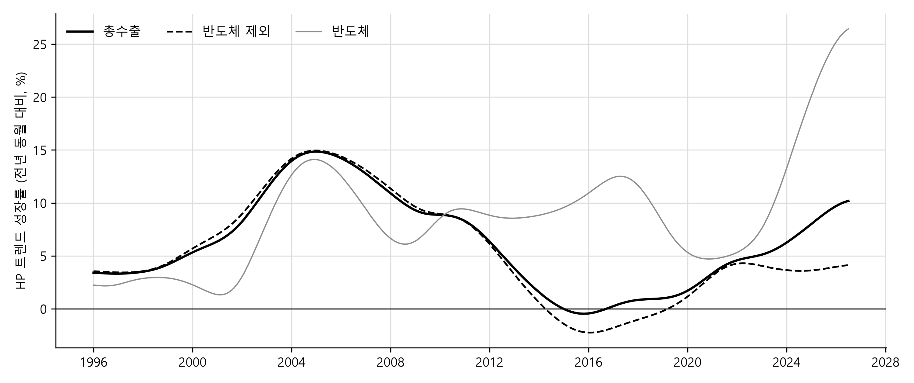
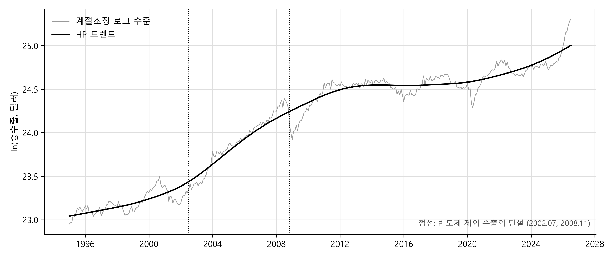
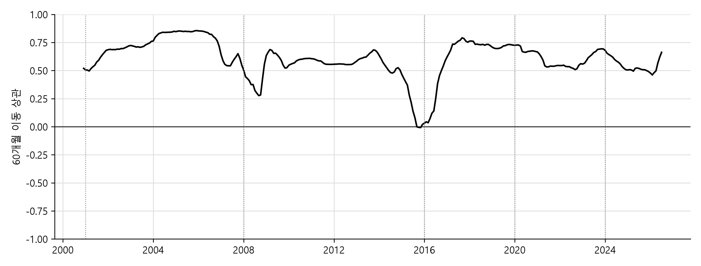

# 한국 수출 트렌드의 변화, 1995\~2026 — 성질별 자료의 기술적 분석

작성일: 2026-09-02
자료: KCSDB2 데이터베이스 (https://pilsunchoi.github.io/KCSDB2/)

---

## 요약

한국의 월별 수출 통계는 전년 동월 대비 증가율로 공표된다. 그 수치는 이번 달이 지난해보다 얼마나 늘었는지를 말하지만, 그 증가가 지난 몇 해의 흐름 위에 있는지 흐름에서 벗어난 것인지, 그리고 총수출 한 숫자가 그 안의 산업들을 얼마나 대표하는지는 말하지 않는다. 본 연구는 관세청의 "성질별" 수출입실적 1995년 1월부터 2026년 7월까지 31년의 월 자료로 수출 트렌드 자체를 잰다. 수출 코드 153개를 품목군 15개와 나머지로 묶고, 한국은행·통계청이 공식 통계에 쓰는 X-13ARIMA-SEATS로 달력조정과 계절조정을 한 뒤 HP(Hodrick-Prescott) 필터로 트렌드를 추정하며, 12개월 차분 계열에 다중 단절(structural break) 검정을 적용해 국면을 나누고 구성·단가와 물량·변동성을 국면마다 잰다. 본 연구는 인과를 묻지 않는 기술적 분석으로서 트렌드가 언제 바뀌었는가, 그 변화를 어느 품목군이 만들었는가, 그 변화는 가격에서 왔는가 물량에서 왔는가를 분석한다. 이렇게 밝혀진 사실은 수출과 산업생산의 관계를 설명하거나 트렌드의 변화를 실시간으로 포착하려는 후속 연구의 출발점이 된다.

결과는 세 가지로 요약된다. 첫째, 총수출의 트렌드 성장률은 2000년대 중반 15% 안팎에서 2015년 무렵 0%까지 10년에 걸쳐 완만하게 내려왔고, 그 움직임은 계단이 아니라 굴곡이어서 총수출에는 통계적으로 단절이 없다. 단절은 품목군에서 나타난다. 반도체를 뺀 수출은 2002년 여름에 높은 성장 국면으로 올라섰다가 2008년 가을에 연 2% 남짓의 낮은 성장 국면으로 내려왔고 그 국면이 18년 가까이 이어지고 있다. 총수출 증가율이 반도체 외 산업의 정체를 가려 온 것은 최근의 일이 아니라 2008년 이후 줄곧 성립해 온 상태다. 둘째, 반도체로의 집중은 오래된 추세가 아니라 최근 3년의 사건이다. 반도체 비중은 2015년까지 20년 동안 8\~15% 사이에 머물렀고 2017\~2018년의 호황 때 잠시 올랐다가 되돌아왔는데, 2024년부터 3년 만에 35%가 되었고 그 3년 동안 총수출 증가의 5분의 4가 반도체 하나에서 왔다. 2000년대 중반의 성장이 여덟 품목군에 고르게 퍼져 있었던 것과 정반대다. 셋째, 2016년 이후 한국 수출의 물량은 늘지 않았다. 명목 수출이 그 사이 크게 늘어난 것은 단위중량당 가치, 곧 가격이 오른 결과이며 최근 3년의 증가는 거의 전부 반도체 단가다. 총수출의 월별 변동 가운데 반도체가 설명하는 몫도 마지막 국면에서 3분의 2에 이른다. 세 결과가 가리키는 것은 하나다. 총수출 증가율은 반도체 제외 증가율과 나란히 읽어야 하며, 최근의 높은 증가율은 폭이 좁은 가격 상승이지 산업 전반의 물량 회복이 아니다.

---

## I. 서론

### 1. 문제

한국의 수출 통계는 관세청이 매달 1일 공표하고 10대 품목 잠정치는 열흘마다 나온다. 공표는 전년 동월 대비 증가율을 맨 앞에 두고 그 아래 품목과 국가의 증가율을 나열한다. 이 형식은 이번 달이 지난해 같은 달보다 얼마나 늘었는가를 말하지만, 그 증가가 지난 몇 해의 트렌드 위에 있는지 트렌드에서 벗어난 것인지는 말하지 않는다. 2025년 총수출은 전년보다 3.8% 늘었고 2026년 상반기 증가율은 60%를 넘는다. 이 두 수치가 같은 트렌드의 두 지점인지, 아니면 트렌드가 바뀐 것인지를 판단하려면 증가율이 아니라 트렌드 자체를 재야 한다. 본 연구는 그 일을 31년 월 자료에서 한다.

트렌드를 재는 데 필요한 것은 긴 계열과 안정된 분류다. HS(Harmonized System) 10단위 품목 자료는 2007년부터이고 그 사이 다섯 번의 개정을 거쳐 코드가 바뀌었다. 관세청 성질별 수출입실적은 1995년부터이고 코드 체계가 31년 동안 거의 변하지 않았다. 연도별 활성 수출 코드가 148\~152개다. 여기에 중량이 전 기간 빠짐없이 있어 코드마다 단위중량당 가치를 낼 수 있고, 관세청의 10대 품목 10일 단위 잠정치가 이 분류로 정의되어 월 계열에서 세운 모형을 10일 계열에 그대로 적용할 수 있다. 본 연구는 성질별 자료를 기본 자료로 쓴다.

### 2. 본 연구의 자리

본 연구는 기술적 분석이다. 인과를 묻지 않고 트렌드가 언제 바뀌었는지, 구성이 어떻게 옮겨갔는지, 그 변화가 단가에서 왔는지 물량에서 왔는지를 잰다. 대상은 수출이며 수입은 총수입과 대분류 3개를 비교 계열로만 둔다. 방법을 기술에 한정한 이유는 본 연구가 답하려는 것이 설명이 아니라 사실의 확정이기 때문이다. 총수출 트렌드가 언제 꺾였는지, 반도체 집중이 언제 시작됐는지, 최근 성장이 가격인지 물량인지는 해석 이전에 자료가 정하는 문제이고, 그 답이 확정되어야 그 뒤의 설명과 예측이 설 자리를 갖는다.

관세청의 월별 공표와 10일 단위 잠정치는 이번 달을 묻고, HS 10단위 자료로 하는 품목 분석은 개별 품목을 묻는다. 본 연구는 기간이 31년으로 길고 품목 구분이 성질별 코드 150여 개로 굵으며, 묻는 것이 이번 달도 개별 품목도 아닌 트렌드 자체다. 2025년에 총수출은 늘었는데 반도체를 뺀 수출은 줄었다는 관찰이 있었다. 본 연구는 그 관찰이 2025년 한 해의 일인지 31년 가운데 어느 시기부터 성립해 온 상태인지를 답한다.

### 3. 트렌드의 어떤 측면을 재는가

트렌드라는 말은 한 가지가 아니다. 계열의 수준이 어느 속도로 움직이는가(성장률), 그 속도가 언제 바뀌는가(전환), 무엇이 그 움직임을 만드는가(구성), 그 움직임이 가격에서 오는가 물량에서 오는가, 그리고 그 움직임이 얼마나 흔들리며 다른 계열과 얼마나 같이 가는가(변동성과 동조성, comovement)가 모두 트렌드의 측면이다. 이 밖에도 목적지의 구성, 새 품목의 진입과 옛 품목의 퇴출, 실질 기준의 성장, 계절 패턴의 변화가 있다. 본 연구는 앞의 5개를 재고 뒤의 4개는 재지 않거나 전처리의 부산물로만 다룬다. 5개를 고른 기준은 총수출 한 계열의 트렌드가 무엇을 말해 주고 무엇을 감추는가를 가리는 데 각각이 필요하다는 것이다.

성장률과 전환을 먼저 재는 이유는 다른 넷이 그것에 기대기 때문이다. 이번 달을 평년과 견줄 때 그 평년이 어느 기간인지, 트렌드가 바뀌었다고 말할 때 무엇과 견주어 바뀌었다는 것인지는 트렌드 성장률의 수준과 그것이 바뀐 시점이 있어야 정해진다. 그래서 III장이 트렌드 성장률을 세 가지 방법으로 재고 단절 검정으로 국면을 나누며, IV장부터 VI장까지의 계산은 모두 그 국면 단위로 한다. 단절 검정이 집중도 계산보다 앞에 오는 순서는 이 의존 관계에서 나온다.

구성과 집중을 재는 이유는 총수출 하나의 트렌드가 얼마나 많은 정보를 갖는가가 그것이 몇 개 품목군에 얼마나 의존하는가에 달려 있기 때문이다. 반도체 비중이 35%이면 총수출의 트렌드는 반도체 트렌드와 반도체 제외 트렌드의 가중 평균이고, 두 트렌드가 다르면 총수출 하나로는 어느 쪽도 읽을 수 없다. IV장의 비중·집중도·기여도는 이 의존이 언제부터 얼마나 커졌는지를 31년 위에 놓는다.

단가와 물량을 가르는 이유는 수출이 명목 달러이기 때문이다. 명목 트렌드의 상승은 물건이 더 나간 것일 수도, 같은 물건의 값이 오른 것일 수도 있고, 둘은 생산과 고용에 대해 다른 것을 뜻한다. 산업생산처럼 물량으로 재는 지표와 견주려면 가격 요인을 걷어내야 하며, 수출물가지수로 실질화하는 것이 정석이지만 본 연구는 그 자료를 쓰지 않고 성질별 자료가 전 기간 갖고 있는 중량으로 단가와 물량을 갈라 그 대용으로 둔다. 변동성과 동조성을 재는 이유는 총수출 한 계열의 움직임이 얼마나 대표적인가를 가리기 위해서다. 총수출 변동의 몇 할이 한 품목군에서 오는지, 품목군들이 같이 움직이는지에 따라 총수출 한 숫자가 수출 전반에 대해 말해 주는 것이 달라진다.

재지 않는 4개는 자료와 순서의 문제다. 목적지의 구성은 성질별 자료에 국가가 없어 재지 못하며, 국가가 있는 신성질별 자료는 2005년부터라 뒤로 미룬다. 새 품목의 진입과 퇴출은 성질별 코드가 31년 동안 거의 바뀌지 않아 이 자료로는 잴 수 없고, HS 10단위 자료가 필요하다. 실질 기준의 성장은 수출물가지수가 필요해 본 연구의 범위 밖이다. 계절 패턴의 변화는 II.3절이 X-11 계절 요인에서 관찰하지만(총수출의 계절 진폭이 31년 동안 23.5%에서 14.3%로 줄었다) 분석 대상으로 삼지는 않는다.

### 4. 질문 세 가지와 답

첫째 질문은 주요 품목의 트렌드 성장률이 언제 바뀌었는가다. 답은 총수출 수준에서는 통계적 단절이 없고 품목군 수준에서 있다는 것이다. 반도체를 뺀 수출은 2002년 7월과 2008년 11월에 평균이 이동했고 그 뒤 연 2.2% 국면이 지금까지 이어진다. 둘째 질문은 구성이 어떻게 옮겨갔는가다. 경공업품에서 중화학공업품으로의 이동은 30년에 걸친 트렌드이지만, 반도체로의 집중은 2023년까지 없다가 3년 만에 일어난 사건이다. 셋째 질문은 그 변화가 단가인가 물량인가다. 2016년 이후 총수출 물량은 정체이고 2024년 이후의 성장은 단가다. 세 답은 III장부터 VI장까지 차례로 근거를 둔다.

---

## II. 자료와 방법

### 1. 성질별 자료

자료는 관세청 성질별 수출입실적(공공데이터포털 15102109)이며, 본 연구가 쓰는 데이터베이스 KCSDB2(https://pilsunchoi.github.io/KCSDB2/)에 적재된 것이다. 기간은 1995년 1월부터 2026년 7월까지 379개월이다. 성질별 분류의 최하위 항목을 관세청 별표는 성질부호라 부르지만 본 연구는 HS 분류의 단위와 같이 코드라 부르고, 둘을 가를 자리에서는 성질별 코드와 HS 코드라 적는다. 성질별 코드는 수출 153개와 수입 181개이며 수출과 수입은 분류 나무가 다르다. 값은 달러 금액과 킬로그램 중량이고 수출은 FOB(free on board) 가격이다. 1996년 수입은 원천 자료가 코드 101\~103개만 담고 있어 총액이 앞뒤 해의 3분의 2다. 응답 창을 바꿔 다시 받아도 같으므로 원천의 결함으로 판정했고, 수입 계열은 1997년 1월부터 쓴다. 수출에는 이 결함이 없다. 본 연구는 수출을 다루고 수입은 총수입과 대분류 3개를 비교 계열로만 둔다.

성질별 총액은 같은 데이터베이스의 품목별 국가별 월 자료보다 크다. 그 자료는 국가별로 받아 적재해서 국적 미상 몫이 빠져 있고 성질별은 그것을 포함하기 때문이다. 본 연구의 총수출은 성질별 기준이며, 2025년 연간 7,093.0억 달러, 2026년 7월까지 12개월 합 9,090.0억 달러다.

### 2. 품목군

분석 단위는 코드가 아니라 코드를 묶은 품목군이다. 코드 단위로 늘어놓으면 반도체가 8개, 석유제품이 4개, 철강제품이 11개로 흩어지고, 품목군 15개에 드는 코드 가운데 9개는 이름에 "기타"가 들어간다. 품목군은 15개다. 10개는 관세청 10일 단위 잠정치의 10대 품목 항목(반도체, 승용차, 석유제품, 선박, 자동차부품, 무선통신기기, 컴퓨터주변기기, 정밀기기, 철강제품, 가전제품)를 그대로 쓴 것이고, 5개는 10대 품목에 들지 않으면서 금액이 큰 항목을 따로 세운 것이다. 일반기계(`43`으로 시작하는 코드 중 정밀기기와 제조장비를 뺀 것), 화공품(`41`로 시작하는 코드 중 의약품을 뺀 것), 의약품(`41401`), 반도체와 디스플레이 제조장비(`43A01`, `43A02`, `43B01`), 이차전지(`44403`)다. 의약품을 화공품에서 떼어 낸 근거는 트렌드가 다르다는 것과 산업생산과 대조할 때 대응하는 광공업생산지수 중분류가 C20과 C21로 서로 다르다는 것이다. 15개에 들지 않는 코드 96개는 "나머지"로 묶어 총수출과의 항등식을 지킨다. 코드와 품목군의 대응은 표 1에 있다.

표 1은 품목군 15개와 나머지를 2023\~2025년 누계 금액 순으로 배열한 것이다. 코드 수는 각 품목군에 속한 성질별 코드의 개수이고, 마지막 열은 그 코드다. 코드가 이어지는 품목군은 범위로 적었으며 코드별 품명은 관세청의 현행 수출 성질별 분류표에 있다.

**표 1. 품목군의 정의와 규모, 2023\~2025년 누계 (억 달러, %)**

| 품목군 | 코드 수 | 금액 | 비중 | 성질별 코드 |
|---|---|---|---|---|
| 반도체 | 8 | 4,197.0 | 20.7 | `44301`\~`44308` |
| 화공품 | 10 | 2,237.0 | 11.0 | `41101`\~`41B01` 중 `41401` 제외 |
| 승용차 | 1 | 2,051.0 | 10.1 | `45101` |
| 일반기계 | 5 | 1,533.0 | 7.6 | `43101`, `43201`, `43301`, `43401`, `43601` |
| 석유제품 | 4 | 1,491.0 | 7.4 | `21601`\~`21604` |
| 철강제품 | 11 | 1,440.0 | 7.1 | `42101`\~`42B01` |
| 선박 | 1 | 757.0 | 3.7 | `45501` |
| 자동차부품 | 1 | 642.0 | 3.2 | `45301` |
| 무선통신기기 | 1 | 538.0 | 2.7 | `44205` |
| 컴퓨터주변기기 | 1 | 390.0 | 1.9 | `44202` |
| 정밀기기 | 1 | 336.0 | 1.7 | `43501` |
| 이차전지 | 1 | 310.0 | 1.5 | `44403` |
| 제조장비 | 3 | 281.0 | 1.4 | `43A01`, `43A02`, `43B01` |
| 의약품 | 1 | 248.0 | 1.2 | `41401` |
| 가전제품 | 8 | 234.0 | 1.2 | `44101`\~`44108` |
| 나머지 | 96 | 3,567.0 | 17.6 | — |
| 총수출 | 153 | 20,252.0 | 100.0 | — |

15개가 총수출의 82.4%를 차지하고 나머지가 17.6%다. 코드 1개로 된 품목군이 8개이고, 반도체·철강제품·화공품·가전제품은 코드 8\~11개를 묶은 것이다. 반도체 제외 수출은 총수출에서 반도체를 뺀 것이며 15개와 별도로 모든 표에 함께 싣는다. 표 1의 비중은 2023\~2025년 3년 누계 기준이라 2026년 7월까지 12개월 기준(IV장)과 다르며, 반도체는 3년 누계에서 20.7%이고 최근 12개월에서 35.3%다. 나머지 96개 코드는 식료·직접소비재 13개, 석유제품을 뺀 원료·연료 7개, 경공업품 61개, 15개 품목군에 들지 않은 중화학공업품 15개이며, 그 가운데 기타 전기전자(`44Z01`), 방송기기(`44203`), 회로보호접속기(`44401`), 인쇄회로(`44404`), 기타 중화학공업품(`4Z001`) 다섯이 나머지 금액의 44.8%를 차지한다.

### 3. 달력조정과 계절조정

계열은 품목군별 월 달러 금액의 로그다. 명목 달러이므로 환율과 세계 물가가 섞여 있으며 본 연구는 이를 실질화하지 않는다. V장의 단가·물량 분해가 가격 요인을 따로 드러내며, 실질화는 수출입물가지수가 필요해 본 연구의 범위 밖이다.

달력조정과 계절조정은 X-13ARIMA-SEATS로 한다(U.S. Census Bureau, 2025). 미국 센서스국이 배포하는 이 프로그램(버전 1.1 빌드 62)은 한국은행과 통계청이 공식 통계의 계절조정에 쓰는 것이며, 달력 효과와 이상치를 ARIMA(autoregressive integrated moving average) 오차 모형 위에서 회귀로 걷어내는 regARIMA(regression with ARIMA errors) 단계와 그 잔차에서 이동하는 계절 성분을 뽑는 X-11 필터 단계로 이루어진다. 두 단계가 한 모형 안에서 추정되므로 계절성이 표본 안에서 변할 때 달력 계수가 그 변화를 잘못 흡수하는 일이 없다. 사양은 다음과 같다. 로그 변환, 사용자 정의 설명변수(user-defined regressor)로 조업일수의 로그(요일 효과 유형)와 설·추석의 세 창(이동 명절 유형), ARIMA 차수 자동 선택, 이상치(가법 이상치와 수준 이동, additive outlier와 level shift) 자동 탐지, 12개월 예측을 붙인 X-11 비대칭 필터, 계절 이동평균 자동 선택이다. 조업일수는 월요일부터 금요일까지에서 공휴일을 뺀 것이며, 공휴일 달력은 한국천문연구원 특일정보 API(application programming interface)가 2004년부터만 응답하므로 1995\~2003년은 당시 공휴일 규정과 음력 변환으로 만들었고 같은 규칙으로 만든 2004\~2006년이 API 응답과 한 날도 어긋나지 않는 것으로 검증했다. 설·추석 창은 연휴 사흘과 그 앞 20일·뒤 10일이며, 창의 길이는 같은 자료로 AIC 격자 탐색을 해서 고른 값이고, 센서스국의 권고대로 달력월 평균으로 중심화한다. 예측 구간의 설명변수는 조업일수 달력이 2027년까지 있어 같은 방식으로 만든다.

이 사양은 센서스국의 관행과 한 곳에서 다르다. 센서스국은 요일 효과를 요일별 일수 여섯 개의 설명변수로 넣고 공휴일은 따로 세는데, 본 연구는 조업일수 하나를 로그로 넣어 탄력성 하나로 잰다. 총수출에서 두 사양을 견주면 센서스국 사양의 AICc(corrected Akaike information criterion)가 16,490.9로 본 연구 사양의 16,500.9보다 10.0 낮다. 그러나 센서스국 사양의 요일 계수 여섯 가운데 유의한 것은 화요일 하나(0.009, $t = 2.3$)뿐이고, 평일 공휴일 하루의 계수 $-0.015$($t = -5.5$)는 본 연구 사양의 탄력성 0.364를 하루로 환산한 0.017과 같은 크기다. 잔차 스펙트럼의 요일 봉우리 경고는 두 사양 모두 없다. 본 연구 사양을 택한 이유는 해석이다. 탄력성 하나는 "조업일 1% 감소에 수출 0.36% 감소"로 읽히고, 관세청 10일 단위 잠정치의 조업일수 보정과 같은 자다. AICc 10.0의 차이는 설명변수 여섯 개를 더 쓴 값이며 그 계수들이 개별로는 유의하지 않으므로, 적합의 이득보다 해석의 손실이 크다고 보았다.

계절조정을 쓸지는 X-11의 품질 통계 M7(Ladiray and Quenneville, 2001)로 정한다. M7은 이동 계절성과 안정 계절성의 비율이며 1을 넘으면 계절 요인을 믿을 수 없다는 뜻이다. 표 2는 수출 계열 18개의 regARIMA 결과와 X-11 진단을 나란히 놓은 것이다. ARIMA 열은 자동 선택된 차수이고 별표는 자동 선택이 실패해 항공기 모형 (0 1 1)(0 1 1)로 되돌린 계열이다. $\beta_D$는 조업일수 탄력성, 설과 추석은 연휴 사흘 창의 계수이며 앞뒤 창의 계수는 본문에 필요한 곳에서만 적는다. 이상치는 자동 탐지된 개수다. 진폭은 X-11 계절 요인(연중 최고와 최저의 로그 차)의 표본 초기 36개월과 말기 36개월 값이다.

**표 2. X-13ARIMA-SEATS 달력조정 계수와 계절조정 진단, 수출 계열 (%)**

| 계열 | ARIMA | $\beta_D$ | $t$ | 설 | 추석 | 이상치 | M7 | 진폭 초기 | 진폭 말기 |
|---|---|---|---|---|---|---|---|---|---|
| 총수출 | (1 1 2)(0 1 1) | 0.36 | 10.5 | $-0.041$ | $-0.046$ | 2 | 0.35 | 23.5 | 14.3 |
| 반도체 제외 | (1 1 0)(0 1 1) | 0.44 | 12.5 | $-0.029$ | $-0.051$ | 3 | 0.38 | 27.5 | 12.5 |
| 반도체 | (3 1 1)(0 1 1) | 0.10 | 2.1 | $-0.020$ | $-0.011$ | 1 | 0.48 | 17.9 | 29.0 |
| 화공품 | (3 1 1)(0 1 1) | 0.46 | 12.9 | $-0.004$ | $-0.023$ | 2 | 0.50 | 15.4 | 12.7 |
| 승용차 | (1 1 1)(0 1 1) | 0.52 | 5.5 | $-0.050$ | $-0.074$ | 8 | 0.42 | 51.3 | 23.6 |
| 석유제품 | (0 1 1)(0 1 1) | 0.54 | 5.3 | 0.002 | $-0.036$ | 2 | 0.88 | 22.8 | 16.8 |
| 일반기계 | (0 1 1)(0 1 1) | 0.49 | 9.4 | $-0.010$ | $-0.053$ | 4 | 0.37 | 41.7 | 16.6 |
| 철강제품 | (0 1 1)(0 1 1) | 0.59 | 12.6 | $-0.009$ | 0.004 | 5 | 0.54 | 16.2 | 8.7 |
| 선박 | (0 1 1)(0 1 1)* | $-0.01$ | $-0.0$ | $-0.108$ | $-0.153$ | 1 | 1.08 | 152.3 | 62.5 |
| 자동차부품 | (1 1 0)(0 1 1) | 0.68 | 11.6 | $-0.017$ | $-0.016$ | 12 | 0.56 | 31.2 | 13.2 |
| 컴퓨터주변기기 | (0 1 0)(0 1 1) | 0.24 | 3.9 | $-0.031$ | $-0.030$ | 5 | 0.86 | 31.3 | 33.0 |
| 무선통신기기 | (1 1 1)(1 0 1) | 0.34 | 3.6 | $-0.017$ | $-0.079$ | 3 | 0.42 | 35.6 | 40.8 |
| 정밀기기 | (0 1 0)(0 1 1) | 0.55 | 11.1 | $-0.011$ | $-0.059$ | 3 | 0.41 | 35.0 | 21.6 |
| 이차전지 | (0 1 1)(0 1 1) | 0.41 | 8.4 | $-0.077$ | $-0.024$ | 4 | 0.51 | 16.1 | 19.2 |
| 제조장비 | (1 1 1)(0 1 1) | 0.77 | 4.2 | 0.244 | 0.049 | 11 | 0.96 | 74.9 | 39.8 |
| 의약품 | (0 1 1)(0 1 1) | 0.06 | 0.6 | $-0.016$ | $-0.138$ | 5 | 0.47 | 29.2 | 31.3 |
| 가전제품 | (0 1 0)(0 1 1) | 0.55 | 11.7 | $-0.043$ | $-0.007$ | 7 | 0.41 | 23.9 | 19.9 |
| 나머지 | (0 1 1)(0 1 1) | 0.44 | 13.7 | $-0.017$ | $-0.034$ | 4 | 0.28 | 24.0 | 15.1 |

M7이 1을 넘는 계열은 선박(1.08) 하나이며, 선박은 계절조정을 쓰지 않고 달력조정 계열의 12개월 차분만으로 다룬다. 제조장비(0.96), 석유제품(0.88), 컴퓨터주변기기(0.86)는 기준 안이지만 가깝다. 계절성 자체는 모든 계열에서 있다. D8 안정 계절성 $F$검정이 선박의 6.1을 포함해 전부 1% 수준에서 유의하고, 조정 뒤의 QS 통계량(seasonal Ljung-Box QS statistic)은 컴퓨터주변기기($p = 0.30$)를 빼고 모두 $p = 1.00$이라 계절성이 남지 않았다. 이상치는 스물세 계열에서 모두 자동으로 잡혔는데 총수출에서는 2008년 11월과 2020년 4월의 수준 이동 둘이다. 금융위기와 코로나를 자료가 스스로 찾은 것이며 본 연구는 개입 더미를 손으로 넣지 않는다. 자동차부품(12개)과 제조장비(11개)는 1990년대 후반에 이상치가 몰려 있다.

계절 진폭은 31년 동안 줄었다. 총수출은 23.5%에서 14.3%로, 승용차는 51.3%에서 23.6%로, 일반기계는 41.7%에서 16.6%로 내려왔다. 반도체는 17.9%에서 29.0%로 오히려 커졌고 컴퓨터주변기기·무선통신기기·이차전지·의약품도 커졌다. 이동하는 계절성을 다루는 것이 X-11 필터의 본령이며, 고정 계절 요인을 쓰는 회귀 기반 조정은 이 이동을 담지 못한다. 조업일수 탄력성은 총수출 0.36, 승용차 0.52, 제조장비 0.77, 자동차부품 0.68이고 반도체는 0.10($t = 2.1$)으로 작지만 유의하며 의약품 0.06과 선박 $-0.01$은 유의하지 않다. 10일 단위 잠정치로 잰 값(총수출 0.60, 반도체 0.24)보다 낮은데, 월 단위는 조업일수의 변동 폭이 작아 식별이 약하기 때문이다.

### 4. 트렌드 분해

계절조정 계열에 두 가지 방법을 적용해 트렌드 $T_t$를 얻고 트렌드 성장률을 $\Delta_{12}\ln T_t$로 통일한다. 본방법은 HP 필터(Hodrick and Prescott, 1997)이며 월 자료 관행값 $\lambda = 129{,}600$(Ravn and Uhlig, 2002)을 쓴다. 강건성으로 비관측성분모형(unobserved components model, UCM; Harvey, 1989)을 둔다. UCM은 평활 트렌드(수준 잡음을 0으로 묶고 기울기만 확률적으로 두는 사양)와 확률적 감쇠 순환(주기 1.5\~10년)과 불규칙 항으로 상태공간 최대우도 추정을 하고 평활 추정치를 쓴다.

UCM을 본방법으로 두지 않은 이유는 우도면에 봉우리가 여럿이기 때문이다. 세 가지 최적화 경로로 추정해 우도가 가장 큰 해를 골랐는데, 총수출과 반도체 제외에서는 세 경로가 같은 해에 이르러 순환 주기 45개월과 HP와의 상관 0.98\~0.99를 주지만, 반도체에서는 우도가 가장 큰 해가 순환이 변동을 거의 다 가져가고 트렌드가 직선에 가까운 해(트렌드 성장률 표준편차 0.8%)다. 트렌드와 순환의 배분이 자료가 아니라 시작점에 달려 있는 것이며, 그 배분이 정해지지 않는 방법을 본방법으로 둘 수 없다. 표 3은 4개 계열에서 두 가지 방법의 트렌드 성장률을 견준 것이다. UCM 순환 주기는 추정된 순환 성분의 주기, 상관은 UCM과 HP의 트렌드 성장률 상관, 표준편차는 트렌드 성장률과 계절조정 계열 12개월 차분의 표준편차, 부호 전환은 트렌드 성장률이 0을 가로지른 횟수다.

**표 3. 트렌드 분해 두 가지 방법의 비교**

| 계열 | UCM 순환 주기(월) | 상관(UCM, HP) | sd HP(%) | sd UCM(%) | sd 계절조정 계열(%) | 부호 전환 HP | 부호 전환 UCM |
|---|---|---|---|---|---|---|---|
| 총수출 | 44.7 | 0.98 | 4.4 | 4.7 | 14.8 | 2 | 2 |
| 반도체 제외 | 45.0 | 0.99 | 4.9 | 5.1 | 13.5 | 2 | 2 |
| 반도체 | 50.1 | 0.58 | 5.2 | 0.8 | 31.4 | 0 | 0 |
| 총수입 | 42.4 | 0.93 | 5.0 | 5.0 | 19.9 | 2 | 2 |

HP와 UCM은 총수출·반도체 제외·총수입에서 상관 0.93\~0.99로 같은 트렌드를 그리고, 트렌드 성장률의 표준편차도 4.4\~5.1%로 계절조정 계열 12개월 차분의 3분의 1 아래에서 같은 크기다. 반도체에서 HP와 UCM이 갈리는 것은 위에서 말한 UCM의 성질이며, HP 트렌드 성장률은 반도체에서도 표준편차 5.2%로 다른 계열과 같은 크기다. 총수출의 UCM 순환 주기 44.7개월은 HP를 본방법으로 두더라도 이 계열의 순환이 4년 남짓이라는 관찰로 남는다.

### 5. 구조변화 검정

검정의 대상은 계열별 $\Delta_{12}\ln y_t$(계절조정 뒤, 선박은 달력조정 계열)이고 모형은 평균 이동이다. Bai and Perron(1998, 2003)의 다중 단절 검정(multiple structural break test)을 따라 동적 계획법(dynamic programming)으로 단절 수 $m = 0, \ldots, 5$마다 잔차제곱합을 최소화하는 분할을 찾고 최소 구간은 24개월로 둔다. 단절 수는 LWZ 기준(Liu, Wu and Zidek, 1997)으로 고른다. BIC(Bayesian information criterion)도 함께 계산했으나 $\Delta_{12}$ 계열은 12개월이 겹쳐 자기상관이 강하고 BIC는 23개 계열 가운데 13개에서 상한인 5개를 골라 정보가 없었다. 단절 1개의 검정은 Andrews의 sup-$F$(supremum $F$) 검정(절사 15%, HAC(heteroskedasticity and autocorrelation consistent) 표준오차 12)이며 임계값은 Andrews(1993) $p = 1$의 7.17(10%), 8.85(5%), 12.35(1%)를 쓴다. 자료 끝에서 24개월 안에 생긴 단절은 최소 구간 조건 때문에 잡히지 않는다.

### 6. 국면

IV장부터 VI장까지의 국면 구분은 검정 결과에 따라 정했다. 총수출에 단절이 없으므로 사전 후보 일곱(1997·2001·2008·2011·2016·2020·2023\~2024) 가운데 5개를 경계로 남겼다. 2001년과 2008년은 반도체 제외의 단절 2개(2002년 7월, 2008년 11월)에 대응하고, 2016년은 총수출 트렌드 성장률의 저점, 2020년은 코로나, 2024년은 반도체의 단절이다. 국면은 1995\~2000년, 2001\~2007년, 2008\~2015년, 2016\~2019년, 2020\~2023년, 2024년\~2026년 7월 6개다. 연 단위 계산의 마지막 끝점은 2025년 8월부터 2026년 7월까지 12개월 합이며, 2023년 한 해와 그 끝점 사이의 햇수는 두 창의 간격인 2.58년으로 센다. 표기는 다음을 따른다. 금액은 억 달러 소수 1자리, 비중과 증가율은 % 소수 1자리, 기여도는 %p 소수 2자리이며, 반올림은 원자료에서 한 번만 하고 표에서 그대로 더해 다른 값이 나와도 주석을 달지 않는다. 시점은 2008년 11월처럼 적고 표 안에서는 2008.11로 줄인다. 본문이 인용한 수치는 재현 노트북의 검증 절이 계산 결과와 대조한다.

---

## III. 트렌드와 국면

### 1. 트렌드 성장률

그림 1은 총수출·반도체 제외·반도체의 HP 트렌드 성장률을 1996년 1월부터 2026년 7월까지 월별로 그린 것이다. 트렌드 성장률은 HP 트렌드의 12개월 로그 차분이며 표본 끝의 값은 필터 끝점의 값이라 자료가 더해지면 개정된다.

**그림 1. HP 트렌드 성장률, 총수출·반도체 제외·반도체 (1996.01\~2026.07, 전년 동월 대비 %)**

총수출 트렌드 성장률은 2005년 1월 14.8%로 정점에 이른 뒤 2015년 11월 $-0.5\%$까지 내려왔고, 2020년 1월 1.7%, 2026년 7월 10.2%다. 반도체 제외는 정점 14.9%(2005년 1월), 저점 $-2.3\%$(2016년 2월), 끝값 4.1%다. 두 선은 27년 동안 거의 붙어 있다가 2023년 이후 처음으로 크게 갈라진다. 반도체는 2001년 2월 1.3%가 저점이고 2026년 7월 26.4%가 정점이다. 총수출 트렌드 성장률이 15%에서 0%로 내려오는 데 10년이 걸렸고 그 사이에 계단이 없다는 것이 이 그림의 첫 관찰이다.

### 2. 구조변화 검정 결과

표 4는 수출 계열 18개의 sup-$F$ 통계량과 그 시점, LWZ가 고른 단절 수, 그리고 단절 시점(새 국면의 첫 달)이다. sup-$F$가 5% 임계값 8.85를 넘는 계열은 일반기계, 자동차부품, 무선통신기기, 의약품 4개다.

**표 4. 평균 이동 단절 검정, 계열별 (1996.01\~2026.07)**

| 계열 | sup-$F$ | sup-$F$ 시점 | 단절 수(LWZ) | 단절 시점 |
|---|---|---|---|---|
| 총수출 | 2.2 | 2012.01 | 0 | 없음 |
| 반도체 제외 | 5.8 | 2012.01 | 2 | 2002.07, 2008.11 |
| 반도체 | 2.3 | 2002.07 | 1 | 2024.01 |
| 화공품 | 6.7 | 2021.12 | 4 | 2009.11, 2011.11, 2020.09, 2022.09 |
| 승용차 | 4.5 | 2007.09 | 3 | 2007.12, 2009.12, 2012.04 |
| 석유제품 | 3.4 | 2012.03 | 0 | 없음 |
| 일반기계 | 9.1 | 2012.09 | 4 | 2002.07, 2008.01, 2010.01, 2012.01 |
| 철강제품 | 4.2 | 2012.05 | 2 | 2002.10, 2008.11 |
| 선박 | 7.0 | 2009.07 | 0 | 없음 |
| 자동차부품 | 15.1 | 2014.08 | 5 | 1998.01, 2002.07, 2007.11, 2009.11, 2011.11 |
| 컴퓨터주변기기 | 1.5 | 2000.11 | 2 | 2022.04, 2024.04 |
| 무선통신기기 | 26.3 | 2004.12 | 1 | 2004.12 |
| 정밀기기 | 8.8 | 2021.12 | 2 | 2003.09, 2006.02 |
| 이차전지 | 7.5 | 2021.09 | 2 | 1999.10, 2012.01 |
| 제조장비 | 7.2 | 2001.01 | 1 | 1998.07 |
| 의약품 | 9.0 | 2002.05 | 3 | 2020.01, 2022.06, 2024.07 |
| 가전제품 | 1.9 | 2014.08 | 3 | 2006.01, 2008.01, 2010.12 |
| 나머지 | 5.3 | 2002.07 | 3 | 2002.10, 2013.06, 2020.09 |

총수출에는 단절이 없다. sup-$F$가 2.2로 10% 임계값에도 못 미치고 LWZ는 0개를 고른다. 총수입도 같다(0개, 1.5). 트렌드 성장률이 15%에서 0%로 내려온 것은 사실이지만 최소 구간 24개월의 평균 이동 모형은 그 굴곡을 단절이라 부르지 않는다. 단절은 품목군에서 나온다. 반도체 제외와 철강제품은 2008년 11월의 하향을 함께 갖고, 상향도 2002년 7월과 10월로 석 달 사이에 있다. 일반기계도 2002년 7월과 2008년 1월에 단절을 가진다. 무선통신기기는 2004년 12월 한 번의 하향이 sup-$F$ 26.3으로 가장 뚜렷하며, 자동차부품은 단절 5개에 sup-$F$ 15.1이다. 반도체의 단절은 2024년 1월 하나뿐이고 그 앞 28년에는 없다.

### 3. 국면 평균

표 5는 LWZ 단절로 나눈 국면마다 계절조정 계열 $\Delta_{12}$의 평균과 표준편차, HP 트렌드 성장률의 평균을 적은 것이다. 단절이 있는 계열 가운데 총수출 구성에서 무게가 큰 5개를 골랐다.

**표 5. 단절로 나눈 국면의 평균 성장률 (%)**

| 계열 | 국면 | 개월 | $\Delta_{12}$ 평균 | HP 트렌드 평균 | $\Delta_{12}$ 표준편차 |
|---|---|---|---|---|---|
| 반도체 제외 | 1996.01\~2002.06 | 78 | 3.5 | 5.3 | 11.7 |
| 반도체 제외 | 2002.07\~2008.10 | 76 | 17.1 | 13.1 | 7.2 |
| 반도체 제외 | 2008.11\~2026.07 | 213 | 2.2 | 2.9 | 13.6 |
| 반도체 | 1996.01\~2023.12 | 336 | 6.2 | 7.5 | 29.6 |
| 반도체 | 2024.01\~2026.07 | 31 | 42.8 | 21.0 | 31.3 |
| 철강제품 | 1996.01\~2002.09 | 81 | $-0.0$ | 3.6 | 16.5 |
| 철강제품 | 2002.10\~2008.10 | 73 | 22.2 | 16.5 | 10.3 |
| 철강제품 | 2008.11\~2026.07 | 213 | 1.3 | 2.3 | 17.8 |
| 일반기계 | 2002.07\~2007.12 | 66 | 21.4 | 17.6 | 8.5 |
| 일반기계 | 2012.01\~2026.07 | 175 | 0.6 | 1.6 | 9.3 |
| 무선통신기기 | 1996.01\~2004.11 | 107 | 35.4 | 36.3 | 24.4 |
| 무선통신기기 | 2004.12\~2026.07 | 260 | $-0.9$ | $-0.7$ | 27.4 |

반도체를 뺀 수출은 2008년 11월부터 213개월 동안 연평균 2.2%로 늘었다. 그 앞 국면(2002년 7월\~2008년 10월)의 17.1%와 견주면 8분의 1이다. 철강제품은 같은 시점에 22.2%에서 1.3%로, 일반기계는 2012년 1월부터 0.6%로 내려왔고 무선통신기기는 2004년 12월부터 260개월 평균이 $-0.9\%$다. 총수출 증가율이 반도체 외 산업의 정체를 가리는 것은 2025년 한 해의 일이 아니라 2008년 11월 이후 18년 동안 성립해 온 상태다. 반도체는 336개월 평균 6.2%로 반도체 제외 셋째 국면의 세 배였고, 2024년 1월부터 31개월 평균은 42.8%다.

그림 3은 총수출의 계절조정 로그 수준과 HP 트렌드를 겹친 것이다. 총수출에는 단절이 없으므로 반도체 제외의 단절 2개를 점선으로 표시했다.

**그림 3. 총수출의 계절조정 로그 수준과 HP 트렌드 (1995.01\~2026.07). 점선은 반도체 제외 수출의 단절(2002.07, 2008.11)**

트렌드는 2002년부터 2008년까지 가장 가파르고 2012년부터 2016년까지 평평하며 2024년부터 다시 가팔라진다. 2009년 초와 2020년 봄의 골은 수준 계열에만 있고 트렌드에는 없다. HP 필터가 몇 달짜리 골을 트렌드로 읽지 않는다는 뜻이다. 반면 2024년 이후의 상승은 트렌드에 들어와 있는데, 이것이 진행 중인 급등의 끝점 효과인지 트렌드의 전환인지는 이 자료로 가를 수 없다(VII장).

---

## IV. 구성의 이동

### 1. 대분류와 집중도

표 6은 수출 대분류 4개의 비중과 코드 153개의 집중도를 국면 경계 연도에서 적은 것이다. 허핀달 지수(Herfindahl index)는 코드별 수출 비중의 제곱합에 10,000을 곱한 집중도 지표다. 한 코드가 수출 전부를 차지하면 10,000이고 153개 코드가 같은 비중이면 65이며, 비중이 큰 코드 몇 개가 값을 거의 결정하므로 상위 코드로의 쏠림을 잰다. 상위 3은 금액 상위 3개 코드의 비중이다. 2026년 행은 2026년 7월까지 12개월 합이다.

**표 6. 대분류 비중과 집중도, 국면 경계 연도 (%)**

| 연도 | 식료·직접소비재 | 원료·연료 | 경공업품 | 중화학공업품 | 반도체 | 허핀달 | 상위 3 |
|---|---|---|---|---|---|---|---|
| 1995 | 2.4 | 3.7 | 24.3 | 69.6 | 14.1 | 343 | 23.1 |
| 2000 | 1.6 | 6.7 | 17.6 | 74.1 | 15.1 | 406 | 27.4 |
| 2007 | 1.0 | 7.9 | 7.4 | 83.7 | 10.5 | 396 | 24.4 |
| 2015 | 1.3 | 7.5 | 6.7 | 84.5 | 12.0 | 368 | 22.8 |
| 2019 | 1.5 | 9.0 | 6.3 | 83.2 | 17.8 | 420 | 27.2 |
| 2023 | 1.7 | 9.9 | 5.3 | 83.1 | 15.9 | 422 | 26.6 |
| 2024 | 1.7 | 8.9 | 5.0 | 84.4 | 21.0 | 478 | 29.8 |
| 2025 | 1.7 | 7.9 | 5.0 | 85.4 | 24.7 | 563 | 32.6 |
| 2026.07 | 1.4 | 7.4 | 4.5 | 86.7 | 35.3 | 1,027 | 41.0 |

경공업품에서 중화학공업품으로의 이동은 31년에 걸친 트렌드다. 경공업품은 1995년 24.3%에서 2007년 7.4%로 내려온 뒤 완만하게 4.5%까지 줄었고, 중화학공업품은 69.6%에서 86.7%가 되었다. 반면 집중은 트렌드가 아니다. 허핀달 지수를 읽는 데는 10,000을 지수로 나눈 값이 편리하다. 그 값은 수출이 같은 비중의 코드 몇 개에 나뉘어 있는 것과 같은 집중도인지를 뜻한다. 1995년의 343은 같은 비중의 코드 29개에 해당하고, 2016년까지 22년 동안 지수는 329와 406 사이, 곧 25\~30개 코드에 해당하는 범위에서 움직였으며 반도체 비중도 1995년 14.1%에서 2015년 12.0%로 20년 동안 제자리였다. 한 번의 선례가 있다. 2017\~2018년 반도체 호황에 반도체 비중이 21.4%, 허핀달 지수가 491(코드 20개에 해당)까지 올랐다가 2019년 17.8%와 420으로 되돌아왔고 2023년까지 410\~427에 머물렀다. 2024년부터는 3년 만에 지수가 478, 563, 1,027로 올라 2026년 7월 기준으로는 같은 비중의 코드 10개에 해당하는 집중도가 되었고, 반도체 비중이 35.3%, 상위 3개 코드가 41.0%가 되었다. 30년 가까이 25\~30개 코드에 해당하던 분산이 3년 만에 10개 수준으로 줄어든 것이다. 수출 집중은 31년의 축적이 아니라 2024년 이후의 사건이며, 2018년의 선례가 되돌아왔다는 것이 이번에도 되돌아온다는 근거는 되지 않는다.

### 2. 품목군 비중

표 7은 품목군 15개와 나머지의 비중을 같은 연도에서 적은 것이다. 열은 국면 경계 연도이고 마지막 열은 2026년 7월까지 12개월 합이다.

**표 7. 품목군 비중, 국면 경계 연도 (%)**

| 품목군 | 1995 | 2000 | 2007 | 2015 | 2019 | 2023 | 2026.07 |
|---|---|---|---|---|---|---|---|
| 반도체 | 14.1 | 15.1 | 10.5 | 12.0 | 17.8 | 15.9 | 35.3 |
| 화공품 | 7.0 | 7.7 | 9.7 | 10.2 | 11.6 | 12.6 | 8.0 |
| 승용차 | 5.2 | 6.4 | 9.3 | 7.9 | 7.5 | 10.8 | 7.5 |
| 석유제품 | 1.9 | 5.4 | 6.5 | 6.1 | 7.6 | 8.3 | 6.1 |
| 일반기계 | 5.6 | 5.0 | 7.3 | 8.3 | 8.8 | 8.4 | 5.3 |
| 철강제품 | 8.0 | 6.6 | 8.5 | 7.9 | 8.1 | 7.9 | 5.3 |
| 선박 | 4.4 | 4.8 | 7.2 | 7.4 | 3.6 | 3.3 | 3.7 |
| 자동차부품 | 0.7 | 1.2 | 3.3 | 4.9 | 4.0 | 3.5 | 2.1 |
| 컴퓨터주변기기 | 3.6 | 6.9 | 3.6 | 1.3 | 1.6 | 1.4 | 3.8 |
| 무선통신기기 | 0.8 | 4.1 | 7.9 | 2.8 | 4.0 | 3.0 | 2.2 |
| 정밀기기 | 0.6 | 0.9 | 1.9 | 1.6 | 2.1 | 1.8 | 1.2 |
| 이차전지 | 0.5 | 0.6 | 0.7 | 1.1 | 1.7 | 1.9 | 1.1 |
| 제조장비 | 0.0 | 0.2 | 0.5 | 1.0 | 1.6 | 1.3 | 1.3 |
| 의약품 | 0.2 | 0.2 | 0.2 | 0.4 | 0.8 | 1.1 | 1.2 |
| 가전제품 | 6.5 | 5.1 | 1.5 | 2.1 | 1.6 | 1.3 | 0.8 |
| 나머지 | 40.8 | 29.8 | 21.2 | 25.0 | 17.7 | 17.6 | 15.3 |

세 종류의 움직임이 보인다. 첫째, 나머지의 비중이 40.8%에서 15.3%로 줄었다. 15개 품목군에 들지 않는 코드 96개의 몫이 31년 동안 절반 이하가 된 것으로, 대분류에서 본 경공업품 비중의 하락이 여기에 담겨 있다. 둘째, 정점을 지난 품목군이 있다. 무선통신기기는 2007년 7.9%가 정점이고 그 뒤 2\~4%이며, 선박은 2015년 7.4%에서 3%대로, 가전제품은 1995년 6.5%에서 0.8%로, 컴퓨터주변기기는 2000년 6.9%에서 1%대로 내려왔다가 2026년 3.8%로 되올랐다. 셋째, 2026년 열에서 반도체를 뺀 거의 모든 품목군의 비중이 2023년보다 낮다. 화공품 12.6%에서 8.0%, 승용차 10.8%에서 7.5%, 일반기계 8.4%에서 5.3%, 철강 7.9%에서 5.3%다. 이것은 그들의 금액이 줄어서가 아니라 분모가 반도체로 부풀어서다. V장의 단가·물량 분해가 이를 가른다.

### 3. 국면별 기여도

표 8은 국면마다 총수출 증가율을 품목군별 기여도로 나눈 것이다. 기여도는 직전 국면의 마지막 해에서 이 국면의 마지막 해까지 품목군 금액의 변화를 시작 시점 총수출로 나눈 것을 햇수로 나눈 연평균 %p이며, 16개 기여도의 합에 햇수를 곱하면 총수출 증가율이 된다. 첫 국면은 1995년에서 2000년까지, 마지막 국면은 2023년에서 2026년 7월까지 12개월 합까지다.

**표 8. 국면별 총수출 증가율의 품목군 기여도 (연평균 %p)**

| | 1995\~2000 | 2001\~2007 | 2008\~2015 | 2016\~2019 | 2020\~2023 | 2024\~2026.07 |
|---|---|---|---|---|---|---|
| 총수출 증가율(기간 전체, %) | 37.8 | 115.6 | 41.8 | 2.9 | 16.6 | 43.8 |
| 총수출 연평균(%) | 6.6 | 11.6 | 4.5 | 0.7 | 3.9 | 15.1 |
| 반도체 | 1.34 | 1.08 | 0.82 | 1.58 | 0.19 | 13.47 |
| 화공품 | 0.72 | 1.89 | 0.59 | 0.45 | 0.77 | $-0.45$ |
| 승용차 | 0.73 | 1.94 | 0.24 | $-0.06$ | 1.28 | $-0.01$ |
| 석유제품 | 1.10 | 1.23 | 0.27 | 0.42 | 0.51 | 0.19 |
| 일반기계 | 0.26 | 1.55 | 0.55 | 0.19 | 0.26 | $-0.34$ |
| 철강제품 | 0.22 | 1.68 | 0.33 | 0.13 | 0.26 | $-0.12$ |
| 선박 | 0.43 | 1.54 | 0.40 | $-0.91$ | 0.06 | 0.81 |
| 자동차부품 | 0.19 | 0.86 | 0.44 | $-0.18$ | 0.03 | $-0.17$ |
| 컴퓨터주변기기 | 1.17 | 0.14 | $-0.22$ | 0.07 | 0.01 | 1.60 |
| 무선통신기기 | 0.96 | 1.84 | $-0.48$ | 0.32 | $-0.12$ | 0.04 |
| 정밀기기 | 0.13 | 0.45 | 0.04 | 0.14 | 0.01 | $-0.02$ |
| 이차전지 | 0.06 | 0.15 | 0.10 | 0.15 | 0.13 | $-0.11$ |
| 제조장비 | 0.07 | 0.12 | 0.12 | 0.16 | $-0.04$ | 0.21 |
| 의약품 | 0.01 | 0.04 | 0.05 | 0.09 | 0.11 | 0.23 |
| 가전제품 | 0.11 | $-0.26$ | 0.18 | $-0.10$ | $-0.03$ | $-0.07$ |
| 나머지 | 0.06 | 2.28 | 1.78 | $-1.71$ | 0.72 | 1.69 |

성장의 폭이 국면마다 다르다. 2001\~2007년의 연 11.6%는 나머지 2.28, 승용차 1.94, 화공품 1.89, 무선통신기기 1.84, 철강 1.68, 일반기계 1.55, 선박 1.54, 반도체 1.08로 8개 품목군이 각각 1%p 넘게 기여했다. 2024년 이후의 연 15.1%는 기여도 합 16.95%p 가운데 반도체가 13.47로 79.5%를 차지하고, 화공품·일반기계·자동차부품·철강은 마이너스다. 기여도 합이 연평균 성장률과 다른 것은 기여도가 단리, 연평균이 복리이기 때문이다. 국면 2개의 연평균 성장률이 11.6%와 15.1%로 둘 다 두 자리인데 그 구성이 정반대라는 것이 표 8의 관찰이다. 2016\~2019년의 연 0.7%는 반도체 $+1.58$과 나머지 $-1.71$·선박 $-0.91$이 상쇄한 결과이고, 2020\~2023년은 승용차 1.28이 가장 컸다.

---

## V. 단가와 물량

성질별 자료는 중량이 전 기간 빠짐없이 있어 코드마다 단가 $p_{it} = V_{it}/W_{it}$를 낼 수 있고 $\Delta\ln V = \Delta\ln p + \Delta\ln W$가 항등식으로 성립한다. 품목군은 코드별 $\Delta\ln p$를 끝점 2개의 평균 금액 비중으로 가중한 Törnqvist(1936) 단가 변화로 합산하고 물량 변화는 $\Delta\ln V - \Delta\ln P$로 둔다. 끝점은 IV장과 같고 끝점 2개 중 한쪽에서 중량이 0인 코드는 가중에서 뺀다. 이 단가는 시장 가격이 아니라 단위중량당 가치다. 메모리 반도체 코드 하나에 1995년의 16메가 D램과 2026년의 고대역폭 메모리가 같이 들어 있으므로 제품 구성이 바뀌면 같은 시장 가격에서도 단가가 움직인다. 표 9는 국면마다 총수출·반도체 제외·품목군의 명목 증가율을 단가와 물량으로 가른 연평균 로그 변화다.

**표 9. 국면별 단가와 물량의 연평균 로그 변화 (%)**

<!-- Word 변환 지침 (표 9):
- 헤더 2행 구조. 마크다운의 13열 헤더("계열", "1995\~2000 P", "Q", "2001\~2007 P", "Q", …)를 두 층으로 나눈다.
  · 1행: [계열 (1\~2행 rowspan=2 병합)] [1995\~2000 (2\~3열 colspan=2)] [2001\~2007 (4\~5열 colspan=2)] [2008\~2015 (6\~7열 colspan=2)] [2016\~2019 (8\~9열 colspan=2)] [2020\~2023 (10\~11열 colspan=2)] [2024\~2026.07 (12\~13열 colspan=2)]
  · 2행: [ (계열 셀과 rowspan=2 병합) ] [P][Q] [P][Q] [P][Q] [P][Q] [P][Q] [P][Q]
- 마크다운의 "1995\~2000 P"는 1행의 "1995\~2000"과 2행의 "P"로 나눠 넣고, 그 오른쪽 "Q"는 2행에 둔다. 나머지 국면도 같다.
- P는 단가(ΔlnP), Q는 물량(ΔlnQ)이며 2행 아래 표 주석으로 그 뜻을 한 줄 단다.
- 병합 셀은 세로·가로 가운데 정렬. 숫자 열은 우측 정렬, 소수 자릿수 현행 유지(1자리).
-->

| 계열 | 1995\~2000 P | Q | 2001\~2007 P | Q | 2008\~2015 P | Q | 2016\~2019 P | Q | 2020\~2023 P | Q | 2024\~2026.07 P | Q |
|---|---|---|---|---|---|---|---|---|---|---|---|---|
| 총수출 | $-2.5$ | 8.9 | 5.7 | 5.3 | 3.3 | 1.1 | 1.0 | $-0.2$ | 4.3 | $-0.4$ | 13.5 | 0.6 |
| 반도체 제외 | $-1.9$ | 8.0 | 6.0 | 5.7 | 2.3 | 1.9 | $-0.3$ | $-0.7$ | 5.6 | $-1.2$ | 3.6 | 0.3 |
| 반도체 | $-6.3$ | 14.1 | 3.2 | 2.6 | 10.9 | $-4.9$ | 8.2 | 2.4 | $-2.4$ | 3.4 | 39.8 | 5.0 |
| 화공품 | $-6.1$ | 14.4 | 7.6 | 6.8 | 0.3 | 4.6 | 0.9 | 3.2 | 6.2 | $-0.3$ | $-4.6$ | 0.8 |
| 승용차 | $-3.5$ | 14.1 | 4.2 | 12.0 | 2.0 | 0.3 | 1.1 | $-1.9$ | 6.6 | 6.5 | $-2.5$ | 2.4 |
| 석유제품 | 8.4 | 18.5 | 12.8 | 0.8 | $-3.0$ | 6.6 | 4.0 | 2.1 | 7.9 | $-2.0$ | 2.1 | 0.2 |
| 일반기계 | $-6.5$ | 10.7 | 4.1 | 12.3 | 3.4 | 2.4 | 1.5 | 0.7 | 3.0 | $-0.3$ | 0.4 | $-4.6$ |
| 철강제품 | $-4.3$ | 6.9 | 9.2 | 5.4 | $-2.4$ | 5.7 | 2.2 | $-0.6$ | 5.2 | $-2.2$ | $-1.3$ | $-0.3$ |
| 선박 | 24.4 | $-16.5$ | 13.7 | 3.2 | 1.8 | 2.8 | $-8.9$ | $-8.2$ | $-1.9$ | 3.5 | 13.5 | 5.5 |
| 자동차부품 | $-3.4$ | 19.8 | 5.1 | 20.3 | 1.9 | 7.1 | $-1.7$ | $-2.5$ | 2.7 | $-2.0$ | $-3.5$ | $-1.7$ |
| 컴퓨터주변기기 | 7.9 | 11.3 | 8.0 | $-6.2$ | 7.3 | $-15.5$ | 3.3 | 1.6 | 5.3 | $-4.8$ | 55.5 | $-1.6$ |
| 무선통신기기 | 16.1 | 22.5 | 9.1 | 11.2 | 1.2 | $-9.6$ | 15.2 | $-5.9$ | 14.3 | $-17.5$ | $-4.8$ | 6.1 |
| 정밀기기 | 0.6 | 13.6 | 8.1 | 13.3 | $-7.5$ | 9.5 | 6.0 | 1.5 | 10.4 | $-9.8$ | 4.6 | $-5.7$ |
| 이차전지 | 2.9 | 7.3 | 6.5 | 8.8 | 0.1 | 9.0 | 5.9 | 5.3 | 4.2 | 2.5 | $-10.7$ | 4.0 |
| 제조장비 | $-56.0$ | 158.9 | 5.3 | 16.0 | $-3.1$ | 16.6 | 1.1 | 11.0 | 4.4 | $-6.8$ | 12.8 | 1.2 |
| 의약품 | 2.0 | 3.2 | 6.9 | 5.7 | 9.2 | 3.9 | 10.3 | 4.9 | 8.4 | 3.1 | 15.2 | 2.0 |
| 가전제품 | $-4.8$ | 6.4 | 6.3 | $-12.7$ | 5.4 | 2.9 | 2.6 | $-8.1$ | 3.8 | $-5.7$ | $-4.4$ | $-1.8$ |
| 나머지 | $-6.1$ | 6.2 | 0.9 | 5.2 | 6.4 | 0.0 | $-5.6$ | $-2.4$ | 5.3 | $-1.5$ | 7.6 | 1.0 |

총수출 물량의 연평균 변화는 1995\~2000년 8.9%, 2001\~2007년 5.3%, 2008\~2015년 1.1%로 국면마다 절반씩 줄었고 2016년 이후 국면 3개는 $-0.2$, $-0.4$, $0.6\%$다. 2016년 이후 10년 동안 한국 수출의 물량은 늘지 않았다. 명목 총수출이 그 사이 5,268.0억 달러에서 9,090.0억 달러로 늘어난 것은 단가다. 2024년 이후 총수출의 연 13.5% 단가 상승은 반도체의 39.8%가 만든 것이고, 반도체 물량은 5.0%다. 반도체를 빼면 2024년 이후 단가 3.6%에 물량 0.3%다. IV.2절에서 본 반도체 외 품목군의 비중 하락은 분모 효과였다. 화공품(물량 0.8%)·승용차(2.4%)·석유제품(0.2%)의 물량은 줄지 않았고 일반기계($-4.6\%$)·정밀기기($-5.7\%$)·자동차부품($-1.7\%$)은 줄었다.

단가와 물량의 역할이 품목군마다 갈린다. 석유제품은 2001\~2007년 단가 12.8%에 물량 0.8%, 2008\~2015년 단가 $-3.0\%$에 물량 6.6%로 유가 순환이 단가 열에 그대로 있다. 승용차는 2001\~2007년 물량 12.0%, 2020\~2023년 물량 6.5%로 물량 주도다. 무선통신기기는 2008\~2015년과 2020\~2023년에 단가가 오르고 물량이 $-9.6\%$, $-17.5\%$로 줄었는데, 이는 한 코드 안에서 제품이 고급화되고 생산이 해외로 옮겨간 것이 단위중량당 가치로 나타난 것이다. 의약품은 6개 국면 내내 단가와 물량이 모두 플러스이고 단가가 2001년 이후 6.9\~15.2%로 크다. 사전 예상(석유제품은 유가, 승용차·선박·기계는 물량)과 어긋나는 칸은 반도체다. 2008\~2015년 반도체는 단가 10.9%에 물량 $-4.9\%$로, 이 국면에서 반도체 수출 증가는 전부 단가였다.

---

## VI. 변동성과 동조성

총수출 $\Delta_{12}$의 분산을 품목군별로 나눈다. $c_{i,t} = (V_{i,t} - V_{i,t-12})/V_{\mathrm{tot},t-12}$는 항등식 $\sum_i c_{i,t} = g_t$를 만족하는 기여도이고, 품목군의 분산 몫은 $\mathrm{cov}(c_i, g)/\mathrm{var}(g)$다. 몫의 합은 100이다. 동조성은 반도체와 반도체 제외의 $\Delta_{12}$(계절조정) 상관과 품목군 15개의 쌍 상관 평균으로 잰다. 표 10은 국면마다 총수출 $\Delta_{12}$의 표준편차, 분산 몫이 큰 품목군 6개의 몫, 그리고 동조성 지표 2개를 적은 것이다.

**표 10. 국면별 총수출 변동의 품목군 분산 몫과 동조성 (%)**

| | 1995\~2000 | 2001\~2007 | 2008\~2015 | 2016\~2019 | 2020\~2023 | 2024\~2026.07 |
|---|---|---|---|---|---|---|
| 총수출 $\Delta_{12}$ 표준편차 | 12.9 | 14.8 | 17.0 | 12.6 | 17.4 | 20.4 |
| 반도체 분산 몫 | 20.6 | 22.7 | 9.3 | 35.6 | 22.7 | 65.9 |
| 나머지 분산 몫 | 24.1 | 19.0 | 13.9 | 16.7 | 12.4 | 5.6 |
| 석유제품 분산 몫 | 7.2 | 5.7 | 15.8 | 10.7 | 14.4 | 7.0 |
| 화공품 분산 몫 | 7.5 | 7.4 | 11.6 | 11.6 | 15.6 | 4.4 |
| 철강제품 분산 몫 | 3.8 | 7.5 | 8.9 | 9.3 | 9.9 | 1.8 |
| 컴퓨터주변기기 분산 몫 | 12.5 | 6.3 | 1.6 | 1.1 | 2.9 | 9.3 |
| 반도체와 반도체 제외의 상관 | 0.52 | 0.83 | 0.53 | 0.78 | 0.65 | 0.91 |
| 품목군 쌍 상관 평균 | 0.22 | 0.30 | 0.40 | 0.11 | 0.32 | 0.20 |

총수출 변동에 대한 반도체의 몫은 5개 국면 동안 9.3\~35.6%였고 마지막 국면에서 65.9%다. 컴퓨터주변기기가 9.3%로 그다음이며 두 정보기술 품목군이 4분의 3을 차지한다. 2008\~2015년에는 석유제품 15.8%와 화공품 11.6%가 컸는데 유가 순환이 수출 변동의 주된 원천이던 시기다. 품목군 쌍 상관 평균은 2008\~2015년 0.40으로 가장 높고 2016\~2019년 0.11로 가장 낮다. 금융위기의 공통 충격이 모든 품목군을 같이 움직였던 것과 달리 2016\~2019년에는 품목군끼리의 동조가 약했다. 이 국면에도 반도체와 반도체 제외의 상관은 0.78로 높으므로, 약해진 것은 반도체 제외를 이루는 품목군들 사이의 동조로 보인다.

그림 2는 반도체와 반도체 제외의 $\Delta_{12}$ 60개월 이동 상관이다. 세로 점선은 국면 경계다.

**그림 2. 반도체와 반도체 제외 수출 $\Delta_{12}$의 60개월 이동 상관 (2000.12\~2026.07). 점선은 국면 경계**

이동 상관은 2005년 12월 0.86이 가장 높고 2015년 11월 $-0.01$이 가장 낮으며 2026년 7월 0.66이다. 2014년부터 2016년까지 상관이 0으로 내려온 구간이 반도체가 반도체 제외와 따로 움직인 유일한 시기다. 표 10의 2016\~2019년 상관 0.78은 그 국면 48개월만으로 잰 값이라 60개월 이동 상관과 다르다. 이동 상관이 가장 낮은 2015년 11월 창은 2010년 12월부터 2015년 11월까지를 담아 그 국면과 겹치지 않는다. 마지막 국면의 상관 0.91은 반도체가 반도체 제외와 같은 방향으로 움직이면서 진폭만 큰 상태다. 반도체가 반도체 제외와 다른 순환을 타는 것이 아니라 같은 순환을 더 크게 탄다는 뜻이다.

---

## VII. 결론과 한계

31년 성질별 자료가 보여 주는 한국 수출의 트렌드는 세 문장으로 요약된다. 총수출의 트렌드 성장률은 2005년 15%에서 2015년 0%로 내려왔으나 그 과정은 계단이 아니라 굴곡이어서 총수출에는 통계적 단절이 없고, 단절은 반도체를 뺀 수출에서 2002년 7월과 2008년 11월에 있으며 그 뒤 18년의 국면 평균은 연 2.2%다. 수출 집중은 2017\~2018년의 일시적 상승을 빼면 2023년까지 없다가 2024년부터 3년 만에 일어났고 그 3년의 성장은 기여도의 79.5%가 반도체다. 2016년 이후 총수출 물량은 늘지 않았고 명목 증가는 단가에서 왔다.

이 결과는 총수출 증가율을 반도체 제외 증가율과 나란히 읽어야 한다는 판단에 시간 좌표를 준다. 총수출과 반도체 제외의 괴리는 2025년의 일이 아니라 2008년 11월 이후 성립해 온 상태이고, 2024년부터는 그 괴리가 집중도와 변동성에도 나타났다. 두 가지가 따라 나온다. 수출을 산업생산과 대조할 때는 반도체 제외 수출을 기본 계열로 삼아야 하고, 총수출 한 숫자로 수출 전반을 읽을 때는 반도체 몫이 65.9%인 국면과 그 전 국면을 갈라 보아야 한다.

한계는 네 가지다. 첫째, 명목 달러 계열이다. 환율과 세계 물가가 섞여 있고 단가·물량 분해는 그 대용이지 실질화가 아니다. 둘째, 성질별 코드 안의 구성 변화가 단가에 섞인다. 코드가 31년간 안정적이라는 것은 분류가 안 바뀌었다는 뜻이지 그 안의 물건이 같다는 뜻이 아니며, 본 연구의 단가는 시장 가격이 아니라 단위중량당 가치다. 무선통신기기의 단가 상승과 물량 감소가 이 한계를 가장 잘 보여 준다. 셋째, 필터의 끝점 문제다. HP 필터와 X-11 필터 모두 표본 끝에서 비대칭 가중을 쓰므로 불안정하고 지금 표본의 끝은 진행 중인 반도체 급등이다. 2026년 7월의 트렌드 성장률 10.2%가 트렌드의 전환인지 끝점 효과인지는 이 자료로 가를 수 없으며, 과거 시점마다 그때까지의 자료로 추정한 값과 전체 자료로 추정한 값의 차이를 재어 두어야 이 한계의 크기를 알 수 있는데, 본 연구는 그것을 하지 않았다. 넷째, 구조변화 검정이 평균 이동 모형이라는 것이다. 트렌드 성장률의 완만한 굴곡을 단절로 잡지 못하는 것은 모형의 성질이며, 기울기 변화 모형이나 마르코프 스위칭으로 다시 재면 총수출에서도 국면이 나올 수 있다. 본 연구는 그 검정을 하지 않았다.

---

## 참고문헌

방법의 출처를 밝히는 목록이다. X-13ARIMA-SEATS 설명서는 실행 파일과 함께 받은 것을 확인했고, 나머지 아홉 편은 원문 대조를 하지 않은 2차 지식 수준의 인용이다.

- Andrews, D. W. K. (1993). Tests for parameter instability and structural change with unknown change point. *Econometrica*, 61(4), 821–856.

- Bai, J. and Perron, P. (1998). Estimating and testing linear models with multiple structural changes. *Econometrica*, 66(1), 47–78.

- Bai, J. and Perron, P. (2003). Computation and analysis of multiple structural change models. *Journal of Applied Econometrics*, 18(1), 1–22.

- Harvey, A. C. (1989). *Forecasting, Structural Time Series Models and the Kalman Filter*. Cambridge University Press.

- Hodrick, R. J. and Prescott, E. C. (1997). Postwar U.S. business cycles: An empirical investigation. *Journal of Money, Credit and Banking*, 29(1), 1–16.

- Ladiray, D. and Quenneville, B. (2001). *Seasonal Adjustment with the X-11 Method*. Lecture Notes in Statistics 158. Springer.

- Liu, J., Wu, S. and Zidek, J. V. (1997). On segmented multivariate regression. *Statistica Sinica*, 7(2), 497–525.

- Ravn, M. O. and Uhlig, H. (2002). On adjusting the Hodrick–Prescott filter for the frequency of observations. *Review of Economics and Statistics*, 84(2), 371–376.

- Törnqvist, L. (1936). The Bank of Finland's consumption price index. *Bank of Finland Monthly Bulletin*, 10, 1–8.

- U.S. Census Bureau (2025). *X-13ARIMA-SEATS Reference Manual, Version 1.1*. Time Series Research Staff, Center for Statistical Research and Methodology, U.S. Census Bureau, Washington, DC. 2025년 4월 22일 판. https://www.census.gov/data/software/x13as.html

