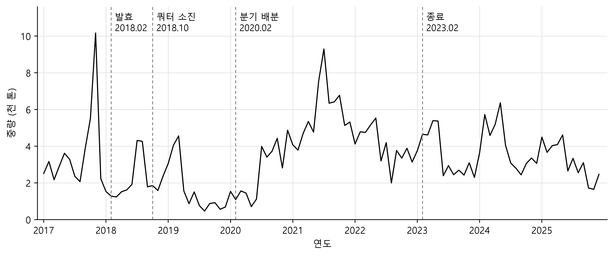
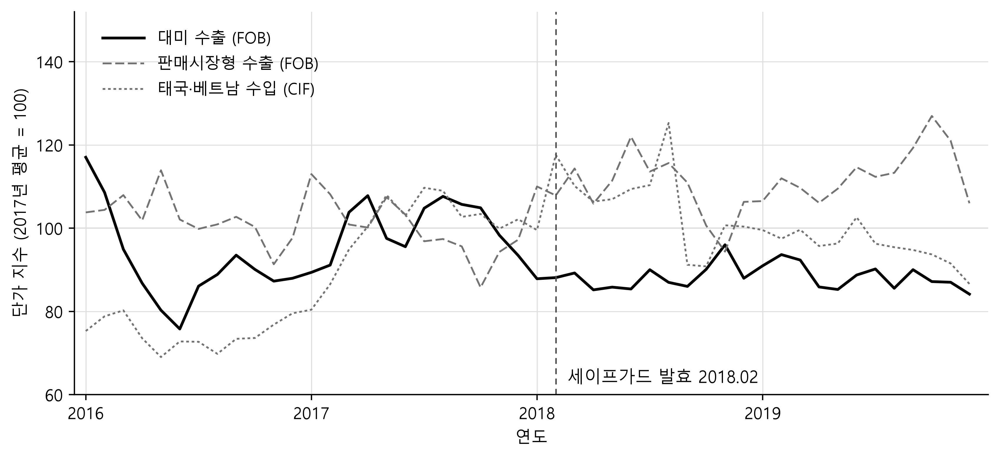

# 미국의 세탁기 무역구제조치와 한국 교역구조의 재편: 2010\~2025년 수출입의 추적 분석

---

## 국문초록

미국은 2018년 2월 가정용 대형 세탁기에 세이프가드 관세를 부과했다. 2012년과 2016년의 반덤핑에 이은 세 번째 무역구제조치였고, 세 번 모두 실질적 대상은 한국의 두 가전기업이었다. Flaaen, Hortaçsu, and Tintelnot(2020)은 미국 소매가격을 사용해 미국 소비자가 관세 부담을 넘는 몫을 떠안았음을 보였으나, 한국 자료는 보조 증거로만 다루었다. 본 연구는 같은 사건을 상대편인 한국에서 본다. 관세청 통관자료로 한국의 수출과 수입 양쪽을 조치가 종료된 2023년 이후까지 추적한다. 분석은 세탁기를 완제품과 부분품으로 나누는 데서 출발한다. 둘은 조치에 다르게 반응하므로 한 품목으로 묶으면 두 반응이 서로 상쇄되어 조치의 효과가 실제보다 작게 나타난다. 이 구분 위에서 네 가지를 발견했다. 첫째, 조정은 판로가 아니라 생산 입지에서 일어났다. 줄어든 대미 물량은 다른 시장으로 가지 않았고, 그 물량은 해외로 이전된 공장이 대신 만들었다. 둘째, 그 생산 이전은 수입측에도 나타나, 태국·베트남발 완제품 물량이 2018년 대미 수출 물량을 넘어서면서 한국은 세탁기 순수출국 지위를 사실상 잃었다. 셋째, 단가는 미국행에서만 내려갔다. 비미국행 수출 단가와 태국·베트남발 수입 단가는 오히려 올랐으므로, 이 하락은 환율이나 그룹 차원의 가격 정책으로는 설명되지 않는다. 넷째, 재편은 관세보다 오래 남았다. 조치 종료 후에도 대미 완제품 수출은 회복되지 않았고 대미 부분품 수출은 사상 최고에 이르러, 미국은 완제품을 사 가는 시장에서 부품을 받아 조립하는 생산기지로 바뀌고 있음을 시사한다.

**주제어**: 무역구제, 세이프가드, 반덤핑, 세탁기, 생산 재배치, 교역구조, 통상법 201조

---

## I. 서론

2018년 2월 7일 미국은 가정용 대형 세탁기(large residential washers, LRW)에 세이프가드 관세를 부과했다. 세이프가드(safeguard measure), 곧 긴급수입제한조치는 특정 품목의 수입이 늘어 국내 산업에 심각한 피해가 발생할 때 수입국이 한시적으로 수입을 제한하는 제도다. GATT 제19조와 WTO 세이프가드협정이 국제법상 근거이고, 미국은 이를 1974년 통상법 제201\~204조로 국내법에 옮겨 두었다. 흔히 "201조 조치"라 부르는 이유다. 반덤핑관세나 상계관세와 결정적으로 다른 점은 상대국의 불공정 행위를 전제하지 않는다는 것이다. 덤핑도 보조금도 없이 정당하게 경쟁해 수입이 늘었더라도, 그 증가가 국내 산업이 입은 심각한 피해(serious injury)의 실질적 원인이라고 판정되면 조치를 취할 수 있다. 그 대신 두 가지 제약이 따르는데, 본 연구에는 이 둘이 특히 중요하다. 하나는 조치가 원산지를 가리지 않고 모든 공급국에 무차별로 적용된다는 것이고, 다른 하나는 한시적이어야 한다는 것이다(WTO 협정은 최초 4년, 연장을 포함해 최대 8년으로 제한한다). 무차별 적용은 반덤핑을 피해 생산지를 옮기던 종래의 대응을 봉쇄했고, 한시성은 기업이 만료 시점을 내다보고 물량과 투자를 배치하게 만들었다. IV장에서 보듯 한국의 수출 자료에는 이 두 성격이 각각 다른 형태로 새겨져 있다. 발동 요건이 낮지 않고 사후 부담도 따르므로 실제 사용은 드물어, 미국에서는 2002년 철강 이후 16년 동안 새로운 201조 조치가 없었다.

이 조치는 트럼프 행정부가 이후 2년에 걸쳐 쏟아낸 일련의 무역조치의 첫머리에 있다. 같은 날 발동된 태양광 전지 세이프가드와 함께 첫 조치였고, 3월의 232조 철강·알루미늄 관세와 7월에 시작된 대중국 301조 관세가 뒤를 이었다. 조치의 형태는 저율할당관세(tariff-rate quota, TRQ)였다. 첫해 기준으로 연간 첫 120만 대까지는 20%, 그 초과분에는 50%의 관세가 부과되었고, 부분품(완성된 세탁기가 아니라 그것을 이루는 부품)에도 5만 대를 넘는 물량에 50%의 추가관세가 적용되었다. 세탁기를 부품 상태로 들여와 현지에서 조립하는 우회를 막기 위한 조항이었다. 이 조치는 이후 한 차례 수정되고 두 해 연장되어 2023년 2월 7일에 종료했다.

이 사건은 무역정책 연구에서 이례적으로 좋은 관측 대상이다. 최종 소비재이고, 품목 분류가 단순하며, 생산이 소수 기업에 집중되어 있고, 무엇보다 조치가 세 차례에 걸쳐 성격을 달리하며 반복되었다. 2012년 한국·멕시코산에 대한 반덤핑관세, 2016년 중국산에 대한 반덤핑관세, 그리고 2018년 사실상 전 세계를 대상으로 한 세이프가드가 그것이다. 앞의 두 조치가 특정 국가를 겨냥한 것이었던 데 비해 세 번째는 원산지를 가리지 않았고, 이 차이에 따라 기업의 대응 방식이 달라졌다.

Flaaen, Hortaçsu, and Tintelnot(2020)—이하 FHT—은 미국 소매 주간 가격자료로 이 세 조치의 소비자가격 효과를 추정해 *American Economic Review*에 발표했다. 이들의 분석은 미국 안에서 벌어진 일에 관한 것이다. 관세가 소비자가격을 얼마나 올렸는가, 관세 대상이 아닌 보완재 가격까지 왜 올랐는가, 국내 브랜드는 어떻게 반응했는가.

본 연구는 같은 사건의 반대편을 본다. 미국의 조치가 한국의 세탁기 교역에 무엇을 했는가. 이는 FHT가 다루지 않은 질문이 아니라, FHT가 보조 증거로만 다룬 질문이다. FHT는 한국 관세청 자료를 두 곳에서 인용한다. 부분품 수출의 목적지 변화(FHT Figure 1 Panel B)와 한국이 들여오는 완제품 세탁기의 원산지별 수입(같은 그림 패널 D)이다. 전자는 공급망 이동을 추적하기 위한 보조 증거이고, 후자는 제3국 파급효과의 예시다. 두 그림 모두 흐름의 크기만 보여줄 뿐, 그 안에서 무엇이 반응했는지는 묻지 않는다. 한국의 완제품 수출 자체가 어떻게 움직였는지, 가격과 물량 중 무엇이 반응했는지, 줄어든 대미 수출이 다른 시장으로 갔는지 아니면 사라졌는지, 그리고 늘어난 수입이 어떤 가격에 들어왔는지는 분석 대상이 아니었다.

교역을 수출과 수입 양쪽으로 놓고 보는 데는 이유가 있다. 이 사건에서 두 흐름은 별개가 아니라 같은 결정의 앞뒷면이다. 한국 기업이 관세를 피해 공장을 태국·베트남으로 옮기면 한국의 대미 수출이 줄고, 바로 그 공장이 한국 내수시장에도 공급하기 시작하면 한국의 수입이 늘기 때문이다. 수출만 보면 "무엇이 사라졌는가"까지밖에 못 보지만, 수입을 함께 보면 "그것이 어디로 갔는가"가 드러난다. V장에서 보듯 두 흐름의 물량은 2018년에 교차하며, 두 흐름의 단가는 같은 달에 반대로 움직인다.

이 질문이 별도로 다뤄질 가치가 있는 이유는 두 가지다. 첫째, 한국은 이 사건의 최초 표적이자 마지막까지 남은 당사자다. 2012년 반덤핑의 대상이 한국산이었고, 2018년 세이프가드의 실질적 대상 기업도 삼성전자와 LG전자였다. 둘째, 수출국 통관자료는 미국 자료가 구조적으로 볼 수 없는 것을 본다. 같은 기업이 같은 달에 미국이 아닌 시장에 얼마를 받고 얼마나 팔았는가가 그것이다. 미국 수입통계에는 그 값이 없다.

본 연구는 인과추정보다 기술적 분석에 무게를 둔다. 사건의 성격상 엄밀한 준실험 설계가 어렵기 때문이다. 대미 수출은 세이프가드 이전에 이미 붕괴해 있었고(2010년 6.39억 달러에서 2015년 0.90억 달러로), 대조군이 될 만한 비미국 목적지들도 같은 기간 함께 감소했다. 이런 조건에서 하나의 계수를 인과효과라고 주장하는 것보다, 자료가 실제로 무엇을 보여주는지를 여러 각도에서 분해해 기록하는 편이 정직하고 유용하다. 결론에서 이 판단의 근거와 한계를 다시 논의한다.

---

## II. 조치의 경과와 선행연구

### 1. 세 차례 조치의 경과

세 차례 조치는 삼성전자와 LG전자를 차례로 밀어낸 과정이었다. 두 기업의 미국 시장 점유율이 오르자 월풀은 2011년 12월 반덤핑을 제소했다. 2012년 12월 최종판정은 삼성 9.29%, LG 13.02%, 대우 82.41%로 기업마다 크게 다른 세율을 매겼고(멕시코산에는 일렉트로룩스 36.52%, 삼성과 월풀에 각 72.41%), 이 세율로 이듬해 2월 반덤핑 명령이 내려졌다(미국 상무부, 2013). 두 기업이 생산을 중국으로 옮기자 월풀은 2015년 다시 제소했고, 2016년 12월 최종판정과 이듬해 2월의 계산 착오 정정을 거쳐 LG 38.43%, 삼성 57.37%가 확정되었다(미국 상무부, 2017). 이렇게 나라를 바꿔 가며 관세를 피하는 "국가 옮겨다니기(country-hopping)"가 반복되자 월풀은 아예 원산지를 가리지 않는 세이프가드를 청원한다. 2018년 1월 포고 9694호가 이를 확정해 2월 7일 발효했다. 연간 첫 120만 대에 20%, 초과분에 50%였고 부분품은 첫해 5만 대 초과분에 50%였다. 3년 1일 시한이었고 캐나다와 일부 개발도상국은 제외되었다. 그전까지 적용되던 최혜국대우(MFN) 세율이 1% 수준이었으니, 사실상 무관세이던 품목에 스무 배가 넘는 세율이 걸린 셈이다. 쿼터는 그해 10월 22일 소진되었다.

3년 1일이라던 시한은 지켜지지 않았다. 연초에 물량이 몰려 조치의 실효성이 떨어진다는 이유로 2020년 포고 9979호가 120만 대 쿼터를 분기당 30만 대로 쪼갰고, 이듬해 포고 10133호는 조치를 2년 더 끌어 2023년 2월 7일에 끝냈다. 세율을 해마다 낮추는 설계는 9694호에 이미 들어 있었고(2년차 18%/45%, 3년차 16%/40%), 10133호는 그 인하를 연장 기간으로 이어 갔다. 연장에는 대통령의 서명이 필요했으나 — 10133호는 트럼프 대통령의 임기 종료 엿새 전에 서명되었다 — 종료에는 아무 결정도 필요하지 않았다. 기한이 다 찼을 뿐이다. 두 사실 모두 FHT의 표본 밖이되 본 연구에는 요긴하다. 쿼터를 어떻게 쪼개느냐가 수출 시점을 바꾼다는 것이 IV.5절의 발견이고, 정책은 저절로 풀려도 그것이 촉발한 생산 배치는 그렇지 않다는 것이 VII장의 결론이다.

표 1은 이 경과를 두 기업별로 정리한 것이다.[^rev1] 행은 시간 순서에 따라 두 차례 반덤핑의 기업별 세율, 각 반덤핑 뒤의 대미 주 공급지, 세이프가드 발효 직전의 한국산 대미 선적, 미국 공장의 가동 시점을 적었다. 반덤핑 세율은 미국 상무부의 반덤핑 명령에서, 대미 공급지와 선적 급증은 FHT가 선하증권 자료로 기업·원산지별로 집계한 미국 수입 물량(FHT Figure 2)에서, 공장 가동 시점은 FHT 본문에서 옮겼다.

[^rev1]: 표 1과 이를 이용한 본문의 서술은 두 기업의 대응을 기업 수준 자료와 대조해야 한다는 익명의 심사위원의 지적을 반영한 것이다. 유익한 지적에 감사드린다.

**표 1. 삼성전자와 LG전자의 대응 연표**

| 구분 | 삼성전자 | LG전자 |
|---|---|---|
| 2012년 한국산 반덤핑 세율 | 9.29% | 13.02% |
| 한국산 반덤핑 이후 대미 주 공급지 | 중국(쑤저우) | 중국(난징) |
| 2016년 중국산 반덤핑 세율 | 57.37% | 38.43% |
| 중국산 반덤핑 이후 대미 주 공급지 | 태국, 베트남 | 베트남 |
| 세이프가드 발효 직전 한국산 대미 선적 급증 | 뚜렷하지 않음 | 뚜렷함 |
| 미국 공장 가동 | 2018년 1월(사우스캐롤라이나주 뉴베리) | 2019년 5월(테네시주 클라크스빌) |

*주: 2016년 중국산 반덤핑 세율은 미국 상무부가 2016년 12월 최종판정의 계산 착오를 정정한 2017년 2월 반덤핑 명령의 값이다. 대미 공급지와 선적 급증은 PIERS 선하증권 자료로 집계한 기업·원산지별 미국 수입 물량(FHT Figure 2)에서 읽은 것이다.*

*자료: 미국 상무부(2013, 2017), Flaaen, Hortaçsu, and Tintelnot(2020).*

두 기업은 세율도, 제3국 공급지의 중심도, 미국 공장을 연 시점도 달랐다. 세이프가드 발효 직전의 선적 앞당기기도 LG는 주로 한국산으로, 삼성은 태국·베트남산으로 했다. 한국 통관자료는 기업을 구분하지 않으므로, 이하에서 관측하는 총계 물량과 단가는 이렇게 다른 두 대응이 합쳐진 결과다.

### 2. 선행연구와 본 연구의 차별성

관세는 누가 부담하는가. 수입국 소비자가 더 높은 가격으로 떠안는가, 아니면 외국 생산자가 수출가격을 낮춰 흡수하는가. 관세 귀착(tariff incidence)이라는 이 오래된 질문에 직접 답한 증거는 뜻밖에 드물다. 2018년 이후 미국이 쏟아낸 관세가 대부분 중간재에 걸려 가격효과를 최종 단계까지 좇기 어려웠기 때문이다. FHT가 하필 세탁기를 고른 이유가 여기 있다. I장에서 든 조건들, 그중에서도 성격이 다른 조치가 세 차례 반복되어 유형별로 효과를 비교할 수 있다는 점이 결정적이었다. 분석에는 세탁기·건조기와 함께 전기·가스레인지, 식기세척기, 냉장고의 주간 소매가격(2013년 3월\~2018년 12월)을 쓰고, 철강 함량과 수입 비중이 세탁기에 가장 가까운 레인지를 대조군으로 삼아 공통 충격을 차분했다. Ashenfelter, Hosken, and Weinberg(2013)의 합병 효과 연구에서 쓰인 방법이다.

FHT는 세 분야의 선행연구에 걸쳐 있다. 첫째는 관세 귀착 연구다. Amiti, Redding, and Weinstein(2019)과 Fajgelbaum et al.(2020)은 2018\~2019년 미국이 부과한 관세에 대해 관세를 포함한 수입가격이 관세율만큼 거의 그대로 올랐음을 보였고, FHT는 같은 물음을 소매가격 단계에서 다루었다. 둘째는 관세를 피하려는 생산 이전 연구다. Blonigen(2002)은 1980년대 미국 반덤핑 판정 뒤 외국 기업이 미국 현지 생산에 나설 확률이 높아졌으나 그 폭은 크지 않았음을 보였다. FHT의 사례에서는 제3국으로의 이전이 두 차례(중국, 이어 태국·베트남) 있은 뒤에 미국 현지 생산이 시작되었다. 셋째는 무역구제에 대한 개별 기업의 대응 연구다. Shin and Ahn(2017)은 한국산 DRAM에 대한 상계관세 분쟁 세 건에서 기업의 대응을 제품·기업 수준 자료로 분석했다. 본 연구도 셋째 분야에 속하지만, 기업 자료가 아니라 한국의 공개 통관자료로 그 대응을 추적한다는 점이 다르다. 이하에서는 FHT의 발견을 차례로 검토하고, 본 연구와의 차이를 절 끝에서 정리한다.

FHT의 첫 발견은 기업이 관세를 피해 공장을 옮겼다는 것이다. 2012년 반덤핑 이후 2년 사이 한국산 수입량이 약 75% 사라지고 중국산이 그 자리를 채웠으며, 2016년 조치가 중국을 막자 이번에는 태국·베트남산이 들어섰다. 선하증권 자료가 이 이동의 정체를 드러낸다. 산업 전체의 재편이 아니라 LG와 삼성 두 기업이 조달지를 바꾼 것이었다. 한국 관세청의 부분품 수출 자료도 한 단계 앞에서 같은 이야기를 들려준다(FHT Figure 1 Panel B). 그러나 원산지를 가리지 않는 2018년 세이프가드 앞에서는 옮겨 갈 곳이 없었다. 남은 선택은 미국 현지에서 생산하는 것이었고, 삼성이 2018년 1월 뉴베리 공장을, LG가 2019년 5월 클라크스빌 공장을 돌리기 시작했다.

둘째 발견은 그 관세가 미국 소비자에게 얼마나 전가되었는가다. 미국의 세탁기 소매가격은 발효 후 4\~8개월 사이 대조군 대비 약 11% 올랐다. 놀라운 것은 관세 대상이 아닌 건조기가 같은 폭으로 올랐다는 점이다. 저자들은 세탁기와 건조기를 짝지어 팔면서 두 가격을 함께 정하는 관행, 그리고 국내 브랜드의 시장지배력에서 이유를 찾는다. 같은 방법으로 측정한 2016년 중국 반덤핑의 가격 상승은 1.5\~3.5%에 그쳤다. 생산지를 손쉽게 옮길 수 있으면 굳이 가격을 올릴 이유가 없기 때문이다. 세탁기와 건조기의 두 상승을 합쳐 계산한 소비자가격의 관세탄력성(tariff elasticity of consumer prices, TECP)은 108\~225%에 이른다. 이 지표는 가격 상승률이 아니라 비율이어서, 늘어난 관세 부담이 소비자가격에 그대로 옮겨졌으면 100%가 된다. 108\~225%란 소비자가 치른 추가 금액이 관세 부담을 넘어섰다는 뜻이다.

셋째 발견은 앞의 둘과 어긋난다. 정작 미국 수입 단가에는 세이프가드 이후 체계적 변화가 나타나지 않았다(FHT Figure 3). 소매가격은 그만큼 올랐는데 국경에서 신고된 가격은 움직이지 않은 것이다. 저자들은 이 대목에서 단가 증거의 한계를 스스로 못 박는다. 각주 12는 "제품 구성의 변화, 이전가격(transfer pricing) 전략, 파악되지 않은 비용 정보"가 신고 금액과 수량으로 계산한 단가를 교란할 수 있다고 적었다. 본 연구의 단가 증거가 FHT와 달라지는 지점이 바로 여기이고, 저 경고는 우리 자료에도 그대로 적용되므로 VI장에서 따로 다룬다.

FHT의 정밀한 규명에도 설계상 닿지 못한 곳이 남는다. 첫째는 상대국이다. 한국 자료는 부분품 흐름과 수입 규모를 보여주는 보조 증거로만 쓰였고, I장에서 열거한 물음들은 다뤄지지 않았다. 둘째는 시간이다. 소매가격 자료가 2018년 12월에 끝나 조치의 나머지 4년과 종료 뒤의 조정이 통째로 관측 밖에 있다. 셋째는 대조군이다. 같은 수출자가 같은 달에 다른 시장에서 받은 가격은 미국 자료에 아예 존재하지 않는다. 본 연구는 이 세 여백을 한국 통관자료로 메우려 한다.

---

## III. 자료와 분석 단위

관세청 「품목별 국가별 수출입실적」(공공데이터포털 OpenAPI, 자료 ID 15100475)을 전수 수집해 구축한 데이터베이스(KCSDB2)를 사용한다. 통관실적은 사후 정정되므로 본문의 모든 수치는 2026년 8월 17일 집계 기준임을 밝혀 둔다. 2007년 1월부터 2026년 3월까지 231개월, 240개국, HS10(가장 세분된 10자리 품목 코드) 기준 15,403개 품목, 총 2,753만 행이다. 각 행은 (월, 상대국, HS10) 조합에 대한 수출금액(USD, FOB), 수입금액(USD, CIF), 수출중량(kg), 수입중량(kg)을 담는다. 국가는 수출의 경우 최종목적국, 수입의 경우 원산국 기준이다. 수집·적재 절차와 검증 결과, 그리고 자료 자체는 공개해 두었다(https://pilsunchoi.github.io/KCSDB2/).

HS 8450은 가정용과 세탁업용 세탁기, 그리고 그 부분품을 묶는 네 자리 분류다. 세이프가드가 겨냥한 가정용 대형 세탁기도 그 안에 들어간다. 한국 관세율표는 이 분류를 표 2에 나온 다섯 가지 HS10 세번(tariff line)으로 나눈다. 세번은 관세율표가 품목을 구분하는 단위이자 거기 붙은 번호로, 관세는 이 단위마다 따로 매겨진다. 본 연구는 이 가운데 8450900000을 부분품으로, 나머지 넷을 완제품으로 구분한다. 이 구분을 하지 않으면 2018년 사건이 얼마나 흐려지는지는 IV.2절에서 살펴본다. 표에는 2015\~2019년 수출 누계를 크기순으로 적었다. 대미 수출은 10kg 초과 세탁기 세번 한 가지에 몰려 있고, 부분품은 전 세계로 시야를 넓힐수록 비중이 커진다.

**표 2. HS 8450의 세번별 구성 (2015\~2019년 수출 누계, 억 달러)**

| HS10 | 품목명 | 미국 | 전 세계 |
|---|---|---|---|
| 8450200000 | 1회 세탁능력 10kg 초과 세탁기 | 7.31 | 21.45 |
| 8450900000 | 부분품 | 1.79 | 18.55 |
| 8450110000 | 완전자동 세탁기 (10kg 이하) | 0.99 | 4.98 |
| 8450120000 | 그 밖의 세탁기(원심탈수기 내장) | 0.01 | 0.02 |
| 8450190000 | 기타 | 0.00 | 0.01 |

*자료: 관세청 「품목별 국가별 수출입실적」에서 계산.*

FHT는 미국 자료에서 가정용 세탁기를 HTS 8450110040, HTS 8450110080, HTS 8450200040, HTS 8450200080, HTS 8450200090으로, 부분품을 HTS 8450.90으로 잡는다. 다만 이 다섯 가지 세번이 곧 세이프가드의 법적 대상은 아니다. 조치의 범위는 관세율표의 칸이 아니라 제품 사양으로 정해졌기 때문이다. 포고 9694호는 대상을 "회전축의 방향과 무관하게, 캐비닛 폭이 가장 넓은 곳을 기준으로 62.23cm 이상 81.28cm 이하인 자동 세탁기"로 정의하고, 소호 8450.11.00 또는 8450.20.00에 분류되는 것으로 한정했다. FHT의 온라인 부록에 따르면 스택형 세탁건조기와 상업용 세탁기가 처음부터 빠졌고, 여기에 더해 영구분할콘덴서 모터에 벨트 구동을 쓰는 드럼세탁기(front loading), 제어형 유도전동기에 벨트 구동을 쓰는 통돌이세탁기(top loading), 캐비닛 폭이 28.5인치를 넘는 드럼세탁기가 제외되었다. 캐나다와 일부 개발도상국에서 오는 물량도 대상이 아니었다. 이 제외를 없애 달라고 요청한 쪽이 삼성과 LG였고 월풀과 GE가 반대했다는 사실은 그 경계가 다툼의 대상이었음을 보여준다. 대상 여부가 이렇게 제품 사양으로 결정되는 이상, 양국 어느 쪽에서도 세번만으로 조치의 범위를 그대로 재현할 수 없다. 본 연구가 쓰는 세번 단위 자료는 조치 대상보다 넓고, 그 안에는 관세가 부과되지 않은 세탁기가 섞여 있다. 이런 물량은 관세에 반응하지 않았을 것이므로 측정된 효과를 줄이는 쪽으로 작용한다. 즉 실제 대상 품목이 받은 충격은 이하에서 측정하는 값보다 작지 않다.

한국 HS10과 미국 HTS10은 6단위까지만 국제 공통이고 그 아래는 각국 코드이므로 정확한 1:1 대응도 성립하지 않는다. 다만 6단위 수준에서는 양국이 일치하며, 포고 9694호가 지정한 소호와 FHT가 잡은 다섯 가지 세번은 모두 8450.11과 8450.20 양쪽에 걸쳐 있다. 한국측에서 여기에 대응하는 세번은 8450110000과 8450200000 두 가지이고, 표 2의 누계로 둘이 대미 완제품 수출의 99.9%를 차지한다. 나머지 8450120000과 8450190000은 대미 수출이 사실상 없어 함께 묶어도 결과가 달라지지 않는다. 본 연구가 네 가지 세번을 완제품 하나로 묶는 것은 이 때문이다.[^1]

[^1]: 묶는 범위를 좁혀도 결론은 달라지지 않는다. 규모가 가장 큰 8450200000 하나로만 계산하면 IV.2절의 미국행·비미국행 격차는 31.8%p로 같고, IV.6절의 2018년 단가 변화도 대미 −12.4%, 판매시장형 +7.3%로 네 가지 세번 기준(−11.7%, +8.0%)과 거의 다르지 않다.

분석 단위는 (품목군, 목적지, 월)이다. 금액은 달러, 물량은 중량(kg)으로 관측되며, 단가는 금액/중량(USD/kg)으로 정의한다. 이 자료가 담는 물량 항목은 중량뿐이고 대수(unit) 기준 수량은 들어 있지 않다. 품목 분류상 완제품 세탁기의 수량 단위는 대수로 지정되어 있으나 실적 자료에 그 값이 실리지 않으며, 부분품은 수량 단위 자체가 지정되어 있지 않다. 따라서 본 연구의 단가는 대수 단가가 될 수 없고 중량 단가일 수밖에 없다. 여기서 오는 해석상 제약은 VI.2절과 결론에서 다룬다. 중량 자체의 결측은 문제가 되지 않는다. 2015\~2025년 대미 완제품 수출에서 금액의 100%, 행의 97.9%에 중량이 기록되어 있다.

기업 수준 자료의 쓰임도 밝혀 둔다. 이 사건의 행위자는 사실상 삼성전자와 LG전자 두 기업이고, 두 기업이 언제 어디로 생산을 옮겼는지는 II.1절 표 1에 정리한 문헌 자료로 상당 부분 확인된다. 본 연구는 이 자료를 통관자료에서 읽은 시점과 대조하는 데 쓰고, 분석의 주 자료로 삼지는 않았다. 본 연구의 물음은 미국의 조치가 한국의 세탁기 교역에 무엇을 했는가이고, 그 답을 한국의 공개 통관자료로 구하도록 설계했기 때문이다. 사업보고서의 생산능력, 감사보고서의 특수관계자 거래, 공장별 생산량을 결합하는 분석은 이와 다른 설계를 요구하므로 후속 과제로 남긴다.

---

## IV. 수출측 조정

### 1. 20년의 궤적 — 세이프가드는 첫 충격이 아니었다

표 3은 2010년부터 2025년까지 한국의 세탁기 수출을 완제품과 부분품으로, 다시 미국과 비미국으로 나눠 놓은 것이다. 네 계열을 함께 보면 세 차례 무역구제조치가 차례로 지나간 자취, 그리고 조치가 끝난 뒤의 궤적이 한 표에 들어온다. 이 표에서 다섯 가지 사실을 읽는다.

<!-- Word 변환 지침 (표 3):
- 헤더 2행 구조.
  · 1행: [연도 (1\~2행 rowspan=2 병합)] [완제품 (2\~3열 colspan=2)] [부분품 (4\~5열 colspan=2)]
  · 2행: [ (연도 셀과 rowspan=2 병합) ] [미국][비미국] [미국][비미국]
- 마크다운의 "완제품 미국"·"완제품 비미국"은 1행의 "완제품"과 2행의 "미국"·"비미국"으로 나눠 넣는다. "부분품 미국"·"부분품 비미국"도 같다.
- "완제품"은 2\~3열 가로 병합(colspan=2), "부분품"은 4\~5열 가로 병합(colspan=2).
- 첫 열 "연도"는 두 헤더 행에 걸친 세로 병합(rowspan=2).
- 병합 셀은 세로·가로 가운데 정렬.
- 숫자 열은 우측 정렬, 소수 자릿수 현행 유지.
-->

**표 3. 한국의 세탁기 수출 (억 달러)**

| 연도 | 완제품 미국 | 완제품 비미국 | 부분품 미국 | 부분품 비미국 |
|---|---|---|---|---|
| 2010 | 6.39 | 7.59 | 0.83 | 2.42 |
| 2011 | 6.13 | 7.45 | 0.64 | 3.13 |
| 2012 | 5.25 | 8.24 | 0.59 | 2.89 |
| 2013 | 2.91 | 6.91 | 0.58 | 4.34 |
| 2014 | 1.48 | 6.38 | 0.46 | 5.42 |
| 2015 | 0.90 | 4.85 | 0.48 | 4.78 |
| 2016 | 1.54 | 4.03 | 0.45 | 4.70 |
| 2017 | 3.06 | 3.58 | 0.13 | 3.86 |
| 2018 | 1.56 | 2.96 | 0.22 | 1.83 |
| 2019 | 1.25 | 2.74 | 0.51 | 1.59 |
| 2020 | 1.84 | 1.66 | 0.53 | 2.02 |
| 2021 | 4.87 | 2.07 | 0.67 | 2.04 |
| 2022 | 3.46 | 2.03 | 0.91 | 1.60 |
| 2023 | 2.91 | 2.01 | 1.33 | 1.47 |
| 2024 | 3.35 | 2.15 | 1.11 | 1.53 |
| 2025 | 2.33 | 2.31 | 1.33 | 1.52 |

*자료: 관세청 「품목별 국가별 수출입실적」에서 계산.*

이 표가 말하는 첫 번째 사실은 2018년 세이프가드가 한국 세탁기 대미 수출에 가해진 최초의 충격이 아니라 세 차례 조치의 마지막이었다는 점이다. 완제품 대미 수출은 2010년 6.39억 달러에서 2015년 0.90억 달러로 이미 86% 감소해 있었다. 이 감소는 2012년 반덤핑관세와 그에 따른 생산 이전으로 설명되며, FHT가 미국 수입량 기준으로 보고한 "2년간 약 75% 감소"와 방향과 크기가 부합한다.

두 번째 사실은 2016\~2017년의 일시적 반등이다. 대미 완제품 수출은 2015년 0.90억 달러에서 2017년 3.06억 달러로 3.4배가 되었다. 이는 2016년 7월 중국산에 반덤핑관세가 부과되면서 중국 생산분이 봉쇄되고, 태국·베트남 생산이 본궤도에 오르기 전 한국 생산분이 일시적으로 미국행을 메운 것으로 읽을 수 있다. 다만 후술하듯 2017년 반등의 상당 부분은 하반기의 밀어내기이므로 연간 수치만으로 해석하면 오도된다.

세 번째 사실은 2021년의 급반등(4.87억 달러)이다. 세이프가드가 유지되던 시기임에도 2012년 수준에 근접했다. 팬데믹 기간 가전 수요 급증과 공급망 교란이 겹친 결과로 보이나 본 연구의 자료만으로는 특정할 수 없다. 이 현상은 별도 연구가 필요하다.

네 번째 사실은 조치 종료 후에도 되돌아오지 않았다는 점이다. 세이프가드는 2023년 2월 7일 종료했으나 완제품 대미 수출은 2021년 4.87억 달러를 정점으로 2022년부터 2025년까지 각각 3.46, 2.91, 3.35, 2.33억 달러로 오히려 내려간다. 조치가 사라진 뒤 2년(2024\~2025년)의 평균은 2.84억 달러로 세이프가드 기간의 정점보다 훨씬 낮고, 2010\~2012년 평균(5.92억 달러)의 절반에 못 미친다. 관세가 걷히면 수출이 회복되리라는 소박한 예상과 어긋나는 이 사실은, 조정이 되돌릴 수 있는 가격·물량 조절이 아니라 생산 입지의 이동이었음을 시사한다. IV.7절에서 다시 살펴본다.

다섯 번째 사실은 부분품 대미 수출의 반전이다. 2017년 0.13억 달러로 바닥을 친 뒤 2023년과 2025년에 1.33억 달러로 관측 기간 전체의 최고치를 경신했다(종전 최고는 2010년의 0.83억 달러). 완제품이 줄고 부분품이 늘어나는 이 엇갈림은 미국 내 조립 생산의 정착을 뜻하며, IV.4절에서 자세히 살펴본다.

### 2. 완제품과 부분품을 나누지 않으면 사건이 사라진다

HS 8450 전체를 하나의 품목으로 다루면 2018년 사건은 거의 보이지 않는다. 세이프가드는 미국행에만 걸린 조치이므로, 그 충격의 크기는 미국행 수출의 변화와 같은 해 비미국행 수출의 변화를 비교해 보는 것으로 가늠할 수 있다. 그런데 이 비교의 결과가 품목을 어떻게 묶느냐에 따라 크게 달라진다. 표 3의 네 계열로 2017년 대비 2018년 변화율을 구해 보면, 완제품과 부분품을 합친 HS 8450 전체 기준으로는 미국행 −44.3%에 비미국행 −35.7%여서 격차가 8.6%p에 그친다. 그러나 완제품만 분리하면 미국행 −49.1%에 비미국행 −17.4%로 격차가 31.8%p, 곧 3.7배로 벌어진다.

이와 같은 희석은 부분품이 미국행과 비미국행에서 차지하는 비중이 크게 다른 데서 온다. 2017년 부분품은 미국행 수출에서는 4.1%에 지나지 않았지만 비미국행 수출에서는 51.9%를 차지했다. 미국행에는 합쳐 넣을 부분품이 애초에 거의 없으므로, 합산해도 변화율은 −49.1%에서 −44.3%로 4.8%p 움직일 뿐이다. 반면 비미국행은 절반이 부분품이어서, 합산하면 변화율이 완제품만 볼 때의 −17.4%에서 −35.7%로 18.3%p 대폭 내려간다. 이처럼 비미국행 쪽 숫자를 끌어내린 부분품에는 무슨 일이 있었는가. 부분품 비미국행 수출은 2017년 3.86억 달러에서 2018년 1.83억 달러로 52.7% 급감했다. 같은 해 완제품 비미국행의 변화율이 −17.4%였으니 세 배가 넘는 낙폭이다. 이는 미국의 세이프가드가 비미국 시장에 직접 작용한 결과가 아니다. 부분품 수출은 최종재 판매가 아니라 해외 생산기지로 향하는 기업 내부 물류이고, 태국·베트남 공장이 미국행 판로를 잃자 그곳으로 가던 부품 수요도 함께 사라진 것이다. 요컨대 부분품 비미국행은 조치 바깥에 있는 비교 기준이 아니라, 미국행 완제품과는 다른 경로로 같은 조치의 영향을 받은 계열이다.

이 관찰은 세탁기 한 사건에 그치지 않는다. HS 6단위나 4단위 수준에서 "품목"을 정의하고 미국행 대 비미국행을 비교하는 관행은, 품목 안에 최종재와 중간재가 섞여 있고 그 중간재가 조치의 영향을 받는 생산기지로 흐를 때 효과를 심각하게 희석한다. 본 연구가 완제품과 부분품을 처음부터 구분한 것은 그 때문이다. 다만 둘을 구분한 뒤에도 비미국 목적지 전체를 온전한 비교 기준으로 삼을 수 있는 것은 아니다. 부분품이 어디로 흘렀는지에 따라 목적지 자체를 다시 구분해야 하며, 이것이 다음 절의 과제다.

### 3. 목적지의 두 유형 — 부분품 비중 스크린

목적지별로 수출액에서 부분품이 차지하는 비중을 계산하면 분포가 거의 이봉형(bimodal)으로 나타난다. 표 4는 2015\~2017년 누계 수출이 0.3억 달러를 넘는 21개 목적지를 그 비중이 높은 순으로 늘어놓고 세 그룹으로 나눈 것이다.

**표 4. 목적지별 부분품 비중 (2015\~2017년 누계, 수출 0.3억 달러 초과국)**

| 부분품 비중 구간 | 국가 (부분품 비중) | 유형 |
|---|---|---|
| 약 60% 이상 | 러시아 91.6%, 태국 90.6%, 인도 87.3%, 폴란드 85.7%, 베트남 83.9%, 멕시코 72.5%, 중국 68.9%, 이란 61.1%, 브라질 59.8% | 생산기지형 |
| 10\~60% | 이집트 35.6%, 캐나다 20.9%, 미국 16.2% | 중간 |
| 10% 미만 | UAE 9.0%, 대만 2.4%, 사우디 2.3%, 호주 2.0%, 콜롬비아 1.6%, 칠레 1.5%, 튀르키예 1.3%, 프랑스 1.2%, 페루 0.2% | 판매시장형 |

*자료: 관세청 「품목별 국가별 수출입실적」에서 계산.*

약 60% 이상 그룹과 10% 미만 그룹으로 뚜렷이 구분되고, 그 사이 구간에 놓이는 것은 미국·캐나다·이집트 셋뿐이다. 이 셋을 제외하면 사실상 이봉 분포이며, 두 그룹 사이의 간격(브라질 59.8%와 UAE 9.0%)이 각 그룹 내부의 산포보다 훨씬 크다. 이는 한국 기업의 해외 세탁기 생산기지 배치를 반영한 것으로 읽힌다. 생산기지형 9개국 가운데 중국·태국·베트남은 두 기업 모두의, 멕시코는 삼성의 세탁기 생산지임이 문서로 확인된다. 중국의 삼성 쑤저우 법인과 LG 난징 법인, 멕시코의 삼성 법인은 미국 상무부의 반덤핑 명령에 생산자로 기재되어 있고(미국 상무부, 2013, 2017), 태국과 베트남은 FHT의 기업별 선적 자료에 두 기업의 대미 공급지로 나타난다(표 1). 러시아·인도·폴란드·브라질·이란은 이러한 문서 확인을 거치지 않았으며, 통관자료의 부분품 비중만으로 분류한 것이다.

생산기지형과 판매시장형의 구분은 분석에 직접적 함의를 갖는다. 생산기지형 목적지는 최종 수요가 아니라 기업의 생산 배치 결정에 따라 움직이고, 미국 관세가 촉발한 재배치의 영향을 직접 받는다. 따라서 대미 수출의 대조군으로 쓸 수 없다. 이하 단가 비교에서는 판매시장형 9개국을 대조군으로 사용한다.

### 4. 부분품 흐름으로 본 공급망 이동

부분품은 최종 소비자가 아니라 공장으로 간다. 사후 서비스용 부품이 섞여 있어 공장이 없는 곳으로도 조금은 흘러가지만 그 몫은 작다. IV.3절의 판매시장형 9개국이 받은 것은 2015\~2017년 부분품 수출의 0.9%에 지나지 않고, 87.4%는 생산기지형 9개국으로 갔다. 따라서 부분품 수출의 목적지가 바뀌었다면 그것은 수요가 옮겨간 것이 아니라 공장이 옮겨간 것이다. 표 5는 세탁기 부분품 수출 금액을 주요 목적지별로 보여주는 것으로, 한국 기업의 해외 생산기지가 어디로 옮겨 다녔는지를 완제품보다 한 단계 앞에서 추적한다.

**표 5. 세탁기 부분품 수출의 목적지 (억 달러)**

| 연도 | 중국 | 태국 | 베트남 | 미국 | 폴란드 | 기타 | 합계 |
|---|---|---|---|---|---|---|---|
| 2010 | 0.25 | 0.39 | 0.01 | 0.83 | 0.01 | 1.76 | 3.25 |
| 2011 | 0.27 | 0.44 | 0.03 | 0.64 | 0.10 | 2.29 | 3.77 |
| 2012 | 0.72 | 0.32 | 0.03 | 0.59 | 0.09 | 1.73 | 3.48 |
| 2013 | 1.29 | 0.48 | 0.03 | 0.58 | 0.33 | 2.22 | 4.92 |
| 2014 | 1.71 | 0.61 | 0.01 | 0.46 | 0.38 | 2.71 | 5.88 |
| 2015 | 1.32 | 0.71 | 0.01 | 0.48 | 0.31 | 2.44 | 5.26 |
| 2016 | 0.89 | 0.80 | 0.31 | 0.45 | 0.45 | 2.24 | 5.15 |
| 2017 | 0.46 | 0.93 | 0.66 | 0.13 | 0.23 | 1.58 | 3.99 |
| 2018 | 0.21 | 0.58 | 0.29 | 0.22 | 0.06 | 0.68 | 2.05 |
| 2019 | 0.27 | 0.38 | 0.30 | 0.51 | 0.05 | 0.59 | 2.10 |
| 2020 | 0.33 | 0.46 | 0.36 | 0.53 | 0.11 | 0.76 | 2.55 |
| 2021 | 0.31 | 0.45 | 0.35 | 0.67 | 0.15 | 0.78 | 2.72 |
| 2022 | 0.24 | 0.31 | 0.29 | 0.91 | 0.24 | 0.52 | 2.51 |
| 2023 | 0.23 | 0.47 | 0.30 | 1.33 | 0.06 | 0.41 | 2.80 |
| 2024 | 0.25 | 0.41 | 0.33 | 1.11 | 0.03 | 0.50 | 2.64 |
| 2025 | 0.26 | 0.30 | 0.37 | 1.33 | 0.02 | 0.57 | 2.84 |

*자료: 관세청 「품목별 국가별 수출입실적」에서 계산.*

이 표는 FHT Figure 1 Panel B와 같은 자료로서 관측 기간을 2025년까지 늘린 것으로, 그들이 서술한 "국가 옮겨다니기"가 부분품 흐름에 남긴 흔적을 보여준다. 대중국 부분품 수출은 2012년 0.72억 달러에서 2014년 1.71억 달러로 급증했다. 한국산 완제품에 반덤핑이 걸리자 중국 생산으로 무게가 옮겨간 것이다. 2014년 정점을 거쳐 1.32, 0.89, 0.46, 0.21억 달러로 네 해 내리 줄어드는데, 낙폭이 해마다 커져 2016년 중국산에 반덤핑이 걸린 뒤로 하강이 뚜렷이 가팔라진다. 그 사이 대베트남 수출은 2014년 0.01에서 2017년 0.66억 달러로, 대태국 수출은 2012년 0.32에서 2017년 0.93억 달러로 늘었다.

두 기업의 이전 경로는 같지 않았다. FHT의 기업별 선적 자료에서 2016년 중국산 반덤핑 뒤 삼성의 대미 공급은 태국과 베트남으로, LG의 대미 공급은 주로 베트남으로 옮겨 갔다(표 1). 태국·베트남산 대미 선적이 2016년 말부터 나타나고 대베트남 부분품 수출도 2016년에 처음 증가한다는 점에서, 대미 공급지가 태국·베트남으로 옮겨 간 것은 2018년 세이프가드가 아니라 2016년 중국산 반덤핑에 대한 대응으로 보아야 한다.

대미 부분품은 다른 궤적을 그린다. 2010\~2016년 0.45\~0.83억 달러 수준을 유지하다가 2017년 0.13억 달러로 급락한 뒤, 2019년 0.51억 달러, 2020년 0.53억 달러로 회복해 이전 수준으로 돌아간다. 월별로 보면 2016년 10월까지 월 400만\~500만 달러이던 것이 11월과 12월에 각각 150만, 80만 달러로 꺾이고 2017년 내내 월 100만 달러 안팎에 머문다. 2018년 하반기부터 회복해 2019년에는 다시 월 400만 달러 안팎이 된다. 이 회복 시점은 삼성 뉴베리 공장(2018년 1월 가동)과 LG 클라크스빌 공장(2019년 5월 가동)의 미국 내 생산 개시와 겹친다.

2020년까지만 보면 이를 "세이프가드가 부분품 수출을 늘렸다"고 읽는 것은 과잉해석이 된다. 2019\~2020년 수준은 2014\~2016년 수준의 회복일 뿐 사상 최고치가 아니었고, 부분품 세번(8450900000)에는 사후 서비스용 부품도 포함되어 미국 내 설치 대수에 비례하는 기저 수요가 존재하기 때문이다. 그러나 관측 기간을 2025년까지 늘리면 그림이 달라진다. 대미 부분품 수출은 2022년 0.91억 달러로 종전 최고치(2010년 0.83억 달러)를 넘어섰고, 2023년과 2025년에는 1.33억 달러로 이전 어느 해보다도 높은 수준에 자리 잡았다. 같은 기간 부분품 수출 총액은 2023년 2.80억 달러, 2025년 2.84억 달러로 2014년 정점(5.88억 달러)의 절반 수준에 머물러 있다. 즉 늘어난 것은 부분품 수출의 총량이 아니라 그 안에서 미국이 차지하는 몫이다. 실제로 대미 HS 8450 수출에서 부분품이 차지하는 비중은 2015\~2017년 16.2%에서 2023\~2025년 30.5%로 배 가까이 올랐다. IV.3절의 분류를 빌리면 미국은 중간 그룹 안에서 생산기지형 쪽으로 더 올라갔다. 이 변화는 두 미국 공장이 가동된 뒤에 나타났으나, 두 공장의 생산량 자료와 대조하지 못했으므로 그 가동이 이 증가를 얼마나 설명하는지는 확정할 수 없다. 또한 사후 서비스 수요라는 기저 성분을 자료에서 분리할 수 없으므로, 증가분 전체를 조립용으로 귀속해서는 안 된다.

### 5. 월별 동학 — 밀어내기와 쿼터 주기

연간 자료로는 보이지 않는 것이 월별 자료에서 드러난다. 그림 1은 대미 완제품 수출 물량을 2017년 1월부터 2025년 12월까지 108개월에 걸쳐 이은 것으로, 네 개의 정책 시점을 수직 점선으로 표시했다. 2017년 11월의 단독 봉우리와 그 직후 2018년 상반기의 저지대, 2018년 7\~8월과 2019년 1\~3월의 두 봉우리, 그리고 2020년 2월 이후로는 좁고 높은 봉우리 대신 완만한 물결이 이어지는 것이 차례로 읽힌다. 이 네 국면을 이하 (가)\~(라)에서 하나씩 본다.

**그림 1. 완제품 대미 수출의 월별 물량, 2017.01\~2025.12**

*자료: 관세청 「품목별 국가별 수출입실적」에서 계산.*

**(가) 발효 전 밀어내기.** 2017년 9\~11월 3개월간 대미 완제품 수출 중량은 같은 해 1\~8월 월평균에서 기대되는 물량의 2.36배였고, 초과분은 11.28천 톤이다. 11월 한 달만 10.17천 톤으로 정상 월의 3.7배였다. 세이프가드 조사는 2017년 5월 청원, 10월 긍정 판정, 12월 구제조치 권고를 거쳤으므로 이 시기 수출업체는 관세 부과를 사실상 확신할 수 있었다.

**(나) 발효 후 급감.** 2018년 1\~6월 월평균 중량은 2017년 1\~8월 평균의 55% 수준으로 내려앉는다. 6개월간 부족분은 7.47천 톤으로, 앞서 계산한 밀어내기 초과분보다 작다. 즉 발효 직후 감소의 상당 부분은 미리 실어 보낸 물량의 반작용이며, 이를 관세의 순효과로 계산하면 과대평가된다. 다만 "정상"으로 삼은 2017년 1\~8월 평균은 IV.1절에서 본 반등 국면의 값이라 높게 잡혔을 수 있다. 그러나 기준선을 낮추면 초과분은 커지고 부족분은 작아져 두 값의 차이가 오히려 벌어지므로, 이 절의 논지는 기준선 선택에 대해 보수적이다.

(가)와 (나)의 분석을 한자리에 모으면 다음 표 6과 같다. 초과분이 부족분보다 크다는 것이 이 표의 요점이다.

<!-- Word 변환 지침 (표 6):
- 첫 열 "구분"은 세로 병합한다.
  · "발효 전 밀어내기 크기": 2017.01\~08 월평균부터 초과분까지 4행 rowspan=4
  · "발효 후 부족분": 2018.01\~06 월평균부터 부족분까지 4행 rowspan=4
- 첫 열의 빈 칸은 병합의 연속이며 데이터가 아니다. 병합 셀은 세로·가로 가운데 정렬.
- 숫자 열은 우측 정렬, 소수 자릿수 현행 유지.
-->

**표 6. 밀어내기와 그 반작용의 크기 (대미 완제품, 중량 천 톤)**

| 구분 | 구간 | 중량 |
|---|---|---|
| 발효 전 밀어내기 크기 | 2017.01\~08 월평균 (정상 기준) | 2.76 |
| | 2017.09\~11 실적 합계 | 19.57 |
| | 2017.09\~11 정상 기대치 (2.76 × 3) | 8.29 |
| | 초과분 | 11.28 |
| 발효 후 부족분 | 2018.01\~06 월평균 | 1.52 |
| | 2018.01\~06 실적 합계 | 9.12 |
| | 2018.01\~06 정상 기대치 (2.76 × 6) | 16.58 |
| | 부족분 | 7.47 |

*자료: 관세청 「품목별 국가별 수출입실적」에서 계산.*

**(다) 쿼터 주기.** 2018년 7\~8월에 중량이 4.3천 톤 수준으로 급등했다가 9월부터 다시 1.8천 톤 수준으로 주저앉는다. 저율할당관세의 20% 구간(연 120만 대)을 소진하기 전에 물량을 밀어 넣으려는 행동으로 읽힌다. 쿼터가 차기 전에 도착한 물량에는 20%가, 다 찬 뒤에 도착한 물량에는 같은 제품인데도 50%가 붙는다. 포고 9694호는 이 120만 대를 나라별로 쪼개지 않고 대상국 전체에 하나의 총량으로 두었으므로, 먼저 실어 보낼수록 30%p를 덜 내고 남이 먼저 채우면 내 물건에 초과 세율이 걸린다.[^2] FHT가 소진 시점을 2018년 10월 22일 하루로 특정한 것, 그리고 뒤에 본 대로 이 총량을 분기로 쪼갠 것이 모두 이 구조와 정합적이다.

[^2]: 포고문은 in-quota 물량을 나라별로 배정하지 않는다고만 정했을 뿐 선착순이라는 명시는 두지 않았다. 먼저 도착한 순서로 채워진다는 서술은 쿼터 소진 시점이 하루로 특정된 점과 뒤이어 분기 배분이 도입된 점에서 온 추론이다. FHT는 미국 세관 자료로 쿼터가 2018년 10월 22일 소진되었다고 보고했는데, 한국 통관 시점이 미국 도착보다 앞서므로(해상 운송 4\~6주) 한국측 급등이 7\~8월에 나타나는 것은 정합적이다.

같은 패턴이 이듬해 반복된다. 2019년 1\~3월 중량이 3.1\~4.6천 톤으로 뛰었다가 4월부터 0.9\~1.6천 톤으로 급락한다. 쿼터 연도는 발효일에 맞춰 매년 2월 7일 갱신되므로, 앞 문단과 같은 4\~6주의 해상 운송 시차를 적용하면 1월 초에 한국을 떠난 선적이 2월 중순 미국에 도착해 새 쿼터의 앞자리를 차지한다. 급등이 쿼터 갱신월인 2월이 아니라 그 한 달 앞인 1월부터 시작되는 것은 이 시차와 정합적이다. 또한 3월까지 이어지다 4월에 끊기는 것은 1분기 안에 저율 구간을 상당 부분 채웠음을 시사한다. 이 연간 쿼터 주기는 FHT의 소매가격 표본(2018년 12월 종료) 이후의 현상으로, 수출국 자료에서만 관측된다. 2019년 4월 이후의 지속적 저수준은 LG 클라크스빌 공장 가동(2019년 5월)과 시기가 겹친다.

**(라) 분기 배분 이후 주기의 소멸.** 이 연초 몰아넣기는 미국 당국도 포착했다. II장에서 본 대로 포고 9979호가 2020년 2월 7일부터 120만 대 쿼터를 분기당 30만 대로 쪼갠 것이 그 대응이다. 포고문은 그 이유를 수입이 짧은 기간에 몰리면 미국 시장의 물량이 왜곡되고 조치의 효과가 훼손된다는 것으로 적었다. 분기는 2월 7일, 5월 7일, 8월 7일, 11월 7일에 시작하며, 이 배분은 포고 10133호가 연장 기간에도 이어 갔다. 연초에 몰아넣어도 그 분기의 30만 대를 넘으면 초과 세율을 물게 되므로 연 단위로 앞세울 유인은 사라진다. 다만 분기 안에서는 같은 유인이 남으므로, 규칙 변경은 앞세우기를 없앤 것이 아니라 그 주기를 1년에서 1분기로 줄인 것이라고 보아야 한다. 한국측 자료도 이와 부합한다. 앞세우기는 두 형태로 나타났다. 2018년에는 쿼터 소진을 앞둔 7\~8월에, 2019년에는 새 쿼터 연도가 열리는 1\~3월에 물량이 몰렸다. 분기 배분 이후에는 둘 다 사라진다. 1분기 집중도(1분기 물량 ÷ 그해 분기 평균)는 2019년 2.35에서 2021\~2022년 0.7\~1.1로, 연중 최대월의 월평균 대비 배율도 2018\~2019년 2.1\~2.8에서 2021\~2022년 1.4\~1.6으로 완만해진다(그림 1). 짧아진 주기의 쏠림도 나타나지 않는다. 분기 경계가 매달 7일이므로 월별 자료로는 2\~4월, 5\~7월, 8\~10월, 11\~1월로 근사한다. 이 기준에서 2021\~2022년 각 분기의 첫 달 물량은 그해 월평균의 0.94배, 셋째 달은 1.07배로 오히려 분기 뒤쪽이 무겁다. 한 분기가 13주인 데 비해 해상 운송에만 4\~6주가 걸려 시기를 조절할 여지가 좁았던 것으로 보인다. 즉 한국 수출의 월별 변동 양상 자체가 쿼터 배분 규칙의 변경에 반응했다. 다만 2020년은 팬데믹이 겹쳐 그해의 저조한 상반기를 분기 배분 하나로 귀속할 수는 없으며, 규칙 변경의 효과는 2021년 이후의 평탄한 계절 형태에서 더 분명하게 읽힌다.

### 6. 단가 — 대미 프리미엄의 소멸

관세의 영향이 물량에만 그쳤는지 가격에도 미쳤는지는 단가에서 드러난다. 표 7은 완제품 수출 단가를 미국과 판매시장형 9개국으로 나눠 2013년부터 2025년까지 늘어놓고, 전자가 후자보다 얼마나 높은지를 대미 프리미엄으로 적은 것이다. 조치 이전과 조치 기간, 그리고 종료 이후의 세 국면이 한 표에 들어 있다.

<!-- Word 변환 지침 (표 7):
- 헤더 2행 구조.
  · 1행: [연도 (1\~2행 rowspan=2 병합)] [수출 단가 (USD/kg) (2\~3열 colspan=2)] [대미 프리미엄 (1\~2행 rowspan=2 병합)]
  · 2행: [ (연도 셀과 rowspan=2 병합) ] [미국][판매시장형 9개국] [ (대미 프리미엄 셀과 rowspan=2 병합) ]
- 표 제목의 "(USD/kg)"는 빼고 1행 그룹 머리글 "수출 단가 (USD/kg)"로 내린다. 프리미엄 열은 %라 단위가 다르므로 그룹 밖에 둔다.
- 병합 셀은 세로·가로 가운데 정렬.
- 숫자 열은 우측 정렬, 소수 자릿수 현행 유지. 프리미엄의 부호(+/−)는 유지.
-->

**표 7. 완제품 수출 단가 (USD/kg)**

| 연도 | 미국 | 판매시장형 9개국 | 대미 프리미엄 |
|---|---|---|---|
| 2013 | 6.51 | 5.69 | +14.4% |
| 2014 | 6.39 | 5.57 | +14.7% |
| 2015 | 6.94 | 5.77 | +20.1% |
| 2016 | 6.40 | 5.87 | +9.1% |
| 2017 | 6.97 | 5.76 | +21.0% |
| 2018 | 6.15 | 6.22 | −1.1% |
| 2019 | 6.30 | 6.41 | −1.7% |
| 2020 | 5.99 | 7.48 | −19.9% |
| 2021 | 7.01 | 8.35 | −16.1% |
| 2022 | 7.22 | 8.61 | −16.1% |
| 2023 | 6.92 | 8.27 | −16.3% |
| 2024 | 7.07 | 8.14 | −13.1% |
| 2025 | 6.07 | 7.38 | −17.7% |

*자료: 관세청 「품목별 국가별 수출입실적」에서 계산.*

2013\~2017년 한국산 세탁기의 대미 수출 단가는 판매시장형 목적지보다 일관되게 9\~21% 높았다. 미국 시장이 대형·고사양 모델 중심이라는 점을 생각하면 자연스럽다. 그런데 세이프가드 관세가 부과된 2018년 이 프리미엄이 사라진다. 대미 단가는 6.97에서 6.15 USD/kg으로 11.7% 하락한 반면 판매시장형 단가는 5.76에서 6.22 USD/kg으로 8.0% 상승해, 상대적으로 약 22%p의 격차 축소가 일어났다.

월별로 보면 하락은 발효월보다 앞선다(그림 2). 2017년 10월까지 7.3 USD/kg 수준을 유지하다가 11월 6.86, 12월 6.52, 2018년 1월 6.13 USD/kg으로 내려가 새 수준에 자리 잡는다. 반기 평균으로는 2017년 하반기 약 7.09에서 2018년 1\~6월 약 6.05 USD/kg이다. 하락이 시작되는 2017년 11월은 IV.5절에서 본 밀어내기의 절정이므로, 이 시점 일치는 우연으로 보기 어렵다.

여기서 조치 종료 이후까지 늘려 본 것이 결정적이다. 프리미엄은 회복되지 않았다. 세이프가드가 끝난 2023년 이후에도 대미 프리미엄은 −16.3%(2023년), −13.1%(2024년), −17.7%(2025년)로 음의 영역에 고착되어 있다. 관세가 사라진 뒤에도 격차가 그대로라면, 2018년의 단가 하락을 관세 부담의 일시적 흡수로 설명하기는 어려워진다. 관세 흡수 가설은 관세 소멸과 함께 프리미엄의 복원을 예측하기 때문이다. 이 사실은 뒤에 볼 해석 후보 가운데 제품 구성의 영구적 변화 쪽에 무게를 싣는다. 그렇다고 해석이 확정되는 것은 아니다. 가능성은 모두 네 가지이고(셋은 측정상의 교란, 하나는 실질적 해석이다) 본 연구의 자료만으로 완전히 가려낼 수 없으므로, VI장에서 자세히 논의한다.

### 7. 목적지 재편 — 줄어든 물량은 어디로 갔는가

관세로 막힌 물량이 다른 시장으로 흘러갔다면 그것은 무역전환(trade deflection)이고, 어디에서도 나타나지 않았다면 수출 자체가 사라진 것이다. 둘을 구분하려면 목적지별로 늘어놓아야 한다. 표 8은 2012\~2025년 누계 기준 상위 9개 목적지의 완제품 수출을 주요 연도에 대해 적은 것으로, 연도 행이 조치 종료 후인 2025년까지 이어진다.

**표 8. 완제품 수출 상위 목적지 (억 달러)**

| 연도 | 미국 | 대만 | 캐나다 | 멕시코 | 사우디 | 호주 | 중국 | 이란 | 콜롬비아 |
|---|---|---|---|---|---|---|---|---|---|
| 2012 | 5.25 | 0.47 | 1.00 | 0.38 | 0.32 | 0.53 | 0.12 | 1.10 | 0.36 |
| 2015 | 0.90 | 0.29 | 0.06 | 0.27 | 0.52 | 0.42 | 0.43 | 0.20 | 0.17 |
| 2017 | 3.06 | 0.32 | 0.16 | 0.18 | 0.26 | 0.25 | 0.36 | 0.20 | 0.13 |
| 2018 | 1.56 | 0.50 | 0.14 | 0.24 | 0.18 | 0.13 | 0.23 | 0.02 | 0.13 |
| 2019 | 1.25 | 0.52 | 0.12 | 0.18 | 0.21 | 0.10 | 0.22 | 0.00 | 0.09 |
| 2021 | 4.87 | 0.34 | 0.66 | 0.11 | 0.13 | 0.05 | 0.16 | 0.00 | 0.07 |
| 2023 | 2.91 | 0.36 | 0.53 | 0.20 | 0.08 | 0.07 | 0.11 | 0.00 | 0.07 |
| 2025 | 2.33 | 0.19 | 0.49 | 0.41 | 0.08 | 0.06 | 0.12 | 0.00 | 0.13 |

*자료: 관세청 「품목별 국가별 수출입실적」에서 계산.*

2017년에서 2018년 사이 대미 수출이 3.06에서 1.56으로 1.50억 달러 감소하는 동안 다른 목적지에서 이를 상쇄할 만한 증가는 나타나지 않는다. 대만이 0.32에서 0.50으로 0.18억 달러 늘었을 뿐이고, 호주·사우디·중국·이란은 오히려 줄었다(이란의 감소는 미국의 대이란 제재 재개에 따른 것으로 별개 요인이다). 표 8에 실리지 않은 목적지까지 더한 비미국행 전체로 보아도 3.58에서 2.96으로 0.62억 달러 감소했다(표 3). 즉 무역전환은 관측되지 않는다. 대미 수출 감소분은 다른 시장으로 옮겨간 것이 아니라 한국으로부터의 수출 자체가 사라진 것이며, 그 물량은 태국·베트남·미국의 해외 공장이 대신 생산했다고 보는 것이 자연스럽다. 이는 FHT가 기업 선하증권 자료로 확인한 생산 재배치와 정합적이다.

표 8의 아래 두 행, 즉 조치가 끝난 뒤인 2023년과 2025년이 이 해석을 한 번 더 뒷받침한다. 대미 수출은 2.91과 2.33억 달러에 머물러 2017년(3.06억 달러)에 미치지 못한다. 관세가 걷혔는데도 한국발 수출이 돌아오지 않았다는 것은, 2018년 이후 사라진 물량이 관세를 피해 잠시 눌려 있던 것이 아니라 다른 나라의 공장으로 영구히 이관되었음을 뜻한다. 한편 같은 기간 멕시코행이 0.11(2021년)에서 0.41억 달러(2025년)로, 콜롬비아행이 0.07에서 0.13억 달러로 늘어난 것은 미국 시장을 겨냥한 우회수출이라기보다 중남미 자체 수요와 멕시코 생산기지의 부분품·완제품 혼합 수요에 가깝다. 멕시코는 IV.3절 분류에서 생산기지형(부분품 비중 72.5%)이므로 판매시장 확대의 증거로 읽어서는 안 된다.

---

## V. 수입측 조정

IV장이 한국에서 나가는 흐름을 보았다면 이 장은 들어오는 흐름을 본다. I장에서 밝힌 대로 두 흐름은 같은 생산 배치 결정의 두 면이다. 이 장은 그 결과를 금액(1절), 원산지(2절), 물량(3절), 단가(4절)의 순서로 살펴본다.

### 1. 순수출의 사실상 소멸

FHT는 이 기간 한국이 세탁기 순수출국에서 순수입국으로 바뀌었다고 각주에서 한 줄 언급했을 뿐 수치를 제시하지는 않았다. 본 연구의 자료로 이를 정확히 측정할 수 있다. 표 9는 완제품 세탁기의 수출과 수입, 그리고 그 차액인 순수출을 2012년부터 2025년까지 보여준다.

**표 9. 한국의 완제품 세탁기 수출입 (억 달러)**

| 연도 | 수출 | 수입 | 순수출 |
|---|---|---|---|
| 2012 | 13.49 | 0.36 | +13.14 |
| 2014 | 7.86 | 0.73 | +7.13 |
| 2016 | 5.56 | 1.38 | +4.18 |
| 2017 | 6.64 | 2.46 | +4.18 |
| 2018 | 4.52 | 3.28 | +1.23 |
| 2019 | 3.99 | 3.70 | +0.30 |
| 2020 | 3.50 | 4.32 | −0.82 |
| 2021 | 6.94 | 4.70 | +2.24 |
| 2022 | 5.49 | 3.51 | +1.98 |
| 2023 | 4.92 | 4.04 | +0.88 |
| 2024 | 5.50 | 3.51 | +1.99 |
| 2025 | 4.65 | 3.74 | +0.90 |

*자료: 관세청 「품목별 국가별 수출입실적」에서 계산.*

순수출은 2012년 13.14억 달러에서 단조적으로 줄어 2020년 −0.82억 달러로 부호가 바뀌지만, 2021년 이후 다시 양(+)으로 돌아와 2025년에는 0.90억 달러다. 따라서 한국이 완제품 세탁기의 순수입국이었던 해는 2020년 한 해에 그친다. 그러나 이 사건의 핵심은 부호의 역전이 아니라 수준의 축소에 있다. 2025년의 순수출 0.90억 달러는 2012년의 6.9%에 지나지 않으며, 한국은 순수출국의 지위를 사실상 상실하고 수출과 수입이 대등한 위치에 놓였다.

### 2. 수입 원산지 — 옮겨간 공장의 역류

원산지를 보면 이 변화의 성격이 분명해진다. 수입이 늘어난 것이 한국 소비자가 외국 브랜드로 옮겨간 결과라면 수입품의 원산지가 여러 나라로 흩어지고 유럽 브랜드의 생산국이 늘어야 한다. 삼성·LG가 생산을 해외로 옮긴 결과라면 두 회사의 공장이 있는 나라에 몰려야 한다. 표 10은 완제품 세탁기 수입을 원산지별로 나눈 것이다. 나라는 베트남·태국·중국 셋뿐인데, 넷째 이하는 규모라 할 것이 없어 기타로 묶었다. 표에 제시한 여덟 해를 합치면 1위 베트남이 8.65억 달러인 데 비해, 기타에 묶인 나라 가운데 가장 큰 스페인도 0.25억 달러에 그친다.

**표 10. 한국의 완제품 세탁기 수입 원산지 (억 달러)**

| 연도 | 베트남 | 태국 | 중국 | 기타 | 합계 |
|---|---|---|---|---|---|
| 2012 | 0.00 | 0.02 | 0.26 | 0.07 | 0.36 |
| 2015 | 0.00 | 0.32 | 0.53 | 0.10 | 0.94 |
| 2017 | 0.52 | 1.03 | 0.75 | 0.17 | 2.46 |
| 2018 | 1.04 | 1.24 | 0.76 | 0.24 | 3.28 |
| 2019 | 1.58 | 1.19 | 0.72 | 0.21 | 3.70 |
| 2021 | 2.15 | 1.39 | 0.99 | 0.17 | 4.70 |
| 2023 | 1.74 | 1.36 | 0.87 | 0.07 | 4.04 |
| 2025 | 1.62 | 1.29 | 0.77 | 0.06 | 3.74 |

*자료: 관세청 「품목별 국가별 수출입실적」에서 계산.*

수입 증가는 거의 전적으로 이 세 나라에서 온다. 세 나라의 몫은 2012년 79.3%에서 2025년 98.4%로 올라, 최근에는 한국이 들여오는 완제품 세탁기의 사실상 전부다. 베트남은 2015년까지 수입이 사실상 없다가 2017년 0.52억 달러로 증가하더니 2021년 2.15억 달러에 이른다. 세 원산지 모두 2021년을 정점으로 완만히 줄지만 2023년과 2025년에도 2017년 수준 아래로는 내려가지 않는다. 그리고 이 셋은 IV.4절에서 본 부분품 수출의 목적지, 곧 한국 기업의 해외 생산기지다.

두 가설 가운데 하나는 이로써 기각된다. 유럽 브랜드의 생산국에서 오는 물량은 2012년과 2025년 모두 0.04억 달러로 제자리다. 전체 수입이 10.5배가 되는 동안 외국 브랜드의 유입은 늘지 않았으므로, 이 증가를 소비자의 브랜드 전환으로 설명할 수는 없다.

남는 것은 생산 배치다. 해외로 옮겨간 생산설비가 한국 내수시장에도 공급하게 된 것이다. 다만 그 이전을 부른 것은 2018년 세이프가드만이 아니다. 표 10에서 보듯 수입은 2012·2016년 반덤핑을 거치며 이미 늘고 있었고, 세이프가드는 그 흐름 위에 얹혔다. 미국의 무역구제조치는 한국의 대미 수출을 줄이는 데 그치지 않고 한국 소비자가 쓰는 세탁기의 생산지까지 바꾸어 놓았다. FHT가 다룬 제3국 효과는 조치의 표적이 아닌 나라에 나타나는 효과이지만, 여기서 관측되는 것은 표적이 된 나라의 국내시장에 나타난 효과다.

이 수입은 독립기업 간 거래가 아니다. 태국·베트남의 세탁기 공장은 삼성전자와 LG전자의 생산거점이고, IV.4절에서 본 대로 한국은 그 공장에 부분품을 대고 있다. 즉 한국은 같은 기업집단 안에서 부품을 내보내고 완제품을 들여온다. 이 기업내 성격은 이하 두 절의 전제가 된다.

### 3. 물량의 역전

금액이 아니라 중량으로 보면 재편의 시점이 한 해로 특정된다. 표 11은 한국이 미국으로 내보낸 완제품 중량과 태국·베트남에서 들여온 완제품 중량을 함께 제시하고 그 비율(배수)을 적은 것이다. 두 흐름은 회계적으로 상쇄되는 관계가 아니다. 하나는 한국에서 미국으로 가는 완제품이고 다른 하나는 동남아에서 한국으로 오는 완제품이니 서로 다른 거래다. 그럼에도 함께 볼 가치가 있는 것은, 같은 두 기업의 같은 생산 배치 결정에서 나오는 두 결과이기 때문이다. 한쪽은 "한국 공장이 미국에 파는 양"이고 다른 쪽은 "해외 공장이 한국에 파는 양"이다.

<!-- Word 변환 지침 (표 11):
- 헤더 2행 구조.
  · 1행: [연도 (1\~2행 rowspan=2 병합)] [중량 (천 톤) (2\~3열 colspan=2)] [수입/수출 (1\~2행 rowspan=2 병합)]
  · 2행: [ (연도 셀과 rowspan=2 병합) ] [대미 수출][태국·베트남발 수입] [ (수입/수출 셀과 rowspan=2 병합) ]
- 표 제목의 "(중량, 천 톤)"은 빼고 1행 그룹 머리글 "중량 (천 톤)"으로 내린다. 수입/수출 열은 무단위 비율이므로 그룹 밖에 둔다.
- 병합 셀은 세로·가로 가운데 정렬.
- 숫자 열은 우측 정렬, 소수 자릿수 현행 유지.
-->

**표 11. 대미 완제품 수출과 태국·베트남발 완제품 수입 (중량, 천 톤)**

| 연도 | 대미 수출 | 태국·베트남발 수입 | 수입/수출 |
|---|---|---|---|
| 2015 | 12.97 | 7.95 | 0.61 |
| 2016 | 24.00 | 11.84 | 0.49 |
| 2017 | 43.91 | 30.41 | 0.69 |
| 2018 | 25.30 | 43.09 | 1.70 |
| 2019 | 19.92 | 58.48 | 2.94 |
| 2020 | 30.73 | 85.29 | 2.78 |
| 2021 | 69.56 | 84.71 | 1.22 |
| 2022 | 47.91 | 51.05 | 1.07 |
| 2023 | 42.10 | 68.93 | 1.64 |
| 2024 | 47.36 | 62.56 | 1.32 |
| 2025 | 38.41 | 70.29 | 1.83 |

*자료: 관세청 「품목별 국가별 수출입실적」에서 계산.*

표에서 보듯이 2015\~2017년에는 대미 수출이 태국·베트남발 수입보다 컸다. 그러나 2018년에 역전된다. 그리고 다시는 되돌아오지 않는다. 2019년에는 수입이 수출의 2.9배가 되고, 팬데믹 수요로 대미 수출이 급반등한 2021년에도 1.22배로 여전히 수입이 앞선다. 조치가 끝난 2023년 이후에도 1.3\~1.8배다. 세이프가드 발효 연도에 한국 세탁기 교역의 방향이 뒤집혔고 그 방향은 관세보다 오래갔다는 것을, 이 한 열이 압축해 보여준다.

### 4. 수입 단가 — 미국행만 홀로 내려갔다

수입 자료에는 금액과 중량이 다 있으므로 수출과 똑같이 단가를 구할 수 있다. 이 단가는 VI.2절의 해석 문제에 결정적이다. 표 12는 완제품 수입 단가를 원산지별로 적고, 대조를 위해 표 7에 실었던 수출 단가 두 열을 같은 기간만큼 잘라 함께 제시한 것이다. 수입은 CIF, 수출은 FOB이므로 두 단가의 수준을 직접 비교할 수는 없고 변화율만 비교할 수 있다.

<!-- Word 변환 지침 (표 12):
- 헤더 2행 구조.
  · 1행: [연도 (1\~2행 rowspan=2 병합)] [수입 단가 (2\~5열 colspan=4)] [(참고) 수출 단가 (6\~7열 colspan=2)]
  · 2행: [ (연도 셀과 rowspan=2 병합) ] [전체][태국][베트남][중국] [미국][판매시장형]
- 마크다운의 "수입 전체"는 2행에서 "전체"로, "(참고) 대미 수출"·"(참고) 판매시장형 수출"은 각각 "미국"·"판매시장형"으로 줄인다. 반복된 "(참고)"는 1행 그룹 머리글로 올린다.
- 두 그룹 모두 USD/kg이므로 제목의 "(USD/kg)"는 제목에 그대로 둔다.
- 병합 셀은 세로·가로 가운데 정렬.
- 숫자 열은 우측 정렬, 소수 자릿수 현행 유지.
-->

**표 12. 완제품 수입 단가와 수출 단가 (USD/kg)**

| 연도 | 수입 전체 | 태국 | 베트남 | 중국 | (참고) 대미 수출 | (참고) 판매시장형 수출 |
|---|---|---|---|---|---|---|
| 2015 | 4.85 | 3.98 | 4.49 | 5.00 | 6.94 | 5.77 |
| 2016 | 4.58 | 3.71 | 5.13 | 4.60 | 6.40 | 5.87 |
| 2017 | 4.74 | 4.78 | 5.80 | 3.71 | 6.97 | 5.76 |
| 2018 | 4.88 | 5.17 | 5.45 | 3.41 | 6.15 | 6.22 |
| 2019 | 4.49 | 5.13 | 4.48 | 3.21 | 6.30 | 6.41 |
| 2020 | 3.94 | 4.48 | 3.68 | 3.32 | 5.99 | 7.48 |

*주: 2021년 이후는 해운운임 급등이 CIF 단가에 섞이므로 제외했다.*

*자료: 관세청 「품목별 국가별 수출입실적」에서 계산.*

2018년의 전년 대비 변화율을 비교하면 세 흐름이 엇갈린다. 대미 수출 단가는 −11.7%인데, 판매시장형 수출 단가는 +8.0%, 태국·베트남발 수입 단가는 +4.3%다. 발효 시점을 낀 6개월 창으로 좁히면 대비가 더 뚜렷하다. 2017.08\~2018.01 대비 2018.02\~07에 대미 수출 단가는 7.01에서 6.12 USD/kg으로 12.7% 내렸고, 같은 창에서 태국·베트남발 수입 단가는 5.16에서 5.51 USD/kg으로 6.8% 올랐다. 같은 달에 반대로 움직인 것이다.

세 원산지 중 중국은 다르게 움직인다. 중국발 단가는 두 창 모두에서 내렸다(연 −8.0%, 6개월 창 −8.7%). 다만 2016년 중국산 반덤핑 이후 삼성·LG의 중국 세탁기 생산이 빠르게 줄어(표 5에서 대중국 부분품 수출이 2017년 0.46억 달러에서 2018년 0.21억 달러로 반감한다) 이 흐름을 두 회사의 기업내 거래로 보기는 어렵다. 이하 기업내 수입은 태국·베트남발을 가리킨다.

세 흐름 가운데 미국행만 홀로 내려갔다는 사실은 대미 단가 하락의 원인에서 두 부류를 배제한다. 첫째는 한국의 세탁기 교역 전반에 걸리는 공통 충격이다. 환율이든 원자재 가격이든 그런 요인이 작동했다면 세 흐름이 함께 움직였어야 한다. 둘째이자 더 중요한 것은 삼성·LG가 그룹 차원에서 이전가격 산정 방식을 바꾼 경우다. 이전가격은 같은 기업집단 안에서 오가는 물건에 회사가 스스로 매기는 값이라 시장가격과 달리 조정의 여지가 있다. 태국·베트남에서 한국으로 오는 수입 역시 두 회사의 기업내 거래이므로, 산정 방식이 바뀌었다면 그 수입 단가에도 같은 방향의 변화가 나타났어야 한다. 그러나 수입 단가는 오히려 올랐다.

표 12는 연 단위이므로 하락이 연중 언제 시작됐는지는 말해 주지 못한다. 월별로 옮기면 시점이 드러난다. 그림 2는 세 흐름의 단가를 2016년 1월부터 2019년 12월까지 월별로 이은 것이다. 앞서 말한 대로 두 단가를 같은 축에 놓을 수 없으므로 각 계열을 2017년 평균이 100이 되도록 지수화했다. 따라서 선 사이의 상하 위치가 아니라 각 선의 기울기와 단차만 해석 대상이다. 대미 수출 단가는 2017년 하반기에 105 안팎이다가 2017년 11월부터 내려가기 시작해 2018년 1월 이후로는 85\~90 구간에 자리 잡고 그 자리를 벗어나지 않는다. 반면 판매시장형 수출과 기업내 수입은 같은 기간 95\~115 구간에 머문다. 발효 전후 6개월 평균으로 보면 대미 수출은 99.6에서 87.3으로 12.3포인트 내렸고, 판매시장형 수출은 96.7에서 112.5로, 기업내 수입은 102.8에서 110.1로 올랐다.

**그림 2. 완제품 월별 단가 지수, 2016.01\~2019.12 (2017년 평균 = 100)**

*자료: 관세청 「품목별 국가별 수출입실적」에서 계산.*

하락이 발효월인 2018년 2월이 아니라 그 석 달 전부터 시작된다는 점은 따로 강조할 만하다. 이 시기는 IV.5절에서 본 밀어내기 구간(2017.09\~11)과 겹친다. 즉 단가 하락은 발효 시점에 갑자기 생긴 것이 아니라, 관세를 앞두고 물량을 밀어 넣는 국면에서 이미 시작되어 발효와 함께 새 수준으로 굳었다. 밀어내기 국면에 어떤 모델을 먼저 실어 보냈는가가 단가에 남았다고 읽으면 VI.2절의 제품 구성 변화 가설과 정합적이고, 관세 부과가 확실해진 시점부터 신고가를 조정했다고 읽으면 기업내 이전가격 가설과 정합적이다. 이 자료로는 둘을 구분하지 못한다.

---

## VI. 미국측 발견과 한국측 발견의 대조

### 1. 정합하는 발견 — 조달지 이동과 물량의 시점

FHT가 기업 수준 자료로 확인한 조달지 이동은 한국 부분품 수출의 목적지 변화(표 5)에 그대로 새겨져 있다. 대중국 부분품 수출의 급증(2012\~2014년)과 급감(2015\~2018년), 대베트남 수출의 폭증(2014\~2017년)은 미국 수입 원산지 구성의 변화와 시차를 두고 대응한다. 한국이 세탁기 순수출국에서 순수입국으로 바뀌었다는 FHT의 각주 언급도 표 9에서 처음으로 수치로 확인된다. 다만 관측 기간을 늘리면 그 전환이 2020년 한 해에 그쳤음이 함께 드러난다(V.1절).

물량의 시점에서도 양쪽이 맞물린다. FHT가 미국 수입에서 관측한 발효 전 급증을 한국 수출에서는 2017년 9\~11월의 중량 급등(정상 대비 초과 11.28천 톤)으로 확인하는데, 한국 통관이 미국 통관보다 앞서므로 한국측 급등이 더 이르다. 쿼터 소진도 마찬가지다. FHT가 인용한 소진 시점은 2018년 10월 22일이고 한국측 선적 급등은 7\~8월인데, 4\~6주의 운송 시차를 감안하면 이 물량이 8\~10월에 걸쳐 도착해 누적된 끝에 쿼터를 채웠다는 그림이 된다.

IV.5절에서 관측한 1분기 급등이 한국 자료만의 인공물이 아니라는 것은 미국 당국이 스스로 증언한다. 포고 9979호가 수입이 짧은 기간에 몰려 시장 물량이 왜곡된다는 이유로 쿼터를 분기 배분으로 바꾼 것은 같은 행동이 미국 수입 자료에서도 확인되었음을 뜻하며, 규칙 변경 이후 한국측 1분기 급등이 사라진 것은 연 단위 앞세우기가 실제로 사라졌음을 보여준다.

### 2. 어긋나는 발견 — 대미 수출 단가

FHT는 관세를 뺀 미국 수입 단가, 곧 국경에서 신고된 가격에 세이프가드 이후 체계적 변화가 없었다고 보고했다(FHT Figure 3). 이는 Amiti, Redding, and Weinstein(2019)과 Fajgelbaum et al.(2020)이 2018\~19년 미국 관세 전반에 대해 내린 결론, 곧 관세를 포함한 수입가격은 관세율만큼 거의 그대로 올랐고 관세를 뺀 수출가격은 내려가지 않았다는 결론과 같은 방향이다. 이 대비는 유추가 아니다. Fajgelbaum et al.이 분석한 첫 물결이 바로 2018년 2월의 태양광·세탁기 관세이므로, 본 연구의 대상은 그들이 "변화 없음"이라고 보고한 범위 안에 들어 있다.

그런데 본 연구의 한국측 단가는 다르게 움직인다(표 7). 대미 단가는 11.7% 하락했고 판매시장형 목적지 단가는 8.0% 상승해 상대 격차가 22%p 줄었다. 표면적으로 이는 수출자가 대미 가격을 낮춰 관세의 일부를 흡수했다는 해석을 부른다.

V.4절의 수입 단가가 이 대목에서 해석의 범위를 좁힌다. 2018년에 대미 수출 단가가 내리는 동안 판매시장형 수출 단가도, 태국·베트남에서 한국으로 오는 수입 단가도 올랐다. 세 흐름 가운데 미국행만 홀로 내려갔으므로, 공통 충격이나 그룹 차원의 이전가격 개편처럼 한국의 세탁기 교역 전반에 걸리는 설명은 성립하지 않는다. 남는 것은 미국이라는 목적지에 한정된 설명이며, 이하 살펴볼 네 후보가 모두 그 조건을 만족한다.

첫 번째 후보는 제품 구성의 변화다. USD/kg는 대수 단가가 아니어서, 대미 수출의 모델 구성이 고가·대형에서 저가·소형으로 이동하면 실제 모델별 가격이 그대로여도 중량 단가는 떨어진다. 세이프가드 발효 후 미국 판매 라인업이 재편되었다면 이 효과가 클 수 있다. II장에서 본 FHT의 각주 12가 첫 항목으로 든 것이 바로 이 후보다. 다만 그 각주는 2018년 세이프가드가 아니라 2012년 반덤핑의 수입가격 증거에 붙은 것이다. 조치 종료 후의 자료가 이 후보를 지지한다. 관세가 사라진 2023년 이후에도 대미 프리미엄은 −13\~−18%에 머물러 회복 기미가 없는데(표 7), 이는 2018년의 하락이 관세에 대한 일시적 대응이 아니라 대미 수출 품목 구성 자체의 영구적 이동이었을 가능성을 높인다.

두 번째 후보는 관측 대상의 차이다. FHT Figure 3도 원산지별로 그려져 한국이 별도 계열로 들어 있으므로 평균의 착시는 아니지만, 두 단가가 측정하는 것이 세 가지 점에서 다르다. 첫째, 분모가 다르다. FHT는 대수 단가(USD/unit)이고 본 연구는 중량 단가(USD/kg)여서, 앞의 첫 번째 후보가 작동하는 통로가 그대로 열려 있다. 둘째, 품목 범위가 다르다. FHT Figure 3은 III장에서 든 다섯 가지 세번 가운데 8450.20에 속하는 셋만 담아 오히려 더 좁고, 본 연구의 완제품은 한국 세번 네 가지를 모두 포함한다. 다만 대미 완제품 수출의 88%가 8450200000이므로 이 차이가 크지는 않다. 셋째, 관측하는 쪽이 다르다. FHT는 미국 통관에 신고된 값이고 본 연구는 한국 통관의 FOB 값이다. 여기에 더해 FHT는 월 1만 대에 못 미치는 구간을 점선으로 표시했는데, 2018년 이후 한국산 대미 물량이 급감했으므로 한국 계열도 조치 이후 구간에서는 그 문턱에 미치지 못했을 수 있다.

세 번째 후보는 기업내 이전가격이다. 대미 선적의 상당 부분이 삼성·LG의 미국 판매법인으로 가는 기업내 거래라면, 신고가격은 독립기업 간 가격이 아니라 이전가격이다. 관세는 수입신고가격에 부과되므로 신고가를 낮출 유인이 존재한다. 이 경우 단가 하락은 시장가격의 하락이 아니라 회계적 조정이다. 같은 각주 12가 제품 구성과 함께 든 둘째 항목이 이것이다. 다만 이 후보는 관세가 부과된 목적지에 한정된 신고가 조정이어야 한다. 같은 기업의 한국행 선적에서는 그런 조정이 관측되지 않으므로(V.4절), 그룹 전체의 가격 정책 변화가 아니라 미국 통관에 국한된 행위라야 자료와 맞는다.

마지막 후보는 수출자가 실제로 가격을 낮췄다는 해석으로, 앞의 셋이 모두 기각되면 남는다. 세이프가드 관세율은 쿼터 내 20%, 초과분 50%였으므로 수출자가 11.7%를 흡수하고 나머지를 미국 소비자에게 넘겼다는 그림은 산술적으로 불가능하지 않다.

이 해석이 문헌 안에서 고립된 것은 아니다. Amiti, Redding, and Weinstein(2020)은 철강의 경우 외국 수출자가 대미 가격을 크게 낮춰 관세 비용의 절반가량을 떠안았음을 보였다. 완전 전가는 평균의 이야기이고 품목에 따라 다르다는 뜻이다. 한시성도 실마리가 된다. Fajgelbaum et al.(2020)은 관세가 한시적이라고 인식되면 공급자가 비용을 흡수해 관세 포함 가격을 유지할 유인이 있는데도 완전 전가가 관측된 것을 "놀라운" 결과로 적었다. 세이프가드는 3년 1일이라는 시한이 조치 자체에 명시된 드문 경우다.

이 마지막 해석은 FHT의 소비자가격 추정과 함께 볼 필요가 있다. FHT의 관세탄력성 108\~225%는 관세가 부과된 물건에 대한 전가율이 아니다. 그들이 측정한 것은 미국 소비자가 사는 세탁기 전체의 가격 변화이고, 여기에는 관세를 물지 않은 국산 브랜드의 인상과 관세 대상이 아닌 건조기의 인상까지 들어 있다. 실제로 FHT는 국산 브랜드가 외국 브랜드와 함께 값을 올렸고 건조기도 같은 폭으로 올랐음을 보이며, 국내 브랜드의 시장지배력 행사를 유력한 설명으로 제시했다. 100%를 넘는 값은 그렇게 설계된 지표에서 나온 것이지 풀어야 할 수수께끼가 아니다.

그럼에도 남는 것이 있다. 관세가 만든 부담은 수출자가 값을 낮춰 떠안는 몫과 소비자가 더 내고 떠안는 몫으로 나뉜다. 미국 안에서 관세와 무관한 인상이 일어났다는 것이 FHT의 발견인데, 여기에 수출자까지 대미 가격을 11.7% 낮췄다면 시장 전체의 가격 움직임은 관세 하나로 설명되는 폭에서 양쪽으로 더 벌어진다. 두 발견은 이 지점에서 모순되지 않고 오히려 결합한다. 즉 수출자는 값을 낮췄고, 미국 내 판매 단계에서는 관세와 별개의 인상이 일어났다는 그림이 가능하다. 다만 본 연구는 이 해석을 주장하지 않는다. 통관자료만으로는 앞의 세 후보를 배제할 수 없기 때문이다.

---

## VII. 결론

미국의 세탁기 무역구제조치에 대해 Flaaen, Hortaçsu, and Tintelnot(2020)은 미국 소비자가 관세 부담을 넘는 몫을 떠안았음을 보였다. 본 연구는 같은 조치들이 상대편인 한국의 교역구조를 어떻게 바꿨는지를 관세청 통관자료로 기술했다. 결론은 한 문장으로 요약된다. 관세는 한시적이었으나 그것이 촉발한 재배치는 그렇지 않았고, 그 흔적은 수출과 수입 양쪽에 대칭적으로 남았다.

한국의 대미 세탁기 수출은 세이프가드로 처음 타격을 입은 것이 아니다. 2012년 반덤핑관세를 거치며 2010년 대비 86% 줄어 있었고, 세이프가드는 그렇게 얇아진 흐름 위에 얹힌 마지막 조치였다. 그럼에도 그 효과는 뚜렷하다. 완제품 기준 2018년 미국행 수출은 전년 대비 49.1% 감소해 비미국행의 17.4% 감소를 크게 웃돌았다. 발효 직전 3개월의 물량이 정상 기대치의 2.36배에 이르는 밀어내기가 있었고, 이후 수출 시점은 관세율이 아니라 쿼터의 배분 방식을 따라 움직였다. 줄어든 물량은 다른 시장으로 가지 않았다. 조정은 판로가 아니라 생산 입지에서 일어났다.

수입측이 그 조정의 도착지를 보여준다. 해외로 옮겨간 생산설비는 한국 내수시장에도 공급하기 시작했고, 태국·베트남에서 들어오는 완제품 물량은 2018년에 대미 수출 물량을 앞질러 이후 되돌아오지 않았다. 완제품 세탁기 순수출은 2012년 13.14억 달러에서 2020년 −0.82억 달러까지 밀렸다가 2025년 0.90억 달러로 돌아왔다. 순수입국이었던 것은 한 해뿐이지만, 순수출 규모가 13년 만에 2012년의 6.9%로 줄었다는 사실은 남는다. 한국은 세탁기를 만들어 파는 나라에서 만들게 하고 사 오는 나라로 변해 갔다.

가장 뚜렷한 것은 비가역성이다. 세이프가드는 두 해 연장을 거쳐 2023년 2월 종료했으나 대미 완제품 수출은 회복되지 않았고(2023년 2.91억 달러, 2025년 2.33억 달러), 그 대신 부분품 대미 수출이 사상 최고 수준(2023년과 2025년 모두 1.33억 달러)에 올라섰다. 관세는 5년으로 끝났지만 그것이 촉발한 공장 이전은 끝나지 않았다. 조치는 되돌릴 수 있어도 공장은 되돌아오지 않는다는 이 비대칭은 FHT의 소매가격 표본이 2018년 12월에 끝나므로 그들의 관측 범위 밖에 있다. 대미 수출에서 부분품이 차지하는 비중이 16.2%(2015\~2017년)에서 30.5%(2023\~2025년)로 오른 것은, 미국이 한국에서 완제품을 사 가는 시장에서 부품을 받아 조립하는 생산기지로 성격을 바꿔 가고 있음을 시사한다.

방법론적 함의는 세 가지다. 첫째, HS 품목 안에서 최종재와 중간재를 분리하지 않으면 효과가 희석된다. 중간재는 최종 수요가 아니라 해외 공장의 조달을 따라 움직이므로 조치에 다르게 반응하고, 그 비중은 목적지마다 크게 다르다. 둘을 한 품목으로 묶으면 두 반응이 서로 상쇄되어 조치의 효과가 실제보다 작게 나타난다. HS 8450 전체로는 미국행·비미국행 차이가 8.6%p에 그치지만 완제품만 보면 31.8%p다. 둘째, 목적지를 부분품 비중으로 분류하면 기업의 해외 생산 배치를 통관자료로 먼저 식별할 수 있다. 완제품을 사 가는 나라에는 완제품이 가고 조립을 맡은 나라에는 부품이 가므로, 목적지별 부분품 비중이 그 역할을 드러낸다. 실제로 비중을 측정하면 분포가 이봉형으로 나타나고, 높은 쪽에 놓인 나라 가운데 문서로 확인할 수 있는 중국·태국·베트남·멕시코는 모두 삼성이나 LG의 세탁기 생산지였다. 공개된 무역통계로 생산 배치를 먼저 식별하고 이를 기업 자료로 확인하는 절차가 가능하다는 뜻이며, 그렇게 구분한 두 그룹은 대조군을 고르는 데도 쓰인다. 셋째, 수출과 수입을 함께 보면 수입국 자료에 없는 대조 기준이 생긴다. 미국 통계에는 같은 수출자가 다른 시장에서 받은 가격도, 자기 해외 공장에서 사 온 가격도 들어 있지 않다. 이 두 가격이 있어야 수출가격의 변화가 관세가 부과된 목적지에 한정된 것인지 그룹 전체에 걸친 것인지를 가릴 수 있다.

본 연구는 인과효과를 추정하지 않았고 그럴 수도 없었다. 대미 수출은 세이프가드 이전에 이미 86% 줄어 안정적인 사전 추세가 없었고, 대조군이 될 만한 비미국 목적지들도 같은 기간 함께 감소해 이중차분이나 합성통제의 전제가 서지 않는다. 통관자료가 기업을 식별하지 못한다는 제약도 있다. 사실상 두 기업의 결정이 계열 전체를 좌우한 사례이므로 여기서 관측한 것은 산업 평균이 아니라 소수 기업의 대응이다. 더구나 두 기업의 대응은 같지 않았으므로(표 1), 본문의 총계 물량과 단가는 두 기업의 서로 다른 대응이 합쳐진 결과이며 어느 한 기업의 행동으로 읽어서는 안 된다. 그럼에도 조치의 시점이 명확하고 자료가 월별이어서, 정교한 식별 없이도 무엇이 언제 얼마나 움직였는지는 자료 표면에 드러난다.

자료를 해석할 때 조심해야 할 것이 세 가지 더 있다. 첫째, 단가가 대수가 아니라 중량 기준이므로 모델 구성의 변화와 가격의 변화를 분리할 수 없다. 둘째, 조치가 끝난 뒤의 궤적에는 팬데믹 수요와 공급망 교란, 인플레이션 감축법 이후의 대미 투자 확대, 2025년 재개된 미국의 관세 조치가 뒤섞여 있다. "종료 후에도 회복되지 않았다"는 관찰은 생산 입지 이동의 비가역성과 정합적일 뿐 그것을 단독으로 입증하지는 않는다. 셋째, 수입측에는 대조군이 없다. 한국이 들여오는 세탁기는 사실상 전부 같은 두 기업의 해외 공장에서 오므로 처치군과 대조군을 구분할 축이 존재하지 않으며, V장은 따라서 순수한 기술이다. 실제로 수입 확대의 주된 동인은 2012·2016년 반덤핑과 그에 따른 생산 이전이지 2018년 세이프가드가 아니다.

끝으로 열린 질문이 하나 남는다. 한국의 대미 수출 단가는 세이프가드와 함께 11.7% 떨어졌고, 다른 시장 단가와 기업내 수입 단가는 같은 시기에 오히려 올랐다. 이는 외국 수출자가 가격을 낮추지 않았다는 기존 문헌의 결론과 어긋난다. 세 흐름의 대비 덕분에 이것이 미국이라는 목적지에 한정된 사건임까지는 확정할 수 있으나, 그 안에서 제품 구성 변화, 관측 대상의 차이, 기업내 이전가격 가운데 무엇이 답인지는 가려지지 않는다. 관세가 걷힌 2023년 이후에도 대미 단가 프리미엄이 −13\~−18%로 고착되어 있다는 사실은 답이 관세 흡수보다 제품 구성의 영구적 이동 쪽에 있을 가능성을 시사하지만, 확정하려면 모델별 가격과 물량을 담은 자료가 있어야 한다. 그래야 모델 구성의 이동과 모델별 가격의 변화를 가려낼 수 있다. 이 불일치를 규명하는 일, 그리고 제도 정보를 세번별·월별 실효세율로 만들어 통관자료에 결합하는 일이 후속 연구의 과제다. 기업 자료의 결합도 같은 과제에 속한다. 두 기업과 각자의 미국 판매법인 사이의 특수관계자 거래 자료는 이전가격 가설을 부분적으로 판별하는 데 쓸 수 있고, 두 미국 공장의 생산량 자료는 대미 부분품 증가분 가운데 조립용 몫의 범위를 좁히는 데 쓸 수 있다.

---

## 참고문헌

### 문헌

Amiti, M., Redding, S. J., & Weinstein, D. E. (2019). The Impact of the 2018 Tariffs on Prices and Welfare. *Journal of Economic Perspectives*, 33(4), 187-210.

Amiti, M., Redding, S. J., & Weinstein, D. E. (2020). Who's Paying for the US Tariffs? A Longer-Term Perspective. *AEA Papers and Proceedings*, 110, 541-546.

Ashenfelter, O. C., Hosken, D. S., & Weinberg, M. C. (2013). The Price Effects of a Large Merger of Manufacturers: A Case Study of Maytag-Whirlpool. *American Economic Journal: Economic Policy*, 5(1), 239-261.

Blonigen, B. A. (2002). Tariff-Jumping Antidumping Duties. *Journal of International Economics*, 57(1), 31-49.

Fajgelbaum, P. D., Goldberg, P. K., Kennedy, P. J., & Khandelwal, A. K. (2020). The Return to Protectionism. *Quarterly Journal of Economics*, 135(1), 1-55.

Flaaen, A., Hortaçsu, A., & Tintelnot, F. (2020). The Production Relocation and Price Effects of US Trade Policy: The Case of Washing Machines. *American Economic Review*, 110(7), 2103-2127.

Shin, W., & Ahn, D. (2017). Firm's Responsive Behaviours in WTO Trade Disputes: Countervailing Cases on Korean DRAMs. *Journal of World Trade*, 51(4), 605-644.

### 정부 문서

미국 상무부. (2013). Large Residential Washers From Mexico and the Republic of Korea: Antidumping Duty Orders. *Federal Register*, 78(32), 11148-11150.

미국 상무부. (2017). Large Residential Washers From the People's Republic of China: Amended Final Affirmative Antidumping Duty Determination and Antidumping Duty Order. *Federal Register*, 82(23), 9371-9373.

포고 9694호. (2018). To Facilitate Positive Adjustment to Competition From Imports of Large Residential Washers (Proclamation 9694 of January 23, 2018). *Federal Register*, 83(17), 3553-3562.

포고 9979호. (2020). To Further Facilitate Positive Adjustment to Competition From Imports of Large Residential Washers (Proclamation 9979 of January 23, 2020). *Federal Register*, 85(18), 5125-5127.

포고 10133호. (2021). To Continue Facilitating Positive Adjustment to Competition From Imports of Large Residential Washers (Proclamation 10133 of January 14, 2021). *Federal Register*, 86(12), 6541-6546.

---

## US Trade Remedies on Washing Machines and the Reorganization of Korea's Trade: Tracking Exports and Imports, 2010–2025

### Abstract

In February 2018 the United States imposed safeguard tariffs on large residential washers. It was the third US trade remedy in the sector, following antidumping duties in 2012 and 2016, and in all three the effective targets were two Korean appliance firms. Flaaen, Hortaçsu, and Tintelnot (2020) used US retail prices to show that US consumers bore more than the tariff burden, but treated Korean data only as corroborating evidence. This paper looks at the same episode from the exporting country's side, tracking both Korean exports and imports in customs records through 2025, past the measure's termination in 2023. The analysis begins by separating finished washers from their parts: the two respond to the measure differently, and pooling them lets the responses partly offset each other, understating its effect. Four findings rest on that distinction. First, the adjustment came in production location, not in the mix of destinations: the lost US-bound volume did not go elsewhere; plants relocated abroad produced it instead. Second, that relocation appears on the import side, where finished-washer volumes from Thailand and Vietnam overtook US-bound export volumes in 2018 and never fell back, effectively costing Korea its net-exporter position. Third, unit values fell only on the US-bound flow; those on non-US exports and on imports from the firms' own Thai and Vietnamese plants rose, ruling out exchange rates or group-wide pricing policy as explanations. Fourth, the reorganization outlasted the tariff: US-bound finished-washer exports did not recover after the measure ended while US-bound parts exports reached a sample-period high, suggesting that the United States is shifting from a market for Korean washers to a production base supplied with Korean parts.

**Keywords**: trade remedies, safeguard, antidumping, washing machines, production relocation, trade structure, Section 201